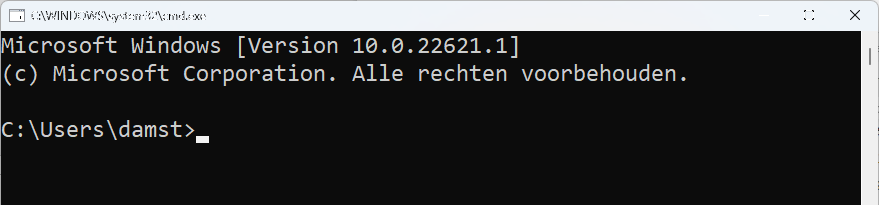

# De eerste stappen

Wel, wel, wie we hier hebben?! Iemand die de edele kunst van het programmeren wil leren? Dan ben je op de juiste plaats gekomen. Je gelooft het misschien niet, maar reeds aan het einde van dit hoofdstuk zal je je eerste eigen computer-applicaties kunnen maken. De weg naar eeuwige roem, glorie, véél vloeken en code herbruiken ligt voor je. Ben je er klaar voor? 


De eerste stappen zijn nooit eenvoudig. We gaan proberen het aantal dure woorden, vreemde afkortingen en ingewikkelde schema's tot een minimum te houden. Maar toch, als je een nieuwe kunst wil leren zal je je handen (én toetsenbord) vuil moeten maken. Wat er ook gebeurt de komende hoofdstukken: blijf volhouden. Leren programmeren is een beetje als een berg leren beklimmen waarvan je nooit de top lijkt te kunnen bereiken. Wat ook zo is. Er is geen "top", en dat is net het mooie van dit alles. Er valt altijd iets nieuws te leren! De zaken waar je de komende pagina's op gaat vloeken zullen over enkele hoofdstukken al kinderspel lijken. Hou dus vol, blijf oefenen, vloek gerust af en toe en vooral: geniet van nieuwe dingen ontdekken! 

Voor we verder gaan wil ik je wel even waarschuwen. Dit boek gaat uit van geen enkele kennis van programmeren, laat staan C#. Om die reden heb ik er dan ook voor gekozen om te beginnen bij het prille begin. Verwacht echter niet dat je aan het einde van dit boek vervolgens supercoole grafische applicaties of games zult kunnen maken. Het is zelfs zo dat we hoegenaamd geen woord gaan reppen over "windows applicaties", met knoppen en menu's enz. Alles dat in dit boek gemaakt wordt zal uitgevoerd "in de console", die oeroude DOS-schermen (ook wel een *shell* genoemd) die je nu nog vaak in films ziet wanneer hackers proberen in een erg beveiligd systeem in te breken. Waarom kies ik voor deze aanpak? Omdat de ervaring leert dat je hierdoor je kan focussen op de essentie van het probleem, en niet afgeleid wordt door existentiële vragen zoals "moet ik deze knop 3 pixel opschuiven?" of "ga ik voor een rode rand of een geel gearceerde?".  





## Wat is programmeren?

Je hoort de termen geregeld: softwareontwikkelaar, programmeur, app-developer, enz. Allen zijn beroepen die in essentie kunnen herleid worden tot hetzelfde: programmeren. Programmeurs hebben geleerd hoe ze computers opdrachten kunnen geven (**programmeren**) zodat deze hopelijk doen wat je ze vraagt.

In de 21e eeuw is de term *computer* natuurlijk erg breed. Quasi ieder apparaat dat op elektriciteit werkt bevat tegenwoordig  een computertje. Gaande van slimme lampen, tot de servers die het Internet draaiende houden of de smartwatch aan je pols. Zelfs aardig wat ijskasten en wasmachines beginnen (kleine) computers te bevatten.

Het probleem van computers, ongeacht hun grootte of kracht, is dat het in essentie ongelooflijk domme dingen zijn. Ze zullen altijd **exact** doen wat jij hen vertelt dat ze moeten doen. Als je hen dus de opdracht geeft om te ontploffen, schrik dan niet dat je even later naar de 112 kunt bellen.

**Programmeren houdt in dat je leert praten met die domme computers zodat ze doen wat jij wilt dat ze doen.**

### Het algoritme

> First, solve the problem. Then, write the code.

Deze quote van John Johnson wordt door veel beginnende programmeurs soms met een scheef hoofd aanhoort. "Ik wil gewoon code schrijven!" Het is een mythe dat programmeurs constant code schrijven. Integendeel, een goed programmeur zal veel meer tijd in de "voorbereiding" tot code schrijven steken: het maken van een goed **algoritme** na een grondige **analyse van het probleem** . 

Het algoritme is de essentie van een computerprogramma en kan je beschouwen als het recept dat je aan de computer gaat geven zodat deze jouw probleem op de juiste manier zal oplossen. **Het algoritme bestaat uit een reeks instructies** die de computer moet uitvoeren telkens jouw programma wordt uitgevoerd. 

Het algoritme van een programma moet je zelf verzinnen. De volgorde waarin de instructies worden uitgevoerd zijn echter zeer belangrijk. Dit is exact hetzelfde als in het echte leven: een algoritme om je fiets op te pompen kan zijn:

```text
Haal dop van het ventiel.
Plaats pomp op ventiel.
Begin te pompen.
```

Eender welke andere volgorde van bovenstaande algoritme zal vreemde (en soms fatale) fouten geven.

Wil je dus leren programmeren, dan zal je logisch moeten leren denken en een analytische geest hebben. Als je eerst tegen een bal trapt voor je kijkt waar de goal staat dan zal de edele kunst van het programmeren voor jou een...speciale aangelegenheid worden. 


Vanaf nu ben je trouwens gemachtigd om naar de nieuwsdiensten te mailen telkens ze foutief het woord "logaritme" gebruiken in plaats van "algoritme". Het woord logaritme is iets wat bij sommige nachtmerries uit de lessen wiskunde opwekt en heeft hoegenaamd niets met programmeren te maken. Uiteraard kan het wel zijn dat je ooit een algoritme moet schrijven om een logaritme te berekenen. Hopelijk moet een journalist nooit voorgaande zin in een nieuwsbericht gebruiken.



### Programmeertaal

Om een algoritme te schrijven dat onze computer begrijpt dienen we een programmeertaal te gebruiken. Computers hebben hun eigen taaltje dat programmeurs moeten kennen voor ze hun algoritme aan de computer kunnen *voeden*. Er zijn tal van computertalen, de ene al wat obscuurder dan de andere. Maar wat al deze talen gelijk hebben is dat ze meestal:
* **ondubbelzinnig** zijn: iedere opdracht of woord kan door de computer maar op exact één manier geïnterpreteerd worden. Dit in tegenstelling tot bijvoorbeeld het Nederlands waar "wat een koele kikker" zowel een letterlijke, als een figuurlijke betekenis heeft die niets met elkaar te maken heeft.
* bestaan uit **woordenschat**: net zoals het Nederlands heeft ook iedere programmeertaal een , meestal beperkte, lijst woorden die je kan gebruiken. Je gaat ook niet in het Nederlands zelf woorden verzinnen in de hoop dat je partner je kan begrijpen.
* bestaan uit **grammaticaregels**: Enkel Yoda mag Engels in een verkeerde volgorde gebruiken. Iedereen anders houdt zich best aan de grammatica-afspraken die een taal heeft. "bal rood is" lijkt nog begrijpbaar, maar als we zeggen "bal rood jongen is gooit veel"?

### De C# taal

Net zoals er ontelbare spreektalen in de wereld zijn, zijn er ook vele programmeertalen. **C#** (spreek uit *'siesjarp'*) is er één van de vele. C# is een taal die deel uitmaakt van de .NET (spreek uit *'dotnet'*) omgeving die meer dan 20 jaar geleden door Microsoft werd ontwikkeld. Het fijne van C# is dat deze een zogenaamde **hogere programmeertaal** is. Hoe "hoger" de programmeertaal, hoe leesbaarder deze wordt voor leken omdat hogere programmeertalen dichter bij onze eigen taal aanleunen. 

De geschiedenis van de hele .NET-wereld vertellen zou een boek op zich betekenen en gaan we hier niet doen. Het is nuttig om weten dat er een gigantische bron aan informatie over .NET en C# online te vinden is, beginnende met **docs.microsoft.com/en-us/dotnet/csharp/getting-started**.


Het fijne van leren programmeren is dat je binnenkort op een bepaald punt gaat komen waarbij de keuze van programmeertaal er minder toe doet. Vergelijk het met het leren van het Frans. Van zodra je Frans onder knie hebt is het veel eenvoudiger om vervolgens Italiaans of Spaans te leren. Zo ook met programmeertalen. De C# taal bijvoorbeeld lijkt bijvoorbeeld als twee druppels water op Java, alsook op de talen waar ze van afstamt, C en C++. 

Zelfs JavaScript, Python en veel andere moderne talen zullen weinig geheimen voor jou hebben wanneer je aan het einde van dit boek bent.



### Anders Hejlsberg


Deze Deen krijgt een eigen sectie in dit boek. Waarom? Hij is niemand minder dan de "uitvinder" van C#. Anders Hejlsberg heeft een stevig palmares inzake programmeertalen verzinnen. Voor hij C# boven het doopvont hield bij Microsoft,  schreef hij ook al Turbo Pascal én was hij de *chief architect* van Delphi. Je zou denken dat hij na 3 programmeertalen wel op z'n lauweren zou rusten, maar zo werkt Anders niet. In 2012 begon hij te werken aan een JavaScript alternatief, wat uiteindelijk het immens populaire TypeScript werd. Dit allemaal om maar te zeggen dat als je één poster in je slaapkamer moet ophangen, het die van Anders zou moeten zijn.


### De compiler

Rechtstreeks onze algoritmen tegen de computer vertellen vereist dat we machinetaal kunnen. Deze is echter zo complex dat we tientallen lijnen machinetaal nodig hebben om nog maar gewoon 1 letter op het scherm te krijgen. Er werden daarom dus hogere programmeertalen ontwikkeld die aangenamer zijn dan deze zogenaamde machinetalen om met computers te praten.

Uiteraard hebben we een vertaler nodig die onze code zal vertalen naar de machinetaal van het apparaat waarop ons programma moet draaien. Deze vertaler is de **compiler** die aardig wat complex werk op zich neemt, maar dus in essentie onze code gebruiksklaar maakt voor de computer.


Merk op dat we hier veel details van de compiler achterwege laten. De compiler is een uitermate complex element, maar in deze fase van je (prille) programmeursleven hoeven we enkel de kern van de compiler te begrijpen: **het omzetten van C# code naar een uitvoerbaar bestand geschreven in machinetaal**.


**Microsoft .NET**

Bij de geboorte van .NET in 2000 zat ook de taal C#.

.NET is een zogenaamd **framework**. Dit framework bestaat uit een grote groep van bibliotheken  en een erg technisch ding genaamd de **Common Language Runtime (CLR)**. De CLR zal ervoor zorgen dat C#, of andere .NET talen (F#, VB.NET, enz.), kunnen samenwerken met de vele bibliotheken.



### Over nummeringen en naamgevingen van .NET en C#

Microsoft heeft er een handje van weg om hun producten ingewikkelde volgnummers-of letters te geven, denk maar aan Windows 10 die de opvolger was van Windows 8 (dat had trouwens een erg goede reden; zoek maar eens op), of Windows 7 dat Windows Vista opvolgde. Het helpt ook niet dat ze geregeld hun producten een nieuwe naam geven. Zo was het binnen .NET tot voor kort erg ingewikkeld om te weten welke versie nu eigenlijk de welke was. Microsoft heeft gelukkig recent de naamgevingen herschikt én hernoemt in de hoop het allemaal wat duidelijker te maken. Laten we daarom even kort te bespreken waar we nu zitten.

**.NET 6 (framework)**

Telkens er een nieuwe .NET framework werd *gereleased* verscheen er ook een bijhorende nieuwe versie van Visual Studio. Vroeger had je verschillende frameworks binnen de .NET familie zoals *.NET Framework*, *".NET Standard"*, *.NET Core* enz. die allemaal net niet dezelfde doeleinden hadden wat het erg verwarrend maakte. Om dit te vereenvoudigen bestaat sinds 2020 enkel nog .NET gevolgd door een nummer. 

Zo had je in 2020 .NET 5 en verschijnt eind 2022 .NET 7. Dit boek maakt gebruikt van **.NET 6** dat verscheen samen met Visual Studio 2022...in november 2021.  Je moet er maar aan uit kunnen.

**C# 10**

De C# taal is eigenlijk nog het eenvoudigst qua nummering. Om de zoveel tijd krijgt C# een update met een nieuwe reeks taal-eigenschappen die je kan, maar niet hoeft te gebruiken. Momenteel zitten we aan **C# 10** dat werd uitgebracht samen met .NET 6. 

Eind 2022 komt .NET 7 uit en dus ook alweer een nieuwe versie van C#, namelijk versie 11. De kans is dus groot dat voorgaande zin alweer gedateerd is tegen dat je hem leest. De vernieuwingen in C# zijn niet altijd belangrijk voor beginnende programmeurs. In dit boek hebben we getracht de belangrijkste én meest begrijpbare nieuwe features uit de taal te gebruiken waar relevant, maar over het algemeen gezien mag je stellen dat dit boek tot en met versie 7.3 de belangrijkste zaken zal behandelen.


Volgende youtube-video van *Johnny does DOTNET* geeft een erg goed historisch overzicht van de naamsveranderingen: **youtube.com/watch?v=O4Qcg5Uon4g**.



Je vraagt je misschien af waarom dit allemaal verteld wordt? Waarom wordt deze geschiedenisles gegeven? De reden is heel eenvoudig. Je gaat zeker geregeld zaken op het internet willen opzoeken tijdens het (leren) programmeren en zal dan ook vaker op artikels stuiten met de oude(re) naamgeving en dan mogelijks niet kunnen volgen. 

