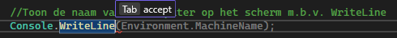
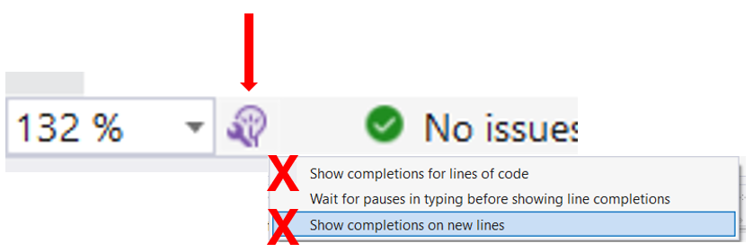

## A.I. even parkeren

Sinds enkele jaren wordt de wereld overspoeld door ChatGPT & friends. De impact hiervan op de wereld valt niet weg te steken, en zeker ook niet op het beroep van ontwikkelaars. Het is dan ook logisch dat Visual Studio A.I. gestuurde tools heeft ingebouwd om het leven te vereenvoudigen. **MAAR: als beginnende programmeur zijn deze tools niet altijd aanbevolen.** Mijn advies is daarom om, zeker in de eerste hoofdstukken van dit boek, te leren programmeren ZONDER deze hulpmiddelen. 

In deze nieuwe sectie gaan we daarom twee zaken doen:

1. We gaan kijken welke krachtige A.I. er in VS beschikbaar zijn (IntelliCode en Copilot), en hoe je ze kan gebruiken (mits dus de nodige waarschuwingen).
2. Vervolgens zal ik uitleggen hoe je deze tools best uitschakelt.

Voor we in IntelliCode en Copilot duiken willen we toch nog één keer waarschuwen omtrent A.I. nu al omarmen: je leert ook niet hoofdrekenen door vanaf dag 1 met een zakrekenmachine aan de slag te gaan.

In hoofdstuk 4 zullen we uitleggen hoe je wél op een verantwoorde manier A.I. kan gebruiken om je code te verbeteren, maar dan wel nadat je de basis onder de knie hebt.

### IntelliCode

Sinds Visual Studio 2022 heeft IntelliSense (zie hoofdstuk 7) een ongelooflijk krachtig broertje bijgekregen, genaamd  IntelliCode. Deze tool zal ervoor zorgen dat je nog betere aanbevelingen krijgt van VS terwijl je aan het typen bent. Het gaat soms zo ver dat het lijkt alsof IntelliCode in je hoofd kan kijken en perfect kan voorspellen wat je wilt typen. 

Wanneer je commentaar in je code schrijft en dan verder werkt dan zal IntelliCode aan de hand van je eerdere tekst code tonen die je mogelijk wou typen. Als je vervolgens op tab duwt zal de lichtgrijze tekst voor je getypt worden. Handig, knap...maar soms ook totaal verkeerde code. Wees dus erg kritisch hiermee.

#### IntelliCode uitschakelen

Je kan IntelliCode op 2 manieren uitschakelen:

**Manier 1:**

Door onderaan links op het kleine paarse lampje met Engelse sleutel te klikken en dan beide "Show..."-opties uit te schakelen.

**Manier 2:**

Via het menu bovenaan kiezen voor Tools, dan Options. Vervolgens zoek je naar "IntelliCode". Klik links op de sectie IntelliCode en schakel alle opties uit daar.

### Copilot

IntelliCode werkt verrassend goed, maar is niet erg interactief. Je kan weliswaar via commentaar wat hints geven welke code je nodig zal hebben, maar voor beginnende ontwikkelaars stopt het daar. Copilot is een ander verhaal: dit is letterlijk een geavanceerde programmeur die als een soort *pair programmer* naast je zit en waar je alles aan kan vragen dat je nodig hebt, behalve om je een zak chips te brengen.

Bij het opstarten van VS zal je mogelijk aan de rechterzijde direct gebombardeerd worden met een venster dat Copilot vooruit duwt. Via de knop er boven kan je inloggen en vervolgens Copilot aan de tand voelen. Copilot werkt soms verbluffend goed. Misschien té goed. Het is griezelig hoe snel en juist het eenvoudige (en zelfs complexe) problemen voor je kan oplossen. Speel er gerust eens mee **en verban het dan van je computer**. 

De programmeur van de toekomst zal béter moeten zijn dan Copilot, ChatGPT *and friends* (Gemini, Claude, Cursor, etc). Wie enkel op AI vertrouwt, riskeert minder kansen in de sector. Het is dus cruciaal dat je zelf de basis onder de knie hebt.

#### Copilot afsluiten

Indien je niet ingelogd bent rechtsboven dan zal Copilot niets doen. Da's eenvoudig. Ben je toch ingelogd - bijvoorbeeld om de tool op gepaste en bewuste momenten te gebruiken- dan kan je via de knop linksboven er op klikken en kiezen voor settings. Vervolgens kan je 2 zaken doen:

a. Beide opties hier uitschakelen.
b. Doorklikken op Options... en vervolgens ook daar alle opties uitschakelen.

