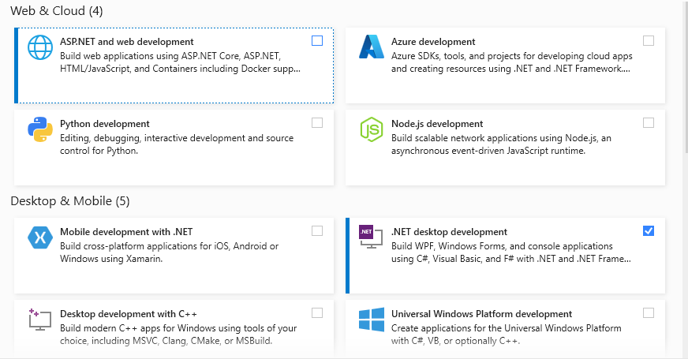
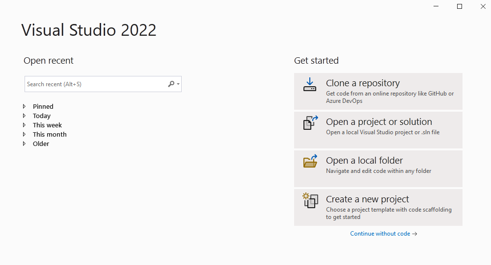
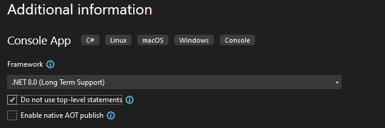
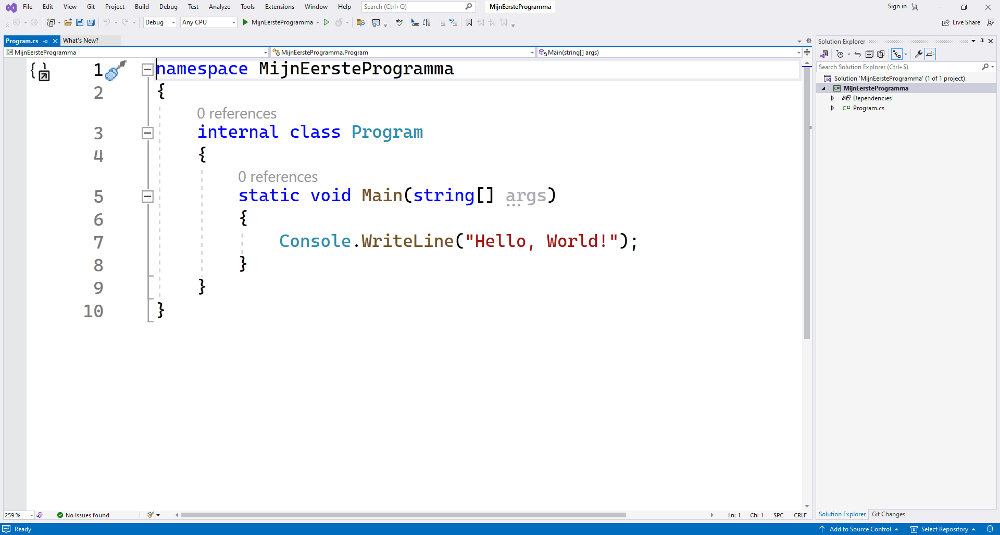

## Kennismaken met C\# en Visual Studio

Je gaat in dit boek leren programmeren met Microsoft Visual Studio 2022, een softwarepakket waar ook een gratis community versie voor bestaat. Microsoft Visual Studio (vanaf nu **VS**) is een pakket dat een groot deel van de tools samenvoegt die een programmeur nodig heeft. Zo zit er een onder andere een debugger, code editor en compiler in.

VS is een zogenaamde **IDE ("Integrated Development Environment")** en is op maat gemaakt om in C# geschreven applicaties te ontwikkelen. Je bent echter verre van verplicht om enkel C# applicaties in VS te ontwikkelen. Je kan gerust VB.NET, TypeScript, Python en andere talen gebruiken. Ook vice versa ben je niet verplicht om VS te gebruiken om te ontwikkelen. Je kan zelfs in notepad code schrijven en vervolgens compileren. Er bestaan zelfs online C# programmeer omgevingen, zoals **dotnetfiddle.net**.

### De compiler en Visual Studio

Zoals gezegd: jouw taak als programmeur is algoritmes in C# taal uitschrijven. Je zou dit in een eenvoudige tekstverwerker kunnen doen, maar dan maak je het jezelf lastig. Net zoals je tekst in notepad kunt schrijven, is het handiger dit bijvoorbeeld in tekstverwerker zoals Word te doen: je krijgt een spellingchecker en allerlei handige extra's. 

Ook voor het schrijven van computer code is het handiger om een IDE te gebruiken, een omgeving die ons zal helpen foutloze C# code te schrijven.

Het hart van Visual Studio bestaat uit de compiler die ik hiervoor besprak. De compiler zal je C# code omzetten naar de IL-code zodat je je applicatie op een computer kunnen gebruiken. Zolang je C# code niet exact voldoet aan de C# syntax en grammatica zal de compiler het vertikken een uitvoerbaar bestand voor je te genereren. 

<!-- \newpage -->

### Visual Studio Installeren

In dit boek zullen de voorbeelden steeds met de **Community** editie van VS gemaakt zijn. Je kan deze gratis downloaden en installeren via [visualstudio.microsoft.com/vs](http://visualstudio.microsoft.com/vs).

Het is belangrijk bij de installatie dat je zeker de **.NET desktop development** workload kiest. Uiteraard ben je vrij om meerdere zaken te installeren.


In dit boek zullen we dus steeds werken met *Visual Studio Community 2022*. Niet met **Visual Studio Code**. Visual Studio code is een zogenaamde lightweight versie van VS die echter zeker ook z'n voordelen heeft. Zo is VS Code makkelijk uitbreidbaar, snel, en compact. Visual Studio vindt dankzij VS Code eindelijk ook z'n weg op andere platformen dan enkel die van Microsoft. Je kan de laatste versie ervan downloaden op: [code.visualstudio.com](http://code.visualstudio.com).


<!-- \newpage -->

### Visual studio opstarten

Als alles goed is geïnstalleerd kan je Visual Studio starten via het start-menu van Windows.

<!--{width=30%}-->

De allereerste keer dat je VS opstart krijg je 2 extra schermen te zien:

* Het "sign in" scherm mag je overslaan. Kies "Not now, maybe later".
* Op het volgende scherm kies je best als "Development settings" voor **Visual C#**. Vervolgens kan je je kleurenthema kiezen. Dit heeft geen invloed op de manier van werken.

><!--{width=10%}--> Dark is uiteraard het coolste thema om in te coderen. Je voelt je ogenblikkelijk Neo uit The Matrix. Het nadeel van dit thema is dat het veel meer inkt verbruikt indien je screenshots in een boek zoals dit wilt plaatsen. 

De keuze voor Development Setting kan je naar "Visual C#" veranderen, maar General is even goed (je zal geen verschil merken in eerste instantie). Je kan dit achteraf nog aanpassen in VS via "Tools" in de menubalk, dan "Import and Export Settings" en kiezen voor "Import and Export Settings Wizard".

<!--{width=30%}-->

<!-- \newpage -->

#### Project keuze
Na het opstarten van VS krijg je het startvenster te zien van waaruit je verschillende dingen kan doen. Van zodra je projecten gaat aanmaken zullen deze in de toekomst ook op dit scherm getoond worden zodat je snel naar een voorgaand project kunt gaan. 

<!--{width=70%}-->

#### Een nieuw project aanmaken

We zullen nu een nieuw project aanmaken, kies hiervoor "Create a new project".

<!--{width=70%}-->


Het "New Project" venster dat nu verschijnt geeft je hopelijk al een glimp van de veelzijdigheid van VS. In het rechterdeel zie je bijvoorbeeld alle Project Types staan. M.a.w. dit zijn alle soorten programma’s die je kan maken in VS. Naargelang de geïnstalleerde opties en bibliotheken zal deze lijst groter of kleiner zijn.


In dit boek zal je altijd het Project Type "**Console App**" gebruiken (ZONDER .NET Framework achteraan). Je vindt deze normaal bovenaan de lijst terug, maar kunt deze ook via het zoekveld bovenaan terugvinden. Zoek gewoon naa - je raadt het nooit -  *console*. **Let er op dat je een klein groen C# icoontje ziet staan bij het zwarte icoon van de Console app.** Ook andere talen ondersteunen console applicaties, maar wij gaan natuurlijk met C# aan het werk.

<!--{width=70%}-->

Een console applicatie is een programma dat alle uitvoer naar een zogenaamde *console* stuurt, een shell. Je kan met andere woorden enkel tekst als uitvoer genereren. Multimedia elementen zoals afbeeldingen, geluid en video zijn dus uit den boze.

**Kies dit type en klik 'Next'.**

Op het volgende scherm kan je een naam ingeven voor je project alsook de locatie op de harde schijf waar het project dient opgeslagen te worden. **Onthoud waar je je project aanmaakt zodat je dit later terugvindt**.


**Het "Solution name" tekstveld blijf je af.** Hier zal automatisch dezelfde tekst komen als die dat je in het "Project name" tekstveld invult. 



Geef je projectnamen ogenblikkelijk duidelijke namen zodat je niet opgezadeld geraakt met projecten zoals Project201, enz. waarvan je niet meer weet welke belangrijk zijn en welke niet.


<!-- \newpage -->

Geef je project de naam "MijnEersteProgramma" en kies een goede locatie. **Ik raad aan om de checkbox *"Place solution and project in the same directory"* onderaan niét aan te vinken.** In de toekomst zal het nuttig zijn dat je meer dan 1 project per solution zal kunnen hebben. Lig er nog niet van wakker. 

<!--{width=80%}-->

Klik op next en kies als Target Framework de meest recente versie. **Duidt hier zeker de checkbox aan met "Do not use-top level statements"!!!**[^gezaag]. Klik nu op Create.

<!--{width=90%}-->

VS heeft nu reeds een aantal bestanden aangemaakt die je nodig hebt om een ‘Console Applicatie’ te maken. 

[^gezaag]: De auteur van dit boek kan fier melden dat die checkbox er staat mede dankzij zijn gezaag op [github.com/dotnet/docs/issues/2742](https://www.github.com/dotnet/docs/issues/2742).

<!-- \newpage -->

### IDE Layout

Wanneer je VS opstart zal je mogelijk overweldigd worden door de hoeveelheid menu's, knopjes, schermen, enz. Dit is normaal voor een IDE: deze wil zoveel mogelijk mogelijkheden aanbieden aan de gebruiker. Vergelijk dit met Word: afhankelijk van wat je gaat doen gebruikt iedere gebruiker andere zaken van Word. De makers van Word kunnen dus niet bepaalde zaken weglaten, ze moeten net zoveel mogelijk aanbieden.

Eens kijken wat we allemaal zien in VS na het aanmaken van een nieuw programma...

<!--{width=75%}-->

* Je kan meerdere bestanden tegelijkertijd openen in VS. Ieder bestand zal z'n eigen **tab** krijgen. De actieve tab is het bestand wiens inhoud je in het hoofdgedeelte eronder te zien krijgt. Merk op dat enkel open bestanden een tab krijgen. Je kan deze tabbladen ook "lostrekken" om bijvoorbeeld enkel dat tabblad op een ander scherm te plaatsen.
* De "**solution explorer**" aan de rechterzijde toont alle bestanden en elementen die tot het huidige project behoren. Als we dus later nieuwe bestanden toevoegen, dan kan je die hier zien en openen. Verwijder hier géén bestanden zonder dat je zeker weet wat je aan het doen bent!


Indien je een nieuw project hebt aangemaakt en de code die je te zien krijgt lijkt in de verste verte niet op de code die je hierboven ziet dan heb je vermoedelijk een verkeerd projecttype of taal gekozen. Of je hebt de *"Do not use top-level statements"* checkbox niet aangeduid.  




**Layout kapot/kwijt/vreemd?**

De layout van VS kan je volledig naar je hand zetten. Je kan ieder (deel-)venster en tab verzetten, verankeren en zelfs verplaatsen naar een ander bureaublad. Experimenteer hier gerust mee en besef dat je steeds alles kan herstellen. Het gebeurt namelijk al eens dat je layout een beetje om zeep is:

* Om eenvoudig een venster terug te krijgen, bijvoorbeeld het properties window of de solution explorer: klik bovenaan in de menubalk op "View" en kies dan het gewenste venster (soms staat dit in een submenu).
* Je kan ook altijd je layout in z'n geheel **resetten**: ga naar "Window" en kies "Reset window layout".



### Je programma starten

De code in Program.cs die VS voor je heeft gemaakt is reeds een werkend programma. Erg nuttig is het helaas nog niet. Je kan de code compileren en uitvoeren door op de groene driehoek bovenaan te klikken:

<!--{width=40%}-->

Als alles goed gaat krijg je nu "Hello World!" te zien en wat extra informatie omtrent het programma dat net werd uitgevoerd:

<!--{width=70%}-->

Veel doet je programma nog niet natuurlijk, dus sluit dit venster maar terug af door een willekeurige toets in te drukken.

### Is dit alles?

Nee hoor. Visual Studio is lekker groot, maar laat je dat niet afschrikken. Net zoals voor het eerst op een nieuwe reisbbestemming komen, kan deze in het begin overweldigend zijn.  Tot je weet waar het zwembad en de pingpongtafel staat en je van daaruit begint te oriënteren.

