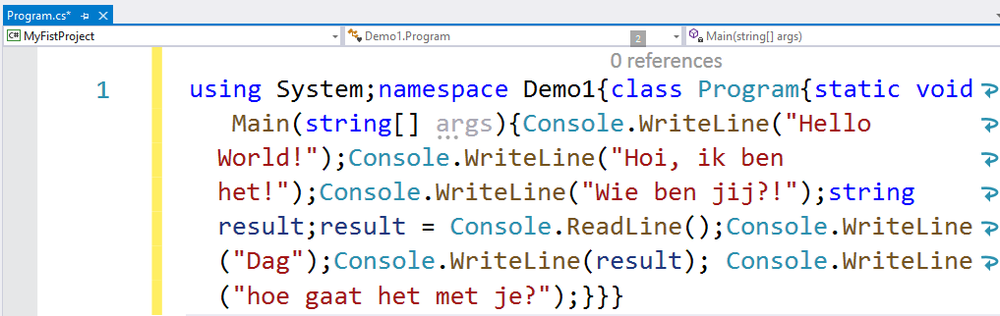

### ReadLine: Input van de gebruiker verwerken

Met de Console kan je met een handvol methoden reeds een aantal interessante dingen doen.

Zo kan je bijvoorbeeld input van de gebruiker inlezen en bewaren in een variabele als volgt:

```csharp
string result;
result = Console.ReadLine();
```

Wat gebeurt er hier juist?

De eerste lijn code: 
* Concreet zeggen we hiermee aan de compiler: maak in het geheugen een plekje vrij waar enkel data van het type string in mag bewaard worden (wat deze zin exact betekent komt later. Onthoud nu dat geheugen van het type ``string`` enkel "tekst" kan bevatten).
* Noem deze geheugenplek ``result`` zodat we deze later makkelijk kunnen in en uitlezen.


Tweede lijn code:
* Vervolgens roepen we de ``ReadLine`` methode aan. Deze methode zal de invoer van de gebruiker van het toetsenbord uitlezen tot de gebruiker op enter drukt.
* Het resultaat van de ingevoerde tekst wordt bewaard in de variabele ``result``.


**Merk op dat de toekenning in C# van rechts naar links gebeurt.** Vandaar dat ``result`` dus links van de toekenning (``=``) staat en de waarde krijgt van het gedeelte rechts ervan.



Je programma zou nu moeten zijn:

```csharp

Console.WriteLine("Hello World!");
Console.WriteLine("Hoi, ik ben het!");
Console.WriteLine("Wie ben jij?!");
string result;
result = Console.ReadLine();
```

Start nogmaals je programma. Je zal merken dat je programma nu een cursor toont en wacht op invoer nadat het de eerste 3 lijnen tekst op het scherm heeft gezet. Je kan nu eender wat intypen en van zodra je op enter duwt gaat het programma verder. Maar aangezien lijn 5 de laatste lijn van ons algoritme is, zal je programma hierna afsluiten (en we hebben dus de gebruiker voor niets iets laten invoeren).



Je kan gratis op Memrise deze cursus dagelijks instuderen, de ideale manier om snel essentiele C# begrippen voor altijd te onthouden. De cursus is beschikbaar via : [app.memrise.com/course/6382184/zie-scherp-scherper-programmeren-in-c-deel-1/](https://app.memrise.com/course/6382184/zie-scherp-scherper-programmeren-in-c-deel-1/).


### Input gebruiker gebruiken

Een variabele is een geheugenplekje (met een naam) waar we zaken in kunnen bewaren. In het volgende hoofdstuk gaan we zo vaak het woord variabele vertellen dat je oren en ogen er van gaan bloeden, dus trek je nu nog niet te veel aan van dit woord. We kunnen nu invoer van de gebruiker, die we hebben bewaard in de variabele ``result``, gebruiken en tonen op het scherm. 

```csharp
Console.WriteLine("Dag");
Console.WriteLine(result);
Console.WriteLine("hoe gaat het met je?");
```

In de tweede lijn hier gebruiken we de variabele ``result`` (waar de invoer van de gebruiker in bewaard wordt) als parameter in de ``WriteLine``-methode. 

Met andere woorden: de ``WriteLine`` methode zal op het scherm tonen wat de gebruiker even daarvoor heeft ingevoerd.


Je volledige programma ziet er dus nu zo uit:

```csharp
Console.WriteLine("Hello World!");
Console.WriteLine("Hoi, ik ben het!");
Console.WriteLine("Wie ben jij?!");
string result;
result = Console.ReadLine();
Console.WriteLine("Dag ");
Console.WriteLine(result);
Console.WriteLine("hoe gaat het met je?");
```

Test het programma en voer je naam in wanneer de cursor knippert.

Voorbeelduitvoer (lijn 3 is wat de gebruiker heeft ingetypt)

```text
Hoi, ik ben het!
Wie ben jij?!
tim [enter]
Dag
tim
hoe gaat het met je?
```


**Aanhalingsteken of niet?**

Wanneer je de inhoud van een variabele wil gebruiken in een methode zoals ``WriteLine()`` dan plaats je deze zonder aanhalingsteken!
Bekijk zelf eens wat het verschil wordt wanneer je volgende lijn code ``Console.Write(result);`` vervangt door ``Console.Write("result");``.

De uitvoer wordt dan (merk het verschil op op lijn 5):

```text
Hoi, ik ben het!
Wie ben jij?!
tim [enter]
Dag
result
hoe gaat het met je?
```



### Write en WriteLine

Naast ``WriteLine`` bestaat er ook ``Write``.

De ``WriteLine``-methode zal steeds een line break (een 'enter') aan het einde van de lijn zetten zodat de cursor naar de volgende lijn springt.

**De ``Write``-methode daarentegen zal geen enter aan het einde van de lijn toevoegen.** Als je dus vervolgens iets toevoegt (met een volgende ``Write`` of ``WriteLine``) **dan zal dit aan dezelfde lijn toegevoegd worden.**

Vervang daarom eens in de laatste 3 lijnen code in je project ``WriteLine`` door ``Write``:

```csharp
Console.Write("Dag");
Console.Write(result);
Console.Write("hoe gaat het met je?");
```

Voer je programma uit en test het resultaat. Je krijgt nu:

```csharp
Hoi, ik ben het!
Wie ben jij?!
tim [enter]
Dagtimhoe gaat het met je?
```

Wat is er "verkeerd" gelopen? Al je tekst van de laatste lijn plakt zo dicht bij elkaar? Inderdaad, we zijn spaties vergeten toe te voegen. Spaties zijn ook tekens die op scherm moeten komen (ook al zien we ze niet) en je dient dus binnen de aanhalingstekens spaties toe te voegen. Namelijk:

```csharp
Console.Write("Dag ");
Console.Write(result);
Console.Write(" hoe gaat het met je?");
```

Je uitvoer wordt nu:

```text
Hoi, ik ben het!
Wie ben jij?!
tim [enter]
Dag tim hoe gaat het met je?
```


### Witregels in C#

C# trekt zich niets aan van **witregels die niét binnen aanhalingstekens staan** (zowel spaties, enters en tabs worden genegeerd). Met andere woorden: je kan het voorgaande programma perfect in één lange lijn code typen, zonder enters. Dit is echter niet aangeraden want het maakt je code een pak onleesbaarder.






**Opletten met spaties**

Let goed op hoe je spaties gebruikt bij ``WriteLine``. **Indien je spaties buiten de aanhalingstekens plaatst dan heeft dit geen effect.**

Hier een fout gebruik van spaties (de code zal werken maar je spaties worden genegeerd):

```csharp
//we visualiseren de spaties even als liggende streepjes in volgende voorbeeld
Console.Write("Dag"_);  
Console.Write(result_);
Console.Write("hoe gaat het met je?");
```

En een correct gebruik:

```csharp
Console.Write("Dag_");
Console.Write(result);
Console.Write("_hoe gaat het met je?");
```



### Zinnen aan elkaar plakken

We kunnen dit allemaal nog een pak korter tonen zonder dat de code onleesbaar wordt. De plus-operator (``+``) in C# kan je namelijk gebruiken om tekst aan elkaar te plakken. De laatste 3 lijnen code kunnen dan korter geschreven worden als volgt:


```csharp
Console.WriteLine("Dag " + result + " hoe gaat het met je?");
```

Merk op dat ``result`` dus NIET tussen aanhalingstekens staat, in tegenstelling tot de andere stukken van de zin. Waarom is dit? Aanhalingstekens in C# duiden aan dat een stuk tekst moet beschouwd worden als tekst van het type ``string``. Als je geen aanhalingsteken gebruikt dan zal C# de tekst beschouwen als een variabele met die naam.

Bekijk zelf eens wat het verschil wordt wanneer je volgende lijn code:


```csharp
Console.WriteLine("Dag "+ result + " hoe gaat het met je?");
```

Vervangt door: 


```csharp
Console.Write("Dag "+ "result" + " hoe gaat het met je?");
```

#### Meer input vragen

Als je meerdere inputs van de gebruiker wenst te bewaren dan zal je meerdere geheugenplekken (variabelen) nodig hebben. Bijvoorbeeld:

```csharp
Console.WriteLine("Geef leeftijd");
string leeftijd; //eerste variabele aanmaken
leeftijd = Console.ReadLine();
Console.WriteLine("Geef adres");
string adres; //tweede variabele aanmaken
adres = Console.ReadLine();
```

Je mag echter ook de variabelen al vroeger aanmaken. In C# zet men de geheugenplek creatie zo dicht mogelijk bij de code waar je die plek gebruikt (zoals vorig voorbeeld), maar dat is geen verplichting. Dit mag dus ook:


```csharp
string leeftijd; //eerste variabele aanmaken
string adres; //tweede variabele aanmaken
Console.WriteLine("Geef leeftijd");
leeftijd = Console.ReadLine();
Console.WriteLine("Geef adres");
adres = Console.ReadLine();
```


Je zal vaak ``Console.WriteLine`` moeten schrijven als je dit boek volgt. We hebben echter goed nieuws voor je: er zit een ingebouwde "snippet" in VS om sneller ``Console.WriteLine`` op het scherm te toveren. We gaan je niet langer in spanning houden...of toch... nog even. Ben je benieuwd? Spannend he!

Hier gaan we: ``cw [tab] [tab]``

Als je dus ``cw`` schrijft en dan twee maal op de tab-toets van je toetsenbord duwt verschijnt daar *automagisch* een verse lijn met ``Console.WriteLine();``.




