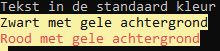

## Kleuren in console

Je kan in console-applicaties zelf bepalen in welke kleur nieuwe tekst op het scherm verschijnt. Je kan zowel de **kleur van het lettertype** instellen (via ``ForegroundColor``) als de **achtergrondkleur** (``BackgroundColor``).

Je kan met de volgende expressies de console-kleur veranderen, bijvoorbeeld de achtergrond in blauw en de letters in groen:

```csharp
Console.BackgroundColor = ConsoleColor.Blue;
Console.ForegroundColor = ConsoleColor.Green;
```

Vanaf dan zal alle tekst die je hierna met ``WriteLine`` en ``Write`` naar het scherm stuurt met deze kleuren werken. Merk op dat we **bestaande tekst op het scherm niét van kleur kunnen veranderen zonder deze eerst te verwijderen en dan opnieuw, met andere kleurinstellingen, naar het scherm te sturen.**


Alle kleuren die beschikbaar zijn staan beschreven in ``ConsoleColor`` deze zijn: Black, DarkBlue, DarkGreen, DarkCyan, DarkRed, DarkMagenta, DarkYellow, Gray, DarkGray, Blue, Green, Cyan, Red, Magenta, Yellow.

Wens je dus de kleur Red dan zal je deze moeten aanroepen door er ``ConsoleColor.`` voor te zetten: ``ConsoleColor.Red``.

Waarom is dit? ``ConsoleColor`` is een zogenaamd ``enum``-type. Enums leggen we verderop in hoofdstuk 5 uit.



Een voorbeeld:

```csharp
Console.WriteLine("Tekst in de standaard kleur");
Console.BackgroundColor = ConsoleColor.Yellow;
Console.ForegroundColor = ConsoleColor.Black;
Console.WriteLine("Zwart met gele achtergrond");
Console.ForegroundColor = ConsoleColor.Red;
Console.WriteLine("Rood met gele achtergrond");
```

Als je deze code uitvoert krijg je als resultaat:




Kleur in console gebruiken is nuttig om je gebruikers een minder eentonig en meer informatieve applicatie aan te bieden. Je zou bijvoorbeeld alle foutmeldingen in het rood kunnen laten verschijnen. Let er wel op dat je applicatie geen aartslelijk programma wordt. 

Hou er ook rekening mee dat niet iedereen (alle) kleuren kan zien. In de vorige editie van dit boek gebruikte ik rode letters op een groene achtergrond. Dat resulteerde in onleesbare tekst voor mensen met *Daltonisme*.



### Kleur resetten

Soms wil je terug de originele applicatie-kleuren hebben. Je zou manueel dit kunnen instellen, maar wat als de gebruiker slechtziend is en in z'n besturingssysteem andere kleuren als standaard heeft ingesteld?!

De veiligste manier is daarom de kleuren te resetten door de ``Console.ResetColor()`` methode aan te roepen zoals volgend voorbeeld toont:

```csharp
Console.ForegroundColor = ConsoleColor.Red;
Console.WriteLine("Error!!!! Contacteer de helpdesk");
Console.ResetColor();
Console.WriteLine("Het programma sluit nu af");
```


<!-- \newpage -->

<!--## Waar zijn de oefeningen?!-->

<!--Huh?! Waar zijn de oefeningen naartoe die de vorige edities van dit handboek nog wel hadden? Om bomen te besparen heb ik besloten om alle oefeningen via **ziescherp.be** beschikbaar te stellen. Je zal langs die webpagina een grote verzamelingen oefeningen vinden, die op de koop toe geregeld vernieuwd en verbeterd worden.


Je kan trouwens gratis op Quizlet deze cursus dagelijks instuderen[^quizlet], de ideale manier om snel essentiele C# begrippen voor altijd te onthouden.


Sinds 2023 is er een gigantische opkomst van nog straffere A.I. tools, met ChatGPT voorop. Alhoewel deze tools vaak heel goede C# code kunnen genereren, raden we af deze te gebruiken, om dezelfde redenen dat je best IntelliCode niet gebruikt (zie hoofdstuk 7). Vraag daarom nooit aan ChatGPT om "oefening x" voor je op te lossen. 

Moet je dan ChatGPT volledig links laten liggen? Uiteraard niet. Gebruik hem als extra leermiddel om bijvoorbeeld stukken code toe te lichten, bepaalde concepten op een andere manier uit te leggen enz. 



[^quizlet]:Via [https://quizlet.com/join/mqzQCGJCF](https://quizlet.com/join/mqzQCGJCF).


-->