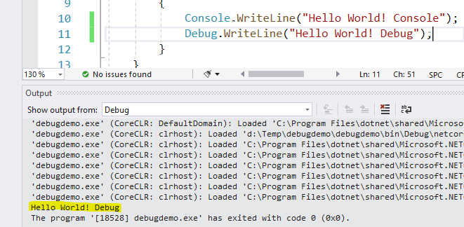
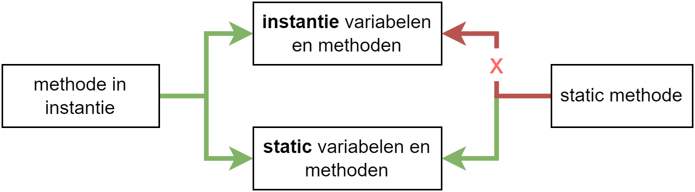

## Static

Herinner je je dat ik bij de definitie van een klasse het volgende scrheef: *"95% van de tijd zullen we in dit boek de voorgaande definitie van een klasse beschrijven, namelijk de blauwdruk voor de objecten die er op gebaseerd zijn. Je zou kunnen zeggen dat de klasse een fabriekje is dat objecten kan maken. Echter, wanneer we het ``static`` keyword zullen bespreken gaan we ontdekken dat heel af en toe een klasse ook als een soort object door het leven kan gaan. "* 

Laat ik hier eens dieper op ingaan: Je hebt het keyword ``static`` al een paar keer zien staan aan de start van methodesignaturen. Maar vanaf hoofdstuk 9 werd er dan weer nadrukkelijk verteld géén ``static`` voor methoden in klassen te plaatsen. *Wat is het nu?*

Bij klassen en objecten duidt ``static`` aan dat een methode of variabele "gedeeld" wordt over alle objecten van die klasse. Wanneer je ``static`` ergens voorplaatst dan kan je dit element aanroepen **zonder dat je een instantie van die klasse nodig hebt**. 

``static`` kan op verschillende plaatsen in een klasse gebruikt worden:

1. Bij *instantievariabelen* om een gedeelde variabele aan te maken, over de objecten heen. We spreken dan niet meer over een instantievariabele maar over een **static field**.
2. Bij *methoden* om zogenaamde methoden-bibliotheken of hulpmethoden aan te maken (denk maar aan ``Math.Pow()`` en ``DateTime.IsLeap()``). We spreken dan over een **static method**.
3. Bij de klasse zelf om te voorkomen dat er objecten van de klasse aangemaakt kunnen worden (bijvoorbeeld de ``Console`` en ``Math`` klasse). Je raadt het nooit, maar dit noemt dan een **static class**. De klasse doet zich dan voor als een uniek *object-achtig* concept.
4. Bij *properties*. We hebben al met 1 **static property** gewerkt namelijk de readonly property ``Now`` van de ``DateTime`` klasse (``DateTime.Now``).


Ook een constructor kan ``static`` gemaakt worden, maar dat ga ik in dit boek niet bespreken. Samengevat kan je een *static constructor* gebruiken indien je een soort *oer-constructor* wilt hebben die eenmalig wordt aangeroepen wanneer het allereerste object van een klasse wordt aangemaakt. Wanneer een tweede instantie wordt aangemaakt zal de *static constructor* niet meer aangeroepen worden.




We vereenvoudigen bewust het keyword ``static`` wat om verwarring te voorkomen. Het "delen van informatie dankzij ``static``" is een gevolg, niet de reden. Met ``static`` geven we eigenlijk aan dat het element bij de klasse zelf behoort én niet bij instanties van die klasse.



### Static fields

Zonder het keyword ``static`` heeft ieder object z'n eigen instantievariabelen. Aanpassingen binnen het object aan die variabelen hebben geen invloed op andere objecten van hetzelfde type. Ik toon je eerst de werking zoals je die gewend bent. Vervolgens leg ik uit hoe ``static`` in de praktijk werkt.

#### Zonder static fields

Gegeven volgende klasse:

```csharp
internal class Mens
{
    private int geboorteJaar;
    public int Geboortejaar 
    {
        get { return geboorteJaar; }
        private set { geboorteJaar = value; }
    }
    public void Jarig()
    {
        Geboortejaar++;
    }
}
```

Als we dit doen:

```csharp
Mens m1 = new Mens();
Mens m2 = new Mens();
m1.Jarig();
m1.Jarig();
m2.Jarig();
Console.WriteLine($"{m1.Geboortejaar}");
Console.WriteLine($"{m2.Geboortejaar}");
```

Dan zien we volgende uitvoer:


```text
2
1
```

Ieder object houdt de stand van z'n eigen variabelen bij. Ze kunnen elkaars interne - zowel publieke als private - staat niet rechtstreeks veranderen.

<!-- \newpage -->


#### En nu, mét static fields

Laten we eens kijken wat er gebeurt indien we een instantievariabele ``static`` maken. 

We maken de variabele ``private int geboorteJaar`` static als volgt: ``private static int geboorteJaar = 1;``. We krijgen dan:

```csharp
internal class Mens
{
    private static int geboorteJaar = 1;
    public int Geboortejaar 
    {
        get { return geboorteJaar; }
        private set { geboorteJaar = value; }
    }
    public void Jarig()
    {
        Geboortejaar++;
    }
}
```

**We hebben er nu voor gezorgd dat ALLE objecten de variabele ``geboorteJaar`` *delen*. Er wordt van deze variabele dus maar één "instantie" in het geheugen aangemaakt.**

Voeren we nu terug volgende code uit:

```csharp
Mens m1 = new Mens();
Mens m2 = new Mens();
m1.Jarig();
m1.Jarig();
m2.Jarig();
Console.WriteLine($"{m1.Geboortejaar}");;
Console.WriteLine($"{m2.Geboortejaar}");;
```

Dan wordt de uitvoer:


```text
4
4
```

We zien dat de variabele ``geboorteJaar`` dus niet meer per object individueel wordt bewaard, maar dat het één globale variabele als het ware is geworden en géén instantievariabele meer is.
``static`` laat je dus toe om informatie over de objecten heen te delen. 


Gebruik static niet te pas en te onpas: vaak druist het in tegen de concepten van OO en wordt het vooral misbruikt.



Ga je dit soort ``static`` variabelen -ook wel static fields genoemd - vaak nodig hebben? Niet zo vaak. Het volgende concept daarentegen wel!

### Static methoden en klassen

Heb je er al bij stil gestaan waarom je dit kan doen:


```csharp
Math.Pow(3,2);
```

Zonder dat we objecten moeten aanmaken in de trend van:

```csharp
Math myMath = new Math(); //dit mag niet!
myMath.Pow(3,2)
```

De reden dat je de ``Math``-bibliotheek kan aanroepen rechtstreeks **op de klasse** en niet op objecten van die klasse is omdat de methoden in die klasse als ``static`` gedefinieerd staan.

De klasse is op de koop toe ook zelf ``static`` gemaakt. Zo kan er zeker geen twijfel bestaan: deze klasse kan niét in een object gegoten worden.

De klasse zal er dus zo ongeveer uitzien:

```csharp
internal static class Math
{
    public static double Pow(int getal, int macht)
    {
        //enz.
```


Zoals je hopelijk al merkt zijn er aardig wat keywords die je nog voor methode en klasse-definities kunt plaatsen. Zo zijn er al:

* De access modifier zoals ``internal`` of ``private``.
* Het keyword ``static`` of niet.
* Het returntype bij methoden (bv. ``void``, ``int``, enz.)



<!-- \newpage -->


#### Voorbeeld van static methoden

Stel dat we enkele veelgebruikte methoden willen groeperen en deze gebruiken zonder telkens een object te moeten aanmaken dan doen we dit als volgt:

```csharp
internal static class EpicLibrary
{
    static public void ToonInfo()
    {
        Console.WriteLine("Ik ben ik");
    }

    static public int TelOp(int a, int b)
    {
        return a+b;
    }
}
```


We kunnen deze methoden nu als volgt aanroepen:

```csharp
EpicLibrary.ToonInfo();
int opgeteld = EpicLibrary.TelOp(3,5);
```

Mooi toch?!

Dankzij ``static`` kunnen we dus eigen bibliotheken van methoden én properties aanmaken die we kunnen aanroepen rechtstreeks op de klasse. We kunnen deze aanroepen zonder dat er een instantie van de klasse moet zijn.

Je mag ook hybride klassen maken waarin sommige delen ``static`` zijn en andere niet. De ``DateTime`` klasse uit het eerste hoofdstuk bijvoorbeeld is zo'n klasse. De meeste dingen gebeurden *non-static* toch was er ook bijvoorbeeld de ``static`` property ``Now`` om de huidige tijd terug te krijgen, alsook de ``IsLeapYear`` hulpmethode die we rechtstreeks op de klasse ``DateTime`` moesten aanroepen:


```csharp
bool gaIkOpPensioenInEenSchrikkeljaar = DateTime.IsLeapYear(2048);
```


### Intermezzo: Debug.WriteLine

Even een kort intermezzo dat we in de volgende sectie gaan gebruiken, namelijk de werking van de ``Debug`` klasse.

De ``Debug`` klasse (die in de ``System.Diagnostics`` namespace staat) kan je gebruiken om eenvoudig zaken naar het *debug output venster* te sturen tijdens het debuggen. Dit is handig om te voorkomen dat je debug informatie steeds naar het console-scherm moet sturen . Het zou niet de eerste keer zijn dat iemand vergeet een bepaalde ``Console.WriteLine`` te verwijderen uit het finale product en zo mogelijk gevoelige debug-informatie naar de eindgebruikers lekt.

<!-- \newpage -->


Volgende code toont een voorbeeld (merk lijn 1 op die vereist is):
```csharp
using System.Diagnostics;

namespace debugdemo
{
    internal class Program
    {
        static void Main(string[] args)
        {
            Console.WriteLine("Hello World! Console");
            Debug.WriteLine("Hello World! Debug");
        }
    }
}
```


Als je voorgaande code uitvoert in debugger modus, dan zal je enkel de tekst ``Hello World! Console`` in je console zien verschijnen. De andere lijn kan je terugvinden in het "Output" venster in Visual Studio:


<!--{width=80%}-->


>Mooi zo. Nu we dat hebben bekeken kunnen terug keren naar het gebruik van het ``static`` keyword. Of zoals mijn grootvader zaliger altijd zei *"goto static!"*.
>
>**MILJAAR!**


#### Nog een voorbeeld van het gebruik van ``static``

In het volgende voorbeeld gebruik ik een ``static`` variabele om bij te houden hoeveel objecten (via de constructor met behulp van ``Debug.WriteLine`` ) er van de klasse reeds zijn aangemaakt:

```csharp
internal class Fiets
{
    private static int aantalFietsen = 0;
    public Fiets()
    {
        aantalFietsen++;
        Debug.WriteLine($"Er zijn nu {aantalFietsen} gemaakt");
    }
    public static void VerminderFiets()
    {
        aantalFietsen--;
        Debug.WriteLine($"STATIC: Er zijn {aantalFietsen} fietsen");
    }
}
```


Merk op dat we de methode ``VerminderFiets`` enkel via de klasse kunnen aanroepen daar deze ``static`` werd gemaakt. We kunnen echter nog steeds ``Fiets``-objecten aanmaken aangezien de klasse zelf niet ``static`` werd gemaakt.

Laten we de uitvoer van volgende code eens bekijken:
```csharp
Fiets merckx = new Fiets();
Fiets steels = new Fiets();
Fiets evenepoel = new Fiets();
Fiets.VerminderFiets();
Fiets aerts = new Fiets();
Fiets.VerminderFiets();
```

Dit zal debug uitvoer geven:

```text
Er zijn nu 1 gemaakt 
Er zijn nu 2 gemaakt 
Er zijn nu 3 gemaakt 
STATIC:Er zijn 2 fietsen
Er zijn nu 3 gemaakt
STATIC:Er zijn 2 fietsen
```


<!-- \newpage -->


### Static tegenover non-static

Van zodra je een methode hebt die ``static`` is dan zal deze methode enkel andere ``static`` methoden en variabelen kunnen aanspreken. Dat is logisch: een ``static`` methode heeft geen toegang tot de gewone niet-statische variabelen van een individueel object, want welk object zou hij dan moeten benaderen? Het omgekeerde kan nog wel natuurlijk.

Volgende code zal dus een fout geven:

```csharp
internal class Mens
{
    private int gewicht = 50;

    private static void VerminderGewicht()
    {
        gewicht--;
    }
}
```

De foutboodschap die verschijnt **"An object reference is required for the non-static field, method, or property 'Program.Mens.gewicht'"** zal bij lijn 7 staan.

Volgende vereenvoudiging maakt duidelijk wat kan aangeroepen worden en wat niet:

<!--{width=75%}-->




Een eenvoudige regel is te onthouden dat van zodra je in een ``static`` *omgeving* bent, je niet meer naar de niet-static delen van je code zal geraken.

Dit verklaart ook waarom je bij console applicaties in Program.cs steeds alle methoden ``static`` moet maken. De ``Main`` van een console-applicatie is namelijk als volgt beschreven:``public static void Main(){}``.
Zoals je ziet is de ``Main`` methode als ``static`` gedefinieerd. Willen we dus vanuit deze methode andere methoden aanroepen dan moeten deze als ``static`` aangeduid zijn..


<!-- \newpage -->


### Static properties 

Beeld je in dat je een pong-variant moet maken waarbij meerdere balletjes over het scherm moeten botsen. Je wilt echter niet dat de balletjes zelf allemaal apart moeten weten wat de grenzen van het scherm zijn. Mogelijk wil je bijvoorbeeld dat je code ook werkt als het speelveld kleiner is dan het eigenlijke Console-scherm.

We gaan dit oplossen met een static property waarin we de grenzen voor alle balletjes bijhouden. Aan onze klasse ``Balletje`` voegen we dan alvast het volgende toe:

```csharp
static public int Breedte { get; set; }
static public int Hoogte { get; set; }

```

In ons hoofdprogramma (``Main``) kunnen we nu de grenzen voor alle balletjes tegelijk vastleggen:

```csharp
Balletje.Hoogte = Console.WindowHeight;
Balletje.Breedte = Console.WindowWidth;
```

Maar even goed maken we de grenzen voor alle balletjes gebaseerd op zelf gekozen waarden:

```csharp
Balletje.Hoogte = 20;
Balletje.Breedte = 10;
```


We zouden zelfs de grenzen van het veld dynamisch kunnen maken en laten afhangen van het huidige level.



De interne werking van de balletjes hoeft dus geen rekening meer te houden met de grenzen van het scherm. We passen de ``Update``-methode aan, rekening houdend met deze nieuwe kennis:

```csharp
public void Update()
{
    if (X + VX >= Balletje.Breedte || X + VX < 0)
    {
        VX = -VX;
    }
    X = X + VX;

    if (Y + VY >= Balletje.Hoogte || Y + VY < 0)
    {
        VY = -VY;
    }
    Y = Y + VY;
}
```


<!-- \newpage -->


En nu kunnen we vlot balletjes laten rond bewegen op bijvoorbeeld een klein deeltje maar van het scherm:

```csharp
static void Main(string[] args)
{
    Console.CursorVisible = false;
    Balletje.Hoogte = 15;
    Balletje.Breedte = 15;

    Balletje m1 = new Balletje(1,1,1,1);
    Balletje m2 = new Balletje(2,2,-2,1);
    
    while (true)
    {
        m1.Update();
        m1.TekenOpScherm();

        m2.Update();
        m2.TekenOpScherm();
  
        System.Threading.Thread.Sleep(50);
        Console.Clear();
    }
}
```


### ``static`` en ``Random``

>Je zal ``static`` minder vaak nodig hebben dan non-static zaken. Alhoewel: wanneer je werkt met een klasse waarin je een ``Random``-number generator gebruikt, dan is het een goede gewoonte deze generator ``static`` te maken zodat alle objecten deze ene generator gebruiken. Anders bestaat de kans dat je objecten dezelfde random getallen zullen aanmaken wanneer ze toevallig op quasi hetzelfde moment werden geïnstantieerd of methoden in aanroept.

<!-- \newpage -->


Test maar eens wat er gebeurt als je volgende klasse hebt:

```csharp
internal class Dobbelsteen
{
    public int Werp()
    {
        Random gen = new Random();  //SLECHT IDEE!
        return gen.Next(1,7);
    }
}
```

Wanneer je nu dezelfde dobbelsteen 10 maal snel na elkaar rolt is de kans groot dat je geregeld dezelfde getallen gooit:

```csharp
Dobbelsteen testDobbel = new Dobbelsteen();
for(int i = 0 ; i < 10; i++)
{
    Console.WriteLine(testDobbel.Werp());
}
```

De reden? Een nieuw aangemaakt ``Random``-object gebruikt de tijd waarop het wordt aangemaakt als een zogenaamde *seed*. Een seed zorgt ervoor dat je dezelfde reeks getallen kan genereren wanneer de seed dezelfde is -een concept dat nuttig is in cryptografie. Uiteraard willen we dat niet bij een dobbelsteen. Het is niet omdat een dobbelsteen snel na elkaar wordt geworpen (of aangemaakt) dat die dobbelsteen dan regelmatig dezelfde getallen na elkaar gooit.

**We lossen dit op door de generator ``static`` te maken zodat er maar één generator bestaat die alle dobbelstenen en hun methoden delen.** Dit is erg eenvoudig opgelost: je verhuist je generator naar buiten de methode en plaatst er ``static`` voor:

```csharp
internal class Dobbelsteen
{
    static Random gen = new Random();
    public int Werp()
    {
        return gen.Next(1,7);
    }
}
```


