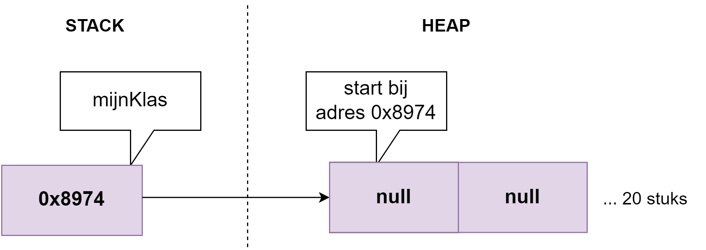
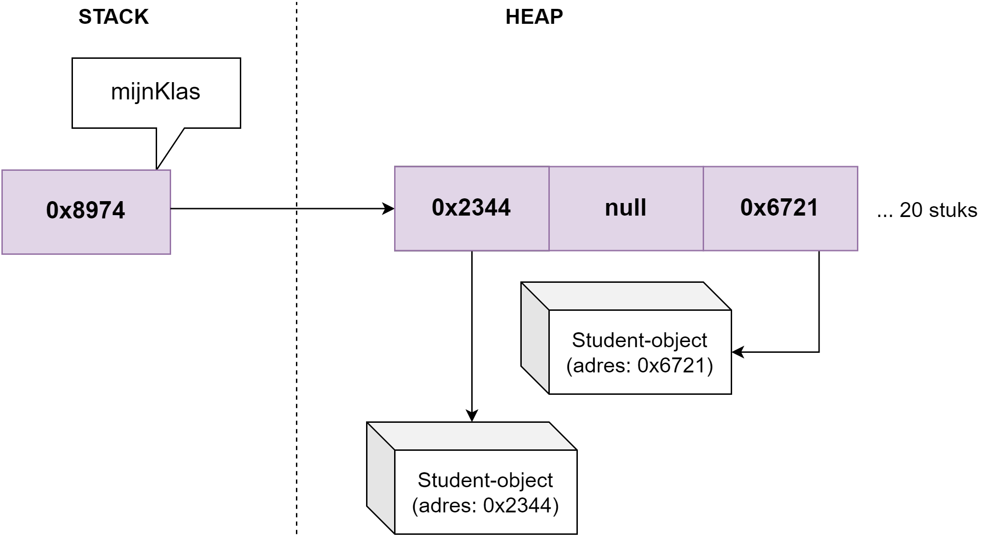
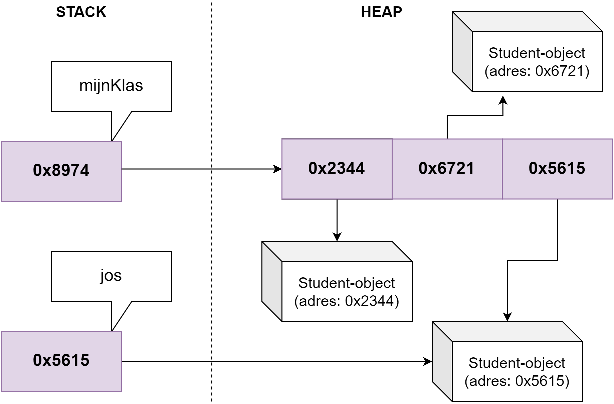

# Arrays en klassen

Arrays van value types kwamen we al in hoofdstuk 8 tegen. In dit hoofdstuk tonen we dat ook arrays van objecten perfect mogelijk zijn. We weten reeds dat klassen niets meer dan zijn dan nieuwe datatypes, en dus is het ook logisch dat wat we reeds met arrays konden, we dit gewoon kunnen blijven doen, maar met objecten. 

**Maar**, er is één grote maar: omdat we met objecten werken moeten we rekening houden met het feit dat de individuele objecten in je array **reference** values hebben en dus mogelijk ``null`` zijn. Met andere woorden: het is van essentiëel belang dat je het hoofdstuk rond geheugenmanagement in C# goed begrijpt, want we gaan het geregeld nodig hebben.

Na Exceptions is het weer tijd voor een andere bekentenis: arrays zijn fijn, maar nogal omslachtig qua gebruik. Er zit echter in .NET een soort *array on steroids* datatype dat ons nooit nog zal doen teruggrijpen naar arrays. Welke dat zijn? Lees verder en ontdek het zelf!

*Let's go!*

## Arrays van objecten aanmaken

Een array van objecten aanmaken doe je als volgt:


```csharp
Student[] mijnKlas = new Student[20];
```

De ``new`` zorgt er echter enkel voor dat er een referentie naar een nieuwe array wordt teruggegeven, waar ooit 20 studenten-objecten in kunnen komen. **Maar: er staan nog géén objecten in deze array. Alle elementen in deze array zijn nu nog ``null``.**




Willen we nu elementen in deze array plaatsen dan moeten we dit ook expliciet doen en moeten we dus objecten aanmaken en hun referentie in de array bewaren:

```csharp
mijnKlas[0] = new Student();
mijnKlas[2] = new Student();
```





Uiteraard kan dit ook in een loop indien relevant voor de opgave. Volgende voorbeeld vult een reeds aangemaakte array met evenveel objecten als de arrays groot is: 

```csharp
for(int i = 0; i < mijnKlas.Length; i++)
{
    mijnKlas[i] = new Student();
}
```


### Individueel object benaderen

Van zodra een object in de array staat kan je deze vanuit de array aanspreken door middel van de index en de *dot*-operator om de de juiste methode of property op het object aan te roepen:


```csharp
mijnKlas[3].Name = " Duke Peekaboo";
```

Uiteraard mag je ook altijd de referentie naar een individueel object in de array kopiëren. Denk er aan dat we de hele tijd met referenties werken en de GC dus niet tussenbeide zal komen zolang er minstens 1 referentie naar het object is. Indien de student op plek 4 in de array aan de start een geboortejaar van 1981 had, dan zal deze op het einde van volgende code als geboortejaar 1983 hebben, daar we op hetzelfde objecten het geboortejaar verhogen in zowel lijn 2 als 3:

```csharp
Student tijdelijkeStudent = mijnKlas[3];
mijnKlas[3].Geboortejaar++;
tijdelijkeStudent.Geboortejaar++;
```


Probeer je objecten te benaderen die nog niet bestaan dan zal je uiteraard een ``NullReferenceException`` krijgen.



### Array initializer syntax

Je kan ook een variant op de object initializer syntax gebruiken waarbij de objecten reeds van bij de start in de array worden aangemaakt. Als bonus zorgt dit er ook voor dat we geen lengte moeten meegeven, de compiler zal deze zelf bepalen. 

Volgende voorbeeld maakt een nieuwe array aan die bestaat uit 2 nieuwe studenten, alsook 1 bestaande met de naam ``jos``:

```csharp
Student jos = new Student();
//...

Student[] mijnKlas = new Student[]
{
    new Student(),
    new Student(),
    jos
};
```

Let op de puntkomma helemaal achteraan. Die wordt als eens vergeten.


Het kan niet genoeg benadrukt worden dat een goede kennis van de heap, stack en referenties essentieel is om te leren werken met arrays van objecten. Uit voorgaande stukje code zien we duidelijk dat een goed inzicht in referenties je van veel leed beschermen. Bekijk eens de eindsituatie van voorgaande code:




Zoals je merkt zal nu de student ``jos`` niet verwijderd worden indien we op gegeven moment schrijven ``jos = null`` daar het object nog steeds bestaat via de array. We kunnen met andere woorden op 2 manieren de student ``jos`` momenteel bereiken, via de array of via ``jos``:

```csharp
jos.Naam = "Joske Vermeulen";
mijnKlas[2].Naam = "Franske Vermeulen"; //we overschrijven "Joske Vermeulen"
```


#### Null-check met ?

Ook hier kan je met ``?`` een null-check schrijven:

```csharp
mijnKlas?[3]?.Name = "Romeo Montague ";
```

Merk op dat het eerste vraagteken controleert of de array zelf niet ``null`` is. Het tweede vraagteken, na de index, is om te controleren of het element op die index niet ``null`` is (toegegeven, erg elegant is dit niet).

### Object arrays als parameters en return

Ook arrays mag je als parameters en returntype gebruiken in methoden. De werking hiervan is identiek aan die van value-types zoals volgende voorbeeld toont. Eerst maken we een methode die als resultaat een referentie naar een lege array van 10 studenten teruggeeft.

```csharp
static Student[] CreateEmptyStudentArray()
{
    return new Student[10];
}
```
Vervolgens kunnen we deze dan aanroepen en het resultaat (de referentie naar de lege array) toewijzen aan een nieuwe variabele (van hetzelfde datatype, namelijk ``Student[]``):


```csharp
Student[] resultaat = CreateEmptyStudentArray();
```


