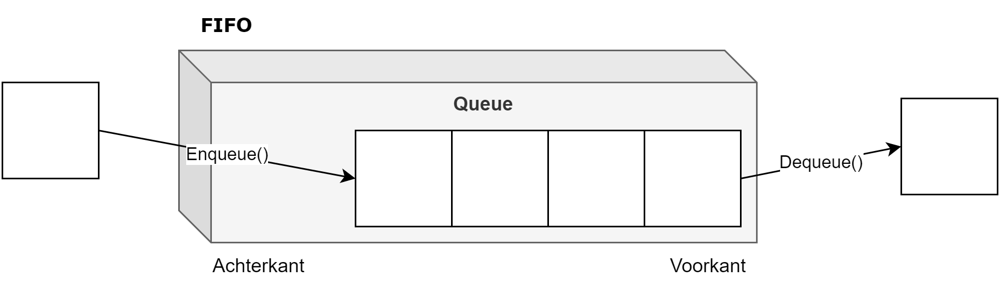
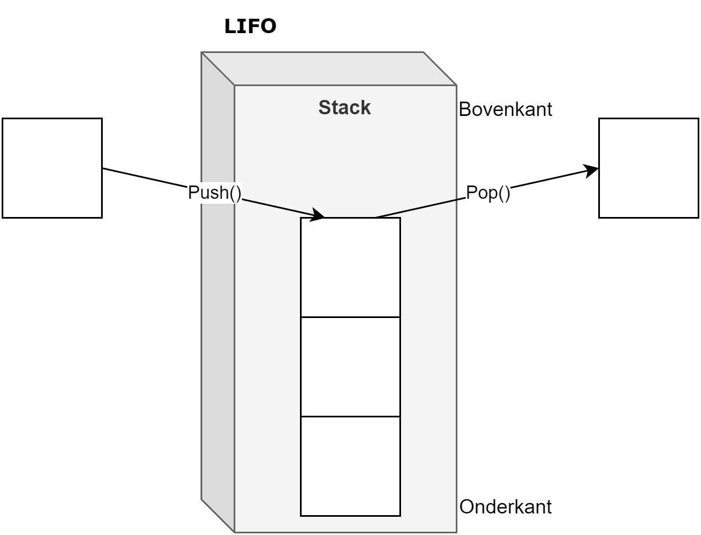
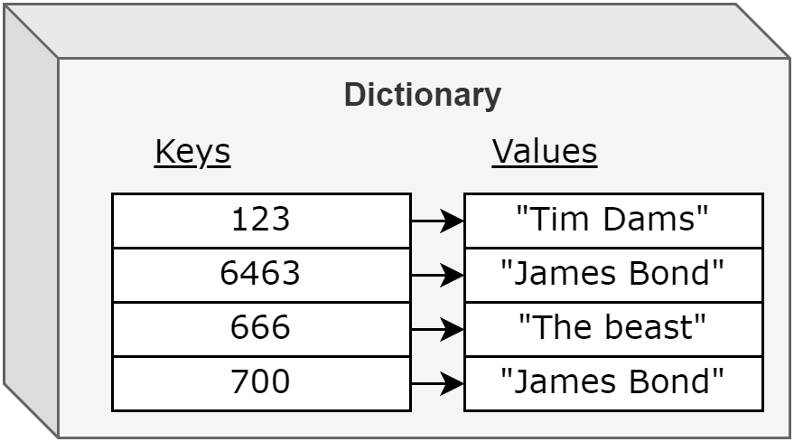

## Nuttige collectie-klassen

Naast de generieke ``List`` collectie, zijn er nog enkele andere nuttige generieke 'collectie-klassen' die je geregeld in je projecten kan gebruiken. We bespreken nu de  ``Dictionary``, ``Queue`` en ``Stack``-collecties.


### ``Queue<>`` collectie

Een queue (uitgesproken als *kjioe*) stelt een "first in, first out"-lijst (FIFO) voor. Een ``Queue`` stelt de rijen voor die we in het echte leven ook hebben wanneer we bijvoorbeeld aanschuiven aan een ticketverkoop of in de supermarkt. Met deze klasse kunnen we zo’n rij simuleren en ervoor zorgen dat steeds het eerste/oudste element in de rij als eerste wordt behandeld. Nieuwe elementen worden achteraan de rij toegevoegd.

We gebruiken onder andere volgende 2 methoden[^peek] om met een ``Queue``-lijst te werken:

* ``Enqueue(T item)``: Voeg een item achteraan de lijst toe.
* ``Dequeue()``: geeft een referentie naar het eerste element in de queue terug en verwijdert dit vervolgens.

<!--{width=70%}-->


Voorbeeld:

```csharp
Queue<string> wachtrij = new Queue<string>();
wachtrij.Enqueue("Ik stond hier eerste.");
wachtrij.Enqueue("Ik tweedes.");
wachtrij.Enqueue("Ik laatste.");
Console.WriteLine(wachtrij.Dequeue());
Console.WriteLine(wachtrij.Dequeue());
```

Dit zal op het scherm tonen:
```
Ik stond hier eerste.
Ik tweedes.
```

[^peek]: Een andere interessante methode is **Peek()**: hiermee kunnen we kijken in de queue wat het eerste element is, zonder het te verwijderen.


<!-- \newpage -->


### ``Stack<>`` collectie
Daar waar een queue "first in,first out" is, is een stack "last in,first out" (LIFO). Met andere woorden het recentst toegevoegde element zal steeds vooraan staan en als eerste verwerkt worden. Je kan dit vergelijken met een stapel papieren waar je steeds bovenop een nieuw papier legt.

Ook de klasse ``Stack`` heeft verschillende methoden, waarvan volgende 2 methoden het interessantst zijn:

* ``Push(T item)``: plaats een nieuw element bovenop de stapel.
* ``Pop()``: geeft het bovenste element in de stack terug en verwijdert dit vervolgens.


<!--{width=70%}-->

Voorbeeld:

```csharp
Stack<string> stapel = new Stack<string>();
stapel.Push("Ik was eerste hier.");
stapel.Push("Ik tweede.");
stapel.Push("Ik als laatste.");
 
Console.WriteLine(stapel.Pop());
Console.WriteLine(stapel.Pop());
```

Dit zal dus het volgende resultaat geven:

```text
Ik als laatste.
Ik tweede.
``` 

<!-- \newpage -->


### ``Dictionary<>`` collectie

In een **dictionary** wordt ieder element voorgesteld door een sleutel (**key** of index) en een waarde (**value**). 

De sleutel moet een unieke waarde zijn zodat het element kan opgevraagd worden uit de dictionary aan de hand van deze sleutel zonder dat er duplicaten zijn.


Bij de declaratie van de ``Dictionary`` dien je op te geven wat het datatype van de key zal zijn, alsook het type van de waarde (*value*). 


De ``Dictionary``-klasse emuleert dus letterlijk de werking van een woordenboek,  waarbij ieder woord uniek is en een bijhorende uitleg heeft. Het woord is de sleutel, de bijhorende uitleg is de waarde. 



#### Gebruik Dictionary
In het volgende voorbeeld maken we een ``Dictionary`` van klanten aan. Iedere klant heeft een unieke ID (de key is van het type ``int``) alsook een naam (die niet noodzakelijk uniek is en de waarde voorstelt):

```csharp
Dictionary<int, string> klanten = new Dictionary<int, string>();
klanten.Add(123, "Tim Dams");
klanten.Add(6463, "James Bond");
klanten.Add(666, "The beast");
klanten.Add(700, "James Bond");
``` 


<!--{width=70%}-->

Bij de declaratie van ``klanten`` plaatsen we dus tussen de ``< >`` twee datatypes: het eerste duidt het datatype van de key aan, het tweede dat van de values.

We kunnen een specifiek element opvragen aan de hand van de key. Stel dat we de waarde (naam) van de klant met key (``id``) gelijk aan ``123`` willen tonen, dan schrijven we:


```csharp
Console.WriteLine(klanten[123]);
```


We kunnen nu met behulp van bijvoorbeeld een ``foreach``-loop alle elementen tonen. Hier kunnen we de key met de ``.Key``-property uitlezen en het achterliggende object of waarde met ``.Value``. ``Value`` en ``Key`` hebben daarbij ieder het type dat we hebben gedefinieerd toen we het ``Dictionary``-object aanmaakten, in het volgende geval is de ``Key`` dus van het type ``int`` en ``Value`` van het type ``string``:

```csharp
foreach (var item in klanten)
{
    Console.WriteLine(item.Key+ "\t:"+item.Value);
}
```


De key werkt dus net als de index bij gewone arrays. Alleen heeft de key nu geen relatie meer met de positie van het element in de collectie, maar is een unieke identifier van het element in kwestie. 

#### Eender welk type voor key en value

De key kan zelfs een ``string`` zijn en de waarde een ander type. In het volgende voorbeeld hebben we eerder een klasse Student aangemaakt. We maken nu een student aan en voegen deze toe aan de studentenLijst. Vervolgens willen we het geboortejaar van een bepaalde student tonen op het scherm en vervolgens verwijderen we deze student:

```csharp
var studentenLijst = new Dictionary<string, Student>();
Student stud = new Student() { Naam = "Tim", Geboortejaar = 2001 };
studentenLijst.Add("AB12", stud);
Console.WriteLine(studentenLijst["AB12"].Geboortejaar);
studentenLijst.Remove("AB12");
```


Lijn1 is zo'n typisch voorbeeld waar het gebruik van het keyword ``var`` effectief een meerwaarde heeft. Het zorgt ervoor dat de code mooi op 1 lijn past en leesbaar blijft.

