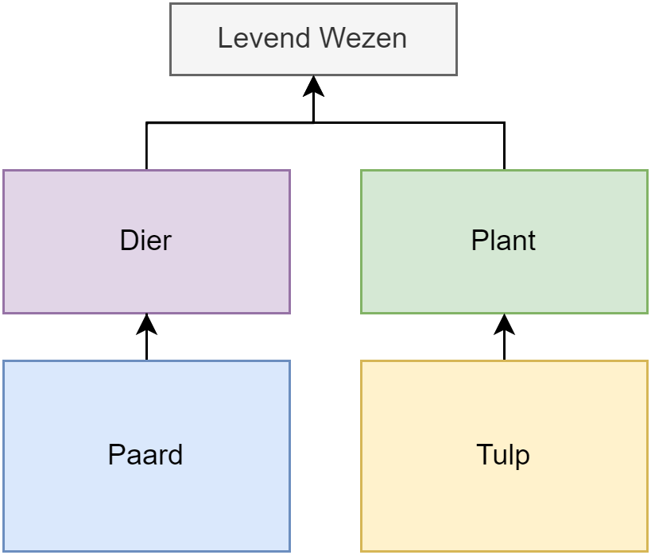
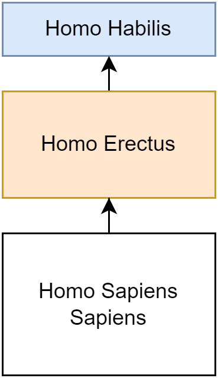
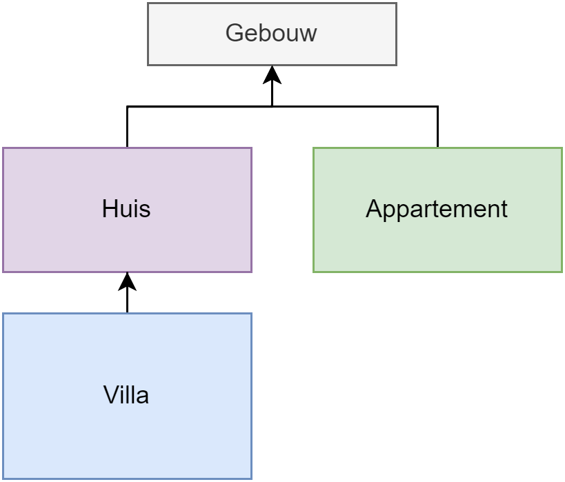
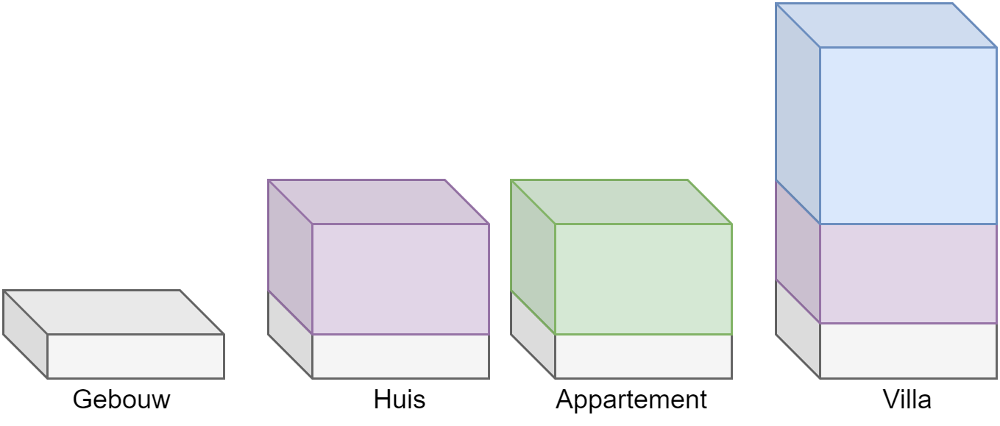
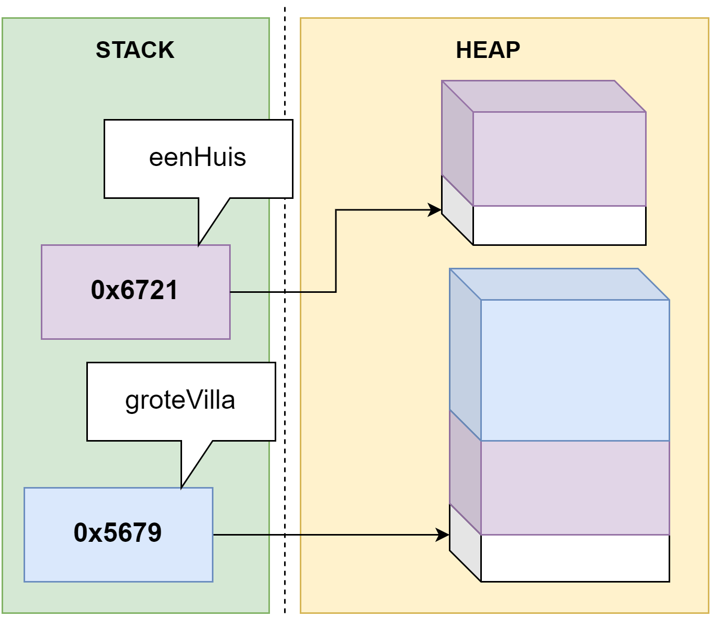
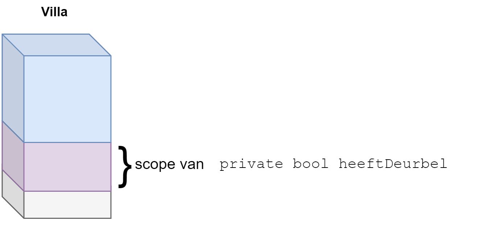

# Overerving

Programmeurs zijn luie wezens. Ieder concept dat hen toelaat minder code te schrijven zullen ze dan ook omarmen. Dubbele code wil namelijk ook zeggen dat er dubbel zoveel plekken zijn waar bugs kunnen optreden én die aangepast moeten worden wanneer de specificaties veranderen.

Indien 2 of meer klassen een aantal gelijkaardige stukken code hebben is er mogelijk een verband tussen die twee klassen. Denk maar aan de klassen ``Monster`` en ``Held`` in een avonturenspel. Beide klassen hebben vermoedelijk bepaalde properties en methoden die identiek, of bijna identiek zijn qua implementatie.

Wat we hier zien is het concept **overerving**. Beide klassen hebben duidelijk een soort gemeenschappelijke "voorouder". Net zoals in de natuur waar apen en mensen afstammen van een gemeenschappelijke voorouder, kan je dit concept ook in OOP hebben. 

De zogenaamde "child-klasse" is de klasse die overerft van een "parent-klasse". Deze child-klasse zal een specialisatie zijn: het zal meer kunnen dan z'n parent. Ook in de natuur zien we dit: de homo sapiens sapiens (wij!) is evolutionair gezien een verbetering tegenover de homo erectus (kleinere hersenen), die op zijn beurt een verbetering is van zijn voorouder, de homo habilis (kon nog niet op 2 ledematen rondwandelen), enz.

Kijken we terug naar ``Monster`` en ``Held`` dan is het duidelijk dat een gemeenschappelijke parent-klasse misschien wel de klasse ``Karakter`` is.

Dankzij overerving kunnen we de gemeenschappelijk code van de child-klassen verhuizen naar deze parent-klasse. In de child-klassen, zullen enkel nog de code bevatten die uniek is voor hen (de zogenaamde specialisatie).


Deze introductie doet uitschijnen dat overerving enkel z'n nut heeft om *dubbele code* te vermijden, wat niet zo is. Dubbele code vermijden dankzij overerving is eerder een gevolg ervan. Overerving is een erg krachtig concept dat in de komende hoofdstukken telkens zal terugkomen wanneer we gaan praten over polymorfisme, interfaces, enz.



## Wat is overerving

Overerving (**inheritance**) laat ons toe om klassen te specialiseren vanuit een reeds bestaande parent- of basisklasse. Wanneer we een klasse van een andere klasse overerven dan zeggen we dat deze nieuwe klasse een child-klasse of sub-klasse is van de bestaande parent-klasse of super-klasse.

De child-klasse kan alles wat de parent-klasse kan, maar de nieuwe klasse kan nu ook extra specialisatie-code krijgen. Dit is exact hetzelfde in de echte wereld waarin de evolutie van soorten ervoor zorgt dat een bepaalde soort, dankzij evolutie, steeds meer specialisaties bijkrijgt tegenover z'n voorgangers.


### Is-een relatie

**Wanneer twee klassen met behulp van een "x is een y"-relatie kunnen beschreven worden dan weet je dat overerving mogelijk is.**

* Een paard **is een** dier (paard = child-klasse, dier = parent-klasse).
* Een tulp **is een** plant.
* Zowel een dier als een plant zijn levende wezens.

Als je dus in een programmeeropdracht het werkwoord *zijn* tegenkomt, in eender welke vorm (was, is, zijn, zal zijn, zijnde, enz. ), dan is de kans groot dat overerving mogelijk is. We gaan echter dit idee verderop in het boek uitbreiden met interfaces en polymorfisme. Deze twee begrippen hangen nauw samen met overerving en zullen soms een "betere oplossing" zijn dan pure overerving.


Wanneer we "x **heeft een** y" zeggen gaat het **niet** over overerving, maar over compositie wat we in het volgende hoofdstuk zullen bekijken. 




Het is niet omdat 2 klassen delen gelijkaardige (of dezelfde) code hebben dat hier dus automatisch overerving van toepassing is. Enkel indien er een realistische "is een"-relatie bestaat kan overerving toegepast worden.

Uiteraard is de kans wel groot dat er "een oplossing" voor je dubbele code is, zelfs wanneer er geen "is een"-relatie bestaat. Meestal beland je dan bij generics (zie appendix) of compositie (zie verder) als mogelijke oplossing van je probleem.



### Overerving beschrijven
In UML-notatie duiden we een overervings-relatie aan met een pijl van van de child- naar de parentklasse:




En als we het voorbeeld van de mens en z'n voorgangers nemen dan zou een vereenvoudigd UML-schema er als volgt uitzien:





## Overerving in C#

Overving in C# duid je aan met behulp van het dubbele punt(:) bij de klassedefinitie, als volgt:

```csharp
class Paard : Dier
{
   public bool KanHinnikken{get;set;}
}

class Dier
{
   public void Eet()
   {
    //...
   }
}
```

We zeggen dus dat ``Paard`` overerft van de klasse ``Dier``. Het paard is dus een specialisatie van dier. Objecten van het type ``Dier`` kunnen enkel de ``Eet``-methode aanroepen. Objecten van het type ``Paard`` kunnen de ``Eet``-methode aanroepen én ze hebben ook een property ``KanHinnikken``. Een paard kan dus alles wat een dier kan en wat het zelf kan. Een dier kan enkel wat het zelf kan:

```csharp
Dier aDier = new Dier();
Paard bPaard = new Paard();
aDier.Eet();
bPaard.Eet();
bPaard.KanHinnikken = false;
aDier.KanHinnikken = false; //!!! zal niet werken!
```


### Transitief

**Overerving in C# is transitief, dit wil zeggen dat de child-klasse ALLES overerft van de parent-klasse: methoden, properties, enz.**

Dit kleine, korte zinnetje herbergt aardig wat kracht. Dankzij overerving kunnen we onze klasse dus erg proper (en kort) houden indien er een "is een" relatie bestaat. Er zijn echter ook enkele kanttekeningen aangaande overerving die we in de komende secties uit te doeken zullen doen. 

Alhoewel overerving transitief is, wil dat niet zeggen dat ``private`` variabelen plots zichtbaar zijn in de child-klasse. De child-klasse erft ALLES over, ook de ``private`` instantievariabelen, maar C# houdt zich wel aan de regels en zal voorkomen dat de child-code aan de parent instantievariabelen kan.


### Overerving en het geheugen

Tijd om eens te kijken hoe het voorgaande er uitziet in de heap en de stack, met een voorbeeld: een applicatie om aan gebouwbeheer te doen.

Beeld je in dat je volgende klassehiërarchie hebt vastgelegd:




Vervolgens maken we van iedere klasse 1 object aan. De objecten in het geheugen (de heap) zullen er dan als volgt uitzien:




Laten we eens 2 objecten aanmaken en kijken wat er in de heap en stack gebeurt:
```csharp
Huis eenHuis = new Huis();
Villa groteVilla = new Villa();
```

Dat ziet er dan als volgt uit




Ook hier zien we duidelijk dat een ``Villa`` object alle "code" in zich heeft die zowel in de klasse ``Villa`` staat (de specialisatie) alsook die waarvan wordt overgeërfd, ``Huis``. Bijgevolg heeft ``groteVilla`` dus ook de "code" van ``Gebouw`` "in zich" dankzij de transitiviteits-eigenschap van overerving. 

Echter, de ``private`` delen van een klasse blijven beperkt tot dat stuk waar de variabele of methode origineel toe hoort. Als er dus in de klasse ``Huis`` een variabele ``private bool heeftDeurbel`` was, dan zal de code in de klasse ``Villa`` daar niet aan geraken:





### ``protected``

Ook al is overerving transitief, hou er rekening mee dat private variabelen en methoden van de parent-klasse NIET rechtstreeks aanroepbaar zijn in de child-klasse. ``private`` geeft aan dat het element enkel in de klasse zichtbaar is:

```csharp
class Paard: Dier
{
   public void MaakOuder()
   {
      geboortejaar++; // !!! dit zal error geven!
   }
}
class Dier
{
   private int geboortejaar;
}
```

Je kan dit oplossen door de **``protected``** access modifier te gebruiken in de plaats van ``private``. Met ``protected`` geef je aan dat het element enkel zichtbaar is binnen de klasse **én** binnen child-klassen:

```csharp
class Paard: Dier
{
   public void MaakOuder()
   {
      geboortejaar++; // werkt nu wel
   }
}
class Dier
{
   protected int geboortejaar;
}
```


Alhoewel ``protected`` z'n nut heeft, is het meestal veiliger om alles nog steeds via properties te doen. Je kan dus beter van een property met ``private set`` er één met ``protected set`` van maken, zodat de achterliggende instantievariabele beschermd blijft.



### Multiple inheritance

In C# is het niet mogelijk om een klasse van meer dan één parent-klasse te laten overerven (zogenaamde *multiple inheritance*), wat wel mogelijk is in sommige andere object georiënteerde talen. Het is in C# dus niet mogelijk om een klasse ``Mens`` te maken die tegelijkertijd overerft van de klasse ``Aap`` en van de klasse ``Tekening`` (om maar iets te zeggen). 

Als puntje bij paaltje komt zal je trouwens bijna nooit multiple inheritance in de echte wereld tegenkomen (het typische tegenvoorbeeld is het vogelbekdier...maar hoe vaak ga je dat moeten modelleren in een project). Vaker zullen compositie en interfaces de oplossing zijn voor je probleem: 2 essentiële OOP aspecten die we in de hierna volgende hoofdstukken uit de doeken zullen doen.


### ``sealed``

Soms wil je niet dat van een klasse nog nieuwe klassen kunnen overgeërfd worden. Je lost dit op door het keyword ``sealed`` voor de klasse te zetten:

```csharp
sealed class DoNotInheritMe
{
   //...
}
```

Als je later dan dit probeert:

```csharp
class ChildClass:DoNotInheritMe
{
   //...
}
```

zal dit resulteren in een foutboodschap, namelijk ``Cannot derive from sealed type 'DoNotInheritMe'``.

