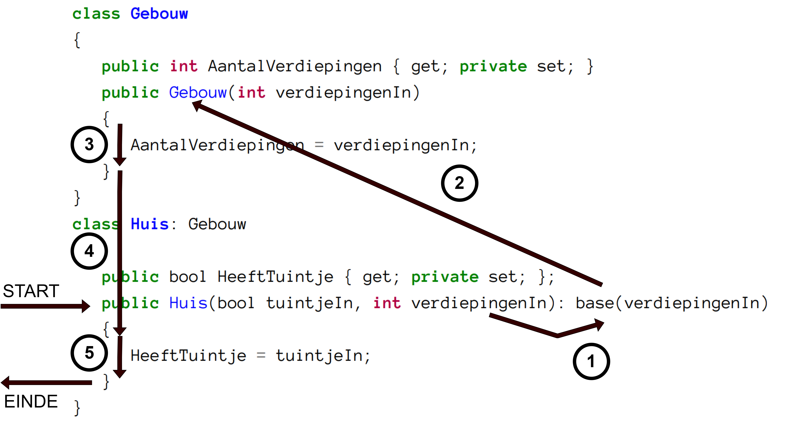

## Constructors bij overerving

Wanneer je een object instantiëert van een child-klasse dan gebeuren er meerdere zaken na elkaar, in volgende volgorde:

* Eerst wordt de constructor aangeroepen van de basis-klasse.
* Gevolgd door de constructors van alle parent-klassen.
* Finaal de constructor van de klasse zelf.

Dit is logisch: de child-klasse heeft de "fundering" nodig van z'n parent-klasse om te kunnen werken. 

Volgende voorbeeld toont dit in actie:

```java
class Soldaat
{
   public Soldaat() 
   {
      Debug.WriteLine("Soldaat is aangemaakt.");
   }
}

class VeldArts : Soldaat
{
   public VeldArts()
   {
      Debug.WriteLine("Veldarts is aangemaakt.");
   }
}
```

Indien je vervolgens een object aanmaakt van het type ``VeldArts``:


```java
VeldArts RexGregor = new VeldArts();
```

Dan zien we de volgorde van constructor-aanroep in het debug output venster:


```text
Soldaat is aangemaakt.
Veldarts is aangemaakt.
```

Er wordt dus verondersteld in dit geval dat er een default constructor in de basis-klasse aanwezig is.


### Overloaded constructors en ``base()``

Indien je klasse ``Soldaat`` een overloaded constructor heeft, dan wisten we al dat deze niet automatisch een default constructor heeft. Volgende code zou dus een probleem geven indien je een ``VeldArts`` wilt aanmaken via ``new VeldArts()``:
```java
class Soldaat
{
   public Soldaat(bool kanSchieten) 
   {
      //Doe soldaten dingen
   }
}

class VeldArts:Soldaat
{
   public VeldArts()
   {
      Debug.WriteLine("Veldarts is aangemaakt.");
   }
}
```

Wat je namelijk niet ziet bij child-klassen en hun constructors is dat er eigenlijk een impliciete aanroep naar de constructor van de parent-klasse wordt gedaan. Bij alle constructors staat er eigenlijk ``:base()`` achter, wat je ook zelf kunt schrijven:

```java
class VeldArts:Soldaat
{
   public VeldArts(): base()
   {
      Debug.WriteLine("Veldarts is aangemaakt.");
   }
}
```

``base()`` achter de constructor zegt eigenlijk *"roep de default constructor van de parent-klasse aan"*. Je mag hier echter ook parameters meegeven en de compiler zal dan zoeken naar een overloaded constructor in de basis-klasse die deze volgorde van parameters kan accepteren.


We zien hier  hoe we ervoor moeten zorgen dat we terug via ``new VeldArts()`` objecten kunnen aanmaken zonder dat we de constructor(s) van ``Soldaat`` moeten aanpassen:
```java
class Soldaat
{
   public Soldaat(bool kanSchieten) 
   {
      //Doe soldaten dingen
   }
}
class VeldArts:Soldaat
{
   public VeldArts():base(true)
   {
      Debug.WriteLine("Veldarts is aangemaakt.");
   }
}
```

De default constructor van ``VeldArts`` zal de actuele parameter ``kanSchieten``  steeds op ``true`` zetten.

Uiteraard wil je misschien kunnen meegeven bij het aanmaken van een ``VeldArts`` wat de startwaarde van ``kanSchieten`` moet zijn. Dit vereist dat je een overloaded constructor in ``VeldArts`` aanmaakt, die op zijn beurt de overloaded constructor van ``Soldaat`` aanroept. 

Je schrijft dan een overloaded constructor in ``VeldArts`` bij:

```java
class Soldaat
{
   public Soldaat(bool kanSchieten) 
   {
      //Doe soldaten dingen
   }
}

class VeldArts:Soldaat
{
   public VeldArts(bool kanSchieten): base(kanSchieten)
   {} 

   public VeldArts():base(true) //Default
   {
      Debug.WriteLine("Veldarts is aangemaakt.");
   }
}
```

Merk op hoe we de formele parameter ``kanSchieten`` doorgeven als actuele parameter aan ``base``-aanroep.

Uiteraard mag je ook de default constructor aanroepen vanuit de child-constructor, alle combinaties zijn mogelijk (zolang de constructor in kwestie maar bestaat in de parent-klasse).


Een hybride aanpak is ook mogelijk. Volgend voorbeeld toont 2 klassen, ``Huis`` en ``Gebouw`` waarbij we de constructor van ``Huis`` zodanig beschrijven dat deze bepaalde parameters "voor zich houdt" en andere als het ware doorsluist naar de aanroep van z'n parent-klasse:

```java
class Gebouw
{
   public int AantalVerdiepingen { get; private set; }
   public Gebouw(int verdiepingenIn)
   {
      AantalVerdiepingen = verdiepingenIn;
   }
}
class Huis: Gebouw
{
   public bool HeeftTuintje { get; private set; };
   public Huis(bool tuintjeIn, int verdiepingenIn): base(verdiepingenIn)
   {
      HeeftTuintje = tuintjeIn;
   }
}
```
Vanaf nu kan ik een huis als volgt bouwen:


```java
Huis peperkoekenHuis = new Huis(true, 1);
```


### Volgorde van constructors

De volgorde waarin alles gebeurt in voorgaande voorbeeld is belangrijk om te begrijpen. Er wordt een hele machine in gang gezet wanneer we volgende korte stukje code schrijven:


```java
Huis eenEigenHuis = new Huis(true,5);
```




**Start:** overloaded constructor van ``Huis`` wordt opgeroepen.
1. Nog voor dat deze echter iets kan doen, wordt de formele parameter ``verdiepingenIn`` (die de waarde ``5`` heeft gekregen) doorgegeven als actuele parameter om de constructor van de basis-klasse aan te roepen.
2. De overloaded constructor van ``Gebouw`` wordt dus aangeroepen.
3. De code van deze constructor wordt uitgevoerd: het aantal verdiepingen van het gebouw/huis wordt ingesteld.
4. Wanneer het einde van de constructor wordt bereikt, zal er teruggegaan worden naar de constructor van ``Huis``.
5. Nu wordt de code van de ``Huis`` constructor uitgevoerd: ``HeeftTuintje`` krijgt de waarde ``true``.

**Einde:**Finaal keren we terug en staat er nu een gloednieuw object in de heap, wiens geheugenlocatie we kunnen toewijzen aan ``eenEigenHuis``.





