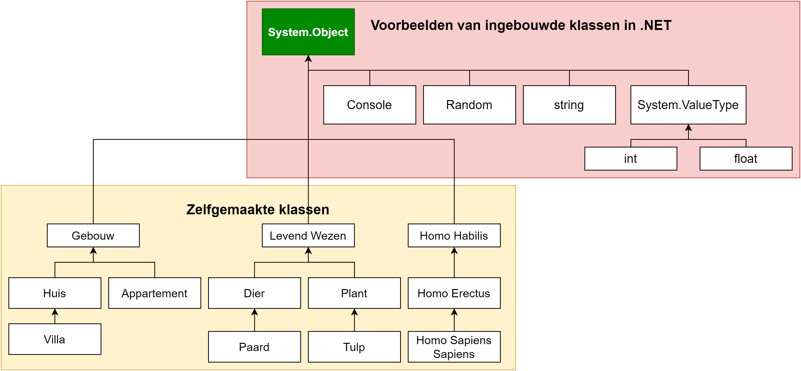
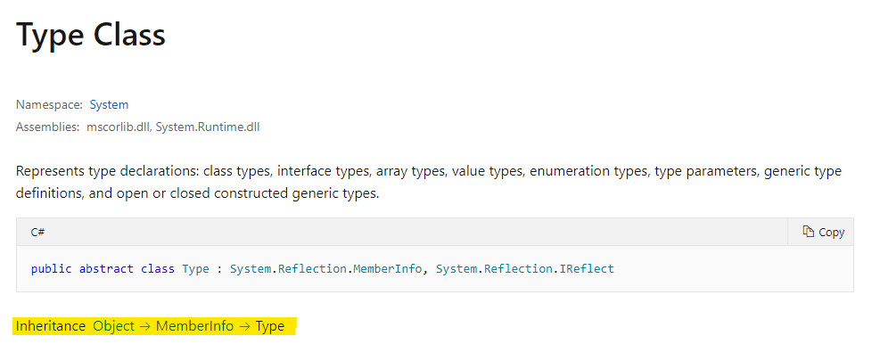

# Gevorderde overervingsconcepten

C# houdt van objecten. De hele taal is letterlijk opgebouwd om maximaal het object georiënteerd programmeren te omarmen. Van zodra je een nieuw project aanmaakt kan je niet naast de ``internal class Program`` zien. Hoe meer je C# en de bestaande bibliotheken bekijkt, hoe duidelijker dit wordt. Alles is een klasse. 

Maar dan stelt zich natuurlijk de vraag: *staat er nog iets boven alle klassen die wij aan het maken zijn? Is er misschien een soort oer-klasse waar alle klassen van overerven?* 

**De vraag stellen is ze beantwoorden! Er is effectief een oer-klasse, genaamd de ``System.Object``-klasse, waar alles en iedereen in C# van moet overerven.**


## `System.Object`
**Alle** klassen in C# zijn afstammelingen van de **``System.Object``** klasse. Zowel de bestaande, ingebouwde klassen zoals ``Random`` en ``Console``, alsook klassen die je zelf maakt. En ja, zelfs de bestaande valuetype datatypes zoals ``int`` en ``bool`` zijn afstammelingen van ``System.Object`` (er zit wel nog één klasse tussen in hun geval, de ``ValueType`` klasse).




Indien je een klasse schrijft zonder een expliciete parent dan zal deze steeds ``System.Object`` als rechtstreekse parent hebben. Ook afgeleide klassen stammen dus uiteindelijk af van ``System.Object``. Concreet wil dit zeggen dat alle klassen ``System.Object``-klassen zijn en dus ook de bijhorende functionaliteit ervan hebben.


Om de klasse ``Object`` niet te verwarren met het concept "object" zullen we hier steeds praten over ``System.Object``.



### Impliciete overerving

Wanneer je een klasse ``Student`` aanmaakt als volgt: ``class Student{ }``. Dan gebeurt er een zogenaamde impliciete overerving van ``System.Object``. Er staat dus eigenlijk:

```csharp
class Student: System.Object
{  }
```

Wat je trouwens ook expliciet zelf mag schrijven, dat maakt niet uit. **Maar van zodra je een klasse schrijft die nergens expliciet van overerft, dan zal deze automatisch van ``System.Object`` overerven.**


### Hoe ziet ``System.Object`` er uit?
Wanneer je een lege klasse maakt dan zal je misschien al gezien hebben dat instanties van deze nieuwe klasse reeds 4 methoden ingebouwd hebben, dit zijn uiteraard de methoden die in de ``System.Object`` klasse staan gedefiniëerd:

|Methode| Beschrijving|
|-------| ------------|
|``Equals()``| Gebruikt om te ontdekken of twee instanties gelijk zijn. |
|``GetHashCode()``| Geeft een unieke *hash* terug van het object; nuttig om o.a. te sorteren.|
|``GetType()``| Geeft het datatype (de klasse) van het object terug.|
|``ToString()``| Geeft een ``string`` terug die het object voorstelt.|

Deze methoden zijn redelijk nutteloos in het begin. Enkel door ze zelf te ``overriden`` zullen ze hun nut bewijzen. Uiteraard kan je de de methoden testen om te zien wat er gebeurt.


### ``GetType()``
Stel dat je een klasse ``Student`` hebt gemaakt in je project. Je kan dan op een object van deze klasse de ``GetType()``-methode aanroepen om te weten wat het type van dit object is:

```csharp
Student stud1 = new Student();
Console.WriteLine(stud1.GetType());
```

Dit zal als uitvoer de namespace gevolgd door het type van het object op het scherm geven . Als je project bijvoorbeeld ``StudentManager`` heet (en je namespace dus vermoedelijk ook) dan zal er op het scherm verschijnen: ``StudentManager.Student``.

Wil je enkel het type zonder namespace dan is het nuttig te beseffen dat ``GetType()`` eigenlijk een object teruggeeft van het type ``Type`` met meerdere eigenschappen, waaronder ``Name``. Volgende code zal enkel ``Student`` op het scherm tonen:

```csharp
Student stud1 = new Student();
Console.WriteLine(stud1.GetType().Name);
```


Je kan in de .NET documentatie altijd opzoeken waar een klasse van overerft. De ``Type`` klasse bijvoorbeeld erft, je raadt het nooit, finaal ook van ``System.Object`` over. Eerst erft ``Type`` over van de ``MemberInfo`` klasse, die op zijn beurt overerft van de oer-klasse.






### ``ToString()``: het werkpaardje van System.Object
Deze methode is de nuttigste, waar je al direct leuke dingen mee kan doen die je programmeursleven, hopelijk, wat gaat vereenvoudigen. 

Wanneer je schrijft:


```csharp
Console.WriteLine(stud1);
```
Wordt er eigenlijk een impliciete aanroep naar ``ToString`` gedaan. Er staat dus eigenlijk altijd:


```csharp
Console.WriteLine(stud1.ToString());
```

Op het scherm verschijnt dan ``StudentManager.Student``. Waarom? Wel, de methode ``ToString()`` wordt in ``System.Object()`` ongeveer als volgt beschreven:

```csharp
public virtual string ToString()
{ 
    return GetType(); 
}
```

Merk twee zaken op:

1. ``GetType()`` wordt aangeroepen en die output krijg je dus terug.
2. De methode is **virtual** gedefinieerd.

**Alle 4 methoden in System.Object zijn ``virtual``, en je kan deze dus ``override``'n!**

Nu komen we tot het hart van deze methoden. Aangezien ze alle 4 ``virtual`` zijn, kunnen we de werking ervan naar onze hand zetten in onze eigen klassen. Aardig wat .NET bibliotheken rekenen er namelijk op dat je deze methoden op de juiste manier hebt aangepast, zodat ook jouw nieuwe klassen perfect kunnen samenwerken met deze bibliotheken. Een eerste voorbeeld hiervan toonden we net: de ``Console.WriteLine`` methode gebruikt van iedere parameter dat je er aan meegeeft de ``ToString``-methode om de parameter op het scherm als ``string`` te tonen.
 
#### ``ToString()`` overriden

 Het zou natuurlijk fijner zijn dat de ``ToString()-``methode van onze student nuttigere info teruggeeft, zoals bijvoorbeeld de ``Voornaam`` die we als autoprop in de klassen hebben geplaatst, gevolgd door de ``Geboortejaar`` (ook een autoprop). 
 
 We kunnen dat eenvoudig verkrijgen door ``ToString()`` te overriden:

 ```csharp
 class Student
 {
   public int Geboortejaar {get;set;}
   public string Voornaam {get;set;}
   public override string ToString()
   {
       return $"{Voornaam} ({Geboortejaar})";
   }
 }
 ```
 Wanneer je nu ``Console.WriteLine(stud1);`` (gelet dat hij de properties ``Voornaam`` en ``Geboortejaar`` heeft) zou schrijven dan wordt je output: ``Tim Dams (1981)``.


 Een extra handigheidje van ``ToString`` is dat deze methode wordt gebruikt tijdens het debuggen om je objecten samen te vatten in het watch-venster.
 

 
 
### De ``Equals()`` methode

Ook deze methode kan je overriden om twee objecten met elkaar te vergelijken:


 ```csharp
if(stud1.Equals(stud2))
```

De ``Equals()``-methode heeft als signatuur: ``public virtual bool Equals(Object o)``
Twee objecten zijn gelijk voor .NET als aan volgende afspraken wordt voldaan:

* Het moet ``false`` teruggeven indien de parameter ``o`` ``null`` is.
* Het moet ``true`` teruggeven indien je het object met zichzelf vergelijkt (bv. ``stud1.Equals(stud1)``).
* Het mag enkel ``true`` teruggeven als zowel ``stud1.Equals(stud2);`` als ``stud2.Equals(stud1);`` waar zijn.
* Indien ``stud1.Equals(stud2)`` true teruggeeft en ``stud1.Equals(stud3)`` ook ``true`` is, dan moet ``stud2.Equals(stud3)`` ook ``true`` zijn.


#### ``Equals()`` overriden
Het is echter aan de maker van de klasse om te beslissen wanneer 2 objecten van een zelfde type gelijk zijn. Het is dus niet zo dat iedere waarde van een instantievariabele bijvoorbeeld gelijk moet zijn opdat 2 objecten gelijk zijn. Alles hangt af van de wijze waarop de klasse dienst moet doen.

Stel dat we vinden dat een student gelijk is aan een andere student indien z'n ``Voornaam`` en ``Geboortejaar`` dezelfde is, we kunnen dan de Equals-methode overriden als volgt in de ``Student`` klasse:

```csharp
public override bool Equals(Object o)
{  
    Student temp = (Student)o; //Zie opmerking na code!
    return (Geboortejaar == temp.Geboortejaar && Voornaam == temp.Voornaam);
}
```


De lijn ``Student temp = (Student)o;`` zal het ``object o`` casten naar een ``Student``. Doe je dit niet dan kan je niet aan de interne Student-variabelen van het ``object o``. Dit concept, **polymorfisme** (zie nog steeds hoofdstuk 16....We komen dichter!).



### ``GetHashcode()`` overriden
Indien je ``Equals`` override dan moet je eigenlijk ook ``GetHashCode`` overriden, daar er wordt verondersteld dat twee gelijke objecten ook dezelfde unieke hashcode teruggeven. Wil je dit dus implementeren dan zal je dus een (bestaand) algoritme moeten schrijven dat een uniek nummer genereert voor ieder niet-gelijke object. Algoritmes bespreken om zelf een hash te genereren liggen niet in de scope van dit boek. 





*"Ik ben nog niet helemaal mee..."*

Niet getreurd, je bent niet de enige: het is allemaal een hoop nieuwe kennis om te verwerken. En ik vermoed dat je nu niet bepaald overweldigd bent van de nieuwe kennis. Mogelijk heb je nu zoiets van? *"Ok..wow?! Wat krijg ik nu juist extra wetende dat al mijn klassen overerven van een oer-klasse? 4 methoden en wat beloofde compatibiliteit met andere .NET bibliotheken? Call me ...unimpressed"*.Begrijpelijke reactie. Hou vol, we zijn een hoop puzzelstukjes aan het opnemen die finaal zullen samenkomen om een gigantisch knappe OOPuzzel te maken (see what I did there?) waarin polymorfisme onze sterspeler zal worden en zal toelaten erg krachtige code te schrijven. Polymorfisme wordt onze doelpuntenmaker, maar ``System.Object`` zal steeds de perfecte voorzet geven!




