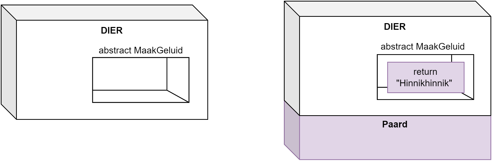

## Abstracte klassen

Aan de start van hoofdstuk 9 beschreven we volgende 2 duidelijke definities:

* **Een klasse** is als een **blauwdruk** (of prototype) dat het gedrag en toestand beschrijft van alle objecten van deze klasse.
* Een individueel **object** is een **instantie** van een klasse en heeft een eigen *toestand*, *gedrag* en *identiteit*.

Niemand die zich hier vragen bij stelde? Als ik in het echte leven zeg: "Geef mij eens de blauwdruk van een object van het type meubel." Wat voor soort meubel zie je voor je bij het lezen van deze zin? Een tafel? Een kast? Een zetel? Een bed? 

En wat zie je voor je als ik vraag om een "geometrische figuur" in te beelden. Een cirkel? Een rechthoek? Een kubus? Een buckyball? Kortom, er zijn in het leven ook soms eerder abstracte dingen die niet op zich in objecten kunnen gegoten worden zonder meer informatie. Toch is het concept "geometrische figuur" een belangrijk concept: we weten dat alle geometrische figuren een gemeenschappelijke definitie hebben, namelijk (met dank aan Encyclo.nl) dat het *twee- of meerdimensionale grafische elementen zijn waarvan de vorm wiskundig te berekenen valt.* **En dus is er ook een bestaansreden voor een klasse ``GeometrischeFiguur``. Objecten van deze, abstracte, klasse maken daarentegen lijkt ons uit ten boze.**

Het is dit concept, **abstracte klasse** dat we in dit hoofdstuk uit te doeken gaan doen. Het laat ons toe klassen te definiëren die niet niet kunnen geïnstantieerd worden, maar die wel dienst kunnen doen als parentklasse voor andere klassen.


### Abstracte klassen in C#

Laten we voorgaande eens praktisch binnen C# bekijken. Soms maken we een parent-klasse waarvan geen instanties kunnen gemaakt worden: denk aan de parent-klasse ``Dier``. Voorbeelden van subklassen van Dier zijn ``Paard`` en ``Wolf``. Van ``Paard`` en ``Wolf`` is het logisch dat je instanties kan maken (echte paardjes en wolfjes) maar van 'een dier'? Hoe zou dat er uit zien? Maar toch willen we bepaalde delen gemeenschappelijk maken (alle dieren hebben bijvoorbeeld zuurstof nodig).

Met behulp van het keyword **``abstract``** kunnen we aangeven dat een klasse abstract is: **je kan overerven van deze klasse, maar je kan er geen instanties van aanmaken.**

We plaatsen ``abstract`` voor de klasse definitie om dit aan te duiden.

Een voorbeeld:
```csharp
abstract class Dier
{
    public string Naam {get;set;}
}
```

We kunnen nu geen objecten meer van het type ``Dier`` aanmaken. Volgende code zal een foutboodschap geven: ``Dier hetDier = new Dier();``


Maar, we mogen dus wel klassen overerven van deze klasse en instanties van deze nieuwe klasse aanmaken:
```csharp
class Paard: Dier
{
    //...
}

class Wolf: Dier
{
    //...
}
```
En dan zal dit wel werken: ``Wolf wolfje = new Wolf();``

En als we polymorfisme gebruiken (*soon!*) dan mag dit ook: ``Dier paardje = new Paard();`` 


In het begin lijkt ``abstract`` een beperkende factor: je kan minder dan ervoor. Maar het heeft dus één heel duidelijke functie: je kan een parent-klasse maken waarin de gedeelde functionaliteit van je child-klassen in zit, zonder dat je deze parent-klasse op zich kunt gebruiken. 



### Abstracte methoden
Het is logisch dat we mogelijk ook bepaalde zaken in de abstracte klasse als ``abstract`` kunnen aanduiden. Beeld je in dat je een methode ``MaakGeluid`` hebt in je klasse ``Dier``. Wat voor een geluid maakt 'een dier'? We kunnen dus ook geen implementatie (code) geven in de abstracte parent klasse, maar willen wel zeker ervoor zorgen dat alle child-klassen van ``Dier`` geluid kunnen maken, op wat voor manier dan ook.

Via abstracte methoden geven we dit aan: we hoeven enkel de methode signatuur te geven, met ervoor ``abstract``:
```csharp
abstract class Dier
{
    public abstract string MaakGeluid();
}
```

Door het keyword ``abstract`` **zijn child-klassen verplicht deze abstracte methoden te overriden!** 


Merk op dat er geen codeblock-accolades na de signatuur van abstracte methodes komt.



De Paard-klasse wordt dan:
```csharp
class Paard: Dier
{
  public bool HeeftTetanus {get;set;}

  public override string MaakGeluid()
  { 
      return "Hinnikhinnik";
  }
}
```
(en idem voor de ``Wolf``-klasse uiteraard, maar hopelijk met een dreigender geluid)

Dit is dus niet hetzelfde als ``virtual`` waar een ``override`` MAG. Bij ``abstract`` MOET je ``override``'n. We komen dan ook bij het hart van het abstracte klasse concept: ze laten ons toe om, als het ware, klassen te maken waar nog gaten in zitten qua implementatie. Een soort klasse-template die de child-klassen nog verder moeten inkleuren.




#### Abstracte methoden enkel in abstracte klassen
Van zodra een klasse een abstracte methode of property heeft dan ben je, logischerwijs, verplicht om de klasse ook abstract te maken. 

Het zou heel vreemd zijn om objecten in het leven te kunnen roepen die letterlijk stukken ontbrekende code hebben...



### Abstracte properties

Properties kunnen ``virtual`` gemaakt worden, en dus ook ``abstract``. Net zoals bij abstracte methoden, kunnen we met abstracte properties de overgeërfde klassen verplichten een eigen implementatie van de property te schrijven. 

Volgend voorbeeld toont hoe dit werkt:

```csharp
abstract class Dier
{
    abstract public int MaxLeeftijd { get;}
}

class Olifant : Dier
{
    public override int MaxLeeftijd 
    {
        get 
        { 
            return 100; 
        }
    }
}
```

Wanneer je een abstracte property maakt dien je ogenblikkelijk aan te geven of het om een readonly, writeonly, of property met get én set gaat:

* ``public abstract int Oppervlakte {get;}``
* ``public abstract int GeheimeCode {set;}``
* ``public abstract int GeboorteDatum {get;set;}``

