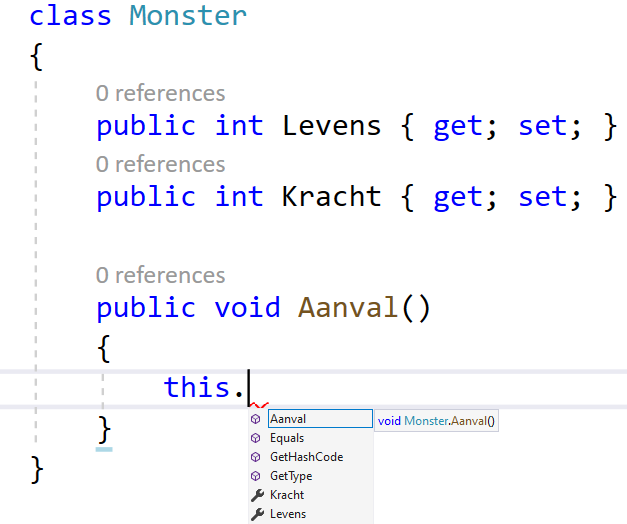
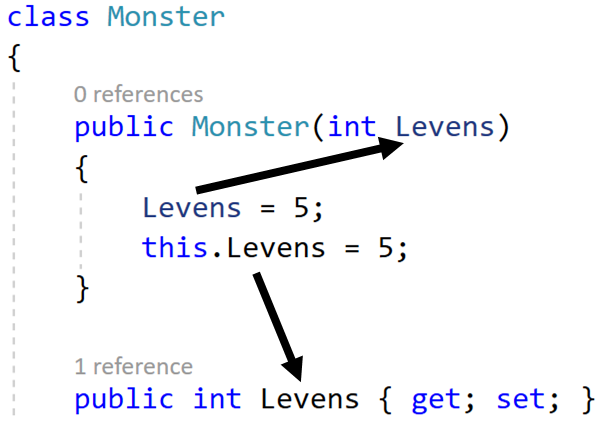

## Het ``this`` keyword

Je zult in je zoektocht naar online antwoorden mogelijk al een paar keer het ``this`` keyword zijn tegengekomen. **Dit keyword kan je aanroepen in een object om de referentie van het object terug te krijgen.** Met andere woorden: het laat toe dat een object "zichzelf" kan aanroepen. Dat klinkt vreemd, maar heeft 3 duidelijke gebruiken:
* Het laat toe dat een object zichzelf kan meegeven als actuele parameter aan een methode.
* Het laat toe instantievariabelen en properties aan te roepen van het object die mogelijk dezelfde naam hebben als een lokale variabele.
* We kunnen een andere constructor vanuit een constructor aanroepen zoals reeds gezien (in hoofdstuk 11).


### Aanroepen van instantievariabelen met zelfde naam

Wanneer je ``this`` gebruikt binnen een klasse, dan zal je zien dat bij het schrijven van de dot-operator je ogenblikkelijk de volledige interne structuur van de klasse kunt bereiken:




Enerzijds ben je vrij om altijd ``this`` te gebruiken wanneer je eender wat van de klasse zelf wilt bereiken. Vooral in oudere code-voorbeelden zal je dat nog vaak zien gebeuren.


Anderzijds laat ``this`` ook toe om properties, methoden en instantievariabelen aan te roepen wanneer die mogelijk op de huidige plek niet aanroepbaar zijn omdat hun naam conflicteert met een lokale variabele dat dezelfde naam heeft:




De lijn ``Levens = 5;`` in de constructor zal de parameter zelf van waarde aanpassen (wat niet wordt aangeraden). Terwijl door ``this`` te gebruiken geraak je aan de property met dezelfde naam.


Merk op dat qua naamgeving de keuze van de formele parameter ``Levens`` in de constructor sowieso een ongelukkige keuze is in dit voorbeeld. 



### Object geeft zichzelf mee als parameter

Beeld je in dat je volgende ``Management`` klasse hebt die toelaat om ``Werknemer`` objecten te controleren of ze promoveerbaar zijn of niet. Het management van de firma heeft beslist dat werknemers enkel kunnen promoveren als hun huidige ``Rang`` lager is dan 10:

```java
class Management
{
    private const int MAXRANG = 10;
    public static bool MagPromoveren(Werknemer toCheck)
    {
        return toCheck.Rang < MAXRANG;
    }
}
```

Dankzij het ``this`` keyword kan je nu vanuit de klasse ``Werknemer`` deze externe methode aanroepen om zo te kijken of een object al dan niet kan promoveren:

```java
class Werknemer
{
    public int Rang { get; set; }
    public bool IsPromoveerbaar()
    {
        return Management.MagPromoveren(this);
    }
}
```

Op deze manier geeft het object waarop je ``IsPromoveerbaar`` op aanroept zichzelf mee als actuele parameter aan ``Management.MagPromoveren()``. Dit laat dus toe dat een werknemer zelf kan weten of hij of zij al dan niet kan promoveren:

```java
Werknemer francis = new Werknemer();
if(francis.IsPromoveerbaar())
{
    Console.WriteLine("Jeuj!");
}
```


