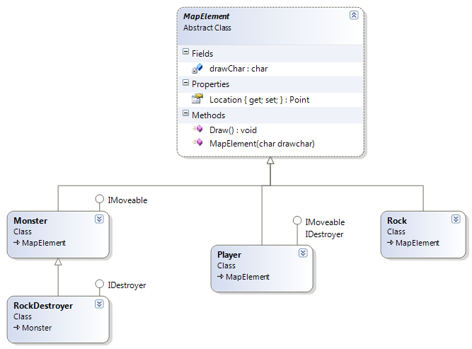
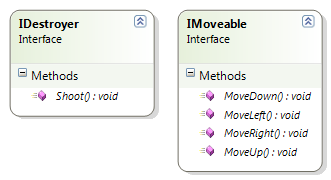
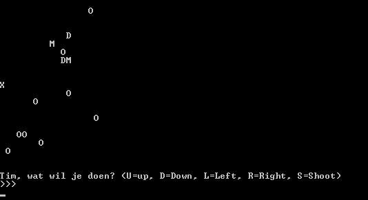

# Figures with interfaces
Gebruik je [Rechthoek-klasse uit de Figuren oefening](../8_klassen/A_practica.md#figures) die je eerder hebt aangemaakt. Maak een List aan waarin je een 10 rechthoek-objecten plaatsen, allen met een verschillende grootte. Zorg ervoor dat je nu je rechthoeken met de Sort()-methode kan sorteren op oppervlakte.


Toon de werking aan in een klein voorbeeld programma. 

# Carbon Footprint

Maak 4 klassen:

* ``Huis``
* ``Fabriek``
* ``Auto``
* ``Plant``

Maak een interface ``ICarbonFootPrint`` die volgende zaken heeft:

* 1 methode ``BerekenFootprint`` die een ``int`` teruggeeft en geen parameters nodig heeft.
* 1 methode ``VerlaagFootprint`` die niets teruggeeft en geen parameters nodig heeft.

Breid de volgende klassen met de interface uit:

* De carbon footprint van een ``huis`` is gebaseerd op het volume van het huis in kubieke meter maal 10.
* De carbon footprint van een ``fabriek`` is gebaseerd op het aantal werknemers maal 100. 
* De carbon footprint van een ``auto`` is gebaseerd op het merk

Het verlagen van de footprint in iedere klasse verzin je zelf (door bijvoorbeeld bij het huis de factor 10 met 1 te verlagen).

Zorg ervoor dat van iedere klasse de footprint kan bevraagd worden (maak/verzin dus de nodige properties per klasse om dit te bereken). De klasse plant moet je niet aanpassen.

Plaats van iedere klasse 2 objecten  in een gemeenschappelijke lijst en zorg ervoor dat:
* de footprint van alle objecten getoond wordt (planten worden overgeslagen)
* de gemiddelde footprint van alle objecten (ook planten worden meegeteld) berekend.
* toont welk object de hoogte footprint heeft.
* van alle objecten de footprint kan verlaagd worden.

# Pokémon interfaces

Shadow Pokémon zijn een speciaal ras Pokémons ([zie hier](https://bulbapedia.bulbagarden.net/wiki/Shadow_Pok%C3%A9mon)) en kunnen "purified" worden op verschillende manieren. Maak een interface ``IShadow`` die een methode ``Purify`` heeft. Verzin enkele Pokémons die Shadow Pokémons zijn, geef ze de interface, en verzin manieren hoe ze purified kunnen worden (bv. door hun HP op -1 te zetten).
Kan je door je lijst van Pokémons gaan enkel de Shadow Pokémons op het scherm tonen?

# PokéDex IList (PRO)
Maak een PokéDex die de interface ``IEnumerable`` implementeert zoals [hier uitgelegd](https://docs.microsoft.com/en-us/dotnet/api/system.collections.ienumerable?view=netcore-3.1). Hierdoor kan je je PokéDex klasse gebruiken als een  ``List``.

# Mapmaker afwerken

Vervolledig het all-in-project  "[Map Maker](../A_DEEL2_AllInOne/1_MapMapker.md)". Inclusief interfaces en is/as .Kan je zelf extra zaken toevoegen zoals andere kamers, andere functionaliteit, enz.

# Game

{blurb, class: tip}
Maak eerst de [corona missie van dit hoofdstuk](../16_interfaces/coronamissie.md). Die opdracht is veel kleiner dan deze stevige brok.



**Zie onderaan pagina voor minimale klasse-hiërarchie en interfaces.**

Maak een spel dat als volgt werkt:
* De speler dient met zijn pion de overkant van het veld te bereiken.
* Het veld bestaat uit 20 bij 20 vakjes. Op ieder vakje kan maximum één mapelement staan: 
  * De speler zelf
  * Een monster
*	Een rots
*	Een speler kan niet door rotsen of monsters wandelen. 
*	Een speler kan in zijn beurt telkens één vakje bewegen OF naar rechts schieten:
  *	Indien geschoten wordt dan zal het mapelement op het vakje rechts van de speler vernietigd worden (rots of monster)
*	Monsters kunnen ook bewegen. In de beurt van de monsters beweegt ieder monster in een willekeurige richting indien er geen rotsen of spelers LINKS van het monster staan.
  *	Indien er WEL een rots of speler LINKS van het monster staat dan schiet het monster en vernietigd het de speler of rots.
*	Enkel RockDestroyer monsters kunnen schieten.
De setup van het spel bestaat uit volgende stappen:
1. Maak een 20 bij 20 array aan en plaats bepaalde hoeveelheid monsters en rotsen op de kaart, behalve op kolom 0.
2. Plaats de speler op de plek 0,10 in de array (midden van kolom 0)
3. Doorloop de volgende stappen tot er winnaar is

Iedere beurt van het spel bestaat uit volgende stappen:
1. Vraag speler om input (bewegen in 1 van de 4 richtingen OF schieten)
2. Voer actie van speler uit
3. Kijk of speler overkant van kaart heeft bereikt, zo ja: gewonnen!
4. Beweeg ieder monster op de kaart in een willekeurige richting
5. Beweeg iedere RockDestroyer OF laat RockDestroyer schieten
 

Stel de speler voor door een X, een rots door O , een monster door M een RockDestroyer door D.

{blurb, class: tip}
Je zal de meeste logica in je ``Main`` of een ``Manager`` klasse moeten plaatsen. De Speler klasse bijvoorbeeld kan niet beslissen at een monster moet doen, dat zou willen zeggen dat de speler als jet ware " in het monster" beslissingen kan maken, wat tegen het principe van OOP zou zijn.



## Extra’s:
Voorgaande beschrijving is een ‘minimale’ beschrijving. Voorzie extra functionaliteit naar believen zoals:
* Speler heeft levens
* Monsters hebben levens
* Andere soort monsters (bv. slimmere)
* Meerdere levels met telkens andere/meer monsters bijvoorbeeld
* Meerdere spelers
* Verder schieten, of schieten in andere richtingen.

## Klasse-schema



``Location`` is van het type ``Point`` (compositie). ``Point`` is een zelfgemaakte mini klasse die er als volgt uit (minimaal uitziet): 
```csharp
class Point
{
  public int X{get;set;}
  public int Y{get;set;}
}
```

En dus in je abstracte klasse MapElement zal iets krijgen in de trend van: ``public Point Location {get;set;} = new Point();``

## Enkele screenshots






