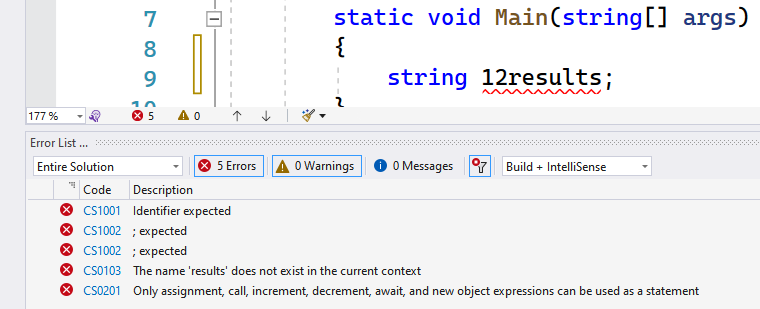
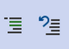

# De basisconcepten van C#


Om een werkend C#-programma te maken moeten we de C#-taal beheersen. Net zoals iedere taal, bestaat ook C# uit enerzijds grammatica, in de vorm van de **C# syntax** en anderzijds woordenschat in de vorm van de te gebruiken gereserveerde **keywords**.

Een C#-programma bestaat uit een opeenvolging van instructies ook wel **statements** genoemd. **Deze eindigen steeds met een puntkomma (``;``)** (zoals ook in het Nederlands een zin eindigt met een punt). Ieder statement kan je vergelijken als één lijn in ons recept, het algoritme.

De volgorde van de woorden (keywords, variabelen, enz.) zijn niet vrijblijvend en moeten aan (grammaticale) regels voldoen. Enkel indien alle statements correct zijn zal het programma gecompileerd worden naar een werkend en uitvoerbaar programma (zoals in het vorige hoofdstuk besproken).

Enkele belangrijke regels van C#:

* **Hoofdlettergevoelig**: C# is hoofdlettergevoelig. Dat wil zeggen dat hoofdletter ``R`` en kleine letter ``r`` totaal verschillende zaken zijn voor C#. ``Reinhardt`` en ``reinhardt`` zijn dus ook niet hetzelfde.
* **Statements afsluiten met puntkomma**: Iedere C# statement wordt afgesloten moet een puntkomma ( **``;``** ). Doe je dat niet dan zal C# denken dat de regel gewoon op de volgende lijn doorloopt en deze als één (fout) geheel proberen te compileren.
* **Witruimtes**: Spaties, tabs en enters worden door de C# compiler genegeerd. Je kan ze dus gebruiken om de layout van je code (*bladspiegel* zeg maar) te verbeteren. De enige plek waar witruimtes wél een verschil geven is tussen aanhalingstekens ``"      "`` die we later (bij string) zullen leren gebruiken.
* **Commentaar toevoegen kan**: door ``//`` voor een enkele lijn te zetten zal deze lijn genegeerd worden door de compiler. Je kan ook meerdere lijnen code in commentaar zetten door er ``/*`` voor en ``*/`` achter te zetten. Voorts zijn er 2 handige knoppen die toelaten om een heel blok code in één keer van commentaar te voorzien of uit commentaar te halen (zie verder).
* **Van boven naar onder**: je code wordt van boven naar onder uitgevoerd en zal enkel naar andere plaatsen springen als je daar expliciet in je code om vraagt (bijvoorbeeld met behulp van loops (hoofdstuk 6) of methoden (hoofdstuk 7)).
* **Je code begint altijd in de ``Main``-methode!!!**

## Keywords: de woordenschat

C# bestaat zoals gezegd niet enkel uit grammaticale regels. Grammatica zonder woordenschat is nutteloos. Er zijn binnen C# dan ook momenteel 80 woorden, zogenaamde **reserved keywords** die de woordenschat voorstellen. Het spreekt voor zich dat deze keywords een eenduidige, specifieke betekenis hebben en dan ook enkel voor dat doel gebruikt kunnen worden. 
In dit boek zullen we stelselmatig deze keywords leren kennen en gebruiken op een correcte manier om zo werkende code te maken. 

Deze keywords zijn:

|   |     |     |   |
|----|----|-----|----|
|*abstract*|*as*|*base*|**bool**|
|**break**|**byte**|**case**|*catch*|
|**char**|checked|*class*|**const**|
|continue|**decimal**|*default*|delegate|
|**do**|**double**|**else**|**enum**|
|event|explicit|extern|**false**|
|finally|fixed|**float**|**for**|
|*foreach*|goto|**if**|implicit|
|*in*|**int**|*interface*|internal|
|*is*|lock|**long**|**namespace**|
|*new*|*null*|*object*|*operator*|
|**out**|*override*|params|*private*|
|*protected*|*public*|readonly|**ref**|
|**return**|**sbyte**|*sealed*|**short**|
|sizeof|stackalloc|*static*|**string**|
|*struct*|**switch**|*this*|*throw*|
|**true**|*try*|typeof|**uint**|
|**ulong**|unchecked|unsafe|**ushort**|
|*using*|using static|*virtual*|**void**|
|volatile|**while**| | |



De keywords in vet zijn keywords die we in het eerste deel van dit boek zullen bekijken (hoofdstuk 1 tot en met 8). Die in cursief in het tweede deel  (9 en verder). De overige zal je zelf moeten ontdekken (of mogelijk zelfs nooit in je carrière gebruiken vanwege hun soms obscure nut).



C# is een levende taal. Soms verschijnen er dan ook nieuwe keywords. De afspraak is echter dat de lijst hierboven niet verandert. Nieuwe keywords maken deel uit van de *contextual keywords* en zullen nooit gereserveerde keywords worden. We zullen enkele van deze "nieuwere" keywords tegenkomen waaronder: ``get``, ``set``, ``value`` en ``var``.






Aandacht, aandacht! Step away from the keyboard! I repeat. Step away from the keyboard. Hierbij wil ik u attent maken op een belangrijke, onbeschreven, wet voor C# programmeurs: "**NEVER EVER USE ``goto``**"

Het moet hier alvast even uit m'n systeem. ``goto`` is weliswaar een officieel C# keyword, toch zal je het in dit boek **nooit** zien terugkomen in code. Je kan alle problemen in je algoritmes oplossen zonder ooit ``goto`` nodig te hebben. 

Voel je toch de drang: **don't!** Simpelweg, don't. Het is het niet waard. Geloof me.

**NEVER USE GOTO**.

Enneuh, ik hou je in't oog hoor!




## Variabelen, identifiers en naamgeving

We hebben variabelen nodig om (tijdelijke) data in op te slaan. Wanneer we een statement schrijven dat bijvoorbeeld input van de gebruiker moet vragen, dan willen we ook die input bewaren zodat we verderop in het programma (het algoritme) iets met deze data kunnen doen.
We doen hetzelfde in ons hoofd wanneer we bijvoorbeeld zeggen "tel 3 en 4 op en vermenigvuldig dat resultaat met 5". Eerst zullen we het resultaat van 3+4 in een variabele moeten bewaren. Vervolgens zullen we de inhoud van die variabele vermenigvuldigen met 5 en dat nieuwe resultaat ook in een nieuwe variabele opslaan (om vervolgens bijvoorbeeld naar het scherm te sturen).

Wanneer we een variabele aanmaken, zal deze moeten voldoen aan enkele afspraken. Zo moeten we minstens 2 zaken meegeven:

* De **identifier** waarmee we snel aan de variabele-waarde kunnen. Dit is de gebruiksvriendelijke naam die we geven aan een geheugenplek.
* Het **datatype** dat aangeeft wat voor data we wensen op te slaan (tekst, getal, afbeelding, enz.). Enkel en alleen dat soort type data zal in deze variabele kunnen bewaard worden. 


### Regels voor identifiers

De code die we gaan schrijven moet voldoen aan een hoop regels. Wanneer we in onze code zelf namen (**identifiers**) geven aan **variabelen** (en later ook methoden, objecten, enz.) dan moeten we een aantal regels volgen, namelijk de volgende:

* **Hoofdlettergevoelig**: de identifiers ``tim`` en ``Tim`` zijn verschillend zoals reeds vermeld.
* **Geen keywords**: identifiers mogen geen gereserveerde C# keywords zijn. De keywords van 2 pagina's terug mogen dus niet. Varianten waarbij de hoofdletters anders zijn mogen wel, bijvoorbeeld: ``gOTO`` en ``stRINg`` mogen dus wel, maar niet ``goto`` of ``string`` daar beide een gereserveerd keyword zijn maar dankzij de hoofdlettergevoelig-regel is dit dus toegelaten. Een ander voorbeeld ``INT`` mag bijvoorbeeld wel, maar ``int`` niet.
* **Eerste karakter-regel**: het eerste karakter van de identifier mag enkel zijn:
  * kleine of grote letter
  * liggend streepje (``_``)
* **Alle andere karakters-regels**: de overige karakters mogen enkel zijn:
  * kleine of grote letter
  * liggend streepje
  * een cijfer (``0`` tot en met ``9``)
* **Lengte**: Een legale identifier mag zo lang zijn als je wenst, maar je houdt het best leesbaar.


Volg je voorgaande regels niet dan zal je code niet gecompileerd worden en zal VS de identifiers in kwestie als een error aanduiden. Of beter, als een hele hoop errors. Schrik dus niet als je bijvoorbeeld het volgende ziet:





#### Enkele voorbeelden

Enkele voorbeelden van toegelaten en niet toegelaten identifiers:

| identifier | toegelaten? | uitleg indien niet toegelaten |
|----|----|-----|
|werknemer| ja |  |
|kerst2018| ja |  |
|pippo de clown| neen| geen spaties toegestaan|
|4dPlaats| neen| mag niet starten met een cijfer|
|_ILOVE2022| ja| |
|Tor+Bjorn| neen| enkel cijfers, letters en liggende streepjes toegestaan|
|ALLCAPSMAN| ja |  |
|B_A_L| ja| |
|class | neen| gereserveerd keyword|
|WriteLine| ja|  |
|______| ja|  |

### Naamgeving afspraken

Er zijn geen vaste afspraken over hoe je je variabelen moet noemen toch hanteren we enkele **coding richtlijnen**:

* **Duidelijke naam**: de identifier moet duidelijk maken waarvoor de identifier dient. Schrijf dus liever ``gewicht`` of ``leeftijd`` in plaats van ``a`` of ``meuh``.
* **Camel casing**: gebruik camel casing indien je meerdere woorden in je identifier wenst te gebruiken. Camel casing wil zeggen dat ieder nieuw woord terug met een hoofdletter begint. Een goed voorbeeld kan dus zijn ``leeftijdTimDams`` of ``aantalLeerlingenKlas1EA``. Merk op dat we liefst het eerste woord met kleine letter starten. Uiteraard zijn er geen spaties toegelaten.

## Commentaar

Soms wil je misschien extra commentaar bij je code zetten. Als je dat gewoon zou doen (bv. ``Dit deel zal alles verwijderen``) dan zal je compiler niet begrijpen wat die zin doet. Hij verwacht namelijk C# en niet een Nederlandstalige zin. Om dit op te lossen kan je in je code op twee manieren aangeven dat een stuk tekst gewoon commentaar is en mag genegeerd worden door de compiler.

### Enkele lijn commentaar

Eén lijn commentaar geef je aan door de lijn te starten met twee voorwaartse slashes ``//``. Uiteraard mag je ook meerdere lijnen op deze manier in commentaar zetten. Zo wordt dit ook vaak gebruikt om tijdelijk een stuk code "uit te schakelen". Ook mogen we commentaar *achter* een stuk C# code plaatsen (zie voorbeeld hieronder). ``//`` zal alle tekens die volgen tot aan de volgende enter in commentaar zetten:

```java
//De start van het programma
int getal = 3;
//Nu gaan we rekenen
int result = getal * 5;
// result = 3*5;
Console.WriteLine(result); //We tonen resultaat op scherm: 15
```

### Blok commentaar

We kunnen een stuk tekst als commentaar aangeven door voor de tekst ``/*`` te plaatsen en ``*/`` achteraan. Een voorbeeld:

```java
/*
    Een blok commentaar
    Een heel verhaal, dit wordt mooi
    Is dit een haiku?
*/
int leeftijd = 0;
```


Je kan ook code in VS selecteren en dan met de comment/uncomment-knoppen in de menubalk heel snel lijnen of hele blokken code van commentaar voorzien, of deze net weghalen:





