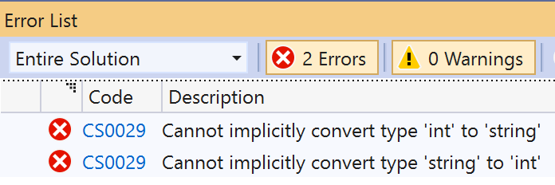

## Variabelen

De data die we in een programma gebruiken bewaren we in een **variabele van een bepaald datatype**. Een variabele is een plekje in het geheugen dat in je programma zal gereserveerd worden om daarin data te bewaren van het type dat je aan de variabele hebt toegekend. Een variabele zal intern een geheugenadres hebben (waar de data in het geheugen staat) maar dat zou lastig programmeren zijn indien je steeds dit adres moest gebruiken. Daarom moeten we ook steeds een naam oftewel **identifier** aan de variabele geven zodat we makkelijk de geheugenplek kunnen aanduiden en niet moeten werken met een lang hexadecimaal geheugen adres (bv 0x4234FE13EF1).


De naam (identifier) van de variabele moet voldoen aan de identifier regels zoals eerder besproken.



### Variabelen aanmaken en gebruiken

Om een variabele te maken moeten we deze **declareren**, door een type en naam te geven. Vanaf dan zal de computer een hoeveelheid geheugen voor je reserveren waar de inhoud van deze variabele in kan bewaard worden. 
Hiervoor dien je minstens op te geven:

1. Het **datatype** \(bv ``int``, ``double``\).
2. Een **identifier** zodat de variabele uniek kan geïdentificeerd worden volgens de naamgevingsregel van C#.
3. \(optioneel\) Een **beginwaarde** die de variabele krijgt bij het aanmaken ervan.

Een variabele declaratie heeft als syntax:


```java
datatype identifier;
```
Enkele voorbeelden:

```java
int leeftijd;
string leverAdres;
bool isGehuwd;
```
Indien je weet wat de beginwaarde moet zijn van de variabele dan mag je de variabele ook reeds deze waarde toekennen bij het aanmaken:


```java
int mijnLeeftijd = 37;
```


Je mag ook meerdere variabelen van het zelfde datatype in 1 enkele declaratie aanmaken door deze met komma's te scheiden:

```java
datatype identifier1, identifier2, identifier3;
```
Bijvoorbeeld ``string voornaam, achternaam, adres;``



### Waarden toekennen aan variabelen

Van zodra je een variabele hebt gedeclareerd kunnen we dus ten allen tijde deze variabele gebruiken om een waarde aan toe te kennen, de bestaande waarde te overschrijven, of de waarde te gebruiken, zoals:

* **Waarde toekennen**: Herinner dat de toekenning steeds gebeurt van rechts naar links: het deel rechts van het gelijkheidsteken wordt toegewezen aan het deel links er van, bijvoorbeeld: `mijnGetal = 15;`
* **Waarde gebruiken**: Bijvoorbeeld `anderGetal = mijnGetal + 15;`
* **Waarde tonen op scherm**: Bijvoorbeeld `Console.WriteLine(mijnGetal);`

Met de **toekennings-operator \(=\)** kan je een waarde toekennen aan een variabele. Hierbij kan je zowel een literal toekennen oftewel het resultaat van een expressie .

Je kan natuurlijk ook een waarde uit een variabele uitlezen en toewijzen (kopiëren) aan een andere variabele:


```java
int eenAndereLeeftijd = mijnLeeftijd;
```


### Literal toewijzen

Literals zijn expliciet ingevoerde waarden in je code. Als je in je code expliciet de waarde 4 wilt toekennen aan een variabele dan is het getal 4 in je code een zogenaamde **literal**. Wanneer we echter data bijvoorbeeld eerst uitlezen of berekenen \(via bijvoorbeeld invoer van de gebruiker of als resultaat van een berekening\) en het resultaat hiervan toekennen aan een variabele dan is dit geen literal.

Voorbeelden van een literal toekennen:

```java
int temperatuurGisteren = 20; //20 is de literal
int temperatuurVandaag = 25; //25 is de literal
```

Het is belangrijk dat het type van de literal overeenstemt met dat van de variabele waaraan je deze zal toewijzen. Een string-literal (zie verder) stel je voor door aanhalingstekens. Volgende code zal dan ook een compiler-fout generen, daar je een string-literal aan een int-variabele wil toewijzen, en vice versa.

```java
string eenTekst;
int eenGetal;
eenTekst = 4;
eenGetal = "4";
```

Als je bovenstaande probeert te compileren dan krijg je volgende error-boodschappen:





#### Literal bepaalt het datatype
De manier waarop je een literal schrijft in je code zal bepalen wat het datatype van die literal is:

* **Gehele getallen** worden standaard als ``int`` beschouwd, vb: ``125``.
* **Kommagetallen** (met punt ``.``) worden standaard als ``double`` beschouwd, vb: ``12.5``.

Wil je echter andere getaltypes dan ``int`` of ``double `` een waarde geven dan moet je dat dus expliciet in de literal aanduiden. Hiervoor plaats je een *suffix* achter de literalwaarde. Afhankelijk van deze suffix duidt je dan aan om welke datatype het gaat: 

* ``U`` of ``u`` voor ``uint``, vb: ``125U`` (dus bijvoorbeeld ``uint aantalSchapen = 27u;``)
* ``L`` of ``l`` voor ``long``, vb: ``125L``.
* ``UL`` of ``ul`` voor ``ulong``, vb: ``125ul``.
* ``F`` of ``f`` voor ``float``, vb: ``12.5f``.
* ``M`` of ``m`` voor ``decimal``, vb: ``12.5M``.

Naast getallen zijn er uiteraard ook nog andere datatypes waar we de literals van moeten kunnen schrijven:

Voor **``bool``** zijn dit enkel ``true`` en ``false``.

Voor **``char``** wordt dit aangeduid met een enkele apostrof voor en na de literal.
Denk maar aan ``char laatsteLetter = 'z';``.

Voor **``string``** wordt dit aangeduid met aanhalingsteken voor en na de literal.
Bijvoorbeeld ``string myPoke = "pikachu"``.


Om samen te vatten, even de belangrijkste literal schrijfwijzen op een rijtje:

```java
int getal = 5;
double anderGetal = 5.5;
uint nogAnderGetal = 15u;
float kleinKommaGetal = 158.9f;
char letter = 'k';
bool isDitCool = true;
string zin = "Ja hoor";
```


De overige types ``sbyte``, ``short`` en ``ushort`` hebben geen literal aanduiding. Er wordt vanuit gegaan wanneer je een literal probeert toe te wijzen aan één van deze datatypes dat dit zonder problemen zal gaan (ze worden impliciet geconverteerd). Bijvoorbeeld ``sbyte start = 127;`` wordt toegestaan, de ``int`` literal 127 zal geconverteerd worden achter de schermen naar een ``sbyte`` en dan toegewezen worden.


##### Hexadecimale en binaire notatie

Je kan ook hexadecimale notatie (starten met ``0x`` of ``0X``) gebruiken wanneer je bijvoorbeeld met ``int`` of ``byte`` werkt:
```java
int mijnLeeftijd = 0x0024; //36
byte mijnByteWaarde = 0x00C9; //201
``` 

Ook binaire notatie (starten met ``0b`` of ``0B``) kan:
```java
int mijnLeeftijd = 0b001001000; //72
int andereLeeftijd = 0b0001_0110_0011_0100_0010 //idem, maar met _ als seperator
``` 

Deze schrijfwijzen kunnen handig zijn wanneer je met binaire of hexadecimale data wilt werken die je bijvoorbeeld uit een stuk hardware hebt uitgelezen (bijvoorbeeld een Arduino of Raspberry Pi).

#### Beginwaarden van variabelen

Het is een goede gewoonte om variabelen steeds ogenblikkelijk een beginwaarde toe te wijzen. Alhoewel C# altijd vers gedeclareerde variabelen een standaard beginwaarde zal geven, is dit niet zo in oudere programmeertalen. In sommige talen zal een variabele een volledig willekeurige beginwaarde krijgen. Gelukkig in C# is dat niet, maar geef toch maar direct steeds een waarde, al was het om je literals te oefenen.

De standaard beginwaarde van een variabele hangt natuurlijk van het datatype af: 

* Voor getallen is dat steeds de nulwaarde (dus ``0`` bij  ``int``, ``0.0`` bij ``double`` enzovoort). 
* Bij variabelen van het type ``bool`` is dat ``false``. 
* Bij ``char`` is dat de literal: ``\0`` (in het volgende hoofdstuk leggen we die vreemde backslash uit). 
* En bij tekst is dat de lege ``string``-literal: ``""`` (maar je mag ook ``String.Empty`` voor de leesbaarheid).


### Nieuwe waarden overschrijven oude waarden

Wanneer je een reeds gedeclareerde variabele een **nieuwe waarde toekent** dan zal de oude waarde in die variabele onherroepelijk verloren zijn. Probeer dus altijd goed op te letten of je de oude waarde nog nodig hebt of niet. Wil je de oude waarde ook nog bewaren dan zal je een nieuwe, extra variabele moeten aanmaken en daarin de nieuwe waarde moeten bewaren:

```java
int temperatuurGisteren = 20;
temperatuurGisteren = 25;
```

In dit voorbeeld zal er dus voor gezorgd worden dat de oude waarde van temperatuurGisteren, ``20``, overschreven zal worden met ``25``.

Volgende code toont hoe je bijvoorbeeld eerst de vorige waarde kunt bewaren en dan overschrijven:

```java
int temperatuurGisteren = 20;
//Doe van alles
//...
//Vervolgens: vorige temperatuur in eergisteren bewaren
int temperatuurEerGisteren = temperatuurGisteren; 
//temperatuur nu overschrijven
temperatuurGisteren = 25; 
```
We hebben dus aan het einde van het programma zowel de temperatuur van eergisteren, ``20``, als die van gisteren, ``25``.



Een veel gemaakte fout is variabelen meer dan één keer declareren. Dit hoeft niet én mag niet. Van zodra je een variabele declareert is deze bruikbaar in de scope (zie hoofdstuk 5) tot het einde.
Volgende code zal dus een fout geven:

```java
double kdRating = 2.1;
//even later...
double kdRating = 3.4; 
```

De foutboodschap vertelt duidelijk wat het probleem is: *A local variable or function named 'kdRating' is already defined in this scope.*

Lijn 3 moet dus worden:
 

```java
kdRating = 3.4; 
```




