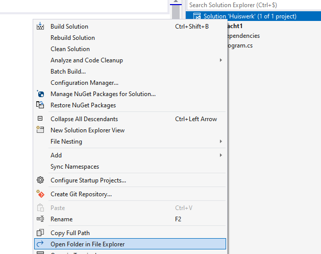

## Solutions, projecten en folderstructuren

Het wordt tijd om eens te kijken hoe Visual Studio jouw code juist organiseert wanneer je een nieuw project start. Zoals je al hebt gemerkt in de Solution Explorer wordt er meer aangemaakt dan enkel een Program.cs codebestand. Visual Studio werkt volgens volgende hiërarchie:

1. Een solution is een folder waarbinnen **één of meerdere projecten** bestaan.
2. Een project is een verzameling bestanden (meestal codebestanden) die kunnen gecompileerd worden tot een uitvoerbaar bestand (we vereenvoudigen bewust het concept project in dit handboek).

Wanneer je dus aan de start van een nieuwe opdracht staat en in VS kiest om voor "Create a new project" dan zal je eigenlijk aan een nieuwe solution beginnen met daarin één project. Je bent dus echter niet beperkt om binnen een solution maar één project te bewaren. Integendeel, vaak kan het handig zijn om meerdere projecten samen te houden. Ieder project bestaat op zichzelf, maar wordt wel logisch bij elkaar gehouden in de solution. Dat is ook de reden waarom we vanaf de start hebben aangeraden om nooit het vinkje "Place solution and project in the same directory" aan te duiden.

### Folderstructuur van een solution

Wanneer je in VS een nieuw project start ben je niet verplicht om de "Project name" en "Solution name" dezelfde waarde te geven. Je zal wel merken dat bij het invoeren van de "Project name" de "Solution name" dezelfde invoer krijgt. Je mag echter vervolgens perfect de "Solution name" aanpassen. 

Stel dat we een nieuw VS project aanmaken met volgende informatie:

1. Naam van het project = Opdracht1
2. Naam van de solution  = Huiswerk

En plaatsen deze in de folder C:\Temp.

Dit zal resulteren in volgende beeld in de solution explorer:

Je ziet duidelijk een hiërarchie: bovenaan de solution Huiswerk, met daarin een project Opdracht1, gevuld met informatie zoals de Program.cs. 

**Rechterklik nu op de solution en kies "Open folder in file explorer"** Je kan deze optie kiezen voor eender welk item in de solution explorer. Het zal er voor zorgen dat de verkenner wordt geopend op de plek waar het item staat waar je op rechter klikte. Op die manier kan je altijd ontdekken waar een bestand of of folder zich fysiek bevindt op je harde schijf.

We zien nu een tweede belangrijke aspect dat we in deze sectie willen uitleggen: **Een solution wordt in een folder geplaatst met dezelfde naam én bevat één .sln bestand. Binnenin deze folder wordt een folder aangemaakt met de naam van het project.** 

Je kan dus je volledige solution, inclusief het project, openen door in deze folder het .SLN bestand te selecteren. Dit bestand zelf bevat echter geen code



Een sln-bestand op zichzelf bevat dus géén code . Je moet de **hele folderstructuur** verplaatsen/doorsturen indien je aan je project op een andere plek wilt werken. Open gerust eens een .sln-bestand in notepad en je zal zien dat het bestand onder andere oplijst waar het onderliggende project zich bevindt. 



### Folderstructuur van een project

Laten we nu eens bekijken hoe de folderstructuur van het project is. Rechterklik deze keer op het project (Opdracht1) en kies weer "Open folder in file explorer." Hier staat een herkenbaar bestand! Inderdaad, het Program.cs codebestand! In dit bestand staat de actuele code van Opdracht1. 



**Een .cs-bestand rechtstreeks vanuit de verkenner openen werkt niet.** VS zal weliswaar de inhoud van het bestand tonen, maar je kan verder niets doen. Je kan niet compileren, debuggen, etc. De reden is eenvoudig: een .cs bestand op zichzelf is nutteloos. Het heeft pas een bestaansreden wanneer het wordt geopend in een project. Het project zal namelijk beschrijven hoe dit specifieke bestand juist moet gebruikt worden in het huidige project.



Voorts zien we ook een .csproj bestand genaamd Opdracht1. Net zoals het .sln-bestand zal dit bestand beschrijven welke bestanden én folder deel uitmaken van het huidige project. Je kan dit bestand dus ook openen vanuit de verkenner en je zal dan je volledige project zien worden ingeladen in Visual Studio. 

#### De bin-folder 
De "obj" folder gaan we in dit handboek negeren. Maar kijk eens wat er in de "bin" folder staat. Een folder"debug". In deze folder zal je gecompileerde (debug) versie van je project terecht komen indien je je huidige project compileert. Je zal wat moeten doorklikken tot de *binnenste folder* (die de naam van de huidige .net versie bevat waarin je compileert).

Je kan in principe vanuit deze map ook je gecompileerde project uitvoeren door te dubbelklikken op Opdracht1.exe. Je zal echter merken dat het programma ogenblikkelijk terug afsluit omdat het programma aan het einde van de code altijd afsluit. Voeg daarom volgende lijn code toe onderaan in je Main: ``Console.ReadLine()`` . Het programma zal nu pas afsluiten wanneer je op enter hebt gedrukt en de gecompileerde versie kan dus nu vanuit de verkenner gestart worden!

Merk op dat je de volledige inhoud van deze folder moet meegeven indien je je gecompileerde resultaat aan iemand wilt geven om uit te voeren.

### Meerdere projecten

We vertelden net dat een solution meerdere projecten kan bevatten. Maar hoe voeg je een extra project toe? Heel eenvoudig: terwijl je huidige solution open is (waar je een project wenst aan toe te voegen) kies je in het menu voor *File->Add->New project...*

e moet nu weer het klassieke proces doorlopen om een console-project, alleen ontbreekt deze keer de "Solution name" tekstveld, daar dit reeds gekend is.

Wanneer je klaar bent zal je zien dat in de Solution Explorer een tweede project is verschenen. Als we wederom de folderstructuur van onze solution zouden bekijken in de verkenner dan zouden we ontdekken dat er een nieuwe folder, genaamd Opdracht2, is verschenen met ook daarin een eigen Program.cs en .csproj-bestand.

Nu rest ons nog één belangrijke stap: **selecteren welk project moet gecompileerd en uitgevoerd worden**. In de solution explorer kan je zien welk het *actieve* project is, namelijk het project dat vet gedrukt staat.

Je kan nu op 2 manieren het actieve, uit te voeren, project kiezen.

**Manier 1**: Rechterklik in de Solution Explorer op het actief te zetten project en kies voor  "Set as startup project."
**Manier 2**: bovenaan , links van de groene "compiler/run" knop, staat een selectieveld met het actieve project. Je kan hier een andere project selecteren. 



Controleer altijd goed dat je in het juiste Program.cs bestand bent aan het werken. Je zou niet de eerste zijn die maar niet begrijpt waarom de code die je invoert z'n weg niet vindt naar je debugvenster. Inderdaad, vermoedelijk heb je het verkeerde Program.cs bestand open OF heb je het verkeerde actieve project gekozen. 

