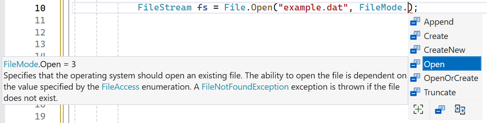

## Schrijven en lezen

De locaties en paths van bestanden kennen is...interessant. Het wordt natuurlijk pas echt nuttig wanneer we de inhoud van bestanden kunnen uitlezen en aanpassen. Daarvoor zijn we hier natuurlijk. 

Er is geen vaste manier om dit te doen. Alles hangt af van je specifieke probleem. We zullen daarom enkele veel gebruikte *use-cases* bekijken.


### StreamWriter en StreamReader 

#### StreamWriter

Met behulp van een ``StreamWriter`` kan je data naar een bestand (of een andere *streambron*) wegschrijven. Het gebruik ervan is verrassend eenvoudig.

```csharp
StreamWriter writer = new StreamWriter("doeeeeeem.txt",true):
writer.WriteLine("Game over!");
```

Inderdaad, net zoals je bij de ``Console``-klasse ``WriteLine`` hebt, heb je dat ook hier om tekst naar een bestand te schrijven. 

Wanneer we een ``writer``-object aanmaken, geven we ook een tweede parameter  (``true``) mee. Dit geeft aan dat de tekst achter de bestaande inhoud van het bestand moet worden toegevoegd (*to append*). Indien je ``false`` meegeeft dan zal de inhoud van het bestand verwijderd worden en start je van een nieuw, leeg bestand.

#### StreamReader

En ja, uiteraard is er dus ook een manier om tekst uit een bestand te lezen. De ``StreamReader`` heeft onder andere een ``ReadLine`` methode die dit toelaat. De extra moeilijkheid bij het uitlezen van bestanden is dat we goed moeten nakijken of er nog iets uit te lezen valt. Dit kun je enigszins vergelijken met het uitlezen van een array, want ook daar moeten we opletten dat we niet voorbij de grenzen van de array gaan.

Volgende voorbeeld gebruikt een ``StreamReader`` om ons tekstbestand lijn per lijn op het scherm te tonen:

```csharp
StreamReader reader = new StreamReader("doeeeeeem.txt");
string regel;

while ((regel = reader.ReadLine()) != null)
{
    Console.WriteLine(line);  
}
```

De conditie op lijn 4 verdient wat toelichting. We doen hier 2 zaken:

1. We lezen de volgende lijn uit met behulp van ``ReadLine``.
2. Wanneer we aan het einde van het bestand zijn zouden we ``null`` terugkrijgen uit ``ReadLine``. Daarom dat we vervolgens hierop controleren. Enkel als we dus effectief nog tekst uitlezen mogen we nogmaals in de loop gaan.


### ``using`` alternatief

In een ver verleden (hoofdstuk 10) hadden we het al even over ``using`` en hoe het gebruikt wordt om aan te geven dat de compiler ook een specifieke  ``namespace`` mag gebruiken. Wel, het ``using`` keyword heeft ook nog een alternatief gebruik in C#. 

Het ``using`` keyword kan ook worden gebruikt om een bepaald stuk code binnen een codeblok te definiëren waarin een object wordt aangemaakt, gebruikt en vervolgens op de juiste manier wordt verwijderd zodra het blok is uitgevoerd. 

Dit is vooral handig bij het werken met bestanden. Het zal ervoor zorgen dat het bestand correct wordt vrijgegeven aan het besturingssysteem, zelfs wanneer er fouten optreden.  Beeld je in dat je programma crasht wanneer je net naar een bestand schrijft: hierdoor bestaat de kans dat het bestand *gelockt* wordt waardoor andere applicaties niet aan het bestand aan kunnen. Niet handig.

De vorm van een ``using``-codeblock ziet er als volgt uit:

```text
using (resource aanmaken dat netjes moet worden opgeruimd)
{

}
```

Volgend voorbeeld, waarin we een StreamWriter gebruiken, toont de werking ervan:

```csharp
using (StreamWriter writer = new StreamWriter("doem.txt"))
{
    writer.WriteLine("Het einde is nabij!");
    writer.WriteLine("Hou vol!");
}
```

Wanneer de accolades van lijn 5 worden bereikt, zal het object dat in lijn1 werd aangemaakt, proper afgesloten worden. C# zal de ``Dispose``-methode[^dispose] van het ``writer``-object aanroepen zodat het bestand terug vrijgegeven wordt.

[^dispose]: De Dispose methode wordt aangeroepen om bestanden, folders of andere *resources* expliciet vrij te geven wanneer ze niet langer nodig zijn. Dit voorkomt geheugenlekken en verhoogt de efficiëntie van de toepassing. De methode zit ingebakken in veel klassen die werken met zaken zoals bestanden, netwerkverbindingen, etc. Al deze klassen implementeren de  ``IDisposable`` interface en hebben daarom de ``Dispose`` methode.


###  Uitgewerkt voorbeeld

Dankzij ``StreamReader`` en ``StreamWriter`` hebben we nu reeds een goede greep op werken met bestanden. Laten we eens alles combineren tot een functioneel programma. We maken een dagboek-programma. Telkens het programma opstart zal het de reeds bestaande dagboek-schrijfsels tonen. Vervolgens kan de gebruiker een nieuwe tekst toevoegen. Nadien sluit het programma af. We gebruiken  ``DateTime.Now`` om ieder schrijfsel van een duidelijke tijd en datum te voorzien:

```csharp
string dagboekPath = "dagboek.txt";
if (!File.Exists(dagboekPath))
{
    File.Create(dagboekPath);
}

// dagboek tonen
Console.WriteLine("Dagboek:");
using (StreamReader reader = new StreamReader(dagboekPath))
{
    string regel;
    while ((regel = reader.ReadLine()) != null)
    {
        Console.WriteLine(regel); // 
    }
}

//dagboek schrijven
Console.WriteLine("\nGeef je volgende dagboekschrijfsel:");
string entry = Console.ReadLine();

using (StreamWriter writer = new StreamWriter(dagboekPath,true))
{
    writer.WriteLine($"\n{DateTime.Now}");
    writer.WriteLine(entry);
}
```

## Binaire bestanden

Totnogtoe werkten we enkel met tekstbestanden om strings uit te lezen. Uiteraard hoeft dit niet, maar het is wel eenvoudig. Soms wil je echter ook binaire bestanden aanmaken en verwerken. Dat kan met de ``BinaryWriter`` en ``BinaryReader``. Dit is echter iets complexer.

De extra moeilijkheid is het feit dat we nu niet meer beperkt zijn tot het wegschrijven van strings. We kunnen perfect een bestand aanmaken dat een opeenvolging van waardes bevat met allemaal verschillende datatypes.  Vooral bij het uitlezen zal dit die extra complexiteit én foutgevoeligheid geven.


### BinaryWriter

De ``BinaryWriter`` is nog relatief eenvoudig. De werking is zeer gelijklopend met de ``TextWriter``. Er zijn wel enkele verschillen.

#### Bestand openen met ``File.Open``

Om een bestand te openen met een ``BinaryWriter`` gebruiken we de ``File``-klasse. We moeten daarbij ook expliciet aangeven hoe het bestand moet aangemaakt worden (indien het niet bestaat):

```csharp
FileStream fs = File.Open("bondData.dat", FileMode.Create);
using (BinaryWriter writer = new BinaryWriter(fs))
{
    //...
```

Het tweede argument bij de ``Open``-methode is een enum die verschillende mogelijkheden heeft:

* ``Append``: Opent een bestaand bestand en plaatst de schrijfpositie aan het einde van het bestand, zodat nieuwe data aan het einde worden toegevoegd. Als het bestand niet bestaat, wordt er een ``FileNotFoundException`` gegenereerd.
* ``Create``: Maakt een nieuw bestand aan. Als het bestand al bestaat, wordt het overschreven.
* ``CreateNew``: Maakt een nieuw bestand aan. Als het bestand al bestaat, wordt er een IOException gegenereerd.
* ``Open``: Opent een bestaand bestand. Als het bestand niet bestaat, zal er een ``FileNotFoundException`` worden gegenereerd.
* ``OpenOrCreate``: Opent een bestaand bestand als het bestaat. Als het bestand niet bestaat, wordt er een nieuw bestand aangemaakt.
* ``Truncate``: Opent een bestaand bestand en snijdt de inhoud af, waardoor het bestand leeg wordt. Als het bestand niet bestaat, wordt er een ``FileNotFoundException`` gegenereerd.

Toegegeven, het is niet altijd erg intuïtief welke modus je juist nodig zal hebben. Alles hangt af van het specifieke probleem dat je wenst op te lossen.



#### Schrijven met ``Write``

Het andere verschil met de ``TextWriter`` is dat je nu alleen een ``Write``-methode gaat gebruiken. Deze methode accepteert elk datatype. En dat is het grote verschil: **met een ``BinaryWriter`` kunnen we elk datatype wegschrijven**!

In volgende voorbeeld schrijven we 3 verschillende zaken weg, een ``string``, een ``int`` en uiteindelijk een ``bool``:

```csharp
var fs = File.Open("bondData.dat", FileMode.Create);
using (BinaryWriter writer = new BinaryWriter(fs))
{
    writer.Write("Bond"); 
    writer.Write(7); 
    writer.Write(true);
}
```

Dit genereert een bestand van 10 bytes. Als we dit bestand vervolgens op binair niveau zouden bekijken, zouden we ontdekken dat de grootte van het bestand exact gelijk is aan de individuele groottes van de drie variabelen:

* De string Bond bestaat uit 4 karakters, elk 1 byte groot, plus 1 extra byte om de lengte van de string aan te geven. Dus in totaal 5 bytes.
* De integer vereist 4 bytes.
* De boolean vereist slechts 1 byte.

Stel nu dat we een complexer voorbeeld hebben waarbij we nog meer typen data willen wegschrijven, zoals een ``double`` en een ``char``:

```csharp
var fs = File.Open("bondDataAdvanced.dat", FileMode.Create);
using (BinaryWriter writer = new BinaryWriter(fs))
{
    writer.Write("Gadget"); 
    writer.Write(42);
    writer.Write(false); 
    writer.Write(3.14159); 
    writer.Write('A'); 
}
```
In dit voorbeeld zou de bestandsgrootte als volgt worden berekend:

* De ``string`` is 6 karakters lang + 1 byte voor de lengte: 6 bytes + 1 byte = 7 bytes.
* De integer beslaat 4 bytes.
* De ``boolean``  beslaat 1 byte.
* De ``double``  beslaat 8 bytes.
* De ``char``  beslaat 1 bytes.
* 
De totale bestandsgrootte zal daarom 21 bytes zijn.

### BinaryReader

Om binaire bestanden uit te lezen hebben we een ``BinaryReader``-object nodig. Deze klasse heeft aller ``ReadX``-methoden, waarbij *X* het datatype aangeeft dat je wilt uitlezen.

Bij het schrijven hoefden we nog niet echt na te denken over de volgorde. Bij het lezen is dit uiteraard cruciaal. Het is essentieel dat we weten in welke volgorde de data in het bestand staat. Als we bijvoorbeeld eerst een ``int`` en daarna een ``char`` hebben weggeschreven, dan moeten we bij het uitlezen exact die volgorde aanhouden. Anders zal de binaire informatie uit het bestand op een verkeerde manier worden verwerkt, wat kan leiden tot onjuiste data of zelfs een crash.

De ``Read``-methode van de ``BinaryReader`` heeft varianten voor ieder primitief datatype beschikbaar in C#. Zo zijn er onder andere:``ReadBoolean``, ``ReadByte``, ``ReadChar``, ``ReadDecimal``, ``ReadDouble``, ``ReadInt16`` (voor ``short``), ``ReadInt32`` (voor ``int``), ``ReadInt64`` (voor ``long``), ``ReadSingle`` (voor ``float``), ``ReadString``, ``ReadUInt16`` (voor ``ushort``),  ``ReadUInt32`` (voor ``uint``).
  
Hierdoor kunnen we specifiek aangeven welk type data we willen inlezen en kan de ``BinaryReader`` de bytes correct interpreteren.

Als we dus het ``bondData.dat`` bestand vervolgens willen uitlezen dan moet dit als volgt:

```csharp
var fs = File.Open("bondData.dat", FileMode.Open);
using (BinaryReader reader = new BinaryReader(fs))
{
    string naam = reader.ReadString();
    int code = reader.ReadInt32();
    bool leeftNog = reader.ReadBoolean();
    Console.WriteLine($"{naam} ({code}). Leeft nog = {leeftNog}");
}
```

Merk op dat we deze keer de modus ``FileMode.Open`` hanteren bij het openen van het bestand.

::: warning

Test gerust eens wat er zou gebeuren als je een van de ``Read``-methode van volgorde zou veranderen. Meestal zal je een uitzondering krijgen omdat de methoden de in te lezen bytes niet begrijpen en kunnen omzetten naar het verwachte datatype.

Als we in het voorgaande voorbeeld lijn 4 en 5 zouden omwisselen dan crasht onze applicatie met een ``EndOfStreamException``.
:::

<!-- \newpage -->


### Binaire inhoud tonen

De ``File``-klasse heeft een handige methode ``ReadAllBytes`` waarmee je snel de binaire inhoud van een bestand kunt bekijken. Deze methode is nuttig wanneer je de exacte gegevens van een bestand wilt inspecteren.

De ``ReadAllBytes`` methode zal een array van ``byte`` teruggeven die we vervolgens kunnen overlopen in een loop. Als handigheidje gebruiken een string formatter ``X2`` (zie hoofdstuk 4) om de bytes als hexadecimale waarden af te drukken:

```csharp
byte[] inhoud = File.ReadAllBytes("bondData.dat");

foreach (byte b in inhoud)
{
    Console.Write($"{b:X2} ");
}
``` 

Dit geeft volgende output:

```text
04 42 6F 6E 64 07 00 00 00 01
```

::: tip
De eerste byte (``04``) geeft de lengte van de string aan die volgt, 4 dus. De volgende 4 bytes, ``42 6F 6E 64`` zijn de Unicode waarden voor de letters "b, o, n , d".
Vervolgens hebben we 4 byes om het getal 7 voor te stellen (``07 00 00 00``). Finaal hebben we nog de byte-waarde ``01`` die de ``bool`` op ``true`` voorstelt.
:::


::: tip

Vond je het vreemd dat 7 binair als ``07 00 00 00`` werd voorgesteld? 

Dit komt doordat het getal 7 wordt opgeslagen als een 4-byte **little-endian** getal. In little-endian-notatie wordt de minst significante byte (**least significant byte** of LSB) eerst opgeslagen. Voor het getal 7 betekent dit dat de hexadecimale waarde 07 in de eerste byte komt, gevolgd door drie nullen omdat de overige bytes geen bijdrage leveren aan de waarde van het getal.

Als we daarentegen het getal 1000 willen voorstellen,  ``3E8`` hexadecimaal, die we in little-endian volgorde opslaan als ``E8 03 00 00``. Hier wordt de LSB ``E8`` (de laagste byte) als eerste byte opgeslagen, gevolgd door ``03`` en daarna twee nullen om de 4-byte structuur te vervolledigen, aangezien 3E8 in 32-bits binaire vorm wordt opgeslagen.

:::