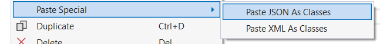

## Klassen serialiseren

Uiteraard weet je nu genoeg om informatie uit je klassen naar een bestand te schrijven en vice versa. Zowel de ``BinaryWriter`` en ``TextWriter`` laten in principe toe om je objectinhoud te bewaren. Bij de ``TextWriter`` moeten we dan een hoop data dan de hele tijd converteren van en naar ``string``, wat totaal niet handig werkt. Bij ``BinaryWriter`` moeten we dan weer goed uitkijken dat we de data in de juiste volgorde inlezen als dat we ze in de eerste instantie hadden weggeschreven.

Telkens een introductie begint zoals de vorige paragraaf, dan weet je dat er een betere oplossing is. Inderdaad, er zit in C# een ingebakken manier om objecten te **serialiseren** naar een bestand. Het woord serialiseren dekt de lading: we gaan de inhoud van een object in serie, achter elkaar bewaren en wegschrijven.  Uiteraard zullen we ook het omgekeerde proces bekijken, namelijk **deserialiseren**. 


Waarom wil je objecten kunnen serialiseren naar een bestand? Eenvoudig: het laat je toe om de huidige staat van je programma naar een bestand weg te schrijven en later terug op te halen. Je maakt letterlijk een *savepoint* van je programma en geeft je gebruiker de mogelijkheid om op een later moment vanaf dat punt verder te werken.



###  JSON

Serialiseren naar een binair bestand resulteert in een zeer compact, maar onleesbaar bestand. Dit type bestand is uiterst efficiënt wat betreft opslag en snelheid bij het inlezen. Echter, het aanpassen van een binair bestand is uiterst complex en het biedt geen garantie dat dit bestand nadien nog correct kan worden gedeserialiseerd naar een object. Bovendien is kennis van het exacte binaire formaat vereist om enige aanpassing te maken, wat handmatig werken vrijwel onmogelijk maakt.

Serialiseren naar een tekstbestand geeft daarentegen een zeer leesbaar en dus makkelijker aanpasbaar bestand. Het biedt eveneens het voordeel dat je het bestand eenvoudig kan openen, wijzigen en opslaan met behulp van een eenvoudige teksteditor. We moeten echter nauwkeurig specificeren welk datatype welke string vertegenwoordigt en structuren consequent aanhouden om misverstanden te vermijden.

<!-- \newpage -->


Het **JSON**-bestandsformaat (JavaScript Object Notation) combineert het beste van beide werelden. We gaan niet alle details van JSON in dit boek bespreken, daar de essentie ervan zeer eenvoudig is. Een JSON-bestand is ogenblikkelijk herkenbaar en leesbaar:

```json
{  
    "student": {  
        "naam":  "barry ",   
        "leeftijd":  25,   
        "uitgeschreven": true  
    }  
}  
```



JSON is de spirituele opvolger van XML. Alhoewel dit bestandsformaat nog steeds populair is, zien we toch dat meer en meer applicaties met JSON beginnen werken. XML-bestanden zijn door de grote hoeveelheid tags net iets minder leesbaar dan JSON-bestanden. Zeg nu zelf:

```json
<student>
    <naam>Barry</naam>
    <leeftijd>25</leeftijd>
    <uitgeschreven>true</uitgeschreven>
</student>
```



Met JSON kun je complexe datastructuren representeren zoals arrays en geneste objecten (denk maar aan associaties). Bovendien maakt JSON gebruik van een sleutel-waarde-notatie, wat bijdraagt aan de leesbaarheid. Hier is een meer geavanceerd voorbeeld waarbij we **vierkante haken gebruiken om een array van data te beschrijven**:

```json
{
    "school": {
        "naam": "AP Hogeschool",
        "locatie": "Antwerpen",
        "studenten": [
            {
                "naam": "Barry",
                "leeftijd": 25,
                "uitgeschreven": true
            },
            {
                "naam": "Anna",
                "leeftijd": 22,
                "uitgeschreven": false
            }
        ]
    }
}
```

<!-- \newpage -->


### Serialiseren in C# naar JSON

Om klassen in C# te serialiseren naar JSON-bestanden, kun je gebruik maken van de ``System.Text.Json`` namespace. 


Objecten serialiseren is verrassend eenvoudig en intuïtief. 

1. **Voeg de benodigde namespace toe**: Zonder deze 3 namespaces kan je uiteraard niets doen in deze sectie:

```csharp
using System.Text.Json;
using System.Text.Json.Serialization;
using System.IO; 
```

2. **Definieer je klasse**: In principe kan je eender welke klasse serialiseren. Oefen echter eerst met kleine, niet complexe klassen. Probeer zeker eerst associaties te vermijden. Dit is trouwens de eerste keer dat je zal ontdekken waarom properties zo belangrijk zijn: enkel de publieke *zijde* van een object wordt geserialiseerd. Wil je dus private instantievariabelen ook bewaren dan zal je deze via een property beschikbaar moeten maken. Zorg er ook voor dat je klasse ``public``:

```csharp
public class Student
{
    public string Naam { get; set; }
    public int Leeftijd { get; set; }
    public bool Uitgeschreven { get; set;}
}
```

3. **Serialiseer de klasse**: Met behulp van de ``static`` klasse **``JsonSerializer``** kunnen we nu eenvoudig een object omzetten naar zµn JSON-voorstelling, van het type ``string``. Je roept gewoon de ``Serialize`` methode aan en geeft het te serialiseren object mee als argument:

```csharp
var student = new Student 
        { Naam = "Barry", Leeftijd = 25, Uitgeschreven = true };
string jsonString = JsonSerializer.Serialize(student);
Console.WriteLine(jsonString); //ter controle
```

4. **Schrijf naar een bestand:** Finaal kunnen we onze bestaande kennis van de  ``File.WriteAllText``-methode gebruiken om de JSON-voorstelling naar een bestand weg te schrijven. Merk op da thet een goede gewoonte is om het bestand een  ".json"-extensie te geven.

```csharp
File.WriteAllText("studentdata.json", jsonString);
```

Als we het bestand in een teksteditor zouden openen dan zouden we volgende ``string`` zien:

```text
{"Naam":"Barry","Leeftijd":25,"Uitgeschreven":true}
```


Je zal  in veel documentatie en online bronnen vaak zien dat men een andere namespace gebruikt om met JSON-bestanden te werken in C#. Tot recent was de ``Newtonsoft.Json`` namespace de geijkte manier. Deze bibliotheek is door een externe firma, Newtonsoft, ontwikkelt (merk op dat het volledig opensource is!) De .NET ontwikkelaars hebben echter veel tijd en moeite in *hun* ``System.Text.Json``namespace gestoken, waardoor er nu een ingebouwde .NET oplossing is. Hierdoor is het aangeraden om nu te werken met de Microsoft oplossing, deze kan quasi alles wat de Newtonsoft-oplossing kan en het zal niet lang meer duren voor het meer zal kunnen.



### Deserialiseren in C# naar JSON

De omgekeerde weg: deserialiseren. 

Om data uit een JSON-bestand te laden, gebruiken we de Deserialize-methode van de ``JsonSerializer``. We veronderstellen dat de klasse onveranderd is gebleven en dat we nog steeds de nodige namespaces voorzien. De methode is *generic*, dus we moeten meegeven welk datatype we verwachten. Dit is logisch: de methode krijgt een ``string`` en kan niet raden bij welke klasse deze data hoort. voor hetzelfde geld zijn er meerdere klassen met de naam ``Student`` en de properties ``Naam``, ``Leeftijd`` en ``Uitgeschreven``:

```csharp
string jsonText = File.ReadAllText("studentdata.json");
Student ingeladen = JsonSerializer.Deserialize<Student>(jsonText);
```


### Serialisatiegedrag bijsturen

Soms zijn er zaken in een klasse die niet direct als JSON kunnen worden geserialiseerd. Denk aan private instantievariabelen en read-only properties. Deze zaken zijn niet beschikbaar voor de buitenwereld. In dergelijke gevallen kunnen we het serialisatiegedrag aanpassen door attributen te gebruiken.


Attributen zijn kleine codeblokjes die worden toegevoegd aan onze klasse om bepaalde eigenschappen van de klasse aan te passen. Bijvoorbeeld, we kunnen een attribuut gebruiken om een property te laten overslaan bij het serialiseren. Attributen zijn herkenbaar aan de tekst tussen vierkante haken boven een klasse-element. Merk op dat attributen niéts met arrays te maken hebben. Ze zijn een C# manier om je code als het ware meta-informatie te geven die door de compiler of andere bibliotheken kan gebruikt worden.



#### JsonIgnore

Er zijn tal van JSON-gerelateerde attributen beschikbaar om dus het *serialisatiegedrag* bij te sturen. Stel dat we in voorgaande klasse een property hebben die niét mag geserialiseerd worden, dan plaatsen we het ``JsonIgnore`` attribuut boven die property:

```csharp
public class Student
{
    public string Naam { get; set; }
    public int Leeftijd { get; set; }
    [JsonIgnore]
    public bool Uitgeschreven { get; set; }
}
```

Als we nu een ``Student``-object zouden serialiseren zoals voorheen dan krijgen we volgende JSON:

```json
{"Naam":"Barry","Leeftijd":25}
``` 

Ook bij het deserialiseren zou ``Uitgeschreven`` genegeerd worden, zelfs als die in het JSON-bestand zou voorkomen.

#### JsonPropertyName

Dit attribuut laat ons toe om de naam van een property aan te passen wanneer deze wordt geserialiseerd. Dit kan handig zijn als de naam van de property niet exact overeenkomt met de naam die we in het JSON-bestand willen gebruiken:

```csharp
public class Student
{
    [JsonPropertyName("VolledigeNaam")]
    public string Naam { get; set; }
}
```

Als we hier een object zouden van serialiseren zou dit volgende JSON geven:

```json
{
    "VolledigeNaam":"Barry"
}
```

<!-- \newpage -->


#### JsonInclude

Soms is het belangrijk dat bepaalde private informatie ook geserialiseerd wordt. Met het ``JsonInclude`` kan je dat aanduiden:

```csharp
public class Student
{
    public string Naam { get; set; }
    [JsonInclude]
    private int leeftijd=20;
}
```

Beeld je in dat we nog een methode hebben die de leeftijd geregeld zal veranderen, dan nog zal de juiste waarde van ``leeftijd``  bewaard worden (en dus niet op 20 blijven). De JSON zal er als volgt uit zien:

```
{"Naam":"Barry","leeftijd":20}
```



Er zijn nog tal van attributen om het serialisatiegedrag te verbeteren. Deze zijn vaak echter een stuk complexer en worden daarom niet in dit basis handboek behandeld. Opgelet: controleer steeds goed of je de juiste attributen hebt opgezocht. Je zal op het internet zowel ``Newtonsoft.Json`` als ``System.Text.Json`` attributen vinden, en beide zijn vaak nét niet hetzelfde.



<!-- \newpage -->


### Onbekende JSON deserialiseren

Als afsluiter toon ik graag een *verborgen feature* van VS die mij al veel tijd heeft bespaard. Stel dat je een stuk JSON hebt van elders[^apirest] dat je in je code wilt kunnen deserialiseren naar een object. Het JSON-bestand is echter vrij complex en gebruikt bijvoorbeeld allerlei geneste objecten (door associatie) en arrays, etc. Kortom, hier manueel de juiste klasse(n) voor schrijven voor je verder kan is veel werk. Zoals je al vermoedde kan je dit heel eenvoudig oplossen. 

* Stap 1: kopieer de JSON-tekst naar het klembord.
* Stap 2: voeg een nieuw, leeg klasse-bestand toe aan je project. verwijder alles in dit bestand behalve de namespace-definitie en bijhorende accolades.
* Stap 3: en nu de magie! Kies in het menu bovenaan voor Edit, dan "Paste Special" en finaal voor "Paste JSON as Classes". BOEM!



Visual Studio heeft nu voor je de nodige klassen geschreven die exact overeen komen met de JSON die jij wilt kunnen deserialiseren. Handig toch?!


[^apirest]: Een typische use-case is wanneer je met een online webapi *praat* die met JSON antwoordt.