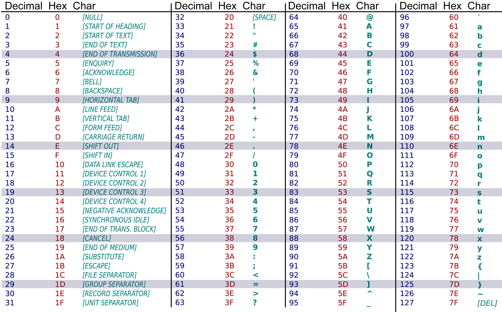

# Tekst gebruiken in code <!--\label{ch:3}-->

Ieder teken dat je op je toetsenbord kunt intypen is een ``char``. Je toetsenbord bevat echter maar een kleine selectie van alle mogelijke tekens. Vergelijk jouw toetsenbord maar eens met dat van iemand uit bijvoorbeeld Spanje, Tunesië of China.

Voordat we leren hoe je in C# input van het toetsenbord uitleest, moeten we begrijpen hoe al die tekens in een computer worden voorgesteld. Dit gebeurt via de UNICODE standaard. Lang geleden was er de ASCII-standaard, die bepaalde welk teken bij welke hexadecimale waarde hoorde. Iedereen die ASCII volgde, kon zo berichten met die tekens naar elkaar sturen.

UNICODE volgt de ASCII-standaard op. Door de verdere digitalisering van de wereld bleek de ASCII-standaard al snel te klein. ASCII kan maar 128 karakters voorstellen, via 7 bits. Dit is weinig vergeleken met de meer dan 1 miljoen tekens in UNICODE, die een 16-bit (UTF-16) voorstelling gebruikt. Er is ook een 32-bit voorstelling mogelijk (UTF-32).

UNICODE bevat ook de eerste 128 tekens van ASCII. Daardoor zijn beide standaarden compatibel. Dankzij UNICODE kunnen we nu wereldwijd elke smiley, letter, en pictogram op dezelfde manier delen. Voor statistiekliefhebbers: er zijn 1.111.998 UNICODE tekens mogelijk. In versie 15.1, uitgebracht in september 2023, zijn daarvan 149.813 tekens gedefinieerd. Er is dus nog ruimte over.


De eerste 32 karakters zijn "onzichtbare" karakters die een historische reden (in ASCII) hebben om in de lijst te staan, maar sommige ervan zijn ondertussen niet meer erg nuttig. Origineel werd ASCII ontwikkeld als standaard om in de vorige eeuw via de Telex te communiceren. Vandaar dat vele van deze karakters commando's lijken om oude typemachines aan te sturen (*line feed, bell, form feed*, enz.), wat ze dus ook effectief zijn!


<!--{width=80%}-->


## Tekst datatypes

In het vorige hoofdstuk werkten we vooral met getallen en haalden we maar kort het ``string`` en ``char`` datatype aan. In dit hoofdstuk ga ik dieper in op deze 2 veelgebruikte datatypes.

### Char

Een **enkel karakter** (cijfer, letter, leesteken, enz.) als 'tekst' opslaan kan je doen door het `char`-type te gebruiken. Je kan één enkel karakter als volgt tonen:

```csharp
char eenLetter = 'X';
Console.WriteLine(eenLetter);
```

Het is belangrijk dat je de apostrof (``'``) niet vergeet voor en na het karakter dat je wenst op te slaan daar dit de literal voorstelling van `char`-literals is. Zonder die apostrof denkt de compiler dat je een variabele wenst aan te roepen van die naam.

Je kan eender welk UNICODE-teken in een `char` bewaren, namelijk een letter, een cijfer of een speciaal teken zoals `%`, `$`, `*`, `#`, enz. **Intern wordt de UNICODE van het character bewaard in de variabele, zijnde een 16 bit getal**. Deze laatste zin is belangrijk: voor een computer zijn `char`-variabelen niet meer dan getallen met een speciale betekenis.

Merk dus op dat volgende lijn: ``char eenGetal = '7';`` weliswaar een getal als teken opslaat, maar dat intern de compiler deze variabele steeds als een ``char`` zal gebruiken. **Als je dit cijfer zou willen gebruiken als effectief cijfer om wiskundige bewerkingen op uit te voeren, dan zal je dit eerst moeten converteren naar een getal** (we zullen dit in hoofdstuk 4 uitleggen).


### String

**Een ``string`` is een reeks van 0, 1 of meerdere `char`-elementen.**

We gebruiken het ``string`` datatype om tekst voor te stellen. Je begrijpt waarschijnlijk zelf wel waarom het ``string`` datatype een belangrijk en veelgebruikt type is in eender welke programmeertaal: er zijn maar weinig applicaties die niet minstens enkele lijnen tekst tonen aan de gebruiker.


In hoofdstuk 8 zullen we ontdekken dat strings eigenlijk zogenaamde arrays zijn. 



#### Strings declareren
Merk op dat we bij een ``string`` literal gebruik maken van aanhalingstekens (`"`) terwijl bij een ``char`` literal we een apostrof gebruiken (`'`). Dit is de manier om een ``string`` met lengte 1 van een ``char`` te onderscheiden.

Volgende code geeft drie keer het cijfer 1 onder elkaar op het scherm. Maar de eerste keer gaat het om het een ``char`` (enkelvoudig teken), dan om een ``string`` (1 of meerdere tekens) en dan een ``int`` (effectief getal, bestaande uit 1 of meer cijfers):

```csharp
char eenKarakter = '1'; 
string eenString = "1"; 
int eenGetal = 1;
 
Console.WriteLine(eenKarakter);
Console.WriteLine(eenString);
Console.WriteLine(eenGetal);
```

Het programma zal driemaal een ``1`` onder elkaar tonen. Boeiend programma, hoor.
