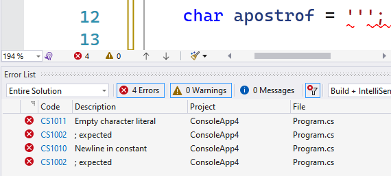

## Escape characters





De voorman hier! Escape characters zijn niet de boeiendste materie om te bespreken. Je zou nog kunnen hopen dat het een opvolger is van Prison Break of zo. Helaas is dat niet zo. Echter: als je escape characters beheerst zal je veel eenvoudiger én mooier tekst op je scherm kunnen toveren. Let dus even goed op a.u.b.



Naast letters en tekens mogen in string en chars ook escape characters staan. In C# hebben bepaalde tekens namelijk een speciale functie, zoals de dubbele aanhalingstekens (`"`) om het begin of einde van een string-literal aan te geven. We hebben dus een manier nodig om aan te duiden wanneer de compiler het eerstvolgende teken als een ``char`` moet beschouwen, of als een teken dat deel uitmaakt van de code zelf.

Zonder aan te geven dat we letterlijk dat teken willen tonen, en het niet in z’n C# functie gebruiken, zouden we problemen krijgen. **Escape characters worden met een backslash (`\`) aangeduid, gevolgd door het karakter dat we wensen te tonen.**

### Voorbeeld van escape chars

Laten we eens kijken naar de werking van het afkappingsteken als voorbeeld (de zogenaamde apostrof, om bijvoorbeeld ``'s avonds`` te schrijven)
Volgende code zal de compiler verkeerd interpreteren, daar hij denkt dat we een leeg karakter wensen op te slaan:


```java
char apostrof = ''';
```

Het gevolg is een litanie aan vreemde foutboodschappen omdat er na de sluitende apostrof (het tweede) plots nog een apostrof (het derde) verschijnt. VS is volledig in de war zo!




De juiste manier is om dus een escape character te gebruiken. We gaan met de backslash aanduiden dat het volgende teken (de tweede apostrof) een ``char`` voorstelt en niet het sluitende teken in de code.


```java
char apostrof = '\'';
```

### Veel gebruikte escape chars

Er zijn verschillende escape characters in C# toegelaten, we lijsten hier de belangrijkste op (voor een totaal overzicht kijk eens op **docs.microsoft.com/dotnet/csharp/programming-guide/strings/**):

```java
\'      //de apostrof zoals zonet besproken.
\"      //een aanhalingsteken zodat je dat ook in je string kunt gebruiken zonder deze af te sluiten.
\\      //een backslash in je tekst tonen. Hoe toon je dan twee backslashes? \\\\
\n      //een nieuwe lijn (zogenaamde enter of newline).
\t      //Horizontale tab.
\uxxxx  //een met als hexadecimale UNICODE waarde xxxx.
```

### Escape characters in strings

Aangezien strings eigenlijk bestaan uit 1 of meerdere char-elementen, is het logisch dat je ook in een string met escape characters kunt werken. Het woord "'s avonds" schrijf je bijvoorbeeld als volgt:


```java
string woord = "\'s avonds";
```

Idem met aanhalingstekens. Stel je voor dat je een programma wilt schrijven dat C# code op het scherm toont. Dat doe je dan met volgende, nogal Inception-achtige, manier:

```java
string inceptionCode = "Console.WriteLine(\"Cool he\");";
Console.WriteLine(inceptionCode);
```

Merk op dat we voorgaande code nog meer Inception-like kunnen maken door de string ineens in de WriteLine methode te plaatsen:


```java
Console.WriteLine("Console.WriteLine(\"Cool he\");");
```

Beide voorbeelden zullen dus volgende tekst op het scherm geven: ``Console.WriteLine("Cool he");``

### Biep biep

``\a`` mag je enkel gebruiken als je een koptelefoon op hebt daar dit het escape character is om de computer een biep te laten doen (mogelijk doet dit niets bij jou, dit hangt van de je computerinstellingen af). Volgende codevoorbeeld zal, als alles goed gaat, een zin op het scherm tonen en dan ogenblikkelijk erna een biepje:


```java
Console.WriteLine("Een zin en dan nu de biep\a");
```


### Witregels en tabs

We gebruiken vooral escape characters in strings om bijvoorbeeld witregels en tabs aan te geven. Test bijvoorbeeld volgende lijn code eens:

```java
string eenString = "Een zin.\t na een tab \nDan eentje op een nieuwe regel";
Console.WriteLine(eenString);
```

Dit zal als output geven:


```java
Een zin.         na een tab
Dan eentje op een nieuwe regel
```

### Over tabstops

Als je het niet gewoon bent de tab-toets op je toetsenbord te gebruiken dan is de eerste werking van \t mogelijk verwarrend. Nochtans is \t in een string gebruiken exact hetzelfde als op de tab-toets duwen. 

In je console-scherm zijn de tab stops vooraf bepaald. Wanneer je dus een tab invoegt zal de cursor zich verplaatsen naar de eerstvolgende tab stop. 

In volgende tekstuitvoer zie je de tabstops op de tweede lijn "gevisualiseerd":


```text
01234567890123456789012345678901234567890123456789
        1       2       3       4       5
```

Bovenstaande uitvoer werd als volgt gemaakt:

```java
Console.WriteLine("01234567890123456789012345678901234567890123456789");
Console.WriteLine("\t1\t2\t3\t4\t5");
```


Tabstops zijn nuttig om je data mooi uitgelijnd in een console-applicatie in een tabel te plaatsen. Als je dat dan nog eens combineert met de UNICODE karakters om tabellen te tekenen kan je toffe dingen maken. Deze karakters, de zogenaamde "Box Drawing" subset, staan in UNICODE gedefinieerd als de tekens met hexadecimale code 0x2500 en verder. Bekijk zeker eens volgende datasheet met alle tekens: **www.unicode.org/charts/PDF/U2500.pdf**.



### Het apenstaartje om escape characters te negeren

Het apenstaartje voor een ``string`` literal plaatsen is zeggen "beschouw alles binnen de aanhalingstekens als effectieve karakters die deel uitmaken van de inhoud van de tekst". Dit teken heet daarom binnen C# niet voor niets het **verbatim** karakter. Het is belangrijk te beseffen dat **escape characters genegeerd worden** wanneer we het verbatim karakter gebruiken. Dit is vooral handig als je bijvoorbeeld een netwerkadres wilt schrijven en niet iedere ``\`` wilt escapen:

```java
string zonderAt = "C:\\Temp\\Myfile.txt";
string metAt = @"C:\Temp\Myfile.txt";
```

Merk op dat aanhalingstekens nog steeds *ge-escape'd* moeten worden. Heb je dus een stuk tekst met een aanhalingsteken in dan zal je zonder het apenstaartje moeten werken.

Uiteraard kan je ook het apenstaartje gebruiken in ``Console.WriteLine``. Volgende zal dus de escape karakters tonen in plaats van "uitvoeren":


```java
Console.WriteLine(@"Om een tab te tonen gebruik je \t in je c# strings.");
```

Wat zal resulteren in volgende uitvoer:


```text
Om een tab te tonen gebruik je \t in je c# strings.
```


