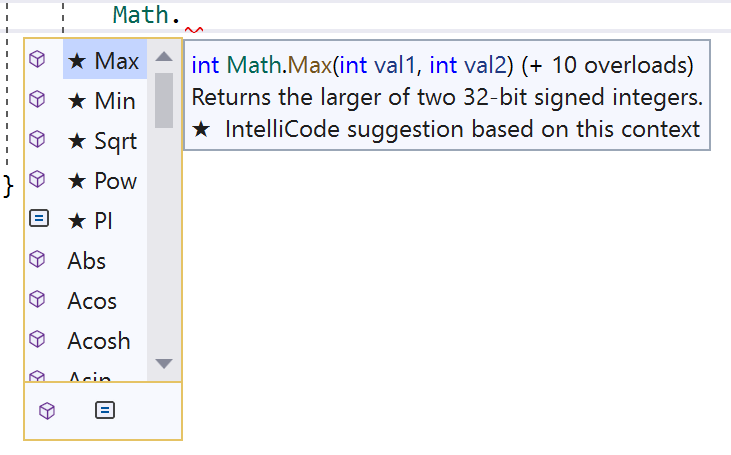

## Berekeningen met System.Math

Een groot deel van je leven als ontwikkelaar zal bestaan uit het bewerken van variabelen in code. Meestal zullen die bewerkingen voorafgaan van berekeningen. De ``System.Math`` bibliotheek zal ons hier bij kunnen helpen. Zoals de naam al doet vermoeden staat deze bibliotheek voor *Mathematics*: wiskunde!


### De Math-bibliotheek

De Math-bibliotheek bevat handige methoden voor een groot aantal typische wiskundige bewerkingen. Zaken die je er bijvoorbeeld in zal terugvinden: 

* Sinus (``Sin``), cosinus (``Cos``), tangens (``Tan``), enz. berekenen aan de van de hoek (in radialen) 
* Vierkantswortel (``Sqrt``) en macht (``Pow``) berekenen.
* Naar boven (``Ceiling``) of onder (``Floor``) afronden. 
* Absolute (``Abs``) waarde berekenen.

Stel dat je de derde macht van een variabele ``getal`` wenst te berekenen. *Zonder* de Math-bibliotheek zou dat er zo uitzien:

```csharp
double result = getal * getal * getal; //SLECHTE MANIER
```

Dit valt nog mee, maar wat als je 3 tot de zevende macht moest berekenen? Laten we eens kijken hoe ``Math`` ons kan helpen, dankzij de ``Pow``  methode (**Power**, Engels voor macht):


```csharp
double result = Math.Pow(getal, 3);
```

Deze methode vereist twee parameters:

* De eerste is het grondtal.
* De tweede is de exponent ("tot de hoeveelste macht").


<!-- \newpage -->


#### De Math bibliotheek ontdekken

Als je in Visual Studio ``Math`` schrijft in je code, gevolgd door een punt (``.``) krijg je alles te zien wat de Math-bibliotheek kan doen:


<!--{width=60%}-->


Een kubusje voor een naam wil zeggen dat het om een **Methode** gaat (zoals ``Console.ReadLine()``). Een vierkantje met twee streepjes in zijn constanten (zoals ``Pi`` en het getal van Euler (``e``)).

#### Methoden gebruiken

De meeste methoden zijn zeer makkelijk in gebruik en werken bijna allemaal op een soortgelijk manier. Meestal moet je 1 of meerdere parameters tussen de haken meegeven en het resultaat moet je altijd in een nieuwe variabele opvangen. 

Enkele voorbeelden:

```csharp
double sineHoekA = Math.Sin(345); //in radialen!
double derdeMachtVan20 = Math.Pow(20, 3);
double complexer = 3 + derdeMachtVan20 * Math.Round(sineHoekA);
```

Twijfel je over de werking van een methode, gebruik dan de help als volgt:

1. Schrijf de Methode zonder parameters. Bijvoorbeeld ``Math.Pow()`` (je mag de foutboodschap negeren). 
2. Plaats je cursor op ``Pow``.
3. Druk op ``F1`` op je toetsenbord.
4. Je krijgt nu de help-files te zien van deze methode.
5. In hoofdstuk 7 leg ik uit hoe je die help-files moet lezen.

<!-- \newpage -->


#### PI 

Ook het getal Pi (``3.141...``) is beschikbaar in de Math-bibliotheek. Het witte icoontje voor PI bij Intellisense toont aan dat het hier om een *field* gaat: een eenvoudige variabele met een specifieke waarde. In dit geval gaat het zelfs om een ``const`` field, met de waarde van Pi van het type double.


```csharp
const double PI= 3.141...;
```

Je kan deze als volgt gebruiken in berekeningen zoals

```csharp
double straal = 5.5;
double omtrek = Math.PI * 2 * straal;
```


### Bereik in code weten 
Het bereik van datatypes ligt weliswaar vast (zie hoofdstuk 2). Maar het is nuttig om weten dat deze ook in de compiler gekend is.  Ieder datatype heeft een aantal ingebouwde zaken die je kan gebruiken om onder andere de maximum en minimum-waarde van een datatype te gebruiken. Volgend voorbeeld toont hoe dit kan:

```csharp
Console.Write("Het bereik van het type double is:");
Console.WriteLine($"{double.MinValue} tot {double.MaxValue}.");
```

Dit geeft op het scherm: 

``Het bereik van het type double is: -1.7976931348623157*10^308 tot 1.7976931348623157E*10^308.``

Je kan met andere woorden met `int.MaxValue` en `int.MinValue` het minimum- en maximumbereik van het type ``int`` verkrijgen. 

Wil je dit van een ``double``, dan gebruik je `double.MaxValue` enz. 

Trouwens, zelfs oneindig is beschikbaar bij kommagetallen als ``.PositiveInfinity`` en  ``.NegativeInfinity``. 

