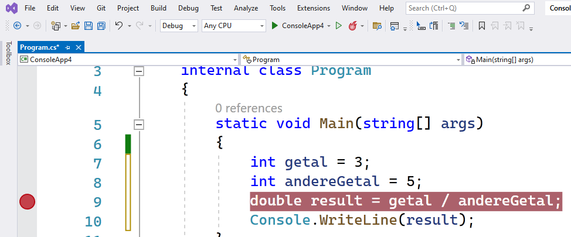
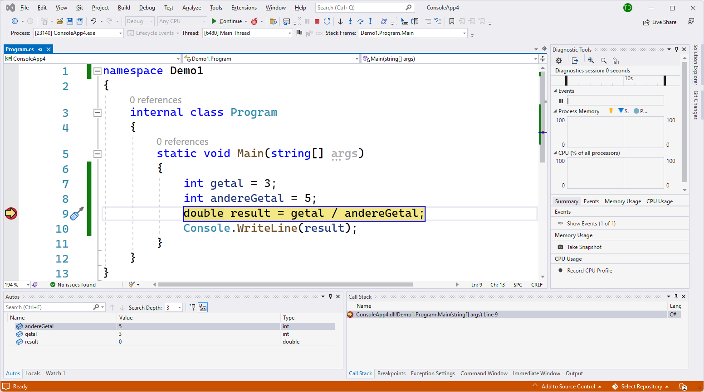
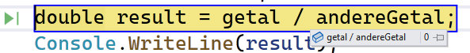
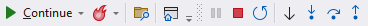

## Debuggen

*"Joepie!! M'n code werkt!"* Je ontkurkt de champagne/bier/melk/frisdrank/water, doet een *Fortnite* danske en laat je programma door duizenden, neen ... miljoenen gebruikers ontdekken. Nog geen uur later staat er een meute met hooivorken en toortsen voor je kantoor. Helaas, er zaten nog "een paar bugs" in je code...

Tijd dus om je **debugger** boven te halen en die (logische) fouten uit je code te halen.

### Logische fouten vs C# fouten

Code die compileert is enkel code die foutloos geschreven is volgens de C# afspraken qua grammatica en syntax. De code zal met andere woorden gecompileerd worden, maar wat er daarna gebeurd is volledig afhankelijk van wat juist de betekenis is van wat je hebt geschreven.

Volgend algoritme bijvoorbeeld is perfecte Nederlandstalige code en zal dus door een fictieve compiler kunnen gecompileerd worden. Het vervolgens uitvoeren is echter niet aan te raden (natrium en water samen geeft een stevige exotherme reactie):


```text
Neem natrium
Neem water
Voeg beide samen
```

Dit is dus een logische fout: oftewel een bug (in dit geval zal dit trouwens een stevige explosie veroorzaken).


### Debuggen met Visual Studio

Standaard wanneer je je code uitvoert met de grote groene playknop start jouw programma in zogenaamde "debug modus". Dit laat je toe om je code ten allen tijde te onderbreken en naar de huidige staat van je programma te kijken. Je kan dan bijvoorbeeld onderzoeken wat de waarden van bepaalde variabelen zijn op dat moment en of die wel correct zijn. Dit is bughunting en zal je héél vaak doen in je programmeer-carrière. 

Om dit te doen moet je één of meer **breakpoints**  in je code plaatsen. Een breakpoint zet je aan een lijn code. Wanneer je programma dan aan deze lijn komt tijdens de uitvoer zal de debugger alles pauzeren.

<!-- \newpage -->


Een breakpoint plaats je door in VS op het grijze gedeelte links van de lijn code te klikken. Als alles goed gaat verschijnt er dan een grote rode "breakpointbol":

<!--{width=60%}-->


In bovenstaande figuur plaatsen we een breakpoint aan lijn 11. De code uitvoer zal dus nog wel lijn 10 uitvoeren, maar niet lijn 11.


Als je nu je project uitvoert zal de code pauzeren aan die lijn en zal VS in "debug modus" openspringen wat er vervolgens als volgt uit ziet:

<!--{width=60%}-->


In dit "nieuwe" scherm zijn er momenteel 2 belangrijke delen:

* Onderaan zie je de **autos** en **locals** . In deze tabs kan je de waarden van iedere variabele in je huidige code zien op het moment van pauzeren. Ideaal om te onderzoeken waarom een bepaalde berekening of expressie niet doet wat ze moet doen.
* Bovenaan zijn enkele debug-knoppen verschenen. Deze licht ik in de volgende sectie toe.
* Voorts kan je in debug-modus met je muis over eender welke variabele of expressie *hoveren* om het resultaat van dat element te bekijken:

<!--{width=60%}-->


### Door je code steppen

Wanneer je gepauzeerd bent kan je de nieuw verschenen debug-knoppen bovenaan VS gebruiken om het verdere verloop te bepalen:

<!--{width=60%}-->


Ik bespreek hier de knoppen die je zeker zal nodig hebben:

* De **continue** knop is logisch: hier op klikken zal je programma terug voortzetten vanaf het breakpoint waar je gepauzeerd bent. Het zal vervolgens verder gaan tot het weer een breakpoint bereikt of wanneer het einde van het programma wordt bereikt.
* De **step in** knop zullen we in hoofdstuk 7 toelichten daar deze knop je toelaat om in een methode te springen.
* De **rode stop** knop gebruik je indien je niet verder wilt debuggen en ogenblikkelijk terug je code wilt aanpassen.
* De **step-over** knop (het gebogen pijltje) is een belangrijke knop. Deze zal je code één lijn code verder uitvoeren en dan weer pauzeren. Het laat je dus toe om letterlijk doorheen je code te *stappen*. Je kan dit doen om de flow van je programma te bekijken (zie volgende hoofdstukken) en om te zien hoe bepaalde variabelen evolueren doorheen je code. 

<!-- \newpage -->


>*Pfft. Debuggen. Waarom moet ik me daar nu mee bezig houden?* 

Even je oren open zetten aub, ik ga iets roepen:**"Debugging is een ESSENTIËLE SKILL!!!"**. Ik laat mijn metselaars ook geen huizen bouwen zonder dat ze ooit een truweel hebben vastgepakt. Een programmeur die niet kan debuggen...is als een vis die niet kan zwemmen!
 
Zorg dus dat je vlot breakpoints kunt plaatsen om zo tijdens de uitvoer te pauzeren om de inhoud van je variabelen te bekijken (via het watch-venster). Gebruik vervolgens de "step"-buttons om door je code te 'stappen', lijn per lijn.

*Is that all?!* NEEN! Een goede programmeur zal telkens **eerst voorspellen** wat er gaat gebeuren: welke waarden zullen de variabelen hebben als ik naar de volgende lijn ga? Wat gaat er op het scherm komen? enz. Als je dan vervolgens naar de volgende lijn of breakpoint gaat en er gebeuren dingen die je niet voorspeld had, dan is de kans groot dat je een bug hebt gevonden.

De grootste fout die je kunt doen is gewoon door je code te "steppen" en hopen dat de bug magisch zal tevoorschijn komen. Neen, zo werkt het dus niet. Je moet actief mee denken of dat je programma effectief werkt zoals je zelfs bedoeld had. 

Dit geldt trouwens ook wanneer je niet aan het debuggen bent, maar gewoon je programma uitvoert om het te testen. Eigenlijk ben je dan ook aan het debuggen. Ook dan moet je voorspellen wat het eindresultaat zal zijn en of dit overeen komt met wat er op het scherm gebeurt. **Wees kritisch!**


