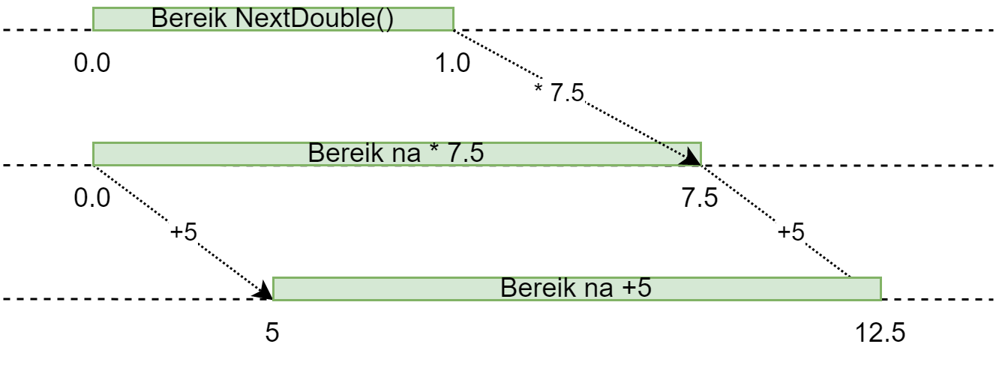

## Random getallen genereren

Willekeurige (*random*) getallen genereren in je code kan leuk zijn om de gebruiker een interactievere ervaring te geven. Beeld je in dat je monsters steeds dezelfde weg zouden bewandelen of dat er steeds op hetzelfde tijdstip een orkaan op je stad neerdwaalt. **SAAI**!

### Random generator
De ``Random``-bibliotheek (eigenlijk klasse, wat we in hoofdstuk 9 zullen toelichten) laat je toe om willekeurige gehele en komma-getallen te genereren. Je moet hiervoor twee zaken doen:

1. Maak **eenmalig** een Random-generator object aan.
2. Roep de ``Next`` methode aan op dit object telkens je een nieuw willekeurig getal nodig hebt.

Als volgt: 
```csharp
Random randomGenerator = new Random();
int mijnLeeftijd = randomGenerator.Next();
```

**De eerste stap dien je maar 1 keer te doen.** De naam die je het generatorobject geeft (hier ``randomGenerator``) mag je kiezen, dit is een variabele en moet dus aan de identifier regels voldoen.

Vanaf nu kan je telkens aan het generatorobject een nieuw getal vragen m.b.v. de ``Next``-methode. 

Volgende code toont bijvoorbeeld 3 random getallen op het scherm:

```csharp
Random myGen = new Random();

int getal1 = myGen.Next();
int getal2 = myGen.Next();
int getal3 = myGen.Next();
Console.WriteLine(getal1);
Console.WriteLine(getal2);
Console.WriteLine(getal3);
```

Uiteraard mag dit ook

```csharp
Console.WriteLine(myGen.Next());
Console.WriteLine($"Nog een getal: {myGen.Next()}");
```


De ``new Random()`` code is iets wat in hoofdstuk 9 en verder volledig uit de doeken zal gedaan worden. Lig er dus nog niet van wakker.



#### Next mogelijkheden
Je kan de ``Next`` methode ook 2 parameters meegeven, namelijk de grenzen waarbinnen het getal moet gegenereerd worden. De tweede parameter is exclusief dit getal zelf. Wil je dus een willekeurig geheel getal tot en met 10 dan schrijf je 11, niet 10, als tweede parameter:

Enkele voorbeelden:
```csharp
Random someGenerator = new Random();
int a = someGenerator.Next(0,11); //getal tussen 0 tot en met 10
int b = someGenerator.Next(55,100); //getal tussen 55 tot en met 99
int c = someGenerator.Next(0,b); //getal tussen 0 tot en met (b-1)
```

#### Genereer kommagetallen met NextDouble
Met de ``NextDouble`` methode kan je kommagetallen genereren tussen ``0.0`` en ``1.0`` (1.0 zal niet gegenereerd worden).

Wil je een groter kommagetal dan zal je dit gegenereerde getal moeten vermenigvuldigen naar de range die je nodig hebt.
Stel dat je een getal tussen 0.0 en 10.0 nodig hebt, dan schrijf je:
```csharp
Random myRan = new Random();
double randomGetal = myRan.NextDouble() * 10.0;
```
Je vermenigvuldigt eenvoudigweg je gegenereerde getal met het bereik dat je wenst (10.0 in dit geval)

En wat als je een kommagetal tussen 5.0 en 12.5 wenst? Als volgt:
```csharp
Random myRan = new Random();
double randomGetal = 5.0 + (myRan.NextDouble() * 7.5);
```





Je bereik is 7.5, namelijk ``12.5 - 5.0`` en vermenigvuldig je het resultaat van je generator hiermee. Vervolgens verschuif je dat bereik naar 5 en verder door er 5 bij op te tellen. Merk op dat we de volgorde van berekeningen *sturen* met onze ronde haakjes.





**"Help! Ik krijg steeds dezelfde random getallen? Wat nu?"**

Wel wel, wie we hier hebben. Werkt je Random generator niet naar behoren? Wil je het ding in de vuilbak gooien omdat het niet zo willekeurig lijkt te werken als je hoopte? Gelukkig ben ik er! Zet je helm dus op en luister.

Wanneer je twee ``Random`` objecten aanmaakt op quasi hetzelfde tijdstip in je code, dan zullen deze twee generators ook dezelfde getallen genereren:

```csharp
Random a = new Random();
Random b = new Random();
Console.WriteLine(a.Next());
Console.WriteLine(b.Next());
```

De ``Random`` bibliotheek gebruikt namelijk de tijd als een soort "willekeurig" startpunt (de tijd is de zogenaamde seed). Het is namelijk een **pseudo-willekeurige getal generator**. 

Dit is de reden waarom je in je code steeds maar **1 Random generator** mag aanmaken! Er zijn weinig redenen om er meerdere aan te maken. Bovenstaande code is dus niet aan te raden.

Wil je toch dezelfde willekeurige reeks getallen na elkaar genereren telkens je je programma opstart (bijvoorbeeld om je code te testen met steeds dezelfde reeks getallen) dan kan je bij het aanmaken van je generator ook een parameter meegeven die als seed zal werken. 

In het volgende voorbeeld zal generator ``a`` steeds dezelfde reeks willekeurige getallen genereren, telkens je je programma uitvoert. De waarde die je meegeeft moet uiteraard niet ``666`` zijn. Ieder getal dat je meegeeft is een andere seed:


```csharp
Random a = new Random(666);
```



