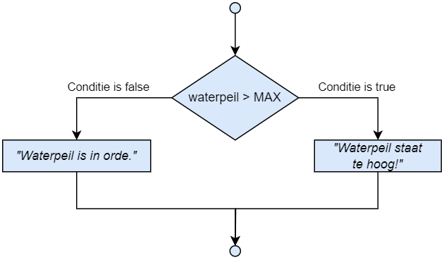

## If

De ``if`` (*als*) uitdrukking is één van de meest elementaire uitdrukkingen in een programmeertaal. Het laat ons toe vertakkingen in onze programmaflow in te bouwen. Ze laat toe om "als dit waar is doe dan dat"-beslissingen te maken.

De syntax is als volgt:

```csharp
if (booleaanse expressie) 
{
    //deze code wordt uitgevoerd indien
    //de booleaanse expressie true is
}
```

Enkel indien de booleaanse expressie **waar** is (``true`` ), zal de code binnen de accolades van het ``if``-blok uitgevoerd worden. Indien de expressie niet waar is (``false``) dan wordt het blok overgeslagen en gaat het programma verder met de code eronder.


Een voorbeeld:

```csharp
int  nummer = 3;
if (  nummer < 5 )
{
    Console.WriteLine ("Ja");
}
Console.WriteLine("Nee");
```

De uitvoer van dit programma zal zijn:

```text
Ja
Nee
```


Indien `` nummer`` groter of gelijk aan 5 was dan zou er enkel ``Nee`` op het scherm zijn verschenen. De lijn ``Console.WriteLine("Nee");`` zal sowieso uitgevoerd worden zoals je ook kan zien in de flowchart op de volgende pagina.[^code2]


[^code2]: [Code2flow.com](https://code2flow.com) is een handige tool om je reeds geschreven C# code om te zetten naar een flowchart. Het kan je helpen om vreemde bugs te ontdekken. Uiteraard is de eerste stap debuggen en door je code *steppen*: vaak zal je ogenblikkelijk zien waar je code verkeerd loopt.


<!--{width=20%}-->


### if met een block

Het is aangeraden om steeds na de if-expressie met accolades te werken. Dit zorgt ervoor dat alle code tussen het block (de accolades) zal uitgevoerd worden indien de booleaanse expressie waar was.  **Gebruik je geen accolades dan zal enkel de eerste lijn na de ``if`` uitgevoerd worden bij ``true``.**

Een voorbeeld:
```csharp
if ( nummer < 5 )
{
    Console.WriteLine ("Ja");
    Console.WriteLine ("Nee");
}
```


<!--{width=25%}-->


<!-- \newpage -->


### Veelgemaakte fouten met ``if``

>Voorman hier! Je hebt me gemist. Ik merk het. Het ging goed de laatste tijd. Maar nu wordt het tijd dat ik je weer even wakker schud want de code die je nu gaat bouwen kan érg vreemde gedragingen krijgen als je niet goed oplet. Luister daarom even naar deze lijst van veel gemaakte fouten wanneer je met ``if`` begint te werken. 


#### Appelen en peren vergelijken
De types in je booleaanse expressie moeten steeds vergelijkbaar zijn. Volgende code zal niet compileren: 


```csharp
if( "4" > 3)
```
daar we hier een ``string`` met een ``int`` vergelijken. Meestal moeten dus beide operanden bij een relationele operator van het zelfde type zijn (of er moet een implicietie, automatische casting kunnen gebeuren). 

#### Accolades vergeten

Accolades vergeten plaatsen om een codeblock aan te duiden is een typische fout. Wanneer je bijvoorbeeld Python hebt geleerd, dan zou je verwachten dat je code zodanig kan uitlijnen (met tabs of spaties) om code bij een ``if`` te groeperen in een block. Wat dus niet zo is. **Je code uitlijnen heeft in C# géén invloed op de programflow**. 

Gebruik je dus geen accolades dan zal enkel de eerste lijn na de ``if`` zal uitgevoerd worden indien ``true``. Gebruiken we de ``if`` met block van daarnet maar zonder accolades dan zal de laatste lijn altijd uitgevoerd worden ongeacht de ``if``:

```csharp
if ( tijd < 20 )
    Console.WriteLine ("Doe zo voort.");
    Console.WriteLine ("Je bent er bijna!"); //verschijnt altijd op scherm
```

Deze code zal dus 2 mogelijke outputs op het scherm geven. Indien de *``tijd`` groter of gelijk is aan 20* dan krijgen we volgende output:

```text
Je bent er bijna!
```

<!-- \newpage -->


Maar indien de ``tijd`` kleiner is dan 20 krijgen we:

```text
Doe zo voort. 
Je bent er bijna!
```

Dit is uiteraard niet de output die we verwachten. We willen de motiverende boodschappen (beide zinnen) enkel tonen indien de gebruiker nog tijd heeft. De juiste oplossing is:

```csharp
if ( tijd < 20 )
{
    Console.WriteLine ("Doe zo voort.");
    Console.WriteLine ("Je bent er bijna!"); 
} 
```


#### Een puntkomma plaatsen na de booleaanse expressie 

Dit zal ervoor zorgen dat er eigenlijk geen codeblock bij de ``if`` hoort en je dus een nietszeggende ``if`` hebt geschreven. De code na het puntkomma zal uitgevoerd worden ongeacht de ``if``:

```csharp
if ( naam == "neo" );
{    
    Console.WriteLine ("Take the red pill?");
    Console.WriteLine ("Or the blue pill?");
}
```

De uitvoer van voorgaande zal altijd de volgende zijn, ongeacht of de gebruikersnaam gelijk is aan "neo":

```text
Take the red pill?
Or the blue pill?
```


Indien de naam gelijk is aan "neo" dan zal de code *tussen de if en het kommapunt op lijn 1* uitgevoerd worden. Kortom, er wordt niets gedaan (daar hier geen code staat). Het block erachter dat de 2 zinnen op het scherm zet wordt altijd uitgevoerd. 


<!-- \newpage -->


### If/else

Met "if - else" kunnen we niet enkel zeggen welke code moet uitgevoerd worden als de conditie waar is **maar ook welke specifieke code moet uitgevoerd indien de conditie niet waar is**. Volgend voorbeeld geeft een typisch gebruik van een "if - else" structuur om 2 waarden met elkaar te vergelijken:

```csharp
const int waterpeil = 10;
int MAX = 5;
 
if ( waterpeil > MAX )
{
         Console.WriteLine ($"Waterpeil staat te hoog!");
}
else
{
         Console.WriteLine ($"Waterpeil is in orde.");
}
```


<!--{width=60%}-->



Een veel gemaakte fout is bij de ``else`` sectie ook een booleaanse expressie plaatsen. Dit kan niet: de ``else`` sectie zal gewoon uitgevoerd worden indien de ``if`` sectie NIET uitgevoerd werd. Volgende code MAG DUS NIET:

```csharp
if(a > b) 
{...}
else (a <= b) //<FOUT!
{...}
```




<!-- \newpage -->


### If - else if

Met een "if - else if" constructie kunnen we meerdere criteria opgeven die waar/niet waar moeten zijn voor een bepaald stukje code kan uitgevoerd worden. 
Sowieso begint men steeds met een ``if``. Als men vervolgens een ``else if`` plaatst dan zal de expressie van deze ``else if`` getest worden enkel en alleen als de eerste expressie niet waar was. Als de expressie van deze ``else if`` wel waar is zal de bijhorende code uitgevoerd worden, zo niet wordt deze overgeslagen.

Een voorbeeld:

```csharp
int x = 9;
 
if (x == 10)
{
     Console.WriteLine ("x is 10");
}
else if (x == 9)
{
     Console.WriteLine ("x is 9");
}
else if (x == 8)
{
     Console.WriteLine ("x is 8");
}
```

Voorts mag men ook steeds nog afsluiten met een finale ``else`` die zal uitgevoerd worden indien geen enkele andere expressie ervoor waar bleek te zijn:

```csharp
if(x>100)
{
    Console.WriteLine("Groter dan 100");
}
else if(x>10)
{
    Console.WriteLine("Groter dan 10");
}
else
{
    Console.WriteLine("Getal kleiner dan of gelijk 10");
}

```



De volgorde van opeenvolgende "if - else if - else" tests is uiterst belangrijk. Als we in de voorgaande code de volgorde van de twee tests omdraaien, zal het tweede blok (``x > 100``) nooit worden bereikt. 

Logisch: neem een getal groter dan 100 en laat het door onderstaande code lopen. Stel, we nemen 110. Al bij de eerste test (``x>10``) is deze ``true`` en verschijnt er dus "Groter dan 10". Alle andere tests worden daarna niet meer gedaan en de code gaat verder na het ``else``-blok:

```csharp

if(x>10)
{
    Console.WriteLine("Groter dan 10");
}
else if(x>100)
{
    Console.WriteLine("Groter dan 100");
}
else
//...
```





Hoe minder tests de computer moet doen, hoe meer performant de code zal uitgevoerd worden. Voor complexe applicaties die bijvoorbeeld in realtime veel berekeningen moeten doen kan het dus een gigantische invloed hebben of een reeks "if - else if else" testen vlot wordt doorlopen. Het is dan ook een goede gewoonte - indien de logica van het algoritme het toelaat - om de meest voorkomende test bovenaan te plaatsen. 

Dit zelfde geldt ook binnen een test zelf wanneer we met logische operators werken. Deze worden altijd volgens de regels van de volgorde van berekeningen uitgevoerd. Volgende test wordt van links naar rechts uitgevoerd:


```csharp
x > 100 && a != "stop"
```

Omdat beide operanden van de EN-operatie ``true`` moeten zijn om een juiste test te krijgen, zal de computer de test automatisch stoppen indien reeds de linkse operand (``x > 100``) niet waar is. Bij dit soort tests probeer je dus ervoor te zorgen dat de tests die het minste kans op slagen hebben (of beter: het vaakst niét zal slagen) eerst te laten testen, zodat de computer geen onnodige extra tests doet.



<!-- \newpage -->


### Nesting

We kunnen met behulp van *nesting*  ook complexere programma flows maken. Nesting wil zeggen dat we meerdere codeblocken in elkaar plaatsen. Hierbij gebruiken we de accolades om het blok code aan te duiden dat bij een "if - else if - else" hoort. Binnen dit blok kunnen nu echter opnieuw beslissingsstructuren worden aangemaakt.

Volgende voorbeeld toont dit aan. We zien hoe nesting wordt toegepast in het else gedeelte ``else``. Bekijk wat er gebeurt als je ``dokterVanWacht`` aan iets anders gelijkstelt dan een lege string:

```csharp
const double MAX_TEMP = 40;
double huidigeTemperatuur = 36.5;
string dokterVanWacht = "";

if (huidigeTemperatuur < MAX_TEMP)
{
    Console.WriteLine("Temperatuur normaal");
}
else
{
    Console.WriteLine("Temperatuur te hoog!");
    if (dokterVanWacht == "")
    {
        Console.WriteLine("Oei oei! Geen dokter van wacht!");
    }
    else
    {
        Console.WriteLine($"{dokterVanWacht} gecontacteerd");
    }  
}
```

### Gebruik relationele en logische operators

We kunnen ook meerdere booleaanse expressie combineren zodat we complexere uitdrukkingen kunnen maken. Stel dat we een if nodig hebben waar enkel *ingegaan* mag worden indien de leeftijd van een gebruiker hoger is dan 18 EN hij heeft een identiteitskaart bij. We kunnen dergelijke samengestelde expressies schrijven gebruik makend van de **logische operators**.

Volgende code toont het gebruik hiervan:

```csharp
if( leeftijd > 18 && heeftIdentiteitskaart == true)
{
    Console.WriteLine("Welkom");
}
else 
{
    Console.WriteLine("Niet toegelaten!);
}
```


<!-- \newpage -->


>Laat deze tiental bladzijden uitleg je niet de indruk geven dat code schrijven met ``if``-structuren een eenvoudige job is. Vergelijk het met van je pa leren hoe je met pijl en boog moet jagen, wat vlekkeloos gaat op een stilstaande schijf, tot je in het bos voor een mammoet staat die op je komt afgestormd. *Da's andere kak hé?*
>
>Het is dan ook aangeraden om, zeker in het begin, om steeds een flowchart te tekenen van wat je juist wilt bereiken. Dit zal je helpen om je code op een juiste manier op te bouwen (denk maar aan nesting en het plaatsen van meerdere "if -else" structuren in of na elkaar). *Bezint eer ge begint.*


