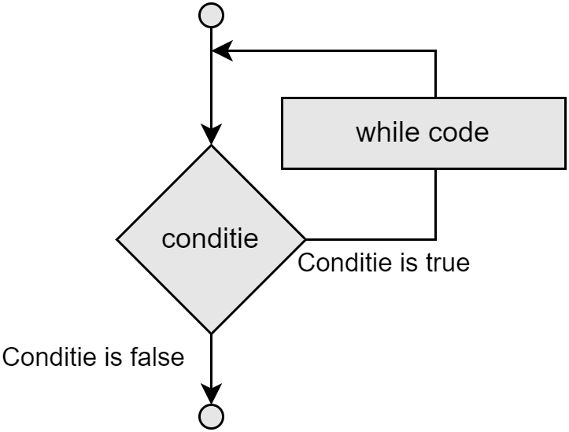
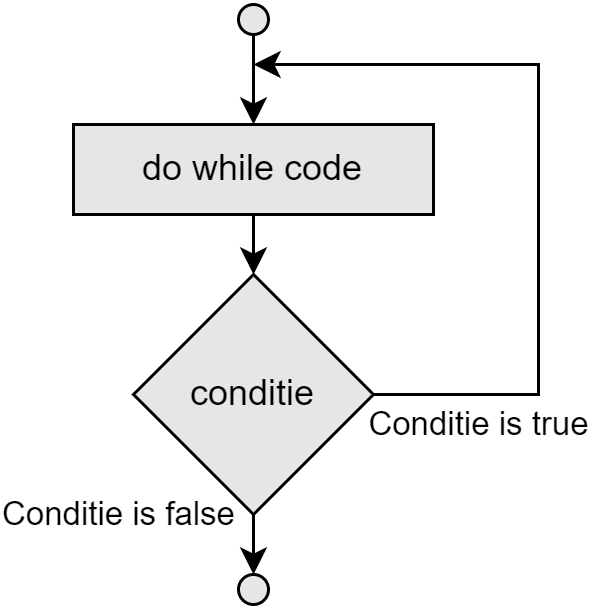

## While

De syntax van een while loop is eenvoudig:

```csharp
while (conditie) 
{
  // C# die zal uitgevoegd worden zolang de conditie waar is
}
```

Waarbij, net als bij een ``if`` statement, de **conditie** uitgedrukt wordt als een booleaanse expressie met 1 of meerdere relationele operators. **Zolang de conditie ``true`` is zal de code binnen de accolades uitgevoerd worden.** Indien de conditie reeds vanaf het begin ``false`` is dan zal de code binnen de ``while``-loop nooit worden uitgevoerd.

Telkens wanneer het programma aan het einde van het ``while`` codeblock komt springt het terug naar de conditie bovenaan en zal de test wederom uitgevoerd worden. Is deze weer ``true`` dan wordt de code weer uitgevoerd. Van zodra de test ``false`` is zal de code voorbij het codeblock springen en na het ``while`` codeblok doorgaan. De flowchart is duidelijk:





Een voorbeeld van een eenvoudige while loop:

```csharp
int myCount = 0;
while (myCount < 100)
{
    myCount++;
    Console.WriteLine(myCount);
}
```

Zolang ``myCount`` kleiner is dan 100 (``myCount < 100``) zal ``myCount`` met 1 verhoogd worden en zal de huidige waarde van ``myCount`` getoond worden. We krijgen met dit programma dus alle getallen van 1 tot en met 100 op het scherm onder elkaar te zien. Daar de test gebeurt aan het begin van de loop wil dit zeggen dat het getal 100 nog wel getoond zal worden. **Begrijp je waarom?** Test dit zelf!

### Complexe condities

Uiteraard mag de conditie waaraan een loop moet voldoen complexer zijn door middel van de relationele operators. 

Volgende ``while`` bijvoorbeeld zal uitgevoerd worden zolang ``teller`` groter is dan 5 én de variabele ``naam`` van het type ``string`` niet gelijk is aan "tim":

```csharp
while(teller > 5 && naam != "tim")
{
  //Keep repeating
}
```

### Oneindige loops
Indien de loop-conditie nooit ``false`` wordt dan heb je een oneindige loop gemaakt. Soms is dit gewenst gedrag (bijvoorbeeld bij de gameloop) soms is dit een bug en zal je dit moeten debuggen.

Volgende twee voorbeelden tonen dit:

Een **bewust oneindige loop**:

```csharp
while(true)
{
  //"To infinity and beyond!"
}
```

**Een bug die een oneindige loop veroorzaakt**:
```csharp
int teller = 0; 
while(teller<10)
{
  Console.WriteLine(teller);
  teller--; //oeps, dit had teller++ moeten zijn
}
```


Probeer er altijd zeker van te zijn dat de variabele(n) die je gebruikt in je test-conditie ook in de loop aangepast worden. Als deze in de loop niet verandert dan zal ook de test-conditie dezelfde blijven en heb je dus een oneindige loop gemaakt.



### Scope van variabelen in loops
Let er op dat de scope van variabelen bij loops zeer belangrijk is. Indien je een variabele binnen de loop definieert dan zal deze steeds terug "gereset" worden wanneer de volgende iteratie van de loop start.
Volgende code toont bijvoorbeeld **foutief** hoe je de som van de eerste 10 getallen (1+2+3+...+10) zou maken:

```csharp
int teller = 1;
while(teller <= 10)
{
   int som = 0;
   som = som+teller;
   teller++;
}
Console.WriteLine(som); //deze lijn zal een fout genereren
```

Voorgaande code zal volgende VS error geven: *The name 'som' does not exist in the current context*.


De **correcte** manier om dit op te lossen is te beseffen dat de variabele ``som`` enkel binnen de accolades van de while-loop gekend is. Op de koop toe wordt deze steeds terug op 0 gezet en er kan dus geen som van alle teller-waarden bijgehouden worden. Hier de oplossing:

```csharp
int teller = 1;
int som = 0;
while(teller <= 10)
{
   som = som+teller;
   teller++;
}
Console.WriteLine(som); 
```


Van zodra je dezelfde lijn(en) code onder elkaar in je code ziet staan (door bijvoorbeeld te copy pasten) is de kans zéér groot dat je dit korter kunt schrijven met behulp van loops (of methoden, wat we in volgende hoofdstuk zullen zien).


## Do while

In tegenstelling tot een while loop, zal een do-while loop sowieso **minstens 1 keer uitgevoerd worden**, omdat de conditie aan het eind van iteratie wordt gecontroleerd, en niet aan de start.

Vergelijk volgende flowchart van de ``do while`` met die van de ``while``:





De syntax van een do-while is eveneens verraderlijk eenvoudig:

```csharp
do{
     // C# die zal uitgevoegd worden zolang de conditie waar is
} while (conditie);
```


Merk op dat achteraan de testconditie een puntkomma na het ronde haakje staat. **Deze vergeten is een véél voorkomende fout. Bij een while is dit niet!**



Daar de test van een do-while achteraan de code van de loop gebeurt is het logisch dat een do-while dus minstens 1 keer wordt uitgevoerd. 


Het volgende eenvoudige aftelprogramma toont de werking van de do-while loop:

```csharp
int i = 10;
do
{
    i--;
    Console.WriteLine(i);
} while (i > 0);
```

Begrijp je wat dit programma zal doen? Inderdaad, dit zal alle getallen van 9 tot en met 0 onder elkaar op het scherm zetten.


### Foute input van gebruiker met loops verwerken
Dankzij loops kunnen we nu ook eenvoudiger omgaan met foutieve input van de gebruiker. Stel dat we volgende vraag hebben:

```csharp
Console.WriteLine("Geef uw keuze in: a, b of c");
string input = Console.ReadLine();
```

Met een loop kunnen we nu deze vragen blijven stellen tot de gebruiker een geldige input geeft:

```csharp
string input;
do
{
  Console.WriteLine("Geef uw keuze in: a, b of c");
  input = Console.ReadLine();
}while(input != "a" && input != "b" && input != "c");
```

**Zolang (while) de gebruiker niet ``"a"``, ``"b"`` of ``"c"`` invoert zal de loop zichzelf blijven herhalen.**

Merk op dat we de variabele ``string input`` **voor** de `` do while`` moeten aanmaken. Zouden we die in de loop pas aanmaken dan zou de variabele niet als test kunnen gebruikt worden aan het einde van de loop. De reden? Wederom de scope van variabelen. De accolades van de ``do while`` creëren een duidelijke scope die iedere iteratie verdwijnt en terug wordt aangemaakt, inclusief dus variabelen die binnen deze accolades worden aangemaakt.


We herhalen voorgaande nog eens nadrukkelijk omdat hier vaak fouten op gemaakt worden: Je ziet dat de test achteraan (``while(input...);``) buiten de accolades van de loop ligt en dus een andere scope heeft.



De booleaanse expressie ``input != "a" && input != "b" && input != "c"`` kan ook anders geschreven met dezelfde interne logica (en dus werking) als ``!(input == "a" || input == "b" || input == "c")``. Sommige mensen prefereren deze tweede vorm. Maar dat is persoonlijke smaak.



Voorgaande logica is een gevolg van de **Wetten van De Morgan** (ook wel dualiteit van De Morgen genoemd) die het verband leggen tussen de logische operatoren EN, OF en de negatie. 

Deze wetten zeggen dat (uitgedrukt even in C# voor de duidelijkheid):

* ``!(A && B )`` is hetzelfde als ``!A || !B``
* ``!(A || B )`` is hetzelfde als ``!A && !B`` 

Zie je hoe we de tweede wet gebruikt hebben in het voorgaande voorbeeld om de alternatieve logica te vinden?

