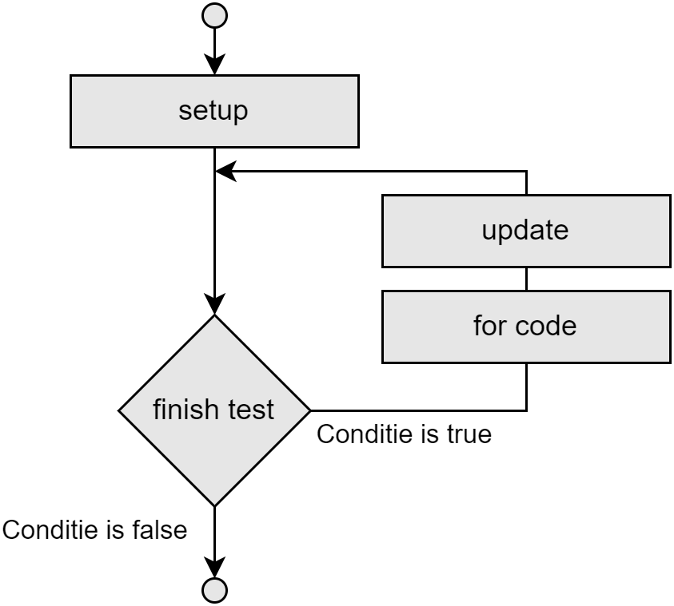

## For-loops

Een veelvoorkomende manier van while-loops gebruiken is waarbij je een bepaalde teller bijhoudt die je telkens met een bepaalde waarde verhoogt. Wanneer de teller een bepaalde waarde bereikt moet de loop afgesloten worden.

Bijvoorbeeld volgende code om alle even getallen van 0 tot 10 te tonen:

```java
int i = 0;
while(i<11)
{
    Console.WriteLine(i);
    i = i + 2;
}
```

**Met een for-loop kunnen we deze veel voorkomende code-constructie verkort schrijven.**

### For syntax

De syntax van een ``for``-loop is de volgende:
```java
for (setup; finish test; update)
{
    // C# die zal uitgevoerd worden zolang de finish test true geeft
}
```
* **setup**: In het setup gedeelte zetten we de "wachter-variabele" op de beginwaarde. De wachter-variabele is de variabele die we tijdens de loop in het oog zullen houden en die zal bepalen hoe vaak de loop moet uitgevoerd worden (bv. ``int i = 0;``).
* **finish test**: Hier plaatsen we een booleaanse expressie die de wachter-variabele uit de setup gebruikt om te testen of de loop-code moet uitgevoerd worden (bv. ``i<11``).
* **update**: Hier plaatsen we wat er moet gebeuren telkens de loop z'n codeblock heeft uitgevoerd. Meestal zullen we hier de wachter-variabele verhogen of verlagen (bv. ``i = i + 2``).



 
Gebruiken we deze kennis, dan kunnen we de eerder vermelde code om de even getallen van 0 tot en met 10 tonen als volgt:

```java
for (int i = 0; i < 11; i += 2)
{
    Console.WriteLine(i);
}
```

Voor de *setup*-variabele kiest men meestal ``i``, maar dat is niet noodzakelijk. In de *setup* wordt dus een variabele op een start-waarde gezet. De *finish test* zal aan de start van iedere loop kijken of de *finish test* nog waar is, indien dat het geval is dan wordt een nieuwe loop gestart en wordt ``i`` met een bepaalde waarde, zoals in *update* aangegeven, verhoogd.



### for-tab-tab
Als je in Visual Studio ``for`` typt en dan tweemaal op [tab] duwt krijg je een kant en klare for-loop.



### continue en break

Het ``continue`` keyword laat toe om in een loop de huidige iteratie te eindigen en weer naar de start van de volgende iteratie te gaan. In het volgende voorbeeld gebruiken we ``continue`` om alle getallen van 1 tot 10 te tonen waarbij we het getal 5 zullen overslaan:

```java
for (int i = 1; i <= 10; i++)
{
    if (i == 5)
    {
        continue;
    }
    Console.WriteLine(i);
}
```

En met ``break`` kan je loops (alle types) altijd vroegtijdig stopzetten. Je springt dan als het ware ogenblikkelijk uit de loop. Je ziet het aankomen zeker? Yups, daar is ie.... 





Olla!? Wat denken we dat we aan het doen zijn? Gelieve die keywords ogenblikkelijk terug uit je code te verwijderen. Bedankt. 

``break`` en ``continue`` zijn de meer subtiele vrienden van ``goto``. Ze leven, net als ``goto`` meer in de schemerzone tussen wat mag en niet mag. Dat maakt hen extra gevaarlijk. Voor je ``break`` als oplossing wilt gebruiken probeer je best eerst of je de loop niet mooier kan afsluiten door bijvoorbeeld de juiste booleaanse expressie te beschrijven in de test-conditie. Hetzelfde geldt voor ``continue`` dat ook snel ``goto``-achtige bugs tot gevolg kan hebben. 


