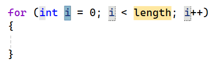

## For-loops

Een veelvoorkomende manier van while-loops gebruiken is waarbij je een bepaalde teller bijhoudt die je telkens met een bepaalde waarde verhoogt. Wanneer de teller een bepaalde waarde bereikt moet de loop afgesloten worden.

Bijvoorbeeld volgende code om alle even getallen van 0 tot 10 te tonen:

```csharp
int i = 0;
while(i<11)
{
    Console.WriteLine(i);
    i = i + 2;
}
```

**Met een for-loop kunnen we deze veel voorkomende code-constructie verkort schrijven.**

### For syntax

De syntax van een ``for``-loop is de volgende:

```csharp
for (setup; finish test; update)
{
    //code die zal uitgevoerd worden zolang de finish test true geeft
}
```

* **setup**: Hier zetten we de "wachter-variabele" op de beginwaarde. De wachter-variabele is de variabele die we tijdens de loop in het oog zullen houden en die zal bepalen hoe vaak de loop moet uitgevoerd worden (bv. ``int i = 0;``).
* **finish test**: Hier plaatsen we een booleaanse expressie die de wachter-variabele gebruikt om te testen of een volgende iteratie moet worden uitgevoerd (bv. ``i<11``).
* **update**: Hier plaatsen we wat er moet gebeuren na iedere iteratie. Meestal zullen we hier de wachter-variabele verhogen of verlagen (bv. ``i = i + 2``).

<!-- \newpage -->

<!--{width=50%}-->
 
Voor de *setup*-variabele kiest men meestal ``i``, maar dat is niet noodzakelijk.

Gebruiken we deze kennis, dan kunnen we de eerder vermelde code om de even getallen van 0 tot en met 10 tonen als volgt:

```csharp
for (int i = 0; i < 11; i += 2)
{
    Console.WriteLine(i);
}
```


Deze code zal telkens ``i`` met 2 verhogen(*update*), startende bij 0 (*setup*). Het blijft dit doorlopen zolang i kleiner is dan 11 (*finish test*). Als output krijgen we:

```text
0
2
4
6
8
10
```



**for-tab-tab**

Als je in Visual Studio ``for`` typt en dan tweemaal op [tab] duwt krijg je een kant en klare for-loop:

<!--{width=70%}-->

Telkens je vervolgens op [tab] duwt verspringt je cursor tussen ``i`` en ``length``. Op die manier kan je dus snel een for schrijven.


<!-- \newpage -->


### continue en break

Het ``continue`` keyword laat toe om in een loop de huidige iteratie te eindigen en weer naar de start van de volgende iteratie te gaan. In het volgende voorbeeld gebruiken we ``continue`` om alle getallen van 1 tot 10 te tonen waarbij we het getal 5 zullen overslaan:

```csharp
for (int i = 1; i <= 10; i++)
{
    if (i == 5)
    {
        continue;
    }
    Console.WriteLine(i);
}
```

Met ``break`` kan je loops altijd vroegtijdig stopzetten. Je springt dan als het ware ogenblikkelijk uit de loop. Je ziet het aankomen zeker? Yups, daar is ie.... 


>Olla!? Wat denken we dat we aan het doen zijn? Gelieve die keywords ogenblikkelijk terug uit je code te verwijderen. Bedankt. 
>
>``break`` en ``continue`` zijn de subtielere vrienden van ``goto``. Ze werken net als ``goto`` in de schemerzone tussen wat wenselijk is en wat niet. Dit maakt ze extra gevaarlijk. Voordat je ``break`` als oplossing gebruikt, probeer eerst of je de loop netjes kunt afsluiten door bijvoorbeeld de juiste booleaanse expressie in de testconditie te gebruiken. Hetzelfde geldt voor continue, dat ook snel goto-achtige bugs kan veroorzaken.
>
>Ik heb gemerkt dat beginnende C#-programmeurs vaak te lui zijn om een deftige stopconditie voor hun loop te schrijven. En dan maar ``break`` als oplossing hanteren.


