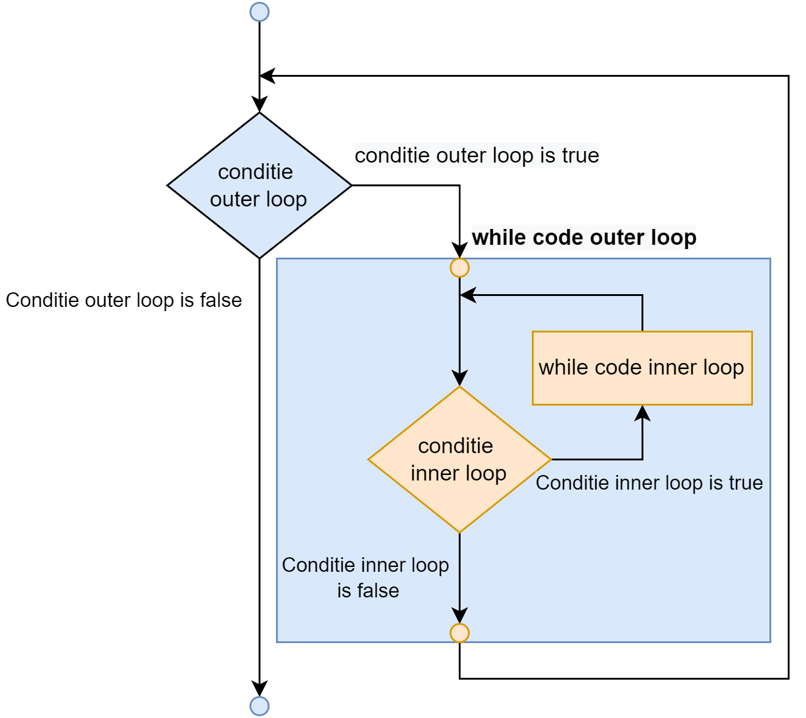

## Nested loops

Wanneer we 1 of meerdere loops in een andere loop plaatsen dan spreken we over **geneste loops**. 
Geneste loops komen vaak voor, maar zijn wel een ander paar mouwen wanneer je deze zaken wilt debuggen en correct schrijven.


<!--{width=70%}-->

We spreken steeds over de **outer loop** als de omhullende of "grootste" loop. Waarbij de binnenste loop de **inner loop** is. 


Volgende code toont bijvoorbeeld 2 loops die genest werden:

```csharp
int tellerA = 0;
int tellerB = 0;

while(tellerA < 3 ) //outer loop
{
    tellerA++;
    tellerB = 0;
    while(tellerB < 5)
    {
        tellerB++;
        Console.WriteLine($"A:{tellerA}, B: {tellerB}");
    }
}
```

<!-- \newpage -->


De uitvoer hiervan zal als volgt zijn:

```text
A:1,  B: 1
A:1,  B: 2
A:1,  B: 3
A:1,  B: 4
A:1,  B: 5
A:2,  B: 1
A:2,  B: 2
A:2,  B: 3
A:2,  B: 4
A:2,  B: 5
A:3,  B: 1
A:3,  B: 2
A:3,  B: 3
A:3,  B: 4
A:3,  B: 5
```

Merk het 'ritme' op in de uitvoer. De linkse teller gaat een pak trager dan de rechtse.

### Geneste loops tellen

Om te tellen hoe vaak de *inner* code zal uitgevoerd worden dien je te weten hoe vaak iedere loop afzonderlijk wordt uitgevoerd. Vervolgens vermenigvuldig je al deze getallen met elkaar.

Een voorbeeld: Hoe vaak zal het woord "Hallo" op het scherm verschijnen bij volgende code?

```csharp
for (int i = 0; i < 10; i++)
{
    for (int j = 0; j < 5; j++)
    {
        Console.WriteLine("Hallo");
    }
}
```

De outer loop wordt 10 keer uitgevoerd (waarbij ``i`` de waarden 0 tot en met 9 aanneemt). De inner loop wordt bij elke iteratie van de outer loop 5 keer uitgevoerd (waarbij ``j`` de waarden 0 tot en met 4 aanneemt). In totaal zal dus 50 keer "Hallo" op het scherm verschijnen (5x10).


Let er op dat ``break`` je enkel uit de huidige loop zal halen. Indien je dit dus gebruikt in de inner loop dan zal de outer loop nog steeds voortgaan. Nog een reden om zéér voorzichtig om te gaan met ``break``. **Of beter nog: gewoon niet gebruiken!**



