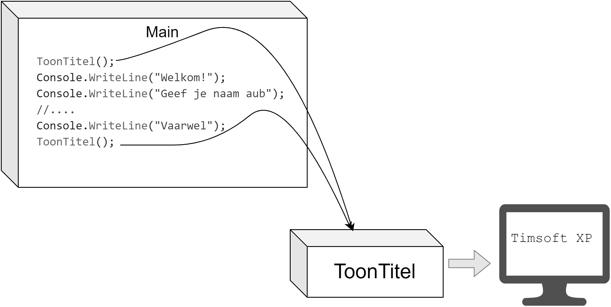
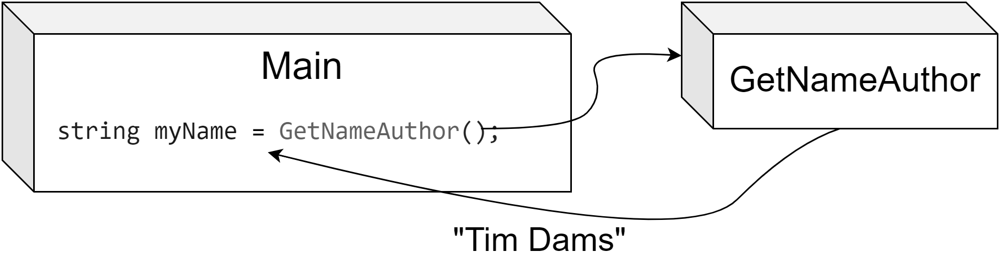
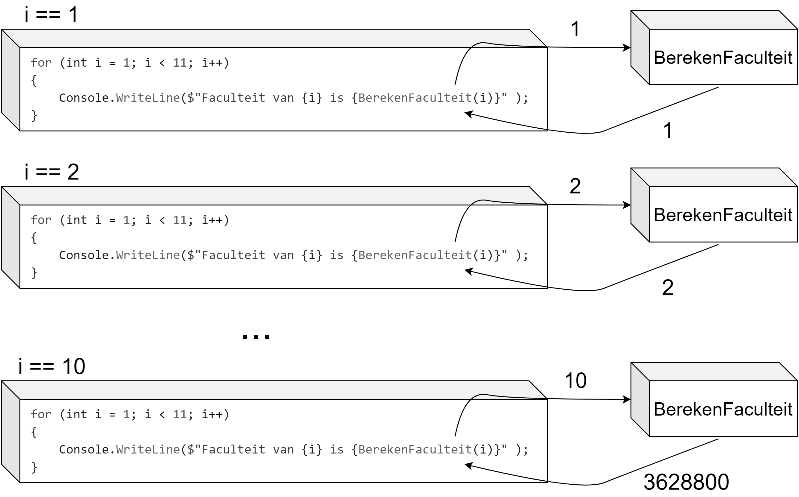
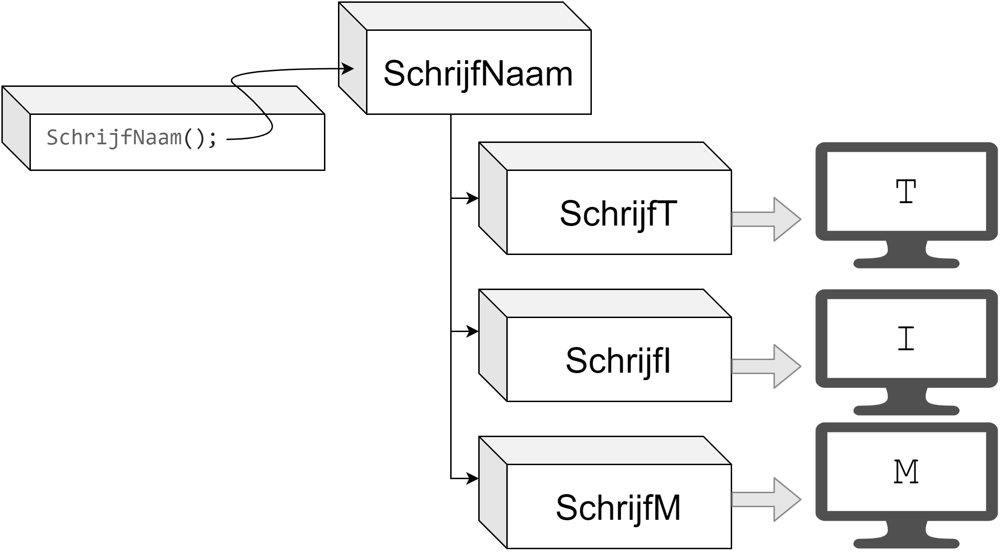
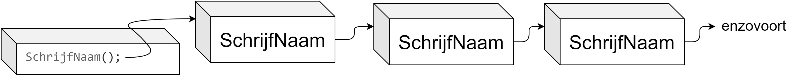
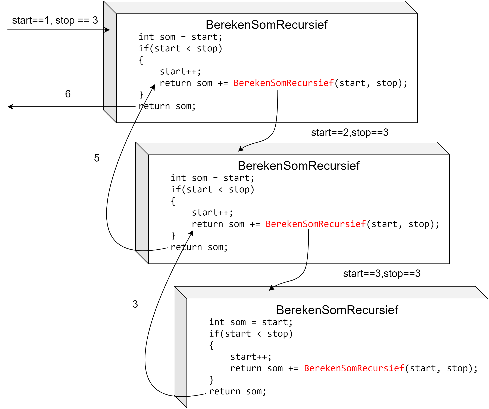
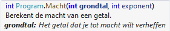

# Methoden

Ene Bill Gates, je weet wel, de oprichter van een bedrijfje genaamd Microsoft zei ooit: *"I will always choose a lazy person to do a difficult job. Because, he will find an easy way to do it."*

Het is je misschien nog niet opgevallen, maar sinds het vorige hoofdstuk zijn we de jacht begonnen op zo weinig mogelijk code te schrijven met zoveel mogelijk rendement. Loops waren een eerste stap in de goede richting. De volgende zijn methoden! Tijd om nog luier te worden.

Veel code die we hebben geschreven wordt meerdere keren, al dan niet op verschillende plaatsen, gebruikt. Dit verhoogt natuurlijk de foutgevoeligheid. Door het gebruik van methoden kunnen we de foutgevoeligheid van de code verlagen omdat de code maar op 1 plek staat én maar 1 keer dient geschreven te worden. Echter, ook de leesbaarheid en dus onderhoudbaarheid van de code wordt verhoogd.

Beeld je eens dat we geen gebruik konden maken van de vele .NET bibliotheken. Stel je voor dat ``Console.WriteLine``  niet bestond? Telkens als we dan iets in C# naar het scherm wilden sturen moesten we de volledige interne code van ``WriteLine`` uitschrijven. Voor de geïnteresseerden, dat zou er (ongeveer) als volgt uitzien:

```java
fixed (byte* p = bytes)
{
    if (useFileAPIs)
    {
        int numBytesWritten;
        Interop.Kernel32.WriteFile(hFile, p, bytes.Length, out numBytesWritten, IntPtr.Zero));
    }
    else
    {
        //enz.
```

Dat is aardig wat bizarre code he? En we tonen maar een stuk. Kortom: we mogen *onze beide pollekes kussen* dat methoden bestaan. Tijd om ze eens van dichterbij te bekijken!


Het is heel normaal dat voorgaande code je zenuwachtig maakt. Negeer ze maar! Toch nieuwsgierig hoe wat er allemaal achter de schermen gebeurt? Voorgaande code komt uit **github.com/dotnet/runtime/blob/main/src/libraries/System.Console/src/System/ConsolePal.Windows.cs**, waar je ook alle andere broncode van de *dotnet runtime* zal terugvinden. 



## Werking van methoden

Een methode, ook vaak functie genoemd, is in C# een stuk code ('block') bestaande uit 0, 1 of meerdere statements. De methode kan herhaaldelijk opgeroepen worden, al dan niet met extra parameters, en kan ook een resultaat terug geven. Een methode kan van eender waar in je code aangeroepen worden.

Je gebruikt al sinds les 1 methoden. Telkens je ``Console.WriteLine()`` bijvoorbeeld gebruikte, roep je een methode aan. **Methoden in C# zijn namelijk herkenbaar aan de ronde haakjes achteraan, al dan niet met actuele parameters tussen.** Kortom, alles wat we nu gaan zien heb je (onbewust) al gebruikt. Het grote verschil zal zijn dat we nu ook **zelf methoden** gaan definiëren, en niet enkel bestaande methoden gebruiken.

Methoden gebruiken heeft als voordeel dat je (kleine) herbruikbare stukken code kunt gebruiken en dus niet steeds deze code overal moet copy pasten. Daarnaast zullen methoden je code ook overzichtelijker maken.

### Methode syntax

De basis-syntax van een methode ziet er als volgt uit (de werking van het keyword ``static`` zien we in hoofdstuk 11):

```java
static returntype MethodeNaam(optioneel_parameters)
{
    //code van methode
}
```

Vervolgens kan je deze methode elders oproepen als volgt, indien de methode geen parameters vereist:


```java
MethodeNaam();
```

Dat is een mondvol. We gaan daarom de methoden even stapsgewijs leren kennen. Let's go!


### Een eenvoudige methode

Beeld je in dat je een applicatie moet maken waarin je op verschillende plaatsen de naam van je programma moet tonen. Zonder methoden zou je telkens moeten schrijven ``Console.WriteLine("Timsoft XP");``

Als je later de naam van het programma wilt veranderen naar iets anders (bv. ``Timsoft 11``) dan zal je manueel overal de titel moeten veranderen in je code. Met een methode hebben we dat probleem niet meer. We schrijven daarom een methode ``ToonTitel`` als volgt:

```java
static void ToonTitel()
{
    Console.WriteLine("Timsoft XP");
}
```


Vanaf nu kan je eender waar in je programma deze methode aanroepen door te schrijven:


```java
ToonTitel();
```

Volgend programma'tje toont dit:

```java
namespace Demo1
{
    internal class Program
    {
        static void ToonTitel()
        {
            Console.WriteLine("Timsoft XP");
        }

        static void Main(string[] args)
        {
            ToonTitel();
            Console.WriteLine("Welkom!");
            Console.WriteLine("Geef je naam aub");
            //....
            Console.WriteLine("Vaarwel");
            ToonTitel();
        }
    }
}
```


Volgende afbeelding toont hoe je programma doorheen de code loopt. De pijlen geven de flow aan:



### Main is ook een methode

Zoals je misschien al begint te vermoeden is dus de ``Main`` waar we steeds onze code schrijven ook een methode. Een console-applicatie heeft een startpunt nodig en daarom begint ieder programma in deze methode, maar in principe kan je even goed je programma op een andere plek laten starten.

Wat denk je trouwens dat je dit doet?

```java
static void Main(string[] args)
{
    Console.WriteLine("Ik zit vast!");
    Main(); //Endless loop incoming!
}

```


``string[] args`` is een verhaal apart en zullen we in het volgende hoofdstuk bekijken. We verklappen alvast dat je via deze ``args`` opstartparameters aan je programma kan meegeven tijdens het opstarten (bijvoorbeeld ``explorer.exe google.com``) zodat je code hier iets mee kan doen.



## Returntypes van methoden

Voorgaande methode gaf niets terug. Dat kon je zien aan het keyword **``void``** (letterlijk: *leegte*). 

Vaak willen we echter wel dat de methode iets teruggeeft. Bijvoorbeeld het resultaat van een berekening.

Het returntype van een methode geeft aan wat het type is van de data die de methode als resultaat teruggeeft bij het beëindigen ervan. Eender welk type dat je kent kan hiervoor gebruikt worden, zoals ``int``, ``string``, ``char``, ``float``, enz. Ook zelfgemaakte (of bestaande) ``enum`` datatypes kunnen als returnwaarde door het leven (en later ook objecten, wat we in hoofdstuk 10 zullen ontdekken).

Het is belangrijk dat in je methode het resultaat ook effectief wordt teruggegeven, dit doe je met het keyword **``return``** gevolgd door de variabele die moet teruggeven worden. 

Denk er dus aan dat deze variabele van het type is dat je hebt opgegeven als zijnde het returntype. Van zodra je ``return`` gebruikt zal je op die plek uit de methode 'vliegen'.

Wanneer je een methode maakt die iets teruggeeft (dus ander returntype dan ``void``) is het ook de bedoeling dat je het resultaat van die methode opvangt en gebruikt. Je kan bijvoorbeeld het resultaat van de methode in een variabele bewaren. Dit vereist dat die variabele dan van hetzelfde returntype is! 

Volgend voorbeeld bestaat uit een methode die de naam van de auteur van je programma teruggeeft:

```java
static string GetNameAuthor()
{
    string name = "Tim Dams";
    return name;
}
```

Een mogelijke manier om deze methode in je programma te gebruiken zou nu kunnen zijn:


```java
string myName = GetNameAuthor();
```






Zoals je merkt is er niet veel verschil met wat je al wist aangaande het gebruik van variabelen. Als je dus twijfelt wat methoden kunnen, beschouw ze als een soort "slimme variabelen" die finaal ook gewoon een waarde hebben, maar deze waarde kan het resultaat van een complex stuk code in de methode zijn.




Je mag zowel literals als variabelen en zelfs andere methode-aanroepen plaatsen achter het ``return`` keyword. Zolang het maar om een expressie gaat die een resultaat heeft kan dit. Voorgaande methode kunnen we dus ook schrijven als:

```java
static string GetNameAuthor()
{
    return "Tim Dams";
}
```



Hier een voorbeeld van een methode die de faculteit van 5 berekent. De oproep van de methode gebeurt vanuit de Main-methode:

```java
internal class Program
{
    static int FaculteitVan5()
    {
        int resultaat = 1;
        for (int i = 1; i <= 5; i++)
        {
            resultaat *= i;
        }
        return resultaat;
    }
 
    static void Main(string[] args)
    {
       Console.WriteLine($"Faculteit van 5 is {FaculteitVan5()}");
    }
}
```


### ``void`` 

Indien je methode niets teruggeeft wanneer de methode eindigt (bijvoorbeeld indien de methode enkel tekst op het scherm toont) dan dien je dit ook aan te geven. Hiervoor gebruik je het keyword void. Een voorbeeld:

```java
static void ShowProgramVersion()
{
    Console.Write("The version of this program is: ");
    Console.Write(2.16 + "\n");
}
```


Het **void** keyword geeft aan dat deze methode niets "teruggeeft" van resultaat aan de code die de methode aanriep. **Zaken naar het scherm sturen met ``Console.WriteLine()`` heeft hier niets mee te maken.** 



### ``return`` 

Je mag het ``return`` keyword eender waar in je methode gebruiken. Weet wel dat van zodra een statement met ``return`` wordt bereikt de methode ogenblikkelijk afsluit en het resultaat achter ``return`` teruggeeft. Soms is dit handig zoals in volgende voorbeeld:

```java
static string WindRichting()
{
    Random r = new Random();
    switch (r.Next(0,4))
    {
        case 0:
            return "noord";
            break;
        case 1:
            return "oost";
            break;
        case 2:
            return "zuid";
            break;
        case 3:
            return "west";
            break;
    }
    return "onbekend";
}
```

Merk op dat de onderste ``return "onbekend";`` nooit zal bereikt worden. Toch vereist C# dit!





Dacht je nu echt dat ik weg was?! Het is me opgevallen dat je niet altijd de foutboodschappen in VS leest. Ik blijf alvast uit jouw buurt als je zo doorgaat. Doe jezelf (en mij) dus een plezier en probeer die foutboodschappen in de toekomst te begrijpen. Er zijn er maar een handvol en bijna altijd komen ze op hetzelfde neer. Neem nou de volgende:**Not all code paths return a value**
Die ga je nog vaak tegenkomen!

Bovenstaande error zal je vaak krijgen en geeft altijd aan dat er bepaalde delen binnen je methode zijn waar je kan komen zonder dat er een ``return`` optreedt. Het einde van de methode wordt met andere woorden bereikt zonder dat er iets uit de methoden terug komt (wat enkel bij ``void`` mag).

Foutboodschappen hebben de neiging om gecompliceerder te klinken dan de effectieve fout die ze beschrijven. Een beetje zoals een lector die lesgeeft over iets waar hij zelf niets van begrijpt.




## Parameters doorgeven

Methoden zijn handig vanwege de herbruikbaarheid. Wanneer je een methode hebt geschreven om de sinus van een hoek te berekenen, dan is het echter ook handig dat je de hoek als parameter kunt meegeven zodat de methode kan gebruikt worden voor eender welke hoekwaarde. 


Indien er wel parameters nodig zijn dan geef je die mee als volgt:


```java
MethodeNaam(parameter1, parameter2, …);
```

Je hebt dit ook al geregeld gebruikt. Wanneer je tekst op het scherm wilt tonen dan roep je de ``WriteLine`` methode aan en geef je 1 parameter mee, namelijk hetgeen dat op het scherm moet komen. Bij de ``Math`` bibliotheek waren er bijvoorbeeld methoden waar je 2 parameters aan kon meegeven, waarbij duidelijk was dat de volgorde belangrijk was: ``Math.Pow(6,3);`` 6 tot de 3e is niet hetzelfde als 3 tot de 6e wat je als volgt zou schrijven ``Math.Pow(3, 6);``.

Parameters kunnen op 2 manieren worden doorgegeven aan een methode:

1. Wanneer een parameter **by value** wordt meegegeven aan een methode, dan wordt **een kopie gemaakt van de huidige waarde** die wordt meegegeven.
2. Wanneer echter een parameter **by reference** wordt meegegeven dan zal een pointer worden meegegeven aan de methode. Deze pointer bevat het **adres van de eigenlijke variabele** die we meegeven. Aanpassingen aan de actuele parameters zullen daardoor ook zichtbaar zijn binnen de scope van de originele variabele. Parameters *by reference* komen pas vanaf hoofdstuk 9 van pas.


Het tweede punt mag je volledig negeren als je geen flauw benul had wat er net werd gezegd. We komen hier later in de volgende hoofdstukken nog uitgebreid op terug!


### Methoden met formele parameters
Om zelf een methode te definiëren die 1 of meerdere parameters aanvaardt, dien je per parameter het datatype en een tijdelijk naam (identifier) te definiëren (*formele parameters*) in de methode-signatuur

Als volgt:

```java
static returntype MethodeNaam(type parameter1, type parameter2)
{
    //code van methode
}
```

Deze formele parameters zijn nu beschikbaar binnen de methode om mee te werken naar believen.


Stel bijvoorbeeld dat we onze ``FaculteitVan5`` willen veralgemenen naar een methode die voor alle getallen werkt, dan zou je volgende methode kunnen schrijven:

```java
static int BerekenFaculteit(int grens)
{
    int resultaat = 1;
    for (int i = 1; i <= grens; i++)
    {
        resultaat *= i;
    }
    return resultaat;
}
```

De naam ``grens`` kies je zelf. Maar we geven hier dus aan dat de methode ``BerekenFaculteit`` enkel kan aangeroepen worden indien er 1 actuele parameter van het type ``int`` wordt meegegeven.

Aanroepen van de methode gebeurt dan als volgt:

```java
int getal = 5;
int resultaat = BerekenFaculteit(getal);
```

Of sneller:


```java
int resultaat = BerekenFaculteit(5);
```


Als we even later ``resultaat`` dan zouden gebruiken zal er de waarde ``120``  in zitten.


Parameters worden "by value" meegegeven (zie het hoofdstuk over Arrays hierna) wat wil zeggen dat een **kopie** van de waarde wordt meegegeven. Als je dus in de methode de waarde van de parameter aanpast, dan heeft dit géén invloed op de waarde van de originele parameter waar je de methode aanriep.



Je zou nu echter de waarde van getal kunnen aanpassen (door bijvoorbeeld aan de gebruiker te vragen welke faculteit moet berekend worden) en je code zal nog steeds werken.


Veel beginnende programmeurs zijn soms verward dat de naam van de parameter in de methode (bv. ``grens``) niet dezelfde moet zijn als de naam van de variabele (of literal) die we bij de aanroep meegeven.

Het is echter logisch dat deze niet noodzakelijk gelijk moeten zijn: het enige dat er gebeurt is dat de methodeparameter de waarde krijgt die je meegeeft, ongeacht van waar de parameter komt.



En wat als je de faculteiten wenst te kennen van alle getallen tussen 1 en 10?  Dan zou je schrijven:

```java
for (int i = 1; i < 11; i++)
{
    Console.WriteLine($"Faculteit van {i} is {BerekenFaculteit(i)}" );
}
```



Dit zal als resultaat geven

```
Faculteit van 1 is 1
Faculteit van 2 is 2
Faculteit van 3 is 6
Faculteit van 4 is 24
Faculteit van 5 is 120
Faculteit van 6 is 720
Faculteit van 7 is 5040
Faculteit van 8 is 40320
Faculteit van 9 is 362880
Faculteit van 10 is 3628800
```


Merk op dat dankzij je methode, je véél code maar één keer moet schrijven, wat de kans op fouten verlaagt.



#### Volgorde van actuele parameters

De volgorde waarin je je parameters meegeeft bij de aanroep van een methode is belangrijk. De eerste variabele wordt aan de eerste parameter toegekend, en zo voort. 

Het volgende voorbeeld toont dit. Stel dat je een methode hebt:

```java
static void ToonDeling(double teller, double noemer)
{
    if(noemer != 0)
        Console.WriteLine(teller/noemer);
    else
        Console.WriteLine("Een zwart gat ontstaat!");
}
```

Stel dat we nu in onze main volgende aanroep doen:

```java
double n = 4.2;
double t = 5.2;
ToonDeling(n, t);
```

Dit zal een ander resultaat geven dan wanneer we volgende code zouden uitvoeren:


```java
ToonDeling(t, n);
```

Ook de volgorde is belangrijk zeker wanneer je met verschillende types als formele parameters werkt:

```java
static void ToonInfo(string name, int age)
{
   Console.WriteLine($"{name} is {age} old");
}
```

Deze aanroep is correct:


```java
ToonInfo("Tim", 37);
```

Deze is **FOUT** en zal niet compileren:


```java
ToonInfo(37, "Tim");
```


### Methoden nesten

In het begin ga je vooral vanuit je ``main`` methoden aanroepen, maar dat is geen verplichting. Je kan ook vanuit methoden andere methoden aanroepen, en van daaruit weer andere, en zo voort. Volgende (nutteloze) programma'tje toont dit in actie:

```java
static void SchrijfT()
{
    Console.WriteLine("T");
}
static void SchrijfI()
{
    Console.WriteLine("I");
}
static void SchrijfM()
{
    Console.WriteLine("M");
}
static void SchrijfNaam()
{
    SchrijfT();
    SchrijfI();
    SchrijfM();
    SchrijfM();
    SchrijfI();
}
public static void Main()
{
    SchrijfNaam();
}
```





### Bugs met methoden

Wanneer je programma's complexer worden moet je zeker opletten dat je geen oneindige lussen creëert, zonder dat je loop-code gebruikt. Zie je de fout in volgende code?

```java
public static void Main()
{
    SchrijfNaam();
}
static void SchrijfNaam()
{
    SchrijfNaam();
    Console.WriteLine("Klaar?");
}
```

Deze code heeft een methode die zichzelf aanroept, zonder dat deze ooit afsluit, waardoor we dus in een oneindige aanroep van de methode komen. Dit programma zal een leeg scherm tonen (daar er nooit aan de tweede lijn in de methode wordt geraakt) en dan crashen wanneer het werkgeheugen van de computer op is (daar de methoden nooit afsluit en telkens een kopie aanroept).



#### Lokale methoden...en waarom je ze beter niet gebruikt

Sinds C# 7.0 kan je methoden definiëren binnenin een andere methode. Dit noemt men *local functions* en alhoewel ze zeker hun nut hebben, is het in deze fase van C# leren **geen goed idee om lokale methoden te gebruiken**. Het is véél belangrijker dat je eerst deftig methoden leert schrijven daar sommige beginnende programmeurs soms per ongeluk een lokale methode schrijven en vervolgens ontdekken dat ze die methode nergens kunnen aanroepen (local functions zijn enkel aanroepbaar binnenin de methode waarin ze gedefinieerd werd).


Kortom, zorg dat je nooit dit schrijft!

```java
static void Main(string[] args)
{
    ZieScherpVindDitNietLeuk();

    static void ZieScherpVindDitNietLeuk()
    {
        Console.WriteLine("Doe dit niet!");
    }
}
```





Even ingrijpen en je wijzen op recursie zodat je code niet in je gezicht blijft ontploffen. **Recursie** is een geavanceerd programmeerconcept wat niet in dit boek wordt besproken, maar laten we het hier kort toelichten. Recursieve methoden zijn methoden die zichzelf aanroepen maar wél op een gegeven moment stoppen wanneer dat moet gebeuren. Volgend voorbeeld is een recursieve methode om de som van alle getallen tussen ``start`` en ``stop`` te berekenen:

```java
static int BerekenSomRecursief(int start, int stop)
{
    int som = start;
    if(start < stop)
    {
        start++;
        return som += BerekenSomRecursief(start, stop);
    }
    return som;
}
```
Je herkent recursie aan het feit dat de methode zichzelf aanroept. Maar een controle voorkomt dat die aanroep blijft gebeuren zonder dat er ooit een methode wordt afgesloten. We krijgen 6 terug (1+2+3) als we de methode als volgt aanroepen:


```java
int einde = BerekenSomRecursief(1,3);
``` 







### Commentaar aan methoden toevoegen

Het is aan te raden om steeds boven een methode een nieuwe vorm van commentaar te plaatsen als volgt (dit werkt enkel bij methoden): ``///``

Visual Studio zal dan automatisch de parameters verwerken van je methode zodat je vervolgens enkel nog het doel van iedere parameter moet schrijven.

Stel dat we een methode hebben geschreven die de macht van een getal berekent (wat dom is...er bestaat al zoiets als ``Math.Pow``). We zouden dan volgende commentaar toevoegen:

```java
/// <summary>
/// Berekent de macht van een getal.
/// </summary>
/// <param name="grondtal">Het getal dat je tot macht wilt verheffen</param>
/// <param name="exponent">De exponent van de macht</param>
/// <returns></returns>
static int Macht(int grondtal, int exponent)
{
    int result = grondtal;
    for (int i = 1; i < exponent; i++)
    {
        result *= grondtal;
    }
    return result;
}
```

Wanneer we nu elders de methode ``Macht`` gebruiken dan krijgen we automatische extra informatie:





#### Regions

Je kan trouwens delen van je code in handige inklapbare secties zetten door deze als regions aan te duiden, als volgt:

```java
#region My Epic code
Console.WriteLine("I am the greatest!");
Console.WriteLine("Echt waar!");
#endregion
```

Je zal vanaf dan in Visual Studio rechts van de start van de region een minnetje zien waar je op kunt klikken om de hele region tot aan ``#endregion`` in te klappen. De code zal nog steeds gecompileerd worden, maar je bladspiegel is weer wat ordelijker geworden én het ingeklapte deel zal nog steeds herkenbaar zijn door de tekst die je achter de region-start (``My Epic code`` in dit geval).

