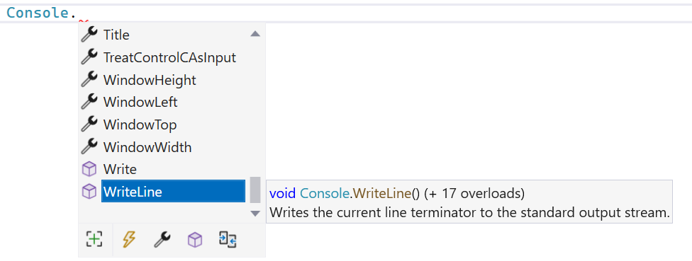

## Bestaande methoden en bibliotheken

Laten we eens kijken naar de vele methoden die reeds ingebouwd zitten in .NET en hoe we ze nu beter kunnen gebruiken.

Sommige methoden vereisen dat je een aantal parameters meegeeft. De parameters dien je tussen de ronde haakjes te zetten. Hierbij weten we nu dat het uiterst belangrijk dat je de volgorde respecteert die de ontwikkelaar van de methode heeft gebruikt. 

Maar wat als je niet weet in welke volgorde je arguementen moet meegeven? **Intellisense** is dan de oplossing! Typ de methode in je code en stop met typen na het eerste ronde haakje. Vervolgens zal Intellisense alle mogelijke manieren tonen waarop je deze methoden kan oproepen. Met de omhoog- en omlaagpijltjes van het toetsenbord kan je alle mogelijke manieren bekijken.


<!--{width=60%}-->


In de voorgaande screenshot zien we dat Intellisense telkens duidelijke de methode-signatuur beschrijft: 

* Het return type (in dit geval ``void``).
* Gevolgd door de naam van de methode.
* Finaal de formele parameters en hun datatype(s). 

Merk trouwens op dat je de ``WriteLine``-methode ook mag aanroepen zonder parameters, dit zal resulteren in een lege lijn in de console.

Met behulp van de F1-toets kunnen we meer info over de methode in kwestie tonen. Hiervoor dien je je cursor op de Methode in je code te plaatsen, en vervolgens op F1 te drukken. Je komt dan op de online documentatie van de methode waar erg veel informatie terug te vinden is over het gebruik ervan. Scroll naar de *overload list*, daar zien we de verschillende manieren waarop je de methode in kwestie kan aanroepen (het concept *overloaden* bespreek ik in de volgende sectie). Je kan vervolgens op iedere methode klikken voor meer informatie en een codevoorbeeld.

<!-- \newpage -->


### Intellisense

*Wat kan deze .NET bibliotheek eigenlijk?* is een veelgestelde vraag. Zeker wanneer je de basis van C# onder de knie hebt en je stilletjes aan met bestaande .NET bibliotheken wilt gaan werken. Wat volgt is een essentieel onderdeel van VS dat veel gevloek en tandengeknars zal voorkomen.

De online documentatie van VS is zeer uitgebreid en dankzij **IntelliSense** krijg je ook aardig wat informatie tijdens het typen van de code zelf. IntelliSense is de achterliggende technologie in VS die ervoor zorgt dat je minder moet typen. Als een soort assistent probeert IntelliSense een beetje te voorspellen wat je gaat typen en zal je daarmee helpen. 


Type eens het volgende in:

```csharp
System.Console.
```

Wacht nu even en er zal na het punt (``.``) een lijst komen van methoden en fields die beschikbaar zijn. Dit is IntelliSense in actie. Als er niets verschijnt of iets dat je niet had verwacht, dan is de kans groot dat er je een schrijffout hebt gemaakt. 

Je kan door deze lijst met de muis doorheen scrollen en zo zien welke methoden allemaal bij de ``Console`` bibliotheek horen. Indien gewenst kan je vervolgens de gewenste methode selecteren en op spatie duwen zodat deze in je code verschijnt.




<!-- \newpage -->


#### Herbruikbare gebruikersinvoer vragen

Vaak moet je code schrijven waarin je een getal aan de gebruiker vraagt:

```csharp
Console.WriteLine("Geef leeftijd");
int leeftijd = int.Parse(Console.ReadLine());
```

Als deze constructie op meerdere plekken in een project voorkomt dan is het nuttig om deze twee lijnen naar een methode te verhuizen die er dan zo kan uitzien:

```csharp
static int VraagInt(string zin)
{
    Console.WriteLine(zin);
    return  int.Parse(Console.ReadLine());
}
```

De code van zonet kan je dan nu herschrijven naar:


```csharp
int leeftijd = VraagInt("Geef leeftijd");
```

Het voorgaande voorbeeld toont ook ineens aan waarom methoden helpen om je code leesbaarder en onderhoudbaarder te maken. Je ``Main`` blijft gevrijwaard van veel repeterende lijnen code en heeft aanroepen naar methoden met een duidelijke naam die ieder een specifiek ding doen. Dit maakt het debuggen ook eenvoudiger: je ziet in één oogopslag wat een methode doet.


<!-- \newpage -->


### IntelliCode

Sinds Visual Studio 2022 heeft IntelliSense een ongelooflijk krachtig broertje bijgekregen, genaamd  IntelliCode. Deze tool zal ervoor zorgen dat je nog betere aanbevelingen krijgt van VS terwijl je aan het typen bent. Het gaat soms zo ver dat het lijkt alsof IntelliCode in je hoofd kan kijken en perfect kan voorspellen wat je wilt typen. **Let hier echter goed voor op**: de aanbevelingen zijn meestal erg accuraat, maar:

1. Ze zorgen ervoor dat je zelf minder moet typen en daardoor ook mogelijk jezelf niet genoeg traint. Zeker als beginnende programmeur. Ik raad je eigenlijk aan om IntelliCode uit te schakelen (via het Tools&Options menu-item). Waarom? Laten we de analogie van het leren fietsen er nog eens bijhalen. Wat IntelliCode eigenlijk doet is je af en toe optillen en enkele meters hoger op de berg plaatsen. Handig, dat wel, maar je traint je fietsbenen natuurlijk niet.
2. De aanbevelingen zijn natuurlijk soms gewoon fout of bevatten bugs die later bijvoorbeeld door hackers kunnen misbruikt worden. Of wat te denken van aanbevelingen die op zich wel zullen werken, maar wel 10x zoveel geheugen vereisen? Kortom, **wees steeds kritisch over de aanbevelingen van IntelliCode**

IntelliCode zal ook IntelliSense verbeteren door de belangrijkste, meest gebruikte methoden bovenaan te zetten. Je zal echter IntelliCode vooral herkennen wanneer er plots een hele lijn code verschijnt in het lichtgrijs. Je kan dit uitschakelen door onderaan op het kleine paarse lampje met Engelse sleutel te klikken en dan beide "Show..."-opties uit te schakelen.



Github Copilot project is zelfs nog krachtiger en komt dus met een nog grotere disclaimer: **beginnende programmeurs, laat dit soort tools beter nog even links liggen!** Je leert ook niet hoofdrekenen door vanaf dag 1 met een zakrekenmachine aan de slag te gaan.


