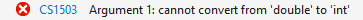

## Geavanceerde methode-technieken

Nu we methoden in de vingers krijgen, is het tijd om naar enkele gevorderde aspecten te kijken. Je hebt vermoedelijk al door dat methoden een erg fundamenteel concept zijn van een programmeertaal en dus hoe beter we ermee kunnen werken, hoe beter. 

Wat nu volgt is grotendeels gebaseerd op  **docs.microsoft.com/dotnet/csharp/programming-guide/classes-and-structs/named-and-optional-arguments**.


### Named parameters
Wanneer je een methode aanroept is de volgorde van je actuele parameters belangrijk: deze moeten meegeven worden in de volgorde zoals de methode ze verwacht.

Met behulp van **named parameters** kan je echter expliciet aangeven welke actuele parameters aan welke formele parameter moet meegegeven worden. 

Stel dat we een methode hebben met volgende signatuur:
```csharp
static void PrintDetails(string seller, int orderNum, string product)
{
    //do stuff
}
```

Zonder named parameters zou een aanroep van deze methode als volgt kunnen zijn:


```csharp
PrintDetails("Gift Shop", 31, "Red Mug");
```

We kunnen named parameters aangeven door de naam van de parameter gevolgd door een dubbel punt en de waarde. Als we dus bovenstaande methode willen aanroepen kan dat ook als volgt met named parameters:


```csharp
 PrintDetails(orderNum: 31, product: "Red Mug", seller: "Gift Shop");
 ```
 of ook:


 ```csharp
 PrintDetails(product: "Red Mug", seller: "Gift Shop", orderNum: 31);
 ```

Kortom, op deze manier maakt de volgorde van parameter niets uit. **Dit werkt echter enkel als je alle parameters op deze manier gebruikt.**


#### Named en unnamed mixen: volgorde wél belangrijk

Je mag echter ook een combinatie gebruiken van named en gewone parameters, maar **dan is de volgorde belangrijk**: je moet je dan houden aan de volgorde van de methode-volgorde. Je verbetert hiermee de leesbaarheid van je code dus (maar krijgt niet het voordeel van een eigen volgorde te hanteren). Enkele **geldige** voorbeelden:

```csharp
PrintDetails("Gift Shop", 31, product: "Red Mug");
PrintDetails(seller: "Gift Shop", 31, product: "Red Mug"); 
```

Enkele **niet geldige** voorbeelden:
```csharp
PrintDetails(product: "Red Mug", 31, "Gift Shop");
PrintDetails(31, seller: "Gift Shop", "Red Mug");
```


### Optionele parameters

Soms wil je dat een methode een standaardwaarde voor een parameter gebruikt indien de programmeur in z'n aanroep geen waarde meegaf. Dat kan met behulp zogenaamde van **optionele of default parameters**. Je geeft aan dat een parameter optioneel is door deze een default waarde te geven in de methode-signatuur. Deze waarde zal dan gebruikt worden indien de parameter geen waarde van de aanroeper heeft gekregen. Let er op: **Optionele parameters worden steeds achteraan de parameterlijst van de methode geplaatst** .

In het volgende voorbeeld maken we een nieuwe methode aan en geven aan dat de laatste twee parameters (``optName`` en ``age``) optioneel zijn door er met de toekenningsoperator een default waarde aan te geven:


```csharp
static void BookFile(int required, string optName = "unknown", int age = 10)
```

Wanneer nu een parameter niet wordt meegegeven, dan zal deze default waarde in de plaats gebruikt worden:
```csharp
BookFile(15, "tim", 25); //klassieke aanroep, age zal 25 en optName zal "tim" zijn
BookFile(20, "dams"); //age zal 10 zijn, optName "dams"
BookFile(35); //optName zal "unknown" en age zal 10 zijn
```

**Je mag enkel de optionele parameters van achter naar voor weglaten. Volgende aanroep is dus niet geldig**:


```csharp
BookFile(3, 4); //daar de tweede param een string moet zijn
```

Met optionele parameters kunnen we dit echter, indien gewenst, omzeilen. Volgende aanroep is wel geldig:


```csharp
BookFile(3, age: 4);
```


### Method overloading

Method overloading wil zeggen dat je een **methode met dezelfde naam en returntype** meerdere keren definieert *maar met andere formele parameters qua datatype en/of aantal*. De compiler zal dan zelf bepalen welke versie moet aangeroepen worden, gebaseerd op het aantal en type actuele parameters dat je meegeeft.

Volgende methoden zijn overloaded:

```csharp
static int BerekenOppervlakte(int lengte, int breedte)
{
    int opp = lengte*breedte;
    return opp;
}

static int BerekenOppervlakte(int straal)
{
    int opp = (int)(Math.PI*straal*straal);
    return opp;
}
```

Afhankelijk van de aanroep zal dus de ene of andere methode uitgevoerd worden. Volgende code zal dus werken:

```csharp
Console.WriteLine($"Rechthoek: {BerekenOppervlakte(5, 6)}");
Console.WriteLine($"Cirkel: {BerekenOppervlakte(7)}");
```


#### Betterness rule

Indien de compiler twijfelt tijdens de **overload resolution** (welke versie moet aangeroepen worden) zal de **betterness rule** worden gehanteerd: de best 'passende' methode zal aangeroepen worden.

Stel dat we volgende overloaded methoden hebben:

```csharp
static int BerekenOppervlakte(int straal) //versie A
{
    int opp = (int)(Math.PI*straal*straal);
    return opp;
}
static int BerekenOppervlakte(double straal) //versie B
{
    int opp = (int)(Math.PI * straal * straal);
    return opp;
}
```


Volgende aanroepen zullen dus als volgt uitgevoerd worden, gebaseerd op de betterness rule:

```csharp
Console.WriteLine($"Cirkel 1: {BerekenOppervlakte(7)}"); //versie A
Console.WriteLine($"Cirkel 2: {BerekenOppervlakte(7.5)}"); //versie B
Console.WriteLine($"Cirkel 3: {BerekenOppervlakte(7.3f)}"); //versie B
```

Volgende tabel geeft de betternes rule weer. In de linkse kolom staat het datatype van de parameter die wordt meegegeven. De rechtse kolom toont welk datatype het argument in de methodesignatuur meer voorkeur heeft van links naar rechts indien dus het originele type niet beschikbaar is.

| Parametertype | Voorkeur van meeste voorkeur naar minste |
| ---------- | --------------- | 
| ``byte`` | ``short, ushort, int, uint, long, ulong, float, double, decimal`` |
| ``sbyte`` | ``short, int long, float, double, decimal`` |
| ``short`` | ``int, long, float, double, decimal`` |
| ``ushort`` | ``int, uint, long, ulong, float, double, decimal`` |
| ``int`` | ``long, float, double, decimal`` |
| ``uint`` | ``long, ulong, float, double, decimal`` |
| ``long`` | ``float, double, decimal`` |
| ``ulong`` | ``float, double, decimal`` |
| ``float`` | ``double`` |
| ``char`` | ``ushort, int, uint, long, ulong, float, double, decimal`` |

Als je bijvoorbeeld een parameter van het type ``int`` meegeeft bij een methode aanroep (eerste kolom), dan zal een methode waar het argument een ``long`` verwacht geprefereerd worden boven een methode die voor datzelfde argument een ``float`` verwacht, enz.

Indien de betterness rule niet werkt, dan zal de eerste parameter bepalen wat er gebruikt wordt. Dat zien we in volgende voorbeeld:

```csharp
static void Main(string[] args)
{
    Toonverhouding(5, 3.4); //versie A
    Toonverhouding(6.2, 3); //versie B
}

static void Toonverhouding(int a, double b) //versie A
{
    Console.WriteLine($"{a}/{b}");
}

static void Toonverhouding(double a, int b) //versie B
{
    Console.WriteLine($"{a}/{b}");
}
```


Indien ook die regel niet werkt dan zal volgende foutmelding verschijnen:



```csharp
static void Main(string[] args)
{ 
    Toonverhouding(5.6, 3.4);
}

static void Toonverhouding(int a, double b)
{
    Console.WriteLine($"{a}/{b}");
}

static void Toonverhouding(double a, int b)
{
    Console.WriteLine($"{a}/{b}");
}
```


### Methoden debugen met step-in

Herinner je je dat we in hoofdstuk 4 debuggen uitlegden en één knopje toen later gingen bekijken? Wel die tijd is nu gekomen. Tijd om de **step in** knop toe te lichten. 


Wanneer je een breakpoint zet in je code en in debugermode komt dan kan je doorheen je code *stappen*, wat je hopelijk al geregeld hebt gedaan. Het nadeel was dat je niet **in** een methode ging wanneer je daar *over stapte*. Wel, met de "step in" knop kan je dat nu wel. Wanneer je aan een lijn met een **eigen geschreven** methode komt dan zorgt deze knop ervoor dat je in de methode gaat en vervolgens daar verder kunt stappen over de verschillende lijnen code.

 Het klinkt simpel, maar oefen het toch best een paar keer!
