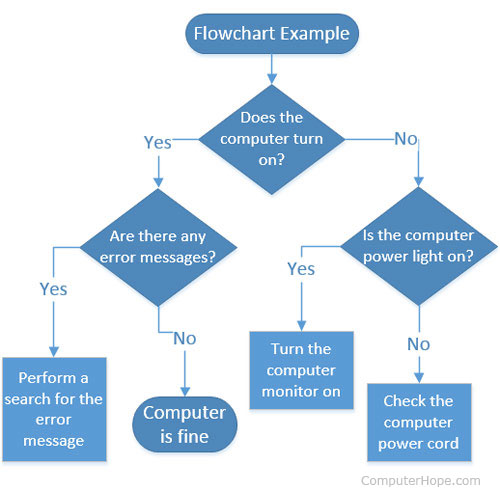

#### Film Default
Maak een methode FilmRuntime() die 3 parameters accepteert:

1. Een string die de naam van de film bevat
2. Een integer die duur in minuten van de film bevat
3. Een enum-type die het genre van de film bevat (Drama, Actie, enz.)

Indien de duur van de film niet wordt meegeven wordt een standaard lengte van 90 minuten ingesteld. Indien het genre niet wordt meegeven dan wordt deze default op Onbekend ingesteld.

De methode geeft niets terug maar toont eenvoudigweg de film op het scherm, gevolgd door z’n duur en genre in volgende formaat.


```text
The Matrix (120minuten, Actie)
```

Toon aan in je main dat de methode werkt met zowel 1, 2 als 3 parameters. Toon ook aan dat je met ‘named arguments’ de methode kan aanroepen.

#### Opwarmers met geavanceerde methoden
Zorg ervoor dat de opwarmers vooran deze reeks oefeningen steeds minstens 1 optionele parameter hebben. Roep deze methoden aan via named parameters.


#### Afsluiter

Dit is een goede oefening om te testen of je alle leerstof van de voorbije hoofdstukken goed beheerst.



Maak een multitool-applicatie die wanneer deze opstart aan de gebruiker een menu toont. Afhankelijk van de input van de gebruiker zal er vervolgens een ander stuk uitgevoerd worden. De verschillende keuzes zijn (de gebruiker voert een cijfer in!):

* **Menuitem 1 - Rekenmachine**. Indien dit gekozen wordt zal het programma eerst 2 getallen aan de gebruiker vragen, gevolgd door een keuzemenu waarop de gebruiker een operator kan kiezen (``+,-,*,/,%``). Het programma toont dan het resultaat indien de operator op de twee ingevoerde getallen wordt uitgevoerd. Wanneer de uitkomst negatief is dan zal de uitkomst in het rood worden getoond. 
* **Menuitem 2 - Password tester:** Vraag aan de gebruiker z'n paswoord. Indien dit gelijk is aan "TrumpSux" zal er een groene tekst "Toegelaten" verschijnen. Zoniet een rode "Verboden" tekst.
* **Menuitem 3 - Recyclage:** Kies eender welk programma dat je in dit of vorig hoofdstuk hebt gemaakt waarin je input aan de gebruiker ook verwerkt. Plaats dit programma achter dit menuitem
* **Menuitem 4 - Computersolver :** Implementeer volgende flowchart 

. 
