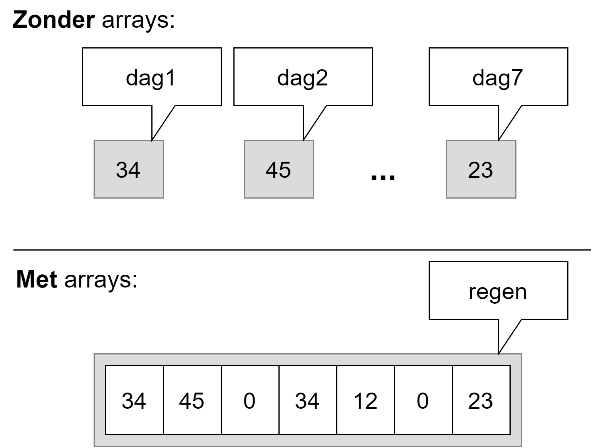
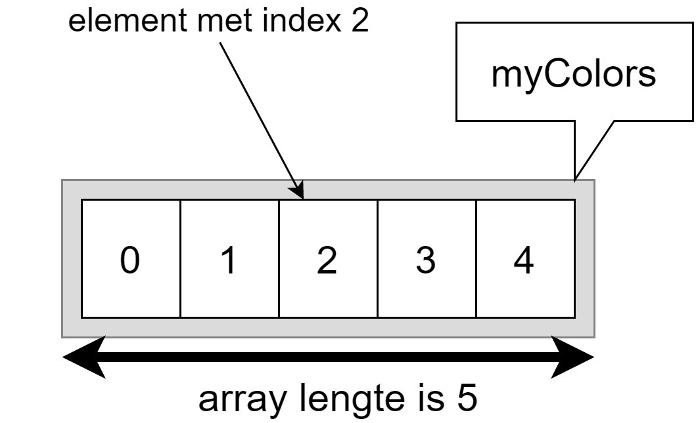

# Arrays

Arrays zijn een veelgebruikt principe in vele programmeertalen. Het grote voordeel van arrays is dat je één enkele variabele kunt hebben die een grote groep waarden voorstelt van eenzelfde type. Hierdoor wordt je code leesbaarder en eenvoudiger in onderhoud. Arrays zijn een zeer krachtig hulpmiddel, maar er zitten wel enkele venijnige addertjes onder het gras.

Op papier zijn arrays eenvoudig...helaas programmeren we niet (of zelden) op papier. In essentie is een array niets meer dan **een verzameling variabelen van hetzelfde type** (bijvoorbeeld een verzameling ints, doubles of chars). Deze waarden kunnen benaderd worden via 1 enkele variabele, de array zelf. Door middel van een *index* kan ieder afzonderlijk element uit de array aangepast of uitgelezen worden.

Een nadeel van arrays is dat, eens we de lengte van een array hebben ingesteld, deze lengte niet meer kan veranderd worden. In het hoofdstuk 12 zullen we leren werken met lists en andere collections die dit nadeel niet meer hebben.

De nadelen zullen we echter met plezier erbij nemen wanneer we programma's beginnen schrijven die werken met véél data van dezelfde soort:  eenvoudigweg kan je stellen dat van zodra je 3 of meer variabelen hebt die dezelfde soort data bevatten (en dus van hetzelfde datatype zijn), een array bijna altijd de oplossing zal zijn.

## Nut van arrays

Stel dat je de dagelijkse neerslag wenst te bewaren om zo later de gemiddelde regen te berekenen. Dit kan je zonder arrays eenvoudig:

```java
int dag1 = 34;
int dag2 = 45;
int dag3 = 0;
int dag4 = 34;
int dag5 = 12;
int dag6 = 0;
int dag7 = 23;
```

Als we je nu vragen om de gemiddelde neerslag te berekenen dan krijg je al een redelijk lang statement:


```java
double gemiddelde = (dag1+dag2+dag3+dag4+dag5+dag6+dag7)/7.0;
```

Maar wat als je plots de neerslag van een heel jaar, 365 dagen, wenst te bewaren. Of een hele eeuw? Of een millennium?! Dat is niet werkbaar zonder een nieuw concept, dat van arrays, te introduceren. Van zodra je een bepaalde soort informatie hebt die je veelvuldig wenst te bewaren dan zijn arrays dus de oplossing.


Voorgaande lijst van 7 aparte variabelen kunnen we eenvoudiger definiëren met 1 array (we bespreken de details verderop), genaamd ``regen``:


```java
int[] regen = {34, 45, 0, 34, 12, 0, 23}; 
```





Het gemiddelde berekenen kan dan als volgt:


```java
double gemiddelde = (regen[0]+regen[1]+regen[2]+regen[3]+regen[4]+regen[5]+regen[6])/7.0;
```

Dat lijkt niet veel beter, integendeel, we zitten nu ook nog met een hoop vierkante haakjes (``[]``). 

De kracht van arrays komt nu: het getal tussen die vierkante haakjes (de index) kan je als een variabele beschouwen en dus ook dynamisch genereren in een loop. Volgend voorbeeld toont hoe we bijvoorbeeld een langere array van elementen met een for-loop overlopen om de som van alle elementen te berekenen:

```java
int[] regen = {34, 45, 0, 34, 12, 0, 23, 7 , 20, 34 , 7 , 42}; //aanmaken array
double som = 0;
for(int i = 0; i<regen.Length;i++)
{
    som += regen[i]; //element per element uit array optellen
}
double gemiddelde = som/regen.Length;
```





Sorry dat we weer even in het diepe water zijn gedoken. Het leek ons nuttig om even het totaalplaatje van arrays alvast uit de doeken te doen, zodat je snapt waarom er hier zo enthousiast over arrays wordt gedaan. 

A propos, kijk eens achterom! Schrik je van hé. Je hebt al een aardige weg afgelegd als we vergelijken met de eerste keer toen ik je in het zwembad gooide. Herinner je je nog dat ik volgende code liet zien. En ik je vervolgens moest gerust stellen?

```java
namespace Demo1
{
    internal class Program
    {
        static void Main(string[] args)
        {
            Console.WriteLine("Hello World!");
            // enz.
```

Alles wordt kinderspel, als je maar lang genoeg met iets bezig bent. Zelfs de code die we net toonden met die arrays zou je niet meer zo erg mogen afschrikken als die eerste keer. Ok, er staan wat nieuwe termen tussen, maar al bij al zouden de grote lijnen van het algoritme en de werking ervan duidelijk moeten zijn.

Blijf dus maar hier lekker in het diep dobberen en ontdek verder waarom arrays zo'n krachtig concept zijn.



## Werken met arrays

### Arrays declareren
Een array creëren (declareren) kan op verschillende manieren.

#### Manier 1
De eenvoudigste variant is deze waarbij je een array variabele aanmaakt, maar deze nog niet initialiseert (i.e. je maakt enkel een identifier in aan). De syntax is als volgt:


```java
type[] arraynaam;
```
Type kan dus eender welk bestaand datatype zijn dat je reeds kent. De [] (vierkante haken of *square brackets*) duiden aan dat het om een array gaat.

Voorbeelden van array declaraties kunnen dus bijvoorbeeld zijn:
```java
int[] verkoopCijfers;
double[] gewichtHuisdieren;
bool[] examenAntwoorden;
ConsoleColor[] mijnKleuren;
```

Op dit punt bestaan de arrays nog niet echt. **Hun lengte ligt nog niet vast** en in het geheugen is enkel een klein stukje geheugen gereserveerd voor een referentie (wat we zo meteen gaan uitleggen).


Stel dat je een array van strings wenst waarin je verschillende kleuren zal plaatsen dan schrijf je:


```java
string[] myColors;
```
Vervolgens kunnen we later waarden toekennen aan de array:

```java
string[] myColors;
myColors = {"red", "green", "yellow", "orange", "blue"};
```

Je array zal vanaf dit punt **een lengte van 5 hebben en kan niet meer groeien of krimpen**.


#### Manier 2
Indien je ogenblikkelijk waarden wilt toekennen (*initialiseren*) tijdens het aanmaken van de array zelf dan mag dit ook als volgt:


```java
string[] myColors = {"red", "green", "yellow", "orange", "blue"};
```

Ook hier zal vanaf dit punt je array een vaste lengte van 5 elementen hebben. 

Merk op dat deze manier dus enkel werkt indien je reeds weet welke waarden in de array moeten. In manier 1 kunnen we perfect een array aanmaken en pas veel later in het programma ook effectief waarden toekennen (bijvoorbeeld door ze stuk per stuk door een gebruiker te laten invoeren).


#### Manier 3
Nog een andere manier om arrays aan te maken is de volgende, waarbij je aangeeft hoe groot de array moet zijn, zonder reeds effectief waarden toe te kennen:

```java
string[] myColors;
myColors = new string[5];
```

Uiteraard kan dit ook in 1 stap:


```java
string[] myColors = new string[5];
```
We geven hier aan dat de array vanaf z'n prille bestaan 5 elementen kan bevatten. Deze elementen zullen allemaal de defaultwaarde van hun datatype krijgen. In het geval van ``string`` hier zal de array dus 5 lege string-elementen bevatten (``""`` of ``string.Empty``).


Ook hier geldt dat de lengte vanaf dan vastligt en niet meer kan veranderen.



### Elementen van een array aanpassen en uitlezen
Van zodra er waarden in een array staan of moeten bijgeplaatst worden kan je deze benaderen met de zogenaamde **array accessor** notatie. Deze notatie is heel eenvoudigweg de volgende:


```java
myColors[2]; //element met index 2
```

We plaatsen de naam van de array, gevolgd door vierkante haakjes waarbinnen een getal , 2 in dit voorbeeld, aangeeft het hoeveelste element we wensen te benaderen (lezen en/of schrijven). Deze nummering start vanaf 0.


**De index van een C#-array start steeds bij 0.** Indien je dus een array aanmaakt met lengte 5 dan heb je de indices 0 tot en met 4.









**Veelgemaakte fouten bij arrays gebeuren op de lengte en indexering ervan**

Het gebeurt vaak dat beginnende programmeurs verward geraken omtrent het aanmaken van een array aan de hand van de lengte en het indexeren erna. Maar niet getreurd, ik zal je hier extra tips geven.

De regels zijn duidelijk:
* Bij het maken van een array is de lengte van een array gelijk aan het aantal elementen dat er in aanwezig is. *Dus een array met 5 elementen heeft als lengte 5.*
* Bij het schrijven en lezen van individuele elementen uit de array (zie hierna) gebruiken we een indexering die start bij **0**. Bijgevolg is **4** de index van het laatste element in een array met **lengte 5**.




#### Lezen

We weten nu hoe we individuele waarden in een array kunnen benaderen. Ze gebruiken is  exact hetzelfde zoals we in het verleden al met eender welke andere variabele hebben gedaan. Het enige verschil is dat de identifier vierkante haken met een index in bevat om aan te geven welke element we nodig hebben van de array.

Wanneer je dus het tweede element van een array wenst te gebruiken kan dit bijvoorbeeld als volgt:


```java
Console.WriteLine(myColors[1]);
```

of ook


```java
string kleurkeuze = myColors[1];
```

of zelfs


```java
if(myColors[1] == "pink")
```

Kortom, alles wat je al kon, kan ook met arrays. Je kan ze zelfs als parameters aan methoden meegeven of terugkrijgen (zie verder). **De individuele elementen in een array zijn gewoon variabelen** (enkel hun naamgeving is gekoppeld aan die van de array en de index van het element in de array).


Een array proberen te tonen als volgt gaat niet:


```java
Console.WriteLine(myColors);
```

De enige manier alle elementen van een array te tonen is door manueel ieder element individueel naar het scherm te sturen. Bijvoorbeeld:

```java
for(int i = 0 ; i<myColors.Length;i++)
{
    Console.WriteLine($"{myColors[i]}");
}
```



Stel dat we een array van getallen hebben, dan kunnen we bijvoorbeeld 2 waarden uit die array optellen en opslaan in een andere variabele als volgt:

```java
int[] numbers = {5, 10, 30, 45};
int som = numbers[0] + numbers[1];
```
De variabele som zal dan vervolgens de waarde 15 bevatten (5+10).

Stel dat we *alle* elementen uit de array ``numbers`` met 5 willen verhogen, dan kunnen we schrijven:

```java
int[] numbers = {5, 10, 30, 45};
numbers[0] += 5;
numbers[1] += 5;
numbers[2] += 5;
numbers[3] += 5;
```

Maar eigenlijk zijn we dan het voordeel van arrays niet aan het gebruiken. Met loops maken we bovenstaande oplossing beter zodat deze zal werken, ongeacht het aantal elementen in de array:

```java
for(int teller = 0; teller < numbers.Length; teller++)
{
    numbers[teller] += 5;
}
```


Zoals je merkt zijn loops en arrays dikke vrienden.



#### Schrijven
Ook schrijven van waarden naar een array gebruikt dezelfde notatie. Enkel moet je dus deze keer de array accessor-notatie links van de toekenningsoperator plaatsen. Stel dat we bijvoorbeeld de waarde van het eerste element uit de ``myColors`` array willen veranderen van ``red`` naar ``indigo``, dan gebruiken we volgende notatie:


```java
myColors[0] = "indigo";
```
Als we bij aanvang nog niet weten welke waarden de individuele elementen moeten hebben in een array, dan kunnen we deze eerst definiëren, en vervolgens individueel toekennen:

```java
string[] myColors;
myColors = new string[5];
// ...
myColors[0] = "red";
myColors[1] = "green";
myColors[2] = "yellow";
myColors[3] = "orange";
myColors[4] = "blue";
```


Een veel gestelde vraag wanneer een programmeur het nut van arrays nog niet 100% ziet is het volgende. Stel dat je deze code hebt;

```java
int dag1 = 34;
int dag2 = 45;
int dag3 = 0;
int dag4 = 34;
int dag5 = 12;
int dag6 = 0;
int dag7 = 23;
```

*"Kan ik die namen (dag1, dag2, enz.) met een loop genereren/bereiken zodat ik iets kan doen als volgt?"* **OPGELET! Hier komt een zeer fout voorbeeld aan...**
```text
for(int i=1; i<=7; i++)
    dagi = ...
```

**Dat gaat niet!** Van zodra je van plan bent om variabele-namen "dynamisch" in je code te proberen aan te roepen, moeten er tal van alarmbelletjes afgaan. De kans is dan héél groot dat je probleem beter met een array wordt opgelost dan met een boel variabelen met soortgelijke namen.



### De lengte van de array te weten komen

Soms kan het nodig zijn dat je in een later stadium van je programma de lengte van je array nodig hebt. De ``Length``-eigenschap van iedere array geeft dit weer. Volgend voorbeeld toont dit:

```java
string[] myColors = {"red", "green", "yellow", "orange", "blue"};
Console.WriteLine($"Length of array = {myColors.Length}" );
```
De ``Length``-eigenschap wordt vaak gebruikt in for/while loops waarmee je de hele array wenst te doorlopen. Door de ``Length``-eigenschap te gebruiken als grenscontrole verzekeren we er ons van dat we nooit buiten de grenzen van de array zullen lezen of schrijven:

```java
//Alle elementen van een array tonen
for (int i = 0; i < getallen.Length; i++)
{
    Console.WriteLine(getallen[i]);
}
```


Elementen benaderen buiten de range van een array geeft erg dikke errors. Het jammerlijke is dat VS dit soort subtiele 'out of range' bugs niet kan detecteren tijdens het compileren. Je zal ze pas ontdekken bij de uitvoer. Volgende code zal perfect gecompileerd worden, maar bij de uitvoer zal er op lijn 2 een error verschijnen en het programma zal stoppen:

```java
string[] myColors = { "red", "green", "yellow", "orange", "blue" };
Console.WriteLine(myColors[9]);
```

Dit zal resulteren in een *"Out of Range exception".

Hackers misbruiken dit soort fouten in code om toegang tot delen van het geheugen te krijgen waar ze eigenlijk niet mochten zijn. Dit zijn zogenaamde *buffer overflow attacks*.






Sorry dat ik je al weer lastig val. Maar ik wil je nog eens extra goed naar bovenstaande fout (*exception*) laten kijken. Prent die**Out of Range fout** goed in je hoofd. 

Deze fout zegt exact wat er mis is: je probeert elementen in een array te benaderen die niet bestaan omdat je buiten het bereik (*range*) van de array bent gegaan. Het is hetzelfde als wanneer ik tegen m'n personeel zeg "ga jij de muur alvast metsen op de zesde verdieping (``etage[5]``)" terwijl we een flatgebouw met maar 3 verdiepingen hebben (``.Length`` is dus 3). 



### Volledig voorbeeldprogramma met arrays

Met al de voorgaande informatie is het nu mogelijk om vlot complexere programma's te schrijven, die veel data moeten kunnen verwerken. Meestal gebruikt men een for-loop om een bepaalde operatie over de hele array toe te passen.

Het volgende programma zal een array van integers aanmaken die alle gehele getallen van 0 tot 99 bevat. Vervolgens zal ieder getal met 3 vermenigvuldigd worden. Finaal tonen we enkel die getallen die een veelvoud van 4 zijn na de bewerking.

```java
//Array aanmaken
int[] getallen = new int[100]; 
//Array vullen
for (int i = 0; i < getallen.Length; i++)
{
    getallen[i] = i;
}
//Alle elementen met 3 vermenigvuldigen
for (int i = 0; i < getallen.Length; i++)
{
    getallen[i] = getallen[i] * 3;
}
//Enkel veelvouden van 4 op het scherm tonen
for (int i = 0; i < getallen.Length; i++)
{
    if(getallen[i] % 4 == 0)
        Console.WriteLine(getallen[i]);
}
```


### Opstartparameters via args

Zoals al in het vorige hoofdstuk beloofd wordt hopelijk nu ook duidelijk(er) wat ``string[] args`` wil zeggen in je ``Main``. Iedere ``Main`` heeft volgende methode-signatuur:


```java
static void Main(string[] args)
```

De ``args`` arrays kunnen we in ons programma uitlezen om eventuele opstartparameters te verwerken die de gebruiker meegaf aan het programma. We hebben dit nog nooit *in-depth* bekeken, maar laten we eens kijken hoe je dit doet. Volg daarom volgende stappenplan:

1. Maak een nieuw console-project aan genaamd ``argstest``.
2. Voeg volgende code toe in je ``Main``:
```java
for (int i = 0; i < args.Length; i++)
{
    Console.WriteLine(args[i]);
}
```
3. Compileer je programma. Run het gerust al eens, je zal zien dat het programma nog niet veel doet. Waarom? Omdat we geen opstartparameters hebben meegegeven. Laten we dat oplossen!
4. Ga via je verkenner naar je project-folder (vanuit VS kan dit snel door in de Solution Explorer te rechterklikken op je project en dan de optie "Open folder in Explorer" te kiezen).
5. Open de ``bin`` folder, en open daarin dan de  ``debug`` folder, gevolgd door de ``net6.0`` folder (die laatste kan mogelijk anders zijn, afhankelijk van welke .NET versie je gebruikt). Hier staat je gecompileerde programma. In principe kan je hier dubbelklikken op je applicatie, maar dat zal niet veel doen, daar we nog steeds geen opstartparameters hebben meegegeven.
6. Nu goed opletten: klik in je verkenner bovenaan in de adresbalk, rechts van de tekst (niet er op). Je kan nu zelf iets intypen. Typ nu ``cmd`` in en druk enter.
7. Cool he. Je zit nu in een shell in de juiste folder.
8. Nu kan je je programma runnen mét opstartparameters. Kijk maar eens wat er gebeurt als je typt: ``argstest ziescherp is cool``

Inderdaad. De spaties gelden als "splitsing" tussen ieder argument. En dus ieder woord zal een apart element in de ``args`` array worden. Je zou nu bijvoorbeeld code kunnen schrijven die iets doet afhankelijk van de parameter, etc.
