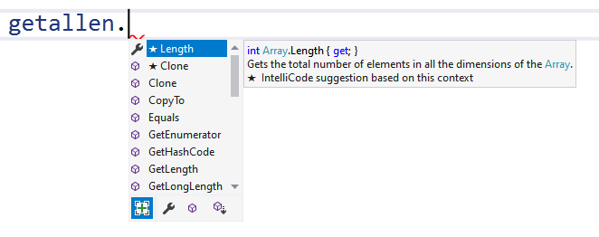

## Nuttige array methoden

Net zoals we hebben gezien dat de Math-klasse een heleboel nuttige methoden in zich heeft, zo heeft ook iedere array een aantal methoden waar handig gebruik van gemaakt kan worden.


Om deze methoden in C# 9.0 of ouder te kunnen gebruiken moet je bovenaan je file de volgende lijn toevoegen: ``using System.Linq;``. Vanaf C# 10 hoeft dit niet omdat er zoiets bestaat als *implicit usings*, een concept dat we niet gaan bespreken in dit boek.



```java
Console.WriteLine(getallen.Sum());
```


Wanneer je een array hebt gemaakt kan je met de IntelliSense van VS bekijken wat je allemaal kan doen met de array:




Al deze methoden hier beschrijven zal ons te ver nemen. De volgende methoden zijn echter zeer handig om te gebruiken:

``Max()``, ``Min()``, ``Sum()`` en ``Average()``.

Volgende code geeft bijvoorbeeld het grootste getal terug uit een array genaamd "leeftijden":


```java
int oudsteleeftijd = leeftijden.Max();
```
