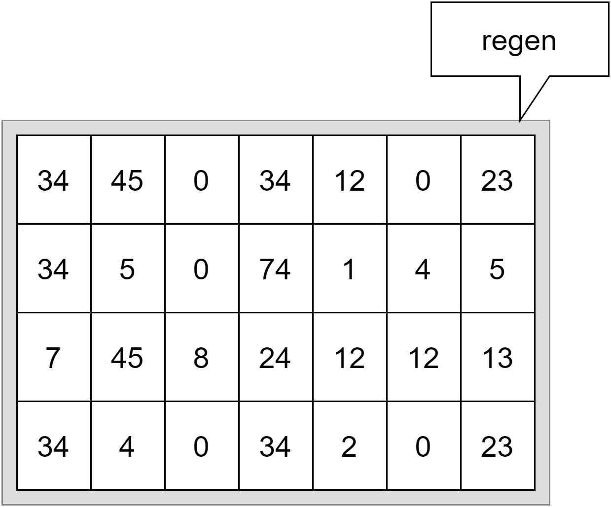
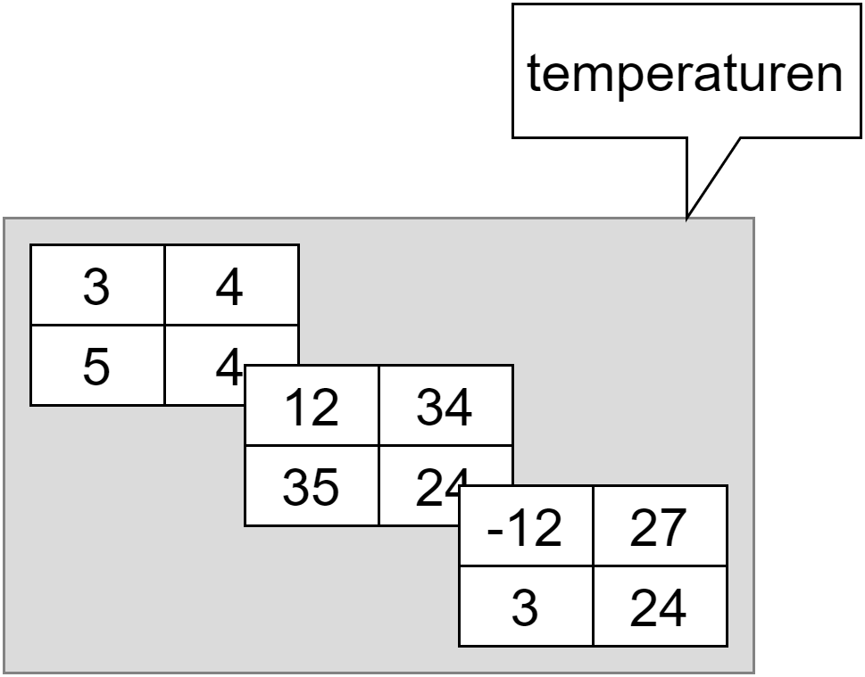

## Meer-dimensionale arrays
Voorlopig hebben we enkel met zogenaamde 1-dimensionale arrays gewerkt. Je kan echter ook meerdimensionale arrays maken. Denk maar aan een n-bij-m array om een matrix voor te stellen. Ik bespreek meerdimensionale arrays maar kort om de eenvoudige reden dat je die in de praktijk minder vaak zal nodig hebben.

Stel je het voorbeeld aan het begin van dit hoofdstuk voor, waarin we de regenval gedurende 7 dagen wilden meten. Wat als we dit gedurende 4 weken wensen te doen, maar wel niet alle data in één lange array willen plaatsen? We zouden dan een 2-dimensionale array kunnen maken als volgt:

```csharp
int[,] regen = 
            {
                {34,45,0,34,12,0,23 },
                {34,5,0,74,1,4,5 },
                {7,45,8,24,12,12,13 },
                {34,4,0,34,2,0,23 }
            };
```


<!--{width=60%}-->


De arrays die we nu behandelen zullen steeds "rechthoekig" zijn. Daarmee bedoelen we dat ze steeds per rij of kolom evenveel elementen zullen bevatten als in de andere rijen of kolommen. 


Arrays die per rij of kolom een andere hoeveelheid elementen hebben zijn zogenaamde **jagged arrays**, welke we verderop kort zullen bespreken.



### n-dimensionale arrays aanmaken
Door een komma tussen rechte haakjes te plaatsen tijdens de declaratie van een array, kunnen we meer-dimensionale arrays maken. 

Bijvoorbeeld om een 2D array te maken schrijven we:


```csharp
string[,] boeken;
```

Een 3D-array:

```csharp
short[,,] temperaturen;
```
(enz.)


Ja, dit kan dus ook een 10-dimensionale array aanmaken. Kan handig zijn als je een fysicus bent die rond de supersnaartheorie onderzoek doet.

```csharp
int[,,,,,,,,,] jeBentGek;
```
Ja, 11 kan ook als je meer in de M-theorie gelooft. En zelfs 26 moest de bosonische snaartheorie meer je ding zijn:

```csharp
int[,,,,,,,,,,,,,,,,,,,,,,,,,] jeBentNogGekker;
```




### Initialisatie

Ook om nu effectief een array aan te maken gebruiken we de komma-notatie, alleen moeten we nu ook de effectieve groottes aangeven. Voor een 5 bij 10 array bijvoorbeeld schrijven we (merk op dat dit dus een 2D-array is):


```csharp
int[,] matrix = new int[5,10];
```

Om een array ook onmiddellijk te initialiseren met waarden gebruiken we de volgende uitdrukking :

```csharp
string[,] boeken = 
    {
        {"Macbeth", "Shakespeare", "ID12341"},
        {"Before I Get Old", "Dave Marsh", "ID234234"},
        {"Security+", "Mike Pastore", "ID3422134"},
        {"Zie scherp", "Tim Dams", "ID007"}
    };
```

Merk op dat we dus nu een 3 bij 4 array maken maar dat dit dus nog steeds een 2D-array is. Iedere rij bestaat uit 3 elementen. **We maken letterlijk een array van arrays**.

<!-- \newpage -->


Of bij een 3D-array:

```csharp
int[,,] temperaturen = 
    {
        {
            {3,4}, {5,4}
        },
        {
            {12,34}, {35,24}
        },
        {
            {-12,27}, {3,24}
        },
    };
```

Die we als volgt kunnen visualiseren:


<!--{width=60%}-->


Zoals je ziet worden meerdimensionale arrays snel een kluwen van komma's, accolades en haakjes. Probeer dus je dimensies te beperken. Je zal zelden een 3 -of meer dimensionale array nodig hebben. 

De regel is eenvoudig: als je een 7-dimensionale array nodig hebt, is de kans groot dat je een volledig verkeerd algoritme hebt verzonnen ... of dat je nog niet aan hoofdstuk 9 bent geraakt ... of dat je een topwetenschapper in CERN bent. *Choose your reason!*



<!-- \newpage -->


Stel dat we uit de boeken-array de auteur van het derde boek wensen te tonen dan kunnen we schrijven:


```csharp
Console.WriteLine(boeken[2, 1]);
```

Dit zal ``Mike Pastore`` op het scherm zetten.

En bij de temperaturen:


```csharp
Console.WriteLine(temperaturen[2, 0, 1]);
```

Dit zal ``27`` teruggeven. We vragen van de laatste array (``[2]``), daarbinnenin de eerste array (rij ``[0]``) en daarvan het tweede element(kolom ``[1]``).

### Lengte van iedere dimensie in een n-dimensionale matrix

Indien je de lengte opvraagt van een meer-dimensionale array dan krijg je de som van iedere lengte van iedere dimensie. Dit is logisch: in het geheugen van een computer worden arrays altijd als 1 dimensionale arrays voorgesteld. De ``boeken`` array zal lengte 12 hebben (3*4) en ``temperaturen`` toevallig ook (3x2x2). 

Je kan echter de lengte van iedere aparte dimensie te weten komen met de ``.GetLength()`` methode die iedere array heeft. Als parameter geef je de dimensie mee waarvan je de lengte wenst:

```csharp
int arrayRijen = boeken.GetLength(0); //geeft 4 
int arrayKolommen = boeken.GetLength(1); //geeft 3
```

Het aantal dimensies van een array wordt trouwens weergegeven door de ``.Rank`` eigenschap die ook iedere array heeft. Bijvoorbeeld:

```csharp
Console.WriteLine(boeken.Rank); //geeft 2
Console.WriteLine(temperaturen.Rank); //geeft 3
```

Willen we dus de lengte van iedere dimensie van bijvoorbeeld de ``temperaturen`` array op het scherm krijgen dan kan dat als volgt:

```csharp
for (int i = 0; i < temperaturen.Rank; i++)
{
    Console.WriteLine(temperaturen.GetLength(i));
}
```


