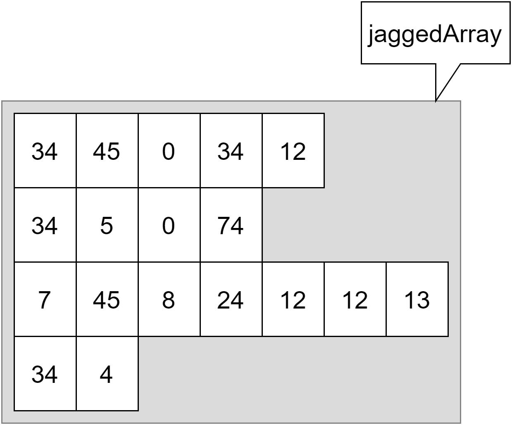

### Jagged Arrays

Jagged arrays (letterlijk *gekartelde arrays*) zijn *arrays van arrays* maar van verschillende lengte. De arrays die we totnogtoe zagen moesten steeds rechthoekig zijn. Jagged arrays, zoals de naam doet vermoeden, hoeven dat niet te zijn:




#### Jagged arrays aanmaken

Het grote verschil bij het aanmaken van bijvoorbeeld een 2D jagged array is het gebruik van de vierkante haken (en dus niet bijvoorbeeld ``tickets[,]``):

```java
double[][]tickets=
    {
      new double[] {3.0, 40, 24},
      new double[] {123 , 31.3 },
      new double[] {2.1}
    };

```


#### Indexering bij jagged arrays

De indexering blijft dezelfde, maar ook hier dus niet met komma's, maar met vierkante haken (bijvoorbeeld ``tickets[0][1]``).

Uiteraard moet je er wel rekening mee houden dat niet eender welke index binnen een bepaalde sub-array zal werken, het is dan ook aangeraden om zeker de ``GetLength``-methode te gebruiken om de sub-arrays op hun lengte te bevragen.
