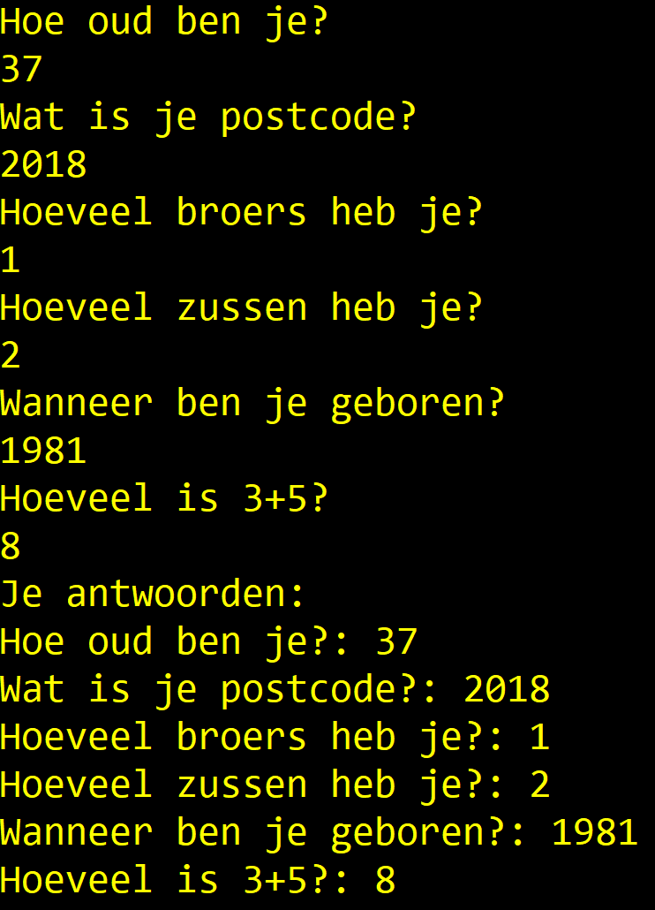
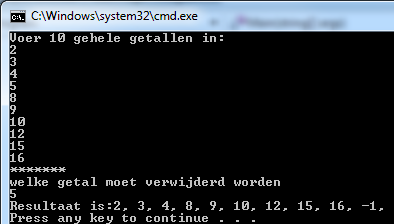

### Arrays


Een aantal oefeningen is geïnspireerd op oefeningen van [Exercism.io](https://exercism.io/tracks/csharp/exercises).



#### Opwarmers

1.	Er worden 20 getallen ingelezen. De getallen worden in omgekeerde volgorde afgedrukt.
2.	Er worden 20 getallen ingelezen. De getallen worden 1 plaats naar voor verschoven afgedrukt, d.w.z. eerst het tweede ingelezen getal, dan het derde ingelezen getal, dan het vierde ingelezen getal , ... , dan het laatste ingelezen getal en tenslotte het eerste ingelezen getal.
3.	Er worden 20 getallen ingelezen. De getallen worden 3 plaatsen naar achter verschoven afgedrukt, d.w.z. eerst het derde laatste ingelezen getal, dan het voorlaatste ingelezen getal, dan het laatste ingelezen getal, dan het eerste ingelezen getal, dan het tweede ingelezen getal en tenslotte het vierde laatste ingelezen getal.
4.	Er worden 20 getallen ingelezen. De getallen worden geroteerd afgedrukt over een aantal elementen x, waarbij x eerst nog wordt ingelezen. Eerst wordt dus het x+1de ingelezen getal afgedrukt, dan het x+2de ingelezen getal, ... , dan het laatste ingelezen getal, dan het eerste ingelezen getal, ... en tenslotte het xde ingelezen getal.
5.	Een rij van 100 getallen wordt ingelezen. Druk de inhoud van de rij af in 3 kolommen. De getallen worden gerangschikt rij per rij.
6.	Een rij van 100 getallen wordt ingelezen. Druk de inhoud van de rij af in 3 kolommen. De getallen worden gerangschikt kolom per kolom
7.	Een rij van 100 gehele getallen wordt ingelezen. Maak een tweede rij die bestaat uit de elementen van de eerste rij in omgekeerde volgorde.
8.	Een rij van 100 gehele getallen wordt ingelezen. Wissel de inhoud van de rij om.
9.	Een rij van 100 gehele getallen wordt ingelezen. Verschuif de inhoud van de rij 1 plaats naar achter. Het laatste getal moet eerst komen.
10.	Een rij van 100 gehele getallen wordt ingelezen. Maak een tweede rij die bestaat uit de elementen van de eerste rij maar 1 plaats naar achter verschoven . Het laatste getal van de eerste rij moet eerst komen in de tweede rij.
11.	Een rij van 100 gehele getallen wordt ingelezen. Maak een tweede rij die bestaat uit de elementen van de eerste rij maar 3 plaatsen naar voor verschoven. Het eerste getal van de eerste rij moet derde laatst komen in de tweede rij, het tweede getal van de eerste rij moet voorlaatst komen in de tweede rij en het derde getal van de eerste rij moet laatst komen in de tweede rij.
12.	Een rij van 100 gehele getallen wordt ingelezen. Verschuif de inhoud van de rij 3 plaatsen naar voor. Het eerste getal moet derde laatst komen, het tweede, voorlaatst en het derde, laatst.
13.	Gegeven is een rij van 50 getallen. Maak een tweede rij waarin geen dubbels voorkomen.
14.	Gegeven is een gesorteerde rij van 50 getallen. Maak een tweede (eveneens gesorteerde) rij waarin geen dubbels voorkomen.
15.	Een rij van maximaal 100 gehele getallen met afsluitwaarde 32767 wordt ingelezen. Druk het maximum van de rij af, het aantal keer dat het voorkwam en de plaats waar het de eerste keer voorkwam.
16.	Een rij van maximaal 100 gehele getallen met afsluitwaarde 32767 wordt ingelezen. Druk het minimum van de rij af, het aantal keer dat het voorkwam en de plaats waar het de laatste keer voorkwam.
17.	Een rij gehele getallen met afsluitwaarde 32767 wordt ingelezen. Het aantal ingelezen getallen is onbeperkt, maar er zullen maximaal 100 verschillende getallen worden ingelezen. Druk af hoeveel verschillende getallen ingelezen werden. 
18.	Druk alle priemgetallen kleiner dan 100.000 af. Maak gebruik van het algoritme van Eratosthenes.

#### Vraag Array
Maak een array die 6 strings kan bevatten. Ieder element van de array bevat een vraag (naar keuze te verzinnen) als string waar de gebruiker met een getal op moet antwoorden.
Maak een array aan die tot 6 ints kan bevatten. Lees 1 voor 1 de vraag uit de string-array uit en toon deze op het scherm. Lees vervolgens het antwoord uit dat de gebruiker intypt en bewaar dit als int in de 2e array.

Na de 6 vragen toon je vervolgens de vragen opnieuw met achter iedere vraag het antwoord van de gebruiker.




#### Array Zoeker

Maak een programma dat eerst weer aan de gebruiker om 10 waarden vraagt die in een array worden gezet.

Vervolgens vraagt het programma welke waarde verwijderd moet worden. Wanneer de gebruiker hierop antwoordt met een nieuwe waarde dan zal deze nieuw ingevoerde waarde in de array gezocht worden. Indien deze gevonden wordt dan wordt deze waarde uit de array verwijderd en worden alle waarden die erachter komen met een plaatsje naar links opgeschoven, zodat achteraan de array terug een lege plek komt.

Deze laatste plek krijgt de waarde -1.

Toon vervolgens alle waarden van de array.

Indien de te zoeken waarde meer dan 1 keer voorkomt, wordt enkel de eerst gevonden waarde verwijderd.



#### LeveringsBedrijf
Maak een programma voor een koeriersbedrijf.  Maak een array die 10 postcodes bevat (zelf te kiezen) van gemeenten waar het bedrijf naar levert. Maak een tweede array die de prijs bevat per kg van iedere respectievelijke gemeente.  Het eerste element  van deze array bevat dus de prijs/kg om naar de gemeente die als eerste in de array met postcodes staat.

Vraag aan de gebruiker een postcode en het gewicht van het pakket. Vervolgens wordt de prijs opgezocht voor die gemeente en wordt deze berekend gegeven het ingegeven gewicht.

Indien het bedrijf niet levert aan de ingetypte postcode dan wordt een foutmelding weergegeven.


```text
Geef gewicht pakket
45
Naar welke postcode wenst u dit pakket te versturen?
2020
Dit zal 9630 euro kosten.
```

#### Bob

Kan je "Bob" programmeren die als volgt werkt:

> Bob is a lackadaisical teenager. In conversation, his responses are very limited.
>Bob answers 'Sure.' if you ask him a question.
>He answers 'Whoa, chill out!' if you yell at him.
>He answers 'Calm down, I know what I'm doing!' if you yell a question at him.
>He says 'Fine. Be that way!' if you address him without actually saying anything.
>He answers 'Whatever.' to anything else."

Bekijk steeds de laatste 2 tekens die de gebruiker invoert om de response van Bob te bepalen. 

Kan je een gesofisticeerdere bot maken? 


``myInputstring.Contains(somestring)`` geeft een ``bool`` terug indien ``somestring`` voorkomt in de variabele ``myInputstring`` van het type ``string``.



Gebruik een array om de antwoorden in te bewaren. 

#### PRO: Bob++

Kan je met een array eerdere vragen van de gebruiker bewaren om zo complexere antwoorden te genereren?

#### Hamming distance
De *hamming distance* is het aantal tekens dat twee reeksen verschillen indien we ieder element vergelijken op dezelfde plaats in de andere reeks.

Maak een programma dat aan de gebruiker vraagt om twee DNA strings in te voeren (een reeks bestaande uit de letters G, A, C & T). Beide reeksen moeten even lang zijn.

Bereken de hamming distance tussen beide reeksen.

De hamming distance van volgende twee DNA strings is 7, omdat er 7 elementen in beide strings staan die niet gelijk zijn aan mekaar op dezelfde plek (aangeduid met ``^``).

```
GAGCCTACTAACGGGAT
CATCGTAATGACGGCCT
^ ^ ^  ^ ^    ^^
```

#### Password generator (PRO)
Ontwerp een consoletoepassing waarmee je een wachtwoord genereert voor een gebruiker. Het wachtwoord is opgebouwd uit:

de 2 eerste letters van de familienaam: de 1ste letter is een hoofdletter, de 2de letter is een kleine letter. 
Daarna worden de 2 letters gewisseld;
het zonenummer van het telefoonnummer zonder de 0;
het eerste cijfer van de postcode in het kwadraat.

> Gebruik de ``ToCharArray()`` methode die je op een string kunt toepassen, zoals hier getoond: ``char[] chars = myEpicName.ToCharArray();`` 


Schrijf nooit een paswoord manager die je paswoorden gortdroog als ``string`` bewaard. **Secure code** schrijven is een hele discipline op zich en laat je best nog even links liggen tot je C# goed in de vingers hebt.

