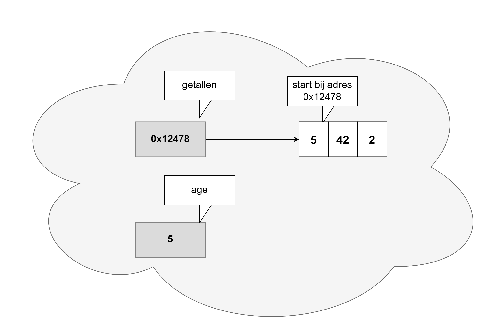

## Geheugengebruik bij arrays

Met arrays komen we voor het eerst iets dichter tot één van de sterktes van C#, namelijk het aspect **referenties**. Vanaf het volgende hoofdstuk zullen we hier ongelooflijk veel mee doen, maar laten we nu alvast eens kijken waarom arrays met referenties werken.

### Reference types en value types

In C# heb je twee soorten variabelen die we nu kort toelichten maar in het volgende hoofdstuk verder zullen uitdiepen:

* **Value** types: deze variabelen bevatten effectief de waarde die de variabele moet hebben. Als we schrijven ``int age = 5`` dan bewaren we de binaire voorstelling voor het geheel getal ``5`` in het geheugen. 
* **Reference** types: deze variabelen bewaren een geheugenadres naar een andere plek in het geheugen waar de effectieve waarde(n) van de variabele te vinden is. Reference types zijn als het ware een wegwijzer en worden ook soms *pointers* genoemd.


Alle datatypes die we tot nog toe zagen (``string`` is een speciaal geval en negeren we om nachtmerries te vermijden) werken steevast *by value*. Momenteel zijn het enkel arrays die we kennen die *by reference* werken in C#. In het volgende hoofdstuk zullen we zien dat er echter nog een hele hoop andere mysterieuze dingen (genaamd *objecten*) zijn die ook *by reference* werken.



### Arrays kopiëren

#### Het probleem als je arrays wilt kopiëren
Arrays worden 'by reference' gebruikt in C#. Dit wil zeggen dat als we schrijven:


```java
int[] getallen = {5,42,2};
int age = 5
```

we in ``getallen`` enkel een geheugenadres bewaren dat wijst naar de plek waar de effectieve waarden staan elders in het geheugen. De afbeelding op volgende pagina geeft dit weer.





Het gevolg van voorgaande is dat volgende code niet zal doen wat je vermoedelijk wenst:

```java
string[] ploegen = {"Beerschot", "Antwerp"};
string[] nieuwePloegen = {"Anderlecht", "Brugge"};
nieuwePloegen = ploegen;
```


De situatie wanneer lijn 2 werd uitgevoerd is de volgende:


Zonder het bestaan van *references* zou je verwachten dat op lijn 3 ``nieuwePloegen`` een kopie krijgt van de inhoud van ``ploegen``. 

De derde lijn(``nieuwePloegen = ploegen;``) zal perfect werken. Wat er echter is gebeurd, is dat we de referentie naar ``ploegen`` ook in ``nieuwePloegen`` hebben geplaatst. **Bijgevolg verwijzen beide variabelen naar dezelfde array, namelijk die waar ``ploegen`` al naar verwees.** We hebben een soort alias gemaakt en kunnen nu op twee manieren de array met de Antwerpse voetbalploegen benaderen. De nieuwe situatie na lijn 3 is dus de volgende geworden:


Als je vervolgens schrijft:


```java
nieuwePloegen[1] = "Beerschot";
```

Dan is dat hetzelfde als onderstaande schrijven daar beide variabele naar dezelfde array-inhoud verwijzen. Het effect zal dus hetzelfde zijn.


```java
ploegen[1] = "Beerschot";
```

En waar staan de ploegen in de nieuwePloegen array (``"Anderlecht"`` en ``"Brugge"``)? **Die array in het geheugen is niet meer bereikbaar** (de garbage collector zal deze ten gepaste verwijderen, wat in hoofdstuk 10 zal toegelicht worden).

Dus, hoe moet je wel te werk gaan? Draai snel deze pagina om !


#### De oplossing als je arrays wilt kopiëren

Wil je  arrays kopiëren dan kan dat **niet** als volgt:

```java
string[] ploegen = {"Beerschot", "Antwerp"};
string[] nieuwePloegen = {"Anderlecht", "Brugge"};
nieuwePloegen = ploegen; //FAIL!!!
```

**Je moet manueel ieder individueel element van de ene naar de andere array kopiëren** als volgt:

```java
for(int i = 0; i < ploegen.Length; i++)
{
    nieuwePloegen[i] = ploegen[i];
}
```


Er is een ingebouwde methode in de ``Array``-bibliotheek (deze bibliotheek zien we in de volgende sectie) die ook toelaat om arrays te kopiëren genaamd ``Copy``. 




Wanneer je met arrays van objecten (zie hoofdstuk 12) werkt dan zal bovenstaande mogelijk niet het gewenste resultaat geven daar we nu ook de individuele referenties van een object kopiëren!



