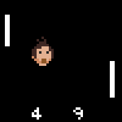

# Object Oriented Programming

Totnogtoe leerden we eigenlijk *gestructureerd programmeren* wat een programmeerparadigma is uit de jaren zestig. Hierbij schrijven we code gebruik makend van methoden, loops en beslissingsstructuren. Op zich blijft dit een erg nuttige manier van programmeren. Wanneer we echter bij complexere applicaties komen dan merken we dat met gestructureerd programmeren we redelijk snel tot minder intuïtieve en soms nodeloos complexe code aanbelanden. 
 
Dat moet dus anders kunnen. Komt u binnen, **Object georiënteerd programmeren** (**OOP**). OOP is een manier van programmeren die voortbouwt op gestructureerd programmeren, maar die toelaat veel krachtigere applicaties te ontwikkelen.

Bij OOP draait alles rond **klassen en objecten** die intern nog steeds gestructureerde code zullen bevatten (loops, methoden en beslissingsstructuren), maar die onze code (hopelijk) een pak overzichtelijker en minder complex gaan maken. Dankzij OOP gaan we onze code meer modulair, leesbaarder en onderhoudsvriendelijker maken én tegelijkertijd zal ze veel krachtiger worden en daardoor complexere zaken eenvoudiger kunnen "oplossen".





Hier zijn we weer!

Ik zet "oplossen" tussen aanhalingstekens. Net zoals alles binnen dit domein ben jij als programmeur uiteindelijk degene die het boeltje moet oplossen. Code, programmeerparadigma's en bibliotheken zijn niet meer dan nuttig gereedschap in jouw arsenaal van programmeertools. Als jij beslist om een hamer als zaag te gebruiken, tja, dan houd ik m'n hart vast voor het resultaat. Dit geldt ook voor de technieken die je nog in dit boek gaat leren: ze zijn "een tool", niets meer. Jij zal ze nog steeds zo optimaal mogelijk moeten leren gebruiken. Uiteraard is het doel van dit boek je zo duidelijk mogelijk het verschil én de bruikbaarheid van de verschillende nieuwe technieken aan te leren.




Toen C# werd ontwikkeld in 2001 was één van de hoofddoelen van de programmeertaal om *"een eenvoudige, moderne, objectgeoriënteerde programmeertaal voor algemene doeleinden"* te worden. **C# is van de grond af opgebouwd met het OOP programmeerparadigma als primaire drijfveer.**

Wanneer we nieuwe programma's in C# ontwikkelden dan zagen we hier reeds bewijzen van. Zo zagen we steeds het keyword ``class`` bovenaan staan, telkens we een nieuw project aanmaakten:
```csharp
namespace WorldDominationTool
{
    internal class Program
    {
```

De klasse ``Program`` zorgt ervoor dat ons programma voldoet aan de C# afspraken die zeggen dat alle C# code in klassen moet staan. 




Duizend mammoeten en sabeltandtijgers! Ik dacht dat ik nu wel mee zou zijn met alles wat C# me zou voorschotelen. Helaas, wolharige neushoorn-kaas, niet dus. Ik ga een voorspelling doen: van alle hoofdstukken in dit boek, wordt dit hoofdstuk hetgene waar je het meest je tanden op gaat stuk bijten. Hou dus vol, geef niet te snel op en kom geregeld hier terug. Succes gewenst!



### Een wereld zonder OOP: Pong
Om de kracht van OOP te demonstreren gaan we een applicatie van lang geleden (deels) herschrijven gebruik makende van de kennis van gestructureerd programmeren. We gaan de arcadehal klassieker "Pong" namaken, waarbij we als doel hebben om een balletje alvast op het scherm te laten botsen. Een rudimentaire oplossing zou de volgende kunnen zijn:

```csharp
Console.CursorVisible = false;
int balX = 20;
int balY = 20;
int VectorX = 2;
int VectorY = 1;
while (true)
{
    //Xvector van richting veranderen aan de randen
    if (balX + VectorX >= Console.WindowWidth || balX+VectorX < 0)
    {
        VectorX = -VectorX;
    }
    balX = balX + VectorX; //X positie updaten
    //Yvector van richting veranderen aan de randen
    if (balY + VectorY >= Console.WindowHeight || balY+VectorY < 0)
    {
        VectorY = -VectorY;
    }
    balY = balY + VectorY; //Y positie updaten
    //Output naar scherm sturen
    Console.SetCursorPosition(balX, balY);
    Console.Write("O");
    System.Threading.Thread.Sleep(50); //50 ms wachten
    Console.Clear();
}
```

Hopelijk begrijp je deze code. Test ze maar eens in een programma. Zoals je zal zien krijgen we een balletje (``"O"``) dat over het scherm vliegt en telkens van richting verandert wanneer het aan de randen van het applicatievenster komt. De belangrijkste informatie zit in de variabelen ``balX``, ``balY`` die de huidige positie van het balletje bevatten. Voorts zijn ook ``VectorX`` en ``VectorY`` belangrijk: hierin houden we bij in welke richting (en met welke snelheid) het balletje beweegt (een zogenaamde bewegingsvector).

#### Extra balletjes?

Dit soort applicatie in C# schrijven met behulp van gestructureerde programmeer-concepten is redelijk eenvoudig. Maar wat als we nu 2 balletjes nodig hebben? Laten we arrays even links laten liggen en het gewoon eens naïef oplossen. Al na enkele lijnen kopiëren merken we dat onze code ongelooflijk rommelachtig gaat worden en we bijna iedere lijn moeten dupliceren:

```csharp
Console.CursorVisible = false;
int balX = 20;
int balY = 20;
int vectorX = 2;
int vectorY = 1;

int bal2X = 10;
int bal2Y = 8;
int vector2X = 2;
int vector2Y = -1;

while (true)
{
    if (balX + vectorX >= Console.WindowWidth || balX+ vectorX < 0)
    {
        vectorX = -vectorX;
    }
    if (bal2X + vector2X >= Console.WindowWidth || bal2X + vector2X < 0)
    {
        vector2X = -vector2X;
    }

    balX = balX + vectorX;
    bal2X = bal2X + vector2X;
    //enzovoort
```

**Bijna iedere lijn code moeten we verdubbelen.** Arrays zouden dit probleem deels kunnen oplossen, maar we krijgen dan in de plaats de complexiteit van werken met arrays op ons bord, wat voor 2 balletjes misschien wat overdreven is én de code ook weer wat minder leesbaar maakt.


### Een wereld met OOP: Pong
Uiteraard zijn we nu eventjes gestructureerd programmeren aan het demoniseren, dit is echter een bekend 21e eeuws trucje om je punt te maken. 

Wanneer we Pong vanuit een OOP paradigma willen aanpakken dan is het de bedoeling dat we werken met klassen en objecten. Net zoals aan de start van dit boek ga ik je ook nu even in het diepe gedeelte van het bad gooien. Wees niet bang, ik zal je er tijdig uithalen (en je zal versteld staan hoeveel code je eigenlijk zult herkennen).

Om Pong in OOP te maken hebben we eerst een klasse nodig waarin we ons balletje gaan beschrijven, zonder dat we al een balletje hebben. En dat ziet er zo uit:

```csharp
class Balletje
{
    //Eigenschappen
    public int X { get; set; }
    public int Y { get; set; }
    public int VectorX { get; set; }
    public int VectorY { get; set; }

    //Methoden
    public void Update()
    {
        if (X + VectorX >= Console.WindowWidth || X + VectorX < 0)
        {
            VectorX = -VectorX;
        }
        X = X + VectorX;


        if (Y + VectorY >= Console.WindowHeight || Y + VectorY < 0)
        {
            VectorY = -VectorY;
        }
        Y = Y + VectorY;
    }

    public void TekenOpScherm()
    {
        Console.SetCursorPosition(X, Y);
        Console.Write("O");      
    }
}
```


De code voor een nieuwe klasse schrijf je best in een apart bestand in je project. Klik bovenaan in de menu balk op "Project" en kies dan "Add class...". Geef het bestand de naam "Balletje.cs". 



Bijna alle code van zonet hebben we hier geïntegreerd in een ``class Balletje``, maar er zit duidelijk een nieuw sausje over. Vooral aan het begin zien we onze 4 variabelen terugkomen in een nieuw kleedje, namelijk als eigenschappen oftewel properties (herkenbaar aan de ``get`` en ``set`` keyword, waarover later meer). Maar al bij al lijkt de code grotendeels op wat we al kenden. En dat is goed nieuws. OOP gooit de vorige hoofdstukken niet in de vuilbak, het gaat als het ware een extra laag over het geheel leggen. Let ook op het essentiële woordje ``class`` bovenaan, daar draait alles natuurlijk om: **klassen en objecten**. 


Een klasse is een blauwdruk van een bepaalde soort 'dingen' of objecten. Objecten zijn de "echte" dingen die werken volgens de beschrijving van de klasse. Ja ik heb zonet 2x hetzelfde verteld, maar het is essentiëel dat je het verschil tussen de termen **klasse** en **object** goed begrijpt. 



Laten we eens een **balletje-object** in het leven roepen. In de main schrijven we daarom dit:

```csharp
Console.CursorVisible = false;
Balletje bal1 = new Balletje();
bal1.X = 20;
bal1.Y = 20;
bal1.VectorX = 2;
bal1.VectorY = 1;
```

Ok, interessant. Die ``new`` heb je al gezien wanneer je met ``Random`` ging werken en de code erna is ook nog begrijpbaar: we stellen eigenschappen van het nieuwe ``bal1`` object in. En nu komt het! Kijk hoe eenvoudig onze volledig ``main`` nu is geworden:

```csharp
static void Main(string[] args)
{
    Balletje bal1 = new Balletje();
    bal1.X = 20;
    bal1.Y = 20;
    bal1.VectorX = 2;
    bal1.VectorY = 1;

    while (true)
    {
        bal1.Update();
        bal1.TekenOpScherm();

        System.Threading.Thread.Sleep(50);
        Console.Clear();
    }
}
```

De loopcode is herleid tot 2 aanroepen van **methoden op het ``bal1`` object**: ``.Update()`` en ``.TekenOpScherm``. 

Run deze code maar eens. Inderdaad, deze code doet exact hetzelfde als hiervoor. Ook nu krijgen we 1 balletje dat op het scherm over en weer botst. 


En nu - abracadabra - kijk goed hoe eenvoudig onze code blijft als we 2 balletjes nodig hebben:

```csharp
Console.CursorVisible = false;
Balletje bal1 = new Balletje();
bal1.X = 20;
bal1.Y = 20;
bal1.VectorX = 2;
bal1.VectorY = 1;

Balletje bal2 = new Balletje();
bal2.X = 10;
bal2.Y = 8;
bal2.VectorX = 2;
bal2.VectorY = -1;

while (true)
{
    bal1.Update();
    bal2.Update(); //zo simpel!
    bal1.TekenOpScherm();
    bal2.TekenOpScherm(); //wow, zooo simpel :)
    System.Threading.Thread.Sleep(50);
    Console.Clear();
}
```

Dit is de volledige code om 2 balletjes te hebben. Hoe mooi is dat?!

**De kracht van OOP zit hem in het feit dat we de logica IN DE OBJECTEN ZELF plaatsen. De objecten zijn met andere woorden verantwoordelijk om hun eigen gedrag uit te voeren gebaseerd op externe impulsen en hun eigen interne toestand.** In onze main zeggen we aan beide balletjes "update je zelf eens", gevolgd door "teken je zelf eens". 






Wanneer we 3 of meer balletjes zouden nodig hebben dan zullen we best arrays in de mix moeten gooien. Onze code blijft echter véél eenvoudiger én krachtiger dan wanneer we in het voorgaande enkel de kennis gebruikten die we totnogtoe hadden. Omdat we toch al in het diepe eind zitten, zal ik hier toch al eens tonen hoe we 100 balletjes op het scherm kunnen laten botsen (we gaan ``Random`` gebruiken zodat er wat willekeurigheid in de balletjes zit):

```csharp
const int AANTAL_BALLETJES = 100;
Random r = new Random();
Balletje[] veelBalletjes = new Balletje[AANTAL_BALLETJES];
for (int i = 0; i < veelBalletjes.Length; i++) //balletjes aanmaken
{
    veelBalletjes[i] = new Balletje();
    veelBalletjes[i].X = r.Next(10, 20);
    veelBalletjes[i].Y = r.Next(10, 20);
    veelBalletjes[i].VectorX = r.Next(-2, 3);
    veelBalletjes[i].VectorY = r.Next(-2, 3);
}

while (true)
{
    for (int i = 0; i < veelBalletjes.Length; i++)
    {
        veelBalletjes[i].Update(); //update alle balletjes
    }
    for (int i = 0; i < veelBalletjes.Length; i++)
    {
        veelBalletjes[i].TekenOpScherm(); //teken alle balletjes
    }
    System.Threading.Thread.Sleep(50);
    Console.Clear();
}
```


De reden dat we 2 loops gebruiken, in plaats van 1, is omdat we in de update fase eerst alle objecten willen updaten (soms ten opzichte van andere objecten) voor we alles terug op het scherm tekenen. Anders kan het zijn dat je vreemde effecten te zien krijgt als je bijvoorbeeld balletjes tegen elkaar wil laten wegbotsen.

Ok, zwem maar snel naar de kant. We gaan al het voorgaande van begin tot einde uit de doeken doen! Leg die handdoek niet te ver weg, we gaan hem nog nodig hebben.


Draai deze pagina pas om wanneer je uitgeslapen bent. Je opperste concentratie zal voor de volgende 2 pagina's vereist zijn!


## Klassen en objecten

Een elementair aspect binnen OOP is het verschil begrijpen tussen een klasse en een object.

Wanneer we meerdere objecten gebruiken van dezelfde soort dan kunnen we zeggen dat deze objecten allemaal deel uitmaken van een zelfde klasse. **Het OOP paradigma houdt ook in dat we de echte wereld gaan proberen te modeleren in code**. OOP laat namelijk toe om onze code zo te structureren zoals we dat ook in het echte leven doen. Alles (objecten) om ons heen behoort tot een bepaalde klasse die alle objecten van dat type beschrijven. 

Neem eens een kijkje aan een druk kruispunt waar fietsers, voetgangers, auto's en allerlei andere zaken samenkomen[^jan]. Het is een erg hectisch geheel, toch kan je alles dat je daar ziet *classificeren*. We zien bijvoorbeeld allemaal mens-objecten die tot de klasse van de Mens behoren, maar ook:

* Alle mensen hebben gemeenschappelijke eigenschappen (binnen deze beperkte context van een kruispunt): ze bewegen of staan stil (gedrag), ze hebben een bepaalde kleur van jas (eigenschap). 
* Alle auto's behoren tot een klasse Auto. Ze hebben gemeenschappelijke zaken zoals: ze hebben een bepaald bouwjaar (eigenschap), ze werken op een bepaalde vorm van energie (eigenschap) en ze staan stil of bewegen (gedrag).
* Ieder verkeerslicht behoort tot de klasse VerkeersLicht.
* Fietsers behoren tot de klasse Fietser.

[^jan]:Dit voorbeeld is gebaseerd op de inleiding van het inzichtvolle boek "Handboek objectgeoriënteerd programmeren" door Jan Beurghs (EAN: 9789059406476)


### Definitie klasse en object

Volgende 2 definities druk je best af op een grote poster die je boven je bed hangt:

* **Een klasse** is als een **blauwdruk** (of prototype) dat het gedrag en toestand beschrijft van alle objecten van deze klasse.
* Een individueel **object** is een **instantie** van een klasse en heeft een eigen *toestand*, *gedrag* en *identiteit*.

Objecten zijn instanties met een eigen levenscyclus die wordt gekenmerkt door:

* **Gedrag**: deze wordt beschreven door de **methoden** in de klasse.
* **Toestand**: deze kan wijzigen door zijn eigen gedrag, of het gedrag van externe impulsen en wordt bepaald door **datavelden** die beschreven staan in de klasse (properties en instantievariabelen). 
* **Identiteit** : een unieke naam van object zodat andere objecten ermee kunnen interageren.


Je zou dit kunnen vergelijken met het grondplan voor een huis dat tien keer in een straat zal gebouwd worden. Het plan is de *klasse*. De effectieve huizen die we, gebaseerd op dat grondplan, bouwen zijn de instanties of objecten van deze klasse en hebben elk een eigen toestand (ander type bakstenen, wel of geen zonnepannelen) en gedrag (rolluiken gaan open als de zon opkomt).



De klasse beschrijft het algemene **gedrag** van de individuele objecten. Dit gedrag wordt meestal bepaald door de interne staat van ieder object op zichzelf, de zogenaamde **eigenschappen**. Nemen we het voorbeeld van de klasse Auto: de huidige snelheid van een individueel auto-object is mogelijks gebaseerd op het merk (eigenschap) van die auto, alsook welke energiebron (eigenschap) die auto heeft. 

Voorts kunnen objecten ook beïnvloed worden door 'de buitenwereld': naast de interne staat van ieder object, leven de objecten natuurlijk in een bepaalde context, zoals een druk kruispunt. Andere objecten op dat kruispunt kunnen invloed hebben op wat een auto-object doet. Met andere woorden: we kunnen 'van buiten uit' vaak ook het gedrag en de interne staat van een object aanpassen. We hebben dit reeds zien gebeuren in het Pong-voorbeeld: de interne staat van ieder individueel balletjes-object is z'n positie alsook z'n richtingsvector. De buitenwereld, in dit geval onze ``Main`` methode kon echter de objecten manipuleren:

* Het gedrag van een balletje konden we aanpassen met behulp van de ``Update`` en ``TekenOpScherm`` methode.
* De interne staat via de eigenschappen die zichtbaar zijn aan de buitenwereld (dankzij het ``public`` keyword) .


Wanneer je later de specificaties voor een opdracht krijgt en snel wilt ontdekken wat potentiële klassen zijn, dan is het een goede tip om op zoek te gaan naar de zelfstandige naamwoorden (*substantieven*) in de tekst. Dit zijn meestal de objecten en/of klassen die jouw applicatie zal nodig hebben.




95% van de tijd zullen we in dit boek de voorgaande definitie van een klasse beschrijven, namelijk de blauwdruk voor de objecten die er op gebaseerd zijn. Je zou kunnen zeggen dat de klasse een fabriekje is dat objecten kan maken.
Echter, wanneer we het ``static`` keyword zullen bespreken gaan we ontdekken dat heel af en toe een klasse ook als een soort object door het leven kan gaan. Heel vreemd allemaal!




Ook voor dit hoofdstuk en alle hoofdstukken hierna is een Memrise cursus beschikbaar: [https://app.memrise.com/course/6383638/zie-scherp-scherper-programmeren-in-c-deel-2/](https://app.memrise.com/course/6383638/zie-scherp-scherper-programmeren-in-c-deel-2/)



### Abstractie principe
Een belangrijk concept bij OOP is het **Black-box** principe waarbij we de afzonderlijke objecten en hun werking als zwarte dozen gaan beschouwen. 

Neem het voorbeeld van de auto: deze is in de echte wereld ontwikkeld volgens het blackbox-principe. De werking van de auto kennen tot in het kleinste detail is niet nodig om met een auto te kunnen rijden. De auto biedt een aantal zaken aan de buitenwereld aan (het stuur, pedalen, het dashboard), wat we de **"interface"** noemen, die je kan gebruiken om de interne staat van de auto uit te lezen of te manipuleren. Stel je voor dat je moest weten hoe een auto volledig werkte voor je ermee op de baan kon...

Binnen OOP wordt dit blackbox-concept **abstractie** genoemd. Het doel van OOP is andere programmeurs (en jezelf) zoveel mogelijk af te schermen van de interne werking van je klasse code. Vergelijk het met de methoden uit hoofdstuk 7: "if it works, it works" en dan hoef je niet in de code van de methode te gaan zien wat er juist gebeurt telkens je de methode wil gebruiken.

Kortom, hoe minder de buitenwereld moet weten om met een object te werken, hoe beter. Beeld je in dat je 10 lijnen code nodig had om een random getal te genereren. Niemand zou de klasse ``Random`` nog gebruiken. Dankzij de ontwikkelaar van deze klasse hoeven we maar 2 zaken te kunnen:

* Een ``Random``-object aanmaken: ``Random ranGen = new Random();``
* De ``Next``-methode aanroepen om een getal uit het object te krijgen: ``int getal = ranGen.Next();``. Wat er nu juist in die methode gebeurt boeit ons niet. It just works! Met dank aan abstractie en de kracht van OOP.


### Objecten in de woorden van Steve Jobs

Steve Jobs, de oprichter van Apple, was een fervent fan van OOP. In een interview in 1994 voor het Rolling Stone magazine gaf hij volgende uitleg:

> "Objects are like people. They’re living, breathing things that have knowledge inside them about how to do things and have memory inside them so they can remember things. And rather than interacting with them at a very low level, you interact with them at a very high level of abstraction, like we’re doing right here.
>
> Here’s an example: If I’m your laundry object, you can give me your dirty clothes and send me a message that says, "Can you get my clothes laundered, please." I happen to know where the best laundry place in San Francisco is. And I speak English, and I have dollars in my pockets. So I go out and hail a taxicab and tell the driver to take me to this place in San Francisco. I go get your clothes laundered, I jump back in the cab, I get back here. I give you your clean clothes and say, "Here are your clean clothes."
>
> You have no idea how I did that. You have no knowledge of the laundry place. Maybe you speak French, and you can’t even hail a taxi. You can’t pay for one, you don’t have dollars in your pocket. Yet, I knew how to do all of that. And you didn’t have to know any of it. All that complexity was hidden inside of me, and we were able to interact at a very high level of abstraction. That’s what objects are. **They encapsulate complexity, and the interfaces to that complexity are high level.**"

### Objecten in de woorden van Bill Gates
En, omdat het vloeken in de kerk is om Steve Jobs in een C# boek aan het woord te laten, hier wat Microsoft-oprichter Bill Gates over OOP te zeggen had:

> "Another trick in software is to avoid rewriting the software by using a piece that’s already been written, so called component approach which the latest term for this in the most advanced form is what’s called Object Oriented Programming."





Ik zie dat je gereedsschapkist al aardig gevuld is. Zoals je misschien al gemerkt hebt aan deze sectie, zullen we vanaf nu ook geregeld minder "praktische" en eerder "filosofische" zaken tegenkomen. Maar wees gerust, je zal toch een grotere gereedsschapkist nodig hebben. Echter, net zoals een voorman niet alleen moet kunnen metsen en timmeren, maar ook stabiliteitsplannen begrijpen, zal ook jij moeten begrijpen wat de grotere ideeën achter bepaalde concepten zijn.

Zet nu je helm maar op, want in de volgende sectie gaan we wel degelijk onze handen lekker vuil maken!




