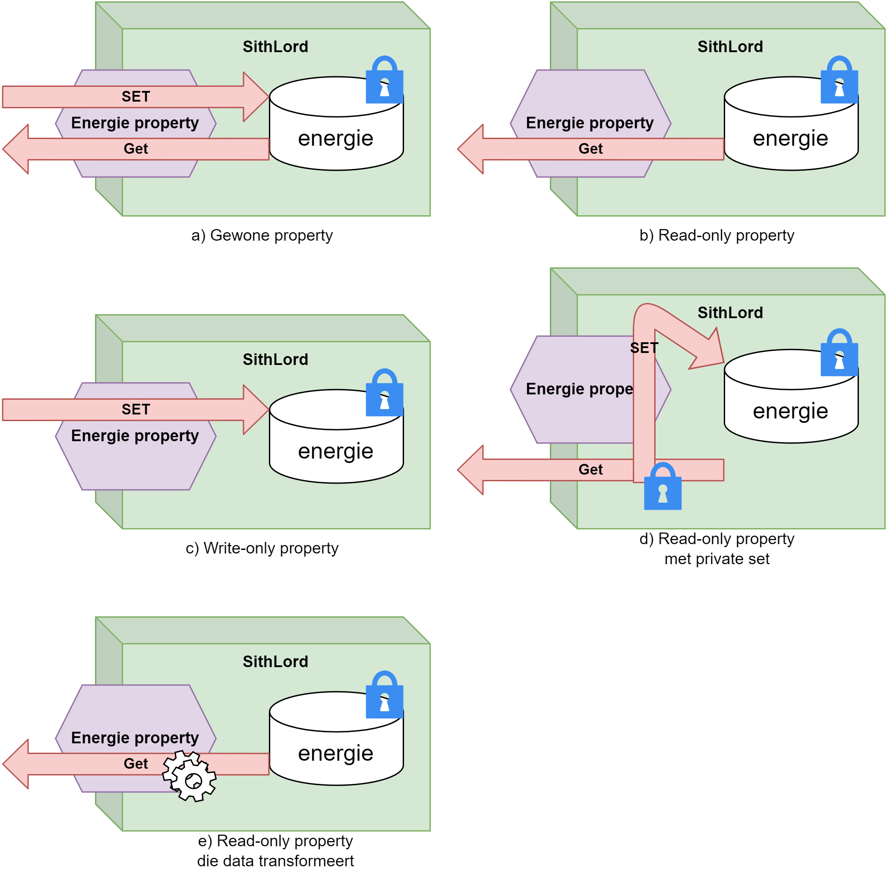
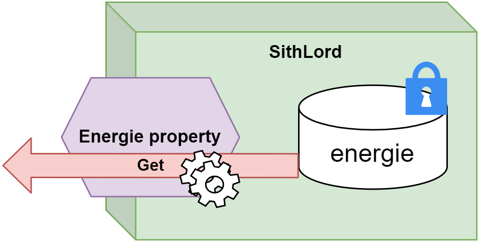

## Properties

We zagen zonet dat instantievariabelen nooit ``public`` mogen zijn om te voorkomen dat de buitenwereld onze objecten 'vult' met slechte zaken. Het voorbeeld waarbij we vervolgens een methode ``StartVerjongingskuur`` gebruikten om op gecontroleerde manier toch aan de interne staat van objecten te komen is één oplossing, maar een nogal *oldschool* oplossing. 

Deze manier van werken - methoden gebruiken om instantievariabelen aan te passen of uit te lezen - is wat voorbij gestreefd binnen C#. Onze programmeertaal heeft namelijk het concept **properties** (*eigenschappen*) in het leven geroepen die toelaten op een eenvoudigere manier aan de interne staat van objecten te geraken.


**Properties (*eigenschappen*) zijn de C# manier om objecten hun interne staat in en uit te lezen. Ze zorgen voor een gecontroleerde toegang tot de interne structuur van je objecten.** 



### Star Wars en de nood aan properties 

In het Star Wars universum heb je goede oude "Darth Vader". Hij behoort tot de mysterieuze klasse van de Sith Lords. Deze Lords lopen met een geheim rond: ze hebben een *Sithnaam*. Deze naam mogen de Lords enkel bekend maken aan andere Sith Lords. Voorts heeft een Sith Lord ook een hoeveelheid energie (*The Force*) waarmee hij kattekwaad kan uithalen. Deze energie kan nooit onder nul gezet worden.


We kunnen voorgaande als volgt schrijven:

```csharp
internal class SithLord
{
    private int energie;
    private string sithName;
}
```

**Het is uit den boze dat we eenvoudige instantievariabelen (``energie`` en ``name``) ``public`` maken.** Zouden we dat wel doen dan kunnen externe objecten deze geheime informatie uitlezen!

```csharp
SithLord palpatine = new SithLord();
Console.WriteLine(palpatine.sithName); //zal niet compileren!
```

We willen echter wel van buiten uit het energie-level van een sithLord kunnen instellen. Maar ook hier hetzelfde probleem: wat als we de energie-level op -1000 instellen? Terwijl energie nooit onder 0 mag gaan.

**Properties lossen dit probleem op.**


### 2 soorten properties

Er zijn 2 soorten properties[^semiprop] in C#:

* **Full properties**: deze stijl van properties verplicht ons véél code te schrijven, maar we hebben ook volledige controle over wat er gebeurt.
* **Auto-properties**: deze zijn exact het omgekeerde van full properties. Je moet niet veel code schrijven, maar je hebt ook weinig (eigenlijk géén) controle over wat er gebeurt.


Ik behandel eerst full properties, omdat auto-properties een soort afgeleide van full properties zijn. Bepaalde aspecten van full properties worden bij auto-properties achter de scherm verstopt zodat jij als programmeur er geen last van hebt.

[^semiprop]: In één van de volgende versies van C# (normaal versie 11) zal er nog een derde type verschijnen: *semi-auto properties*. Een propertytype dat zich tussen beide bestaande types zal bevinden. De details en exacte gebruik ervan worden nog besproken op [github.com](github.com/dotnet/csharplang/issues/140) door de ontwikkelaars, dus het is nog te vroeg om deze al op te nemen in dit boek. 


### Full properties

Properties herken je aan de ``get`` en ``set`` keywords in een klasse. Een property is een beschrijving van wat er moet gebeuren indien je informatie uit (**``get``**) een object wilt halen of informatie in (**``set``**) een object wilt plaatsen.

In volgende voorbeeld maken we een property, genaamd ``Energie`` aan. Deze doet niets anders dan rechtstreeks toegang tot de instantievariabele ``energie`` te geven:

```csharp
internal class SithLord
{
    private int energie;

    public int Energie
    {
        get
        {
            return energie;
        }
        set
        {
            energie = value;
        }
    }
}
```


Dankzij voorgaande code kunnen we nu buiten het object de property ``Energie`` gebruiken als volgt:

```csharp
SithLord Vader = new SithLord();
Vader.Energie = 20; //set
Console.WriteLine($"Vaders energie is {Vader.Energie}"); //get
```

Laten we eens inzoomen op de full property code.


#### Full property: identifier en datatype
De eerste lijn van een full property beschrijft de naam (identifier) en datatype van de property: ``public int Energie``

**Een property is altijd ``public``** daar dit de essentie van een property net is "de buitenwereld gecontroleerde toegang tot de interne staat van een object geven".

Vervolgens zeggen we wat voor **datatype** de property moet zijn en geven we het een naam die moet voldoen aan de identifier regels van weleer. Voor de buitenwereld zal een property zich gedragen als een gewone variabele, met de naam ``Energie`` van het type ``int``.


Indien je de property gaat gebruiken om een instantievariabele naar buiten beschikbaar te stellen, dan is het een goede gewoonte om dezelfde naam als dat veld te nemen maar nu met een hoofdletter (dus ``Energie`` i.p.v. ``energie``).

#### Full property: get gedeelte

Indien je wenst dat de property data **naar buiten** kan sturen, dan schrijven we de get-code. Binnen de accolades van de ``get`` schrijven we wat er naar buiten moet gestuurd worden.

```csharp
get
{
    return energie;
}
```

Dit werkt dus identiek aan een methode met een returntype. **Het element dat je met ``return`` teruggeeft in de get code moet uiteraard van hetzelfde type zijn als waarmee je de property hebt gedefinieerd (``int`` in dit geval).**

We kunnen nu van buitenaf toch de waarde van ``energie`` uitlezen via de property en het get-gedeelte, bijvoorbeeld ``int uitgelezen = palpatine.Energie;``.


We mogen eender wat doen in het get-gedeelte (net zoals bij methoden) zolang er finaal maar iets uitgestuurd wordt m.b.v. ``return``. Ik zal hier verderop meer over vertellen, want soms is het handig om *getters* te schrijven die de data transformeren voor ze uitgestuurd wordt.


<!-- \newpage -->


#### Full property: set gedeelte

In het set-gedeelte schrijven we de code die we moeten hanteren indien men van buiten een waarde aan de property wenst te geven om zo een instantievariabele aan te passen. 

```csharp
set
{
    energie = value;
}
```

De waarde die we van buiten krijgen (als een parameter zeg maar) zal altijd in een lokale variabele **``value``** worden bewaard binnenin de set-code. Deze zal van het type van de property zijn. 


Deze ``value`` parameter is een geserveerd keyword van de ``set`` syntax en kan je niet hernoemen of voor iets anders gebruiken. 



Vervolgens kunnen we ``value`` toewijzen aan de interne variabele indien gewenst: ``energie = value;``. Uiteraard kunnen we die toewijzing dus ook gecontroleerd laten gebeuren, wat ik zo meteen uitleg.

We kunnen vanaf nu van buitenaf waarden toewijzen aan de property en zo ``energie`` toch bereiken: ``palpatine.Energie = 50;``.


Je bent niet verplicht om een property te maken wiens naam overeen komt met een bestaande instantievariabele (**maar dit wordt wel aangeraden**). 

Dit mag dus ook:

```csharp
internal class Auto
{
    private int benzinePeil;

    public int FuelLevel
    {
        get { return benzinePeil; }
        set { benzinePeil = value; }
    }
}
```




Visual Studio heeft een ingebouwde *snippet* om snel een full property, inclusief een bijhorende private instantievariabele, te schrijven. **Typ "propfull" gevolgd door twee maal op de tab-toets te duwen.**



### Full property met toegangscontrole

De full property ``Energie`` heeft nog steeds het probleem dat we negatieve waarden kunnen toewijzen (via de ``set``) die dan vervolgens zal toegewezen worden aan ``energie``.

**Properties hebben echter de mogelijkheid om op te treden als wachters van en naar de interne staat van objecten.**

We kunnen in de ``set`` code extra controles inbouwen. Aangezien de variabele ``value`` de waarde krijgt die we extern aan de property toewijzen, kunnen we deze controleren en zo nodig de toewijzing voorkomen. Volgende voorbeeld zal enkel de waarde toewijzen indien deze groter of gelijk aan 0 is:

```csharp
public int Energie
{
    get
    {
        return energie;
    }
    set
    {
        if(value >= 0)
            energie = value;
    }
}
```

Volgende lijn zal dus geen effect hebben:


```csharp 
palpatine.Energie = -1;
```

We mogen de code binnen ``set`` en ``get`` zo complex maken als we zelf willen. 


Probeer wel steeds de OOP-principes te hanteren wanneer je met properties werkt: in de ``get`` en ``set`` van een property mogen enkel die dingen gebeuren die de verantwoordelijkheid van de property zelf zijn. Je gaat dus bijvoorbeeld niet controleren of een andere property geen illegale waarden krijgt, daar is die andere property voor verantwoordelijk.



<!-- \newpage -->


### Property variaties

We zijn niet verplicht om zowel de ``get`` en de ``set`` code van een property te schrijven. Dit laat ons toe om een aantal variaties te schrijven:

* **Write-only property**: heeft geen ``get``.
* **Read-only property**: heeft geen ``set``.
* **Read-only property met private ``set``** : het omgekeerde, een private ``get``, zal je zelden tegenkomen.
* **Read-only property die data transformeert**: om interne data in een andere vorm uit je object te krijgen.

<!--{width=100%}-->


<!-- \newpage -->

#### Write-only property

Dit soort properties zijn handig indien je informatie naar een object wenst te sturen dat niet mag of moet uitgelezen kunnen worden. Het meest typische voorbeeld is een property ``Pincode`` van een klasse ``BankRekening``. 


```csharp
public int Energie
{
    set
    {
        if(value >= 0)
            energie = value;
    }
}
```
We kunnen dus enkel ``energie`` een waarde geven, maar niet van buiten uitlezen.


#### Read-only property
Letterlijk het omgekeerde van een write-only property. Deze gebruik je vaak wanneer je informatie uit een object wil kunnen uitlezen uit een instantievariabele dat NIET door de buitenwereld mag aangepast worden.

```csharp
public int Energie
{
    get
    {
        return energie;
    }
}
```
We kunnen enkel ``energie`` van buiten uitlezen, maar niet aanpassen.



Het ``readonly`` keyword heeft andere doelen en wordt NIET gebruikt in C# om een readonly property te maken.


<!-- \newpage -->


#### Read-only property met private set


Soms gebeurt het dat we van enkel voor de buitenwereld de property read-only willen maken. We willen in de klasse zelf nog steeds controleren dat er geen illegale waarden aan private instantievariabelen worden gegeven. Op dat moment definiëren we een read-only property met een private setter:

```csharp
public int Energie
{
    get
    {
        return energie;
    }
    private set
    {
        if(value >= 0)
            energie = value;
    }
}
```

Van buiten zal enkel code werken die de ``get`` van deze property aanroept, bijvoorbeeld:


```csharp
Console.WriteLine(palpatine.Energie);
```

Code die de ``set`` van buiten nodig heeft (bv. ``palpatine.Energie = 65;``) zal een fout geven ongeacht of deze geldig is of niet.


Het is een goede gewoonte om **altijd** via de properties je interne variabele aan te passen en niet rechtstreeks via de instantievariabele zelf. Dit is zo'n nuttige tip dat we op de volgende pagina de voorman hier ook nog even over aan het woord gaan laten.



>Lukt het een beetje? Properties zijn in het begin wat overweldigend, maar geloof me: ze zijn zowat dé belangrijkste bewoners in de .NET/C# wereld.

<!-- \newpage -->


**Nu even goed opletten**: indien we **in** het object de instantievariabelen willen aanpassen dan is het een goede gewoonte om ook dat **via de property** te doen (ook al zit je in het object zelf en heb dus eigenlijk de property niet nodig). Zo zorgen we ervoor dat de bestaande controle in de property niet wordt omzeilt. Kijk zelf naar volgende **slechte** codevoorbeeld:

```csharp
internal class SithLord
{
    private int energie;
    private string sithName;
    public void ResetLord(int resetWaarde)
    {
        energie = resetWaarde;
    }
    public int Energie
    {
        get
        {
            return energie;
        }
        private set
        {
            if(value >= 0) 
                energie = value;
        }
    }
}
```

De nieuw toegevoegde methode ``ResetLord`` willen we gebruiken om de lord z'n energie terug te verlagen. Als we deze methode met een negatieve waarden aanroepen zullen we alnsog ``energie`` op een verkeerde waarde instellen. Nochtans is dit een illegale waarde volgens de set-code van de property.

**We moeten dus in de methode ook expliciet via de property gaan** om bugs te voorkomen en dus gaan we in ``ResetLord``schrijven naar de property ``Energie`` én niet rechtstreeks naar de instantievariabele ``energie``:

```csharp
public void ResetLord(int resetWaarde)
{
    Energie = resetWaarde; // Energie i.p.v. energie
}
```


#### Read-only properties die transformeren


<!--{width=60%}-->


Je bent uiteraard niet verplicht om voor iedere instantievariabele een bijhorende property te schrijven. Omgekeerd ook: mogelijk wil je extra properties hebben voor data die je 'on-the-fly' kan genereren dat niet noodzakelijk uit een instantievariabele komt. Stel dat we volgende klasse hebben:

```csharp
internal class Persoon
{
    public string Voornaam {get;set;}
    public string Achternaam {get;set;}
}
```

We willen echter ook soms de volledige naam of emailadres krijgen, beide gebaseerd op de inhoud van de instantievariabelen ``voornaam`` en ``achternaam``. Via een read-only property die transformeert kan dit:

```csharp
internal class Persoon
{
    public string Voornaam {get;set;}
    public string Achternaam {get;set;}
    public string VolledigeNaam
    {
        get
        { 
            return $"{Voornaam} {Achternaam}";
        }
    }
    public string Email
    {
        get
        {
            return $"{Voornaam}@ziescherp.be";
        }
    }
}
```



**Methode of property?**

Een veel gestelde vraag bij beginnende OOP-ontwikkelaars is: *"Moet dit in een property of in een methode geplaatst worden?"*

De regels zijn niet in steen gebeiteld, maar ruwweg kan je stellen dat:

* Betreft het een actie of gedrag: iets dat het object moet doen (tekst tonen, iets berekenen of aanpassen, enz.) dan plaats je het in een **methode**. 
* Betreft het een eigenschap van het object, dan gebruik je een **property** indien het om data gaat die snel verkregen of berekend kan worden. Gaat het om data die zwaardere en/of langere berekeningen vereist dan is een methode nog steeds aangeraden.




