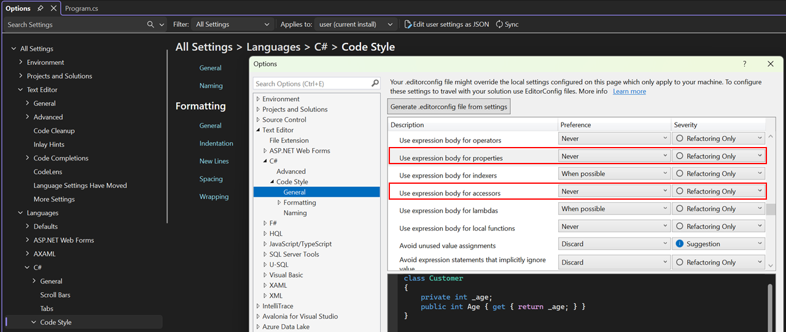

### Auto-properties

Automatische eigenschappen (**automatic properties**, *auto-implemented properties*, soms ook *autoprops* genoemd) laten toe om snel properties te schrijven zonder dat we de achterliggende instantievariabele moeten beschrijven.

Een auto-property herken je aan het feit dat ze een pak korter zijn qua code, omdat er veel meer (onzichtbaar) achter de schermen wordt opgelost:

```csharp
public string Voornaam { get; set; }
```

Heel vaak wil je heel eenvoudige variabelen aan de buitenwereld van je klasse beschikbaar stellen. Omdat je instantievariabelen echter niet ``public`` mag maken, moeten we dus properties gebruiken die niets anders doen dan als doorgeefluik fungeren. auto-properties doen dit voor ons: het zijn vereenvoudigde full properties waarbij de achterliggende instantievariabele onzichtbaar voor ons is. Je kan echter bij auto-properties ook geen verdere controle op de in-of uitvoer doen.

Zo kan je eenvoudig de volgende klasse ``Persoon`` herschrijven met behulp van auto-properties. De originele klasse mét full properties:

```csharp
internal class Person
{
    private string voornaam;
    public string Voornaam
    {
        get { return voornaam; }
        set { voornaam = value; }
    }

    private int geboorteJaar;
    public int Geboortejaar
    {
        get { return geboorteJaar; }
        set { geboorteJaar = value; }
    }
}
```

De herschreven klasse met auto-properties wordt: 

```csharp
internal class Person
{
    public string Voornaam { get; set; }
    public int Geboortejaar { get; set; }
}
```

Beide klassen hebben exact dezelfde functionaliteit, echter is de laatste klasse aanzienlijk korter en dus eenvoudiger om te lezen. **De private instantievariabelen zijn niét meer aanwezig.** C# gaat die voor z'n rekening nemen. Alle code zal dus via de properties moeten gaan.

**Het is belangrijk te benadrukken dat de achterliggende instantievariabele onzichtbaar is in auto-properties en onmogelijk kan gebruikt worden. Alles gebeurt via de auto-property, altijd.** Je hebt dus enkel een soort publieke variabele. Maar wel eentje  die conform de afspraken is ("maak geen instantievariabelen publiek!"). Gebruik dit dus enkel wanneer je 100% zeker bent dat de auto-property geen waarden kan krijgen die de interne werking van je klasse kan verstoren.


Vaak zal je nieuwe klassen eerst met auto-properties beschrijven. Naarmate de specificaties dan vereisen dat er bepaalde controles of transformaties moeten gebeuren, zal je stelselmatig auto-properties vervangen door full properties.

Dit kan trouwens automatisch in VS: selecteer de autoprop in kwestie en klik dan vooraan op de schroevendraaier en kies "Convert to full property".

**Opgelet**: Merk op dat de syntax die VS gebruikt om een full property te schrijven anders is dan wat ik hier uitleg. Wanneer je VS laat doen krijg je een oplossing met allerlei ``=>`` tekens. Dit is heet **Expression Bodied Member syntax (EBM)**. Ik behandel deze nieuwere C# syntax in de appendix.




Wil je toch je autoproperties omzetten naar full properties volgens de "klassieke" syntax die we hier uitleggen, ga dan naar je instellingen.
Tools->Options->Text Editor->C#->Code Style->General->Expression Preferences->Use expression body for accessors and properties.






### Nut auto-properties? 

Merk op dat je auto-properties dus enkel kan gebruiken indien er geen extra logica in de property (bij de ``set`` of ``get``) aanwezig moet zijn.

Stel dat je bij de setter van geboorteJaar wil controleren op een negatieve waarde, dan zal je dit zoals voorheen moeten schrijven en kan dit niet met een automatic property:

```csharp
set
{
    if( value > 0)
        geboorteJaar = value;
}
```
**Voorgaande property kan dus *NIET* herschreven worden met een automatic property.** auto-properties zijn vooral handig om snel klassen in elkaar te knutselen, zonder je zorgen te moeten maken om andere vereisten. Vaak zal een klasse in het begin met auto-properties gevuld worden. Naarmate je project vordert zullen die auto-properties meer en meer omgezet worden in full properties. 

<!-- \newpage -->


### Beginwaarden van auto-properties

Je mag auto-properties beginwaarden geven door de waarde achter de property te schrijven, als volgt:


```csharp
public int Geboortejaar {get;set;} = 2002;
```

Al je objecten zullen nu als geboortejaar 2002 hebben wanneer ze geïnstantieerd worden.


### Alleen-lezen auto-properties

Je kan auto-properties ook gebruiken om bijvoorbeeld een read-only property met private setter te definiëren. Als volgt:


```csharp
public string Voornaam { get; private set; }
```

Een andere manier die ook kan wanneer we enkel een read-only property nodig hebben, is als volgt:


```csharp
public string Voornaam { get; } = "Tim";
```

Hierbij zijn we dan wel verplicht om ogenblikkelijk deze property een beginwaarde te geven, daar we deze op geen enkele andere manier nog kunnen aanpassen. 


Als je in Visual Studio in je code ``prop`` typt en vervolgens twee keer de tabtoets indrukt dan verschijnt al de nodige code voor een automatic property. 
Via ``propg`` gevolgd door twee maal de tabtoets krijg je een auto-property met private setter.

