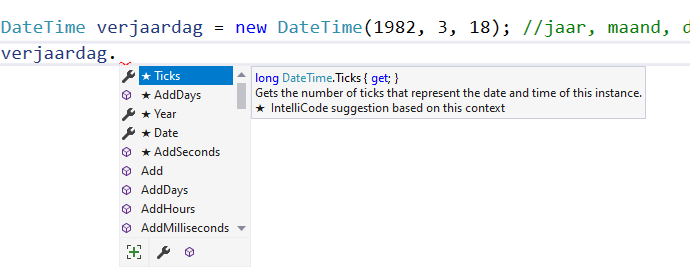

## OOP in de praktijk : DateTime





Doe die zwembroek maar weer aan! We gaan nog eens zwemmen. 

Zoals je vermoedelijk al doorhebt hebben we met properties en methoden nog maar een tipje van de klasse-ijsberg besproken. Vreemde dingen zoals *constructors*, *static methoden*, *overerving* en arrays van objecten staan ons nog allemaal te wachten. 

Om je toch al een voorsmaakje van de kracht van klassen en objecten te geven, gaan we eens kijken naar één van de vele klassen die je tot je beschikking hebt in C#. Je hebt al leren werken met bijvoorbeeld de ``Random`` klasse, maar ook al met wat speciale *static klassen* zoals de ``Math``- en ``Console``-bibliotheek die je kan gebruiken ZONDER dat je er objecten van moet aanmaken (het keyword ``static`` is daar de oorzaak van).

Nog zo'n handige ingebouwde klasse is de ``DateTime`` klasse, die, je raadt het nooit, toelaat om de tijd en/of datum in een object voor te stellen.



De .NET klasse ``DateTime`` is de ideale manier om te leren werken met objecten. Het is een nuttige en toegankelijk klasse.

### DateTime objecten aanmaken

Er zijn 2 manieren om ``DateTime`` objecten aan te maken:

1. Door aan de klasse de huidige datum en tijd te vragen via ``DateTime.Now``. 
2. Door manueel de datum en tijd in te stellen met het ``new`` keyword en de **klasseconstructor** (een concept dat we binnen 2 hoofdstukken uit de doeken gaan doen)

#### DateTime.Now

Volgend voorbeeld toont hoe we een object kunnen maken dat de huidige datum tijd van het systeem bevat. Vervolgens printen we dit op het scherm:

```java
DateTime currentTime = DateTime.Now;
Console.WriteLine(currentTime);
```


``DateTime.Now`` is een zogenaamde **static property** wat verderop in het boek zal uitgelegd worden. 



#### Met constructor en ``new``

De constructor van een klasse laat toe om bij het maken van een nieuw object, beginwaarden voor bepaalde instantievariabelen of properties mee te geven. De ``DateTime`` klasse heeft meerdere constructors gedefiniëerd zodat je bijvoorbeeld een object kan aanmaken dat bij de start reeds de geboortedatum van de auteur bevat:


```java
DateTime verjaardag = new DateTime(1981, 3, 18); //jaar, maand, dag
```

Ook is er een constructor om startdatum én -tijd mee te geven bij de objectcreatie:

```java
//Volgorde: jaar, maand, dag, uur, minuten, seconden
DateTime trouwMoment = new DateTime(2017, 4, 21, 10, 00,34 ); 
```

### DateTime methoden

Van zodra je een ``DateTime`` object hebt gemaakt zijn er tal van nuttige methoden die je er op kan aanroepen. Visual Studio is zo vriendelijk om dit te visualiseren wanneer we de dot-operator typen achter een object:




#### Add-methoden

De ingebouwde methoden beginnen allemaal met ``Add``, gevolgd door wat er moet bijgevoegd worden: ``AddDays``, ``AddHours``, ``AddMilliseconds``, ``AddMinutes``, ``AddMonths``, ``AddSeconds``, ``AddTicks``, ``AddYears``.


Een *tick* is 100 nanoseconden, oftewel 1 tien miljoenste van een seconden. Dat lijkt een erg klein getal (wat het voor ons ook is) maar voor computers is dit het soort tijdsintervals waar ze mee werken.



Deze methoden kan je gebruiken om een bepaalde aantal dagen, uren, minuten op te tellen bij de huidige tijd en datum van een object.

Het object zal voor ons de "berekening" hiervan doen en vervolgens een **nieuw DateTime object** teruggeven dat je moet bewaren wil je er iets mee doen.

In volgende voorbeeld wil ik ontdekken op welke datum de wittebroodsweken van m'n huwelijk eindigen (pakweg 5 weken na de trouwdag).

```java
DateTime eindeWitteBroodsweken = trouwMoment.AddDays(35);
Console.WriteLine(eindeWitteBroodsweken);
```

### DateTime properties

Dit hoofdstuk heeft al aardig wat woorden verspild aan properties, en uiteraard heeft ook de ``DateTime`` klasse een hele hoop interessante properties die toelaten om de interne staat van een ``DateTime`` object te bewerken of uit te lezen.

Enkele nuttige properties van ``DateTime`` zijn: ``Date``, ``Day``, ``DayOfWeek``, ``DayOfYear``, ``Hour``, ``Millisecond``, ``Minute``, ``Month``, ``Second``, ``Ticks``, ``TimeOfDay``, ``Today``, ``UtcNow``, ``Year``.


**Alle properties van DateTime zijn read-only** en hebben dus een private setter die we niet kunnen gebruiken.

Een voorbeeld:

```java
Console.WriteLine($"Einde in maand nr: {eindeWitteBroodsweken.Month}.");
Console.WriteLine($"Dat is een {eindeWitteBroodsweken.DayOfWeek}.");
```

Dit geeft op het scherm: 


```text
Je wittebroodsweken eindigen in maand nummer: 5.
Dat is een Friday.
```

### Static methoden

Sommige methoden zijn ``static`` dat wil zeggen dat je ze enkel rechtstreeks op de klasse kunt aanroepen. Vaak zijn deze methoden hulpmethoden waar de individuele objecten niets aan hebben. We hebben dit reeds gebruikt, zonder het te weten, bij de ``Math`` en ``Console``-klassen. 

We behandelen ``static`` uitgebreid verderop in het boek.


#### De tijd uit een string inlezen

Parsen laat toe dat je strings omzet naar een ``DateTime`` object. Dit is handig als je bijvoorbeeld de gebruiker via ``Console.ReadLine()`` tijd en datum wilt laten invoeren:

```java
string datumInvoer = Console.ReadLine(); 
DateTime datumVerwerkt = DateTime.Parse(datumInvoer);
Console.WriteLine(datumVerwerkt);
```

Indien je nu dit programma'tje zou uitvoeren en als gebruiker "8/11/2016" zou intypen, dan zal deze datum geparsed worden en in het object ``datumVerwerkt`` komen.


Zoals je ziet roepen we ``Parse`` aan op ``DateTime`` en dus niet op een specifiek object. Dat was ook zo reeds bijvoorbeeld bij ``int.Parse`` wat dus doet vermoeden dat zelfs het ``int`` datatype eigenlijk een klasse is!



#### IsLeapYear

Deze nuttige methode geeft een ``bool`` terug om aan te geven of de actuele parameter (type ``int``) een schrikkeljaar voorstelt of niet:

```java
DateTime vandaag = DateTime.Now;
if(DateTime.IsLeapYear(vandaag.Year))
    Console.WriteLine("Dit jaar is een schrikkeljaar.");
```

### TimeSpan 

Je kan DateTime objecten ook van elkaar aftrekken (optellen gaat niet!). Het resultaat van deze bewerking geeft echter niet een DateTime object terug, **maar een ``TimeSpan`` object**. Dit is nieuwe object van het type ``TimeSpan`` (wat dus een andere klasse is) dat aangeeft hoe groot het verschil is tussen de 2 DateTime objecten kunnen we als volgt gebruiken:

```java
DateTime vandaag = DateTime.Today;
DateTime geboorteDochter = new DateTime(2009,6,17);
TimeSpan verschil = vandaag - geboorteDochter;
Console.WriteLine($"{verschil.TotalDays} dagen sinds geboorte dochter.");
```


Je zal de ``DateTime`` klasse in véél van je projecten kunnen gebruiken waar je iets met tijd, tijdsverschillen of datums wilt doen. We hebben de klasse in deze sectie echter geen eer aangedaan. De klasse is veel krachtiger dan we hier hebben doen uitschijnen. Het is een goede gewoonte als beginnende programmeur om steeds de documentatie van nieuwe klassen er op na te slaan. Wanneer je in je browser zoekt op "C#" gevolgd door de naam van de klasse dan zal je zo goed als zeker als eerste *hit* de officiële .NET documentatie krijgen op **docs.microsoft.com**.






Gaat het nog?! Dit was een stevig hoofdstuk he. We hebben zo maar eventjes 4 heel grote fasen doorlopen:

1. Eerst keken we hoe OOP ons kan helpen in een real-life voorbeeld, Pong. We schreven code die hier en daar herkenbaar was, maar op andere plaatsen totaal nieuw was.
2. Vervolgens namen we de mammoet bij de horens en bekeken we de theorie van OO, die ons vooral verwarde.
3. Gelukkig gingen we dan ogenblikkelijk naar de praktijk over en zagen we dat methoden en properties de kern van iedere klasse blijkt te zijn.
4. Als afsluiter gooiden we dan de ``DateTime`` klasse open om een voorproefje te krijgen van hoe krachtig een goedgeschreven klasse kan zijn.

Voor je verder gaat raad ik je aan om dit alles goed te laten bezinken én maximaal de komende oefeningen te maken. Het zal de beste manier zijn om de ietwat bizarre wereld van OOP snel eigen te maken.




