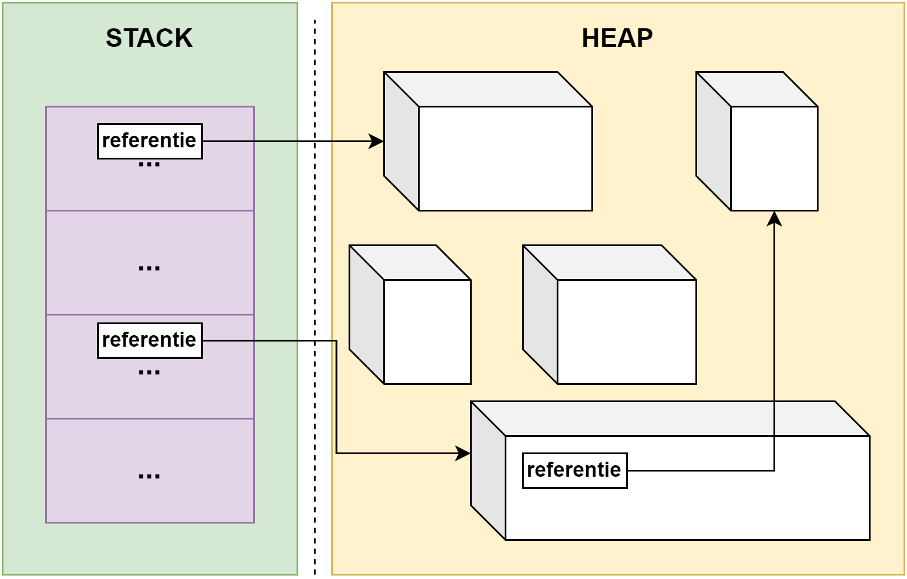
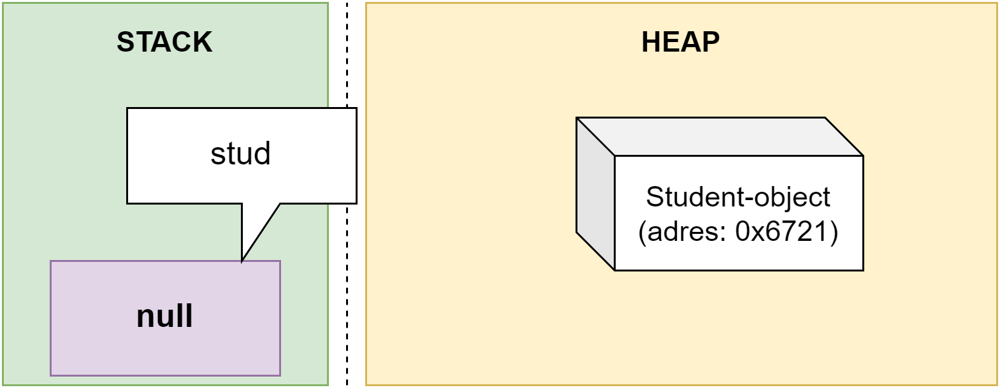
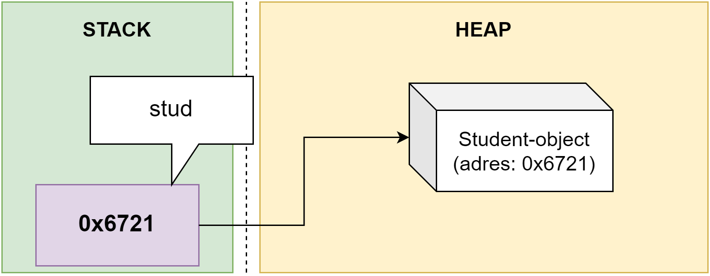
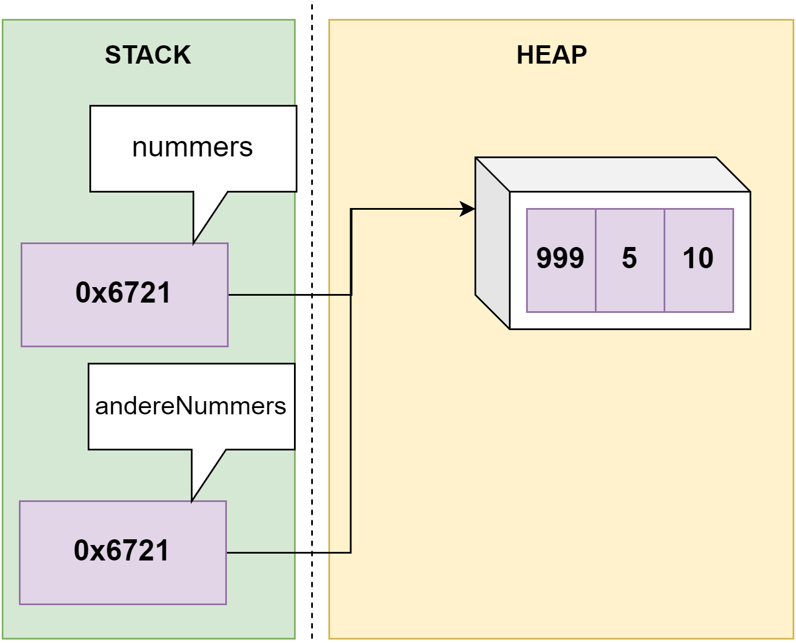
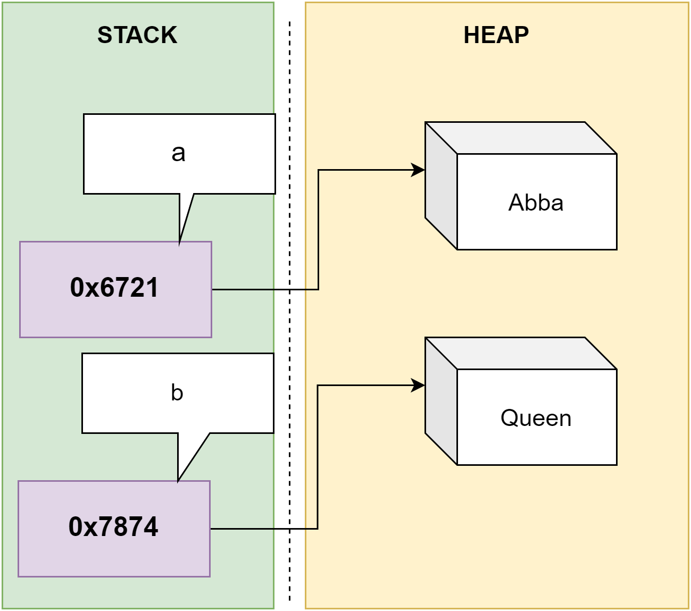
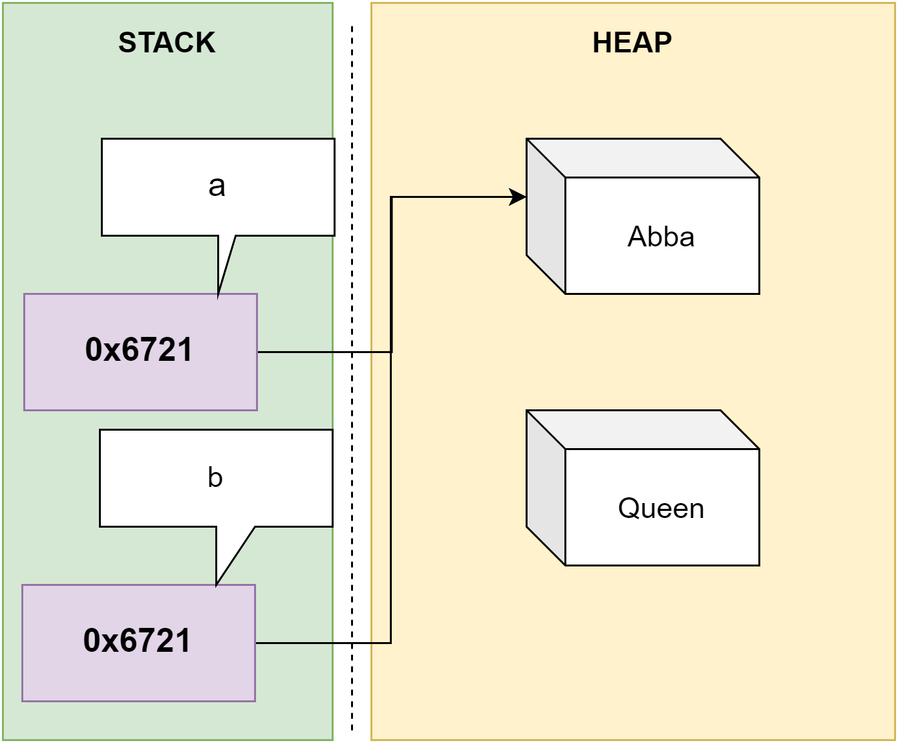
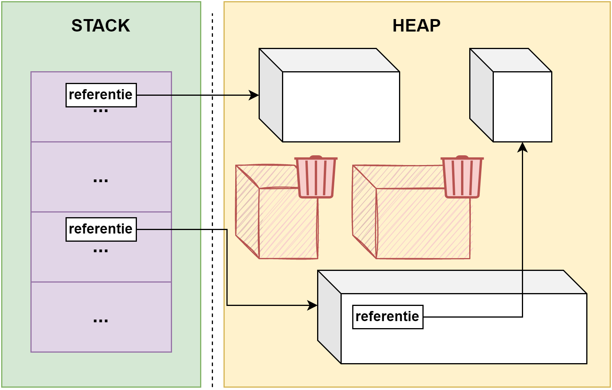

# Geheugenmanagement, uitzonderingen en namespaces

Dit hoofdstuk gaat een beetje overal over. In de eerste, en belangrijkste, plaats gaan we eens kijken wat er allemaal achter de schermen gebeurt wanneer we met objecten programmeren. We zullen namelijk ontdekken dat er een fundamenteel verschil is in het werken met bijvoorbeeld een object van het type ``Student`` tegenover werken met een eenvoudige variabele van het type ``int``. 

Vervolgens gaan we kort de keywords ``using`` en ``namespace`` bekijken. Die tweede heb je al bij iedere project bovenaan je code zien staan, nu wordt het tijd om toe te lichten waarom dat is.

Finaal lijkt het ons een goed moment om je robuustere, minder crashende, code te leren schrijven. Exception handling, de naam zegt het al, gaat ons helpen om die typische uitzonderingen (zoals deling door 0) in algoritmes op een elegante manier op te vangen (en dus niet door een nest van ``if`` structuren te schrijven in de hoop dat je iedere mogelijke uitzondering kunt opvangen).


## Geheugenmanagement in C#

In hoofdstuk 8 deden we reeds uit de doeken dat variabelen op 2 manieren in het geheugen kunnen leven:

* **Value types**: waren variabelen wiens waarde rechtstreeks op de geheugenplek stonden waar de variabele naar verwees. Dit gold voor alle bestaande, ingebakken datatypes zoals ``int``, ``bool``, ``char`` enz. alsook voor ``enum`` types.
* **Reference types**: deze variabelen bevatten als inhoud een geheugenadres naar een andere plek in het geheugen waar de effectieve waarde van deze variabele stond. We zagen dat dit voorlopig enkel bij arrays gebeurde.

**Ook objecten zijn reference types.** Alhoewel hoofdstuk 8 liet uitschijnen dat vooral value type variabelen veelvuldig in programma's voorkwamen, zal je nu ontdekken dat reference types véél meer voorkomen, **simpelweg omdat alles in C# een object is** (en dus ook arrays van objecten én zelfs valuetypes!).

Om goed te begrijpen waarom reference types zo belangrijk zijn, zullen we nu eerst eens inzoomen op hoe het geheugen van een C# applicatie werkt. 

### Stack en heap

In hoofdstuk 8 toonden we hoe alle variabelen in één grote "wolk geheugen" zitten, ongeacht of ze nu value types of reference types zijn. Dat klopt niet helemaal. Eigenlijk zijn er **2 soorten geheugens** die een C# applicatie tot z'n beschikking heeft.

Wanneer een C# applicatie wordt uitgevoerd krijgt het twee soorten geheugen toegewezen dat het 'naar hartelust' kan gebruiken, namelijk:

1. Het kleine, maar snelle **stack** geheugen.
2. Het grote, maar tragere **heap** geheugen.

Afhankelijk van het soort variabele wordt ofwel de stack, ofwel de heap gebruikt. **Het is uitermate belangrijk dat je weet in welk geheugen de variabele zal bewaard worden!** Je hebt hier geen controle over, maar het beïnvloedt wel de manier waarop je code zal werken.

Volgende tabel vat samen welke type in welk geheugen wordt bewaard:

|         | Value types           | Reference types  |
| ------------- |-------------| -----|
|Inhoud van de variabele    |  Eigenlijke data | Referentie naar de eigenlijke data |
|Locatie      |  **Stack**      |   **Heap**  |
| Beginwaarde | ``0``,``0.0``, ``""``,``false``, enz.      |    ``null`` |
| Effect ``=`` operator | Kopieert actuele waarde     |   Kopieert adres naar actuele waarde |



### Waarom twee geheugens?

Waarom plaatsen we niet alles in de stack? De reden hiervoor is dat bij het compileren van je applicatie er reeds zal berekend worden hoeveel geheugen de stack zal nodig hebben. Wanneer je programma dus later wordt uitgevoerd weet het OS perfect hoeveel geheugen het minstens moet reserveren bij het besturingssysteem.

Er is echter een probleem: de compiler kan niet alles perfect berekenen of voorspellen. Van een variabele van het type ``int`` is perfect geweten hoe groot die zal zijn (32 bit). Maar wat met een ``string`` die je aan de gebruiker vraagt? Of wat met een array waarvan we pas tijdens de uitvoer de lengte gaan berekenen gebaseerd op *runtime* informatie?

Het zou nutteloos (en zonde) zijn om reeds bij aanvang een bepaalde hoeveelheid stackgeheugen voor een array te reserveren als we niet weten hoe groot die zal worden. Beeld je in dat alle applicaties op je computer *voor alle zekerheid* een halve gigabyte aan geheugen zouden vragen. Je computer zou enkele terabyte aan geheugen nodig hebben. Het is dus veel realistischer om enkel het geheugen te reserveren waar de compiler 100% zeker van is dat deze zal nodig zijn.

De heap laat ons toe om geheugen op een wat minder gestructureerde manier in te palmen. Tijdens de uitvoer van het programma zal de heap als het ware dienst doen als een grote zandbak waar eender welke plek kan ingepalmd worden om zaken te bewaren (op voorwaarde dat die vrij is natuurlijk). De stack daarentegen is het kleine bankje naast de zandbak: handig, snel, en perfect geweten hoe groot.


### Value types in de stack

**Value** type variabelen worden in de stack bewaard. **De effectieve waarde van de variabele wordt in de stack bewaard.**
Dit zijn alle gekende, 'eenvoudige' datatypes die we totnogtoe gezien hebben:

* ``sbyte``, ``byte``, ``short``, ``ushort``, ``int``, ``uint``, ``long``, ``ulong``, ``char``, ``float``, ``double``, ``decimal``, ``bool``.
* structs (niet besproken in dit boek, maar wel kort toegelicht in de appendix).
* enums (zie hoofdstuk 5).

### = operator bij value types

Wanneer we een value-type willen kopiëren gebruiken we de =-operator die de waarde van de rechtse operand zal uitlezen en zal kopiëren naar de linkse operand:

```csharp
int getal = 3;
int anderGetal = getal;
```

Vanaf nu zal ``anderGetal`` de waarde ``3`` hebben. Als we nu één van beide variabelen aanpassen dan zal dit **geen** effect hebben op de andere variabelen.

We zien hetzelfde effect wanneer we een methode maken die een parameter van het value type aanvaardt: 
```csharp
void VerhoogParameter(int a)
{
    a++;
    Console.WriteLine($"In methode {a}");
}
```


Bij de aanroep geven we een kopie van de variabele mee:
```csharp
int getal = 5;
VerhoogParameter(getal);
Console.WriteLine($"Na methode {getal}");
```

De parameter ``a`` zal de waarde ``5`` gekopieerd krijgen. Maar wanneer we nu zaken aanpassen in ``a`` zal dit geen effect hebben op de waarde van ``getal``.

De output van bovenstaand programma zal zijn:


```text
In methode 6
Na methode 5
```

### Reference types

**Reference** types worden in de heap bewaard. De *effectieve waarde* wordt in de heap bewaard, en in de stack zal enkel een **referentie** of **pointer** naar de data in de heap bewaard worden. Een referentie (of pointer) is niet meer dan het geheugenadres naar waar verwezen wordt (bv. ``0xA3B3163``). Concreet zijn dit alle zaken die vaak redelijk groot zullen zijn of waarvan op voorhand niet kan voorspeld worden hoe groot ze *at runtime* zullen zijn (denk maar aan arrays, instanties van complexe klassen, enz.)

### = operator bij reference types
Wanneer we de = operator gebruiken bij een reference type dan kopiëren we de referentie naar de waarde van de rechtse operand, niet de waarde zelf.

#### Bij objecten

We zien dit gedrag bij alle reference types, zoals objecten:


```csharp
Student stud = new Student();
```

Wat gebeurt er hier?

1. ``new Student()`` : ``new`` roept de constructor van ``Student`` aan. Deze zal met behulp van een constructor een object in de **heap** aanmaken en vervolgens de geheugenlocatie ervan teruggeven.
2. Een variabele ``stud`` wordt in de **stack** aangemaakt en mag enkel een referentie naar een object van het type ``Student`` bewaren.
3. De geheugenlocatie uit de eerste stap wordt vervolgens in ``stud`` opgeslagen in de stack.

Laten we eens inzoomen op voorgaande door de code even in 2 delen op te splitsen:

```csharp
Student stud;
stud = new Student();
```

Het geheugen na lijn 1 ziet er zo uit:


Lijn 2 gaan we nog trager bekijken. Eerst zal het gedeelte rechts van de ``=``-operator uitgevoerd worden. Er wordt dus **in de heap** een nieuw ``Student``-object aangemaakt:




Vervolgens wordt de toekenning toegepast en wordt het geheugenadres van het object in de variabele ``stud`` geplaatst:





We gaan nogal licht over het ``new``-keyword en de constructor. Maar zoals je merkt is dit een ongelooflijk belangrijk mechanisme in de wereld van de objecten. Het brengt letterlijk objecten tot leven (in de heap) en zal als resultaat laten weten op welke plek in het geheugen het object staat.



#### Bij arrays

Zoals we in hoofdstuk 8 hebben gezien, zien we het zelfde gedrag bij arrays:

```csharp
int[] nummers = {4,5,10};
int[] andereNummers = nummers;
```

In dit voorbeeld zal ``andereNummers`` nu dus ook verwijzen naar de array in de heap waar de actuele waarden staan.

Als we dus volgende code uitvoeren dan ontdekken we dat beide variabele naar dezelfde array verwijzen:

```csharp
andereNummers[0] = 999;
Console.WriteLine(andereNummers[0]);
Console.WriteLine(nummers[0]);
```

We zullen dus als output krijgen:


```text
999
999
```




Hetzelfde gedrag zien we bij objecten:

```csharp
Student a = new Student("Abba");
Student b = new Student("Queen");
```

Geeft volgende situatie in het geheugen:




Schrijven we dan het volgende:

```csharp
b = a;
Console.WriteLine(a.Naam);
```

Dan  zullen we in dit geval dus ``Abba`` op het scherm zien omdat zowel ``b`` als ``a`` naar hetzelfde object in de heap verwijzen. Het originele "Queen"-object zijn we kwijt en zal verdwijnen (zie Garbage collector verderop).





De meeste klassen zullen met value type-properties en instantievariabelen werken in zich, toch worden deze ook samen met het gehele object in de heap bewaard en niet in de stack. Kortom **het hele object** ongeacht de vorm (*datatypes*) van z'n inhoud wordt in de heap bewaard.



### De Garbage Collector 
Een stille held van .NET is de zogenaamde GC, de **Garbage Collector**. Dit is een geautomatiseerd onderdeel van ieder C# programma dat ervoor zorgt dat we geen geheugen nodeloos gereserveerd houden.
De GC zal geregeld het geheugen doorlopen en kijken of er in de heap objecten staat waar geen referenties naar verwijzen. Indien er geen referenties naar wijzen zal dit object verwijderd worden.




In dit voorbeeld zien we dit in actie:

```csharp
Held supermand = new Held();
Held batmand = new Held();
batmand = supermand;
```

Vanaf de laatste lijn zal er geen referentie meer naar het originele object zijn waar ``batmand`` naar verwees in de heap, daar we deze hebben overschreven met een referentie naar het eerste ``Held`` object in ``supermand``. De GC zal dus dat tweede aangemaakte ``Held`` object verwijderen. Wil je dat niet dan zal je minstens 1 variabele moeten hebben die naar de data verwijst. Volgend voorbeeld toont dit:

```csharp
Held supermand = new Held();
Held batmand = new Held();
Held bewaarEersteHeld = batmand;
batmand = supermand;
```
De variabele ``bewaarEersteHeld`` houdt dus een referentie naar die in ``batmand`` bij en we kunnen dus later via deze variabele alsnog aan de originele data.


De GC werkt niet continue daar dit te veel overhead van je computer zou vereisen. De GC zal gewoon om de zoveel tijd alle gereserveerde geheugenplekken van de applicatie controleren en die delen verwijderen die niet meer nodig zijn.
Je kan de GC manueel de opdracht geven om een opkuisbeurt te starten met ``GC.Collect()`` maar dit is ten stelligste af te raden! De GC weet meestal beter dan ons wanneer er gekuist moet worden.



