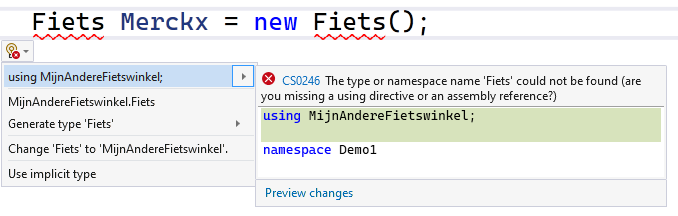

## Namespaces en ``using``
Je zal het keyword ``namespace`` al vele malen bovenaan je code hebben zien staan .

```csharp
namespace MyEpicGame
{
    internal class Monster
```

De naam die achter de ``namespace`` staat is altijd die van je project, maar waarom is dit eigenlijk?

### Wat zijn namespaces

Een ``namespace`` wordt gebruikt om te voorkomen dat 2 projecten die toevallig dezelfde klassenamen hebben in conflict komen. Beeld je in dat je een project van iemand anders toevoegt aan jouw project en je ontdekt dat in dat project reeds een klasse ``Student`` aanwezig is. Hoe weet C# nu welke klasse moet gebruikt worden? Want mogelijk wens je beide te gebruiken!

De namespace rondom een klasse is als het ware een extra stukje naamgeving waarmee je kan aangeven welke klasse je juist nodig hebt. In bovenstaand stukje code heb ik een project ``MyEpicGame`` gemaakt en zoals je ziet bevat het een klasse ``Monster``. De volledige naam (of **Fully Qualified Type Name**) van deze klasse is ``MyEpicGame.Monster``. 

Als ik dus even later een project met volgende namespace, en zelfde klassenaam, importeer:

```csharp
namespace NietZoEpicGame
{
    internal class Monster
```
Dan kan ik deze klasse aanroepen als ``NietZoEpicGame.Monster`` en kan er dus geen verwarring optreden.





De politie uw vriend! Inderdaad. De auteur van dit boek heeft klachten gekregen over het feit dat hij het edele beroep van politie-agent ietwat besmeurd. We willen daarom even u attenderen en, zoals een goed agent betaamd, u de weg doorheen de stad wijzen.

Als u ons tegenkomt en vraagt "Waar is de Kerkstraat." Dan zullen wij u meer informatie moeten vragen. Zonder er bij te zeggen in welke gemeente u die straat zoekt, is de kans bestaande dat we u naar de verkeerde Kerkstraat sturen (er zijn er namelijk best veel in België en Nederland). Wel, namespaces zijn exact dat. Een soort stadsnaam (of postcode) die essentiëel is bij een straatnaam om zonder verwarring een straat te kunnen identificeren, in dit geval dus de klassenaam. Nog een fijne dag!



### ``using`` in je code

Wanneer je een bepaalde namespace nodig hebt (standaard laadt een C# 10 project er maar een handvol in) dan dien je dit bovenaan je bestand aan te geven met ``using``. Bijvoorbeeld ``using System.Diagnostics``. Je zegt dan eigenlijk: *"Beste C#, als je een klasse zoekt en je vindt ze niet in dit project: kijk dan zeker in de System.Diagnostics-bibliotheek."*


### Ontbrekende namespaces terugvinden
Het gebeurt soms dat je een klasse gebruikt en je weet zeker dat ze in jouw project of een bestaande .NET bibliotheek aanwezig is. Visual Studio kan je helpen de namespace van deze klasse te zoeken moest je daar te lui voor zijn.

Je doet dit door de naam van de klasse te schrijven (op de plek waar je deze nodig hebt) en dan op het lampje dat links in de rand verschijnt te klikken. Indien de klasse gekend is door VS zal je nu de optie krijgen om automatisch:
* oftewel ``using``, met de juiste namespace, bovenaan je huidige codebestand te plaatsen.
* oftewel de volledige naam van de klasse uit te schrijven (dus inclusief de namespace).




Trouwens: de optie ``Generate type ..`` zal je ook vaak kunnen gebruiken. Wanneer de klasse in kwestie (``Fiets`` hier) nog niet bestaat en je wilt deze automatische laten genereren (in een apart bestand) dan zal deze optie dat voor je doen. 


Maar hoe weet C# nu welke bibliotheken allemaal beschikbaar zijn? Wel, je kan in je project via de solution explorer kijken welke bibliotheken (meestal in de vorm van DLL-bestanden) werden toegevoegd. In je solution explorer klik je hiervoor de *Dependencies* open. Daar kan je dan zien in welke bibliotheken VS mag zoeken als je een klasse nodig hebt die niet gekend is. Klik bijvoorbeeld eens onder *Dependencies* de sectie *FrameWorks* open en dan *MicrosofT.NETCore.App*. Je zal er onder andere alle **System.** bibliotheken zien staan.




Je kan ook extra bibliotheken toevoegen aan je Dependencies. Rechterklik maar eens op Dependencies en zie wat je allemaal kunt doen. **Vooral de NuGet packages zijn een erg nuttig en krachtig hulpmiddel**. Lees er alles over op **docs.microsoft.com/en-us/nuget/quickstart/install-and-use-a-package-in-visual-studio**. Helaas kan niet alles over C# en .NET in één boek verzameld worden, maar weet dat er erg nuttige, toffe en zelfs grappige NuGet packages bestaan, zoek bijvoorbeeld maar eens naar de *Colorful.Console* NuGet!



