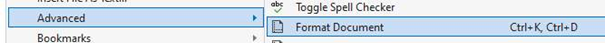

# Do's & don'ts in code ("boeteblad")

In programmeren zijn we streng in het verbeteren van code. Volgende afspraken worden gehanteerd bij de AP Hogeschool bij het verbeteren van vaardigheidsproeven. 

Er zal steeds een puntenverdeling staan per sectie waar je punten kan scoren op het maken van de gevraagde functionaliteit. Het maximum van de score behaal je enkel voor deze sectie als je de vereisten van deze sectie perfect hebt geïmplementeerd én met meest logische oplossingsstrategie (vb. geen loops gebruikt, maar alles hardcoded) .

**MAAR indien je volgende zaken in je code hebt staan dan zullen er punten van totaalscore afgetrokken worden.**

##	Project bevat nog fouten en compileert niet (-1 punt)

Dit is hopelijk duidelijk? Wanneer we op "compile & run" klikken willen we je code in actie zien. Geen werkend project kost je. 
Tip: de deadline van het examen nadert? Zet de stoute code in commentaar.

##	Iedere klasse niet in apart bestand (-1 punt) [semester 2]

Je moet voor een opgave 2 of meerdere klassen maken? Plaats IEDERE KLASSE IN EEN APART bestand.
Moet je dus ``Student``, ``Leraar`` en ``School`` klasse maken? Dan ontdekken we hopelijk in je project minstens 3 bestanden genaamd "Student.cs", "Leraar.cs" en "School.cs".

Oh wee je gebeente als je één groot bestand genaamd "Klassen.cs" (o.i.d.) in je project hebt staan.

##	Veel onnodige of redundante code (-3 punt max)
Los je de problemen té omslachtig op? Dat kan je tot maximum 3 punten op je totaalscore kosten. 

Enkele typische voorbeelden:

* Geen loops of methoden gebruiken wanneer je bepaalde code meerdere keren na elkaar moet uitvoeren.
* Identieke code op meerdere plekken (tip: ook hier zal een methode handig zijn).

##	Bladspiegel overdreven slecht (-1 punt)

Is de layout van je code *all over the place*?  Zorg dat al je code mooi uitgelijnd staat en inspringt waar nodig. 

Tip: in Visual Studio kan je eenvoudig je bladspiegel juist zetten via het menu => Edit => Advanced => Format document. 

 
##	Naamgeving van methoden en variabelen niet conform conventies (-2 punt)

Zorg dat je methoden, variabelen en klassen (sem 2) de juiste naamgeving hanteren. 

* Camel Casing: bv. groteHond
* Duidelijk: geen x, boe, meuh of i (enkel bij looptellers mogen we i,j, x en y zien).
* Gewone variabelen starten met een kleine letter.
* Methoden starten steeds met een hoofdletter.
* Private (h9 en verder) zaken starten met kleine letter.
* Public (h9 en verder) zaken starten met hoofdletter.

[Volgende pagina geeft een goed overzicht.](https://github.com/ktaranov/naming-convention/blob/master/C%23 Coding Standards and Naming Conventions.md)

##	Naamgeving niet consistent (-1 punt)

We hebben er geen probleem mee dat je al je methoden en variabelen Engelse of Nederlandse namen geeft. Maar wees wel consistent: ga ofwel "full Dutch" oftewel "full English". 

Ter zijde: onze DuoLingo skillz zijn beperkt. Gelieve dus géén andere talen te gebruiken.

##	LINQ methoden gebruiken bij arrays (-3 punten)

Zonder in detail te gaan, weet dat je bij arrays dankzij Linq een aantal handige methoden hebt die je niet mag gebruiken. Dit jaar moet je al je bewerkingen op arrays manueel m.b.v. loops doen.

Zijn dus niet toegestaan ([bron](https://www.completecsharptutorial.com/linqtutorial/linq-average-count-max-sum-first-contains-elementat-distinct-example-csharp.php#:~:text=Average()%20%2D%20Average%20Method%20calculates,numeric%20values%20from%20the%20list)):

* ``Average()`` - Average Method calculates the average value of numeric data.
* ``Count()`` – Count method count the present items in list.
* ``Max()`` – It picks the maximum numeric values from the list.
* ``Min()`` – It picks the minimum numeric values from the list.
* ``Sum()`` – It calculates the sum of total numeric value present in the list.
* ``First()`` – It picks the first value present in the list.
* ``Last()`` – It picks the last value present in the list.
* ``Contains()`` – It find the value in the list and returns Boolean (true/false) result.
* ``ElementAt()`` – It picks the value from the list on the given position.
* ``Distinct()`` – It removes duplicate value and picks only unique elements.

Opgelet: de [Array. methoden zoals IndexOf, Fill etc. zijn wél toegestaan](https://learn.microsoft.com/en-us/dotnet/api/system.array?view=net-8.0).

##	Gebruik van goto, break en continue (-3 punt)

Zonder in debat te gaan. ``goto`` willen we nooit zien. Simpel.
``break`` is enkel toegestaan in een ``switch`` om een case af te sluiten.

Elders (bv. in loops) zijn ``break`` en ``continue`` niét toegestaan.

PS Merk op dat vanaf het 2e jaar je wél in loops ``break`` en ``continue`` mag gebruiken. Je moet echter eerst leren om zelf deftig uit loops te geraken.

##	Methoden in methoden definiëren (-3 punt)

Iedere methode definieer je (t.e.m. hoofdstuk 8) op hetzelfde niveau in het "Program.cs" bestand. Je mag dus nooit methoden in methoden schrijven. (opgelet: je mag uiteraard wel methoden in een andere methode aanroepen.)

Schrijf dus niet:

Maar wel:

## Project aanmaken met top-level statements actief (-5 punten)

**5 punten?!** Inderdaad. Zo'n hekel hebben de lectoren aan top-level statements.

Zorg er dus voor dat je bij het aanmaken van een nieuw project steeds dat vinkje "Do not use top-level statements" aanduidt:  

Ziet je code er uit zoals aan de rechterkant in volgende afbeelding, dan ben je het vinkje vergeten aan te zetten:

