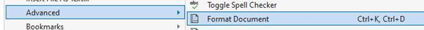

##	Bladspiegel overdreven slecht (-1 punt)

*(-1 punt)*

Is de layout van je code *all over the place*?  Zorg dat al je code mooi uitgelijnd staat en inspringt waar nodig. 

Tip: in Visual Studio kan je eenvoudig je bladspiegel juist zetten via het menu => Edit => Advanced => Format document. 

