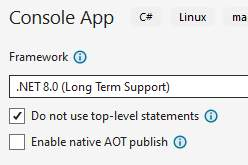
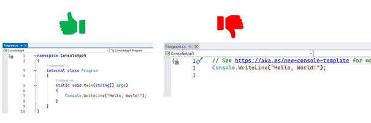

## Project aanmaken met top-level statements actief (-5 punten)

*(-5 punten)*

**5 punten?!** Inderdaad. Zo'n hekel hebben de lectoren aan top-level statements.

Zorg er dus voor dat je bij het aanmaken van een nieuw project steeds dat vinkje "Do not use top-level statements" aanduidt:  

Ziet je code er uit zoals aan de rechterkant in volgende afbeelding, dan ben je het vinkje vergeten aan te zetten:

