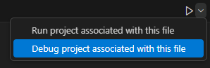

## Visual Studio Code op Mac configureren 

Volgende (in opbouw) gids overloopt hoe je Visual Studio Code kunt installeren op Mac zodat je er C# applicaties in kunt ontwikkelen.

De stappen met **(eenmalig)** achter moet je maar 1 keer doen tijdens installatie. Al de rest heb je nodig telkens je een nieuw project begint.

### Installeer VS Code for Mac (eenmalig)

Volg de Installation stappen (1 tot 6) op [deze pagina](https://code.visualstudio.com/docs/setup/mac).

### Installeer C# Dev Kit extension (eenmalig)

Klik op extensions  en zoek op c#.

Installeer: 

Na installatie sluit VS Code.

### Installeer .NET 8 (eenmalig)

Surf naar [deze pagina](https://dotnet.microsoft.com/en-us/download/dotnet/8.0).

Download en installeer de juiste macOS installer (afhankelijk van je processortype).

# Andere output (eenmalig)

Druk command+, (komma) om naar de settings te gaan.

Ga naar Extensions-\> C#-\> Debugger

En pas Debug:Console instelling aan naar **externalTerminal**

Mooi zo. Je bent klaar om C# applicaties te maken!

# New project maken:

Command+SHIFT+P en kies .NET New Project:

Dan Console App:

Kies folder waar de solution moet komen.

Geef de solution een naam:

Kies "create project":

Je mag dit vertrouwen:

In explorer (linkerzijde) zie je je project (klik   als je geen explorer balk ziet):

Open de Program.cs file:

**OPGELET:** we moeten nog 1 ding doen voor we kunnen beginnen.

Klik met je muis op de eerste lijn code (``// See https://aka.ms/new-console-template for more information``) zodat je cursor er staat. Er zou nu aan de linkerzijde een geel lampje moeten verschijnen:

Klik op gele lampje en kies ``Convert to program.main style program``:

Ready to program:

# Code compileren+uitvoeren

Optie 1: druk op F5.

Optie 2: druk op playknop rechtsboven }

# Code debuggen

Zet eerst gewenste breakpoint (rode bolletje) vlak naast de lijnnummers:

Klik rechtsboven op het kleine pijltje naast de "play"knop:

En kies "debug project associated with the file":

