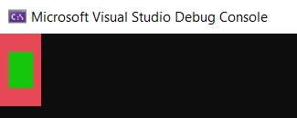
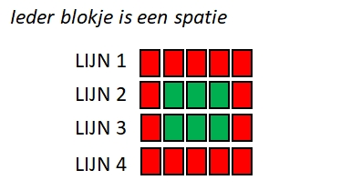

## Oefeningen



We sluiten ieder hoofdstuk af met een kleine selectie oefeningen. In de mate van het mogelijk zijn ze gerangschikt van eenvoudig tot iets pittiger. Bekijk zeker **ziescherp.be** waar je een grote hoeveelheid extra oefeningen zal terugvinden, alsook de oplossingen voor de meeste oefeningen.


### Visitekaartje

Schrijf een programma om de volgende zaken te tonen op afzonderlijke regels
* Naam: *voornaam achternaam*
* Adres: *straat en gemeente* 
* Hobby: *hobby*
* Waarom wil je leren programmeren? *Argumentatie*

Wat cursief staat moet vervangen worden door je eigen gepaste waarden

Zorg ervoor dat de titel van ieder element in een andere kleur getoond wordt.


### Communicatiefouten

Schrijf een applicatie met behulp van ``ReadLine()`` en ``WriteLine()``-methoden waarbij de computer aan de gebruiker om zijn of haar favoriete kleur, eten, auto, film en boek vraagt. Het programma zal de antwoorden echter door elkaar halen waardoor de computer vervolgens toont: 


```text
Je favoriete kleur is [eten]. Je eet graag [auto]. 
Je lievelingsfilm is [boek] en je favoriete boek is [kleur].
```

Waarbij tussen de rechte haakjes steeds de invoer komt die de gebruiker eerder opgaf voor de bijhorende vraag.

Maak het programma "grappig" door de antwoorden op de verkeerde plek te gebruiken, bijvoorbeeld: "Zo, je favoriete kleur is The Lord of the Rings?!".


### Tekening

Kan je volgende afbeeldingen namaken in de console?




Volgende tekening toont een schematische weergave:




Je kan een gekleurd vakje 'tekenen' door de ``BackGroundColor`` van de console in te stellen en dan één of meerdere **spaties** naar het scherm te sturen met ``Write`` of ``WriteLine``.


### Muziek*

Met de ``Console.Beep()`` methode kan je muziek maken. Volgende voorbeeld toont bijvoorbeeld hoe je do-re-mi-fa-sol-la-si-do afspeelt:

```java
Console.Beep(264, 1000);
Console.Beep(297, 1000);
Console.Beep(330, 1000);
Console.Beep(352, 1000);
Console.Beep(396, 1000);
Console.Beep(440, 1000);
Console.Beep(495, 1000);
Console.Beep(528, 1000);
```

Je geeft aan ``Beep`` 2 getallen mee (*argumenten*):

1. De frequentie van de toon die moet afgespeeld worden. Bijvoorbeeld 264 (in Hertz).
2. De duur dat de toon moet afgespeeld worden in milliseconden. Als je dus 1000 meegeeft zal de toon gedurende 1000 ms, oftewel 1 seconde, afgespeeld worden.

Open 1 van de eerder gemaakte oefeningen en zorg ervoor dat bij het opstarten ervan er een kort, door jezelf gecomponeerd, introliedje wordt afgespeeld.


